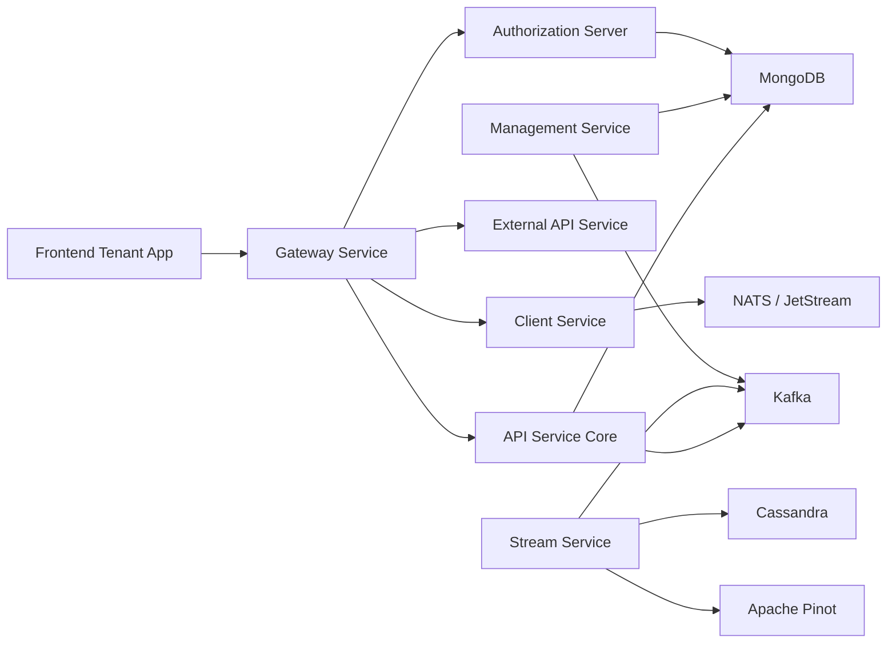
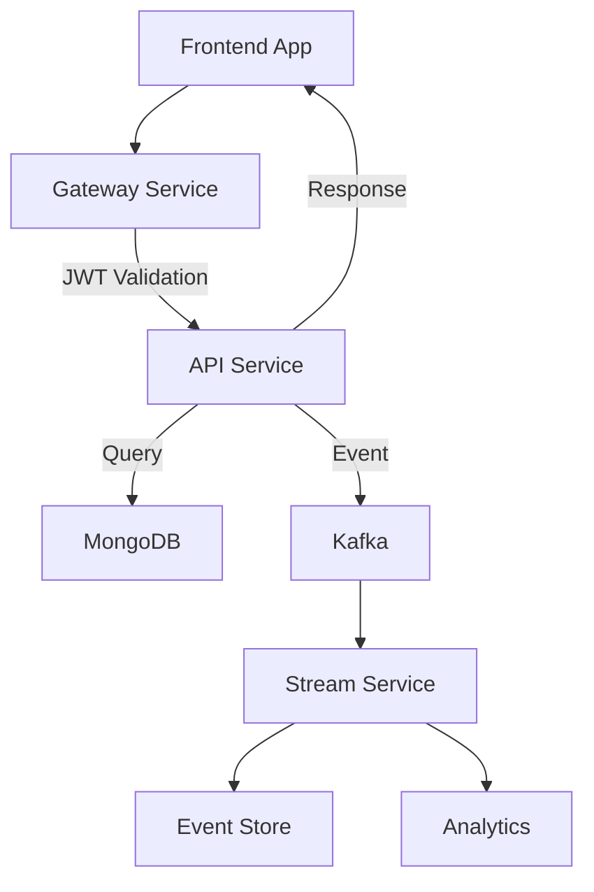

<div align="center">
  <picture>
    <source media="(prefers-color-scheme: dark)" srcset="https://raw.githubusercontent.com/flamingo-stack/openframe-oss-tenant/main/docs/assets/logo-openframe-full-dark-bg.png">
    <source media="(prefers-color-scheme: light)" srcset="https://raw.githubusercontent.com/flamingo-stack/openframe-oss-tenant/main/docs/assets/logo-openframe-full-light-bg.png">
    
  </picture>
</div>

<p align="center">
  <a href="LICENSE.md"></a>
</p>

# OpenFrame OSS Tenant

**OpenFrame** is the AI-powered MSP platform that replaces expensive proprietary software with open-source alternatives enhanced by intelligent automation. This repository contains the complete multi-service backend and frontend stack for running an OpenFrame tenant.

[](https://www.youtube.com/watch?v=a45pzxtg27k)

## 🚀 Features

OpenFrame delivers a **production-grade, multi-tenant, event-driven MSP platform** with:

### 🤖 AI-Powered Automation
- **Mingo AI** for technicians - Automates routine IT tasks
- **Fae Client** - AI-driven interface for end-users  
- **Intelligent Dialog System** - Context-aware assistance

### 🔧 Unified Platform
- ✅ **Multi-tenant OAuth2 / OIDC** authentication with SSO support
- ✅ **Secure edge gateway** with JWT + API key enforcement
- ✅ **REST + GraphQL** core APIs with DataLoader batching
- ✅ **Device lifecycle management** - Registration, monitoring, decommissioning
- ✅ **Organization & event management** - Multi-tenant structure
- ✅ **Tool integration APIs** - Seamless workflow connectivity

### 📊 Real-time Data Platform
- ✅ **Streaming pipeline** - Kafka, Debezium, Apache Pinot, Cassandra
- ✅ **Event normalization** - Tool-specific deserializers and handlers
- ✅ **Agent lifecycle management** - NATS-based listeners and heartbeats
- ✅ **Analytics & monitoring** - Real-time insights and audit trails

### 🛡️ Enterprise Security
- ✅ **Multi-tenant isolation** - TenantContext ThreadLocal separation
- ✅ **Per-tenant RSA signing keys** - Secure JWT issuance
- ✅ **Role-based authorization** - Granular permission management
- ✅ **API key rate limiting** - Protected external endpoints

### 💻 Modern Frontend
- ✅ **Next.js 16 + React 19** tenant application
- ✅ **Tauri desktop chat client** - OpenFrame Chat with token bridge
- ✅ **TanStack Query** API integration with GraphQL
- ✅ **Zustand state management** - Fleet & Tactical tool clients

## 🏗️ Architecture

OpenFrame follows a **microservices architecture** with strict multi-tenancy and event-driven design:



### Technology Stack

| Layer | Technologies |
|-------|--------------|
| **Frontend** | Next.js 16, React 19, TypeScript, TanStack Query, Zustand |
| **Backend** | Spring Boot 3.3, Java 21, Netflix DGS GraphQL |
| **Authentication** | Spring Authorization Server, OAuth2, OIDC, PKCE |
| **Data Storage** | MongoDB, Apache Cassandra, Apache Pinot |
| **Messaging** | Apache Kafka, NATS JetStream |
| **API Gateway** | Spring Cloud Gateway, WebSocket proxy |

### Service Architecture

| Layer | Services | Responsibility |
|-------|----------|----------------|
| **Edge** | Gateway | JWT validation, API keys, WebSocket proxy |
| **Identity** | Authorization Server | OAuth2/OIDC, tenant keys, SSO |
| **Core API** | API Service | REST + GraphQL, business logic, pagination |
| **Agents** | Client Service | Agent auth, registration, NATS listeners |
| **Streaming** | Stream Service | Event ingestion, normalization, handlers |
| **Management** | Management Service | Bootstrap, schedulers, connectors |
| **External** | External API Service | Public REST API, tool proxying |
| **Frontend** | Tenant App | React UI, Mingo AI, tool clients |
| **Desktop** | OpenFrame Chat | Tauri chat client, token bridge |

## ⚡ Quick Start

Get OpenFrame running locally in 5 minutes:

```bash
# 1. Clone and setup
git clone https://github.com/flamingo-stack/openframe-oss-tenant.git
cd openframe-oss-tenant
./clients/openframe-client/scripts/setup_dev_init_config.sh

# 2. Start MongoDB
sudo systemctl start mongod

# 3. Start backend services
mvn clean install
mvn spring-boot:run -pl openframe/services/openframe-api &
mvn spring-boot:run -pl openframe/services/openframe-authorization-server &
mvn spring-boot:run -pl openframe/services/openframe-gateway &

# 4. Start frontend
cd openframe/services/openframe-frontend
npm install && npm run dev

# 5. Access OpenFrame
# https://localhost:3000
```

**Default Login:** `admin@example.com` / `admin123`

[](https://www.youtube.com/watch?v=bINdW0CQbvY)

## 🔄 End-to-End Request Flow

Example device management request lifecycle:



## 🛠️ Core Modules

### Multi-Tenant Authentication
- **OAuth2 Authorization Server** with per-tenant RSA keys
- **OpenID Connect** (OIDC) with PKCE support
- **SSO Integration** - Google, Microsoft, custom providers
- **Secure cookie handling** and dev ticket exchange

### API Gateway & Security
- **Reactive API Gateway** with JWT resource server
- **Multi-tenant issuer resolver** and role-based authorization
- **API key management** with rate limiting
- **WebSocket proxy** for tools and NATS

### Data Layer
- **MongoDB** documents and repositories with tenant indexing
- **Reactive + blocking** repository patterns
- **Custom cursor-based pagination** for large datasets
- **Multi-tenant indexed collections** with compound keys

### Streaming Platform
- **Kafka producer** auto-configuration with AOP integration
- **Debezium CDC** ingestion and processing
- **Tool-specific deserializers** and event normalization
- **Cassandra persistence** and Pinot analytics

### Agent Management
- **Agent authentication** and registration endpoints
- **Tool agent binary delivery** and lifecycle management
- **NATS JetStream listeners** - Heartbeats, connections, status
- **Machine monitoring** with real-time updates

## 📚 Documentation

📚 See the [Documentation](./docs/README.md) for comprehensive guides including:

- **Getting Started** - Setup and first steps
- **Development** - Local development and contributing
- **Reference** - API documentation and architecture
- **CLI Tools** - [OpenFrame CLI](https://github.com/flamingo-stack/openframe-cli)

## 🌟 Design Principles

1. **Strict Multi-Tenancy** - TenantContext isolation, per-tenant JWT issuers, tenant-aware repositories
2. **Event-Driven Architecture** - Debezium CDC, Kafka streaming, Pinot analytics, Cassandra storage
3. **Separation of Bounded Contexts** - Authorization, Gateway, API, Streaming, Management, External APIs
4. **Extensibility** - Tool deserializers, post-save hooks, processor extension points, pluggable schedulers
5. **Secure-by-Default** - RSA JWT, PKCE, API key rate limiting, HttpOnly cookies, RBAC

## 🤝 Contributing

We welcome contributions! Please see:

- **[Contributing Guidelines](./CONTRIBUTING.md)** - How to contribute
- **[Development Setup](./docs/development/setup/local-development.md)** - Local environment
- **[OpenMSP Slack](https://join.slack.com/t/openmsp/shared_invite/zt-36bl7mx0h-3~U2nFH6nqHqoTPXMaHEHA)** - Join our community

> **Note**: We don't use GitHub Issues or GitHub Discussions. All support and community discussions happen in our OpenMSP Slack community.

## 🌐 Community & Links

- **Website**: [https://flamingo.run](https://flamingo.run)
- **OpenFrame**: [https://openframe.ai](https://openframe.ai)
- **Slack Community**: [OpenMSP Slack](https://www.openmsp.ai/)
- **CLI Tools**: [flamingo-stack/openframe-cli](https://github.com/flamingo-stack/openframe-cli)

---
<div align="center">
  Built with 💛 by the <a href="https://www.flamingo.run/about"><b>Flamingo</b></a> team
</div>