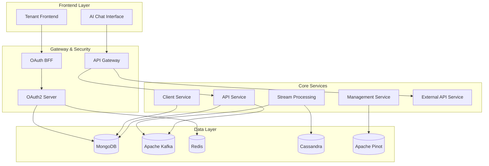

<div align="center">
  <picture>
    <source media="(prefers-color-scheme: dark)" srcset="https://shdrojejslhgnojzkzak.supabase.co/storage/v1/object/public/public/doc-orchestrator/logos/1771371901777-lc3cse-logo-openframe-full-dark-bg.png">
    <source media="(prefers-color-scheme: light)" srcset="https://shdrojejslhgnojzkzak.supabase.co/storage/v1/object/public/public/doc-orchestrator/logos/1771372526604-k3y1w-logo-openframe-full-light-bg.png">
    
  </picture>
</div>

<p align="center">
  <a href="LICENSE.md"></a>
</p>

# OpenFrame OSS Tenant

**The unified AI-powered MSP platform that replaces expensive proprietary software with open-source alternatives enhanced by intelligent automation.**

OpenFrame is a complete multi-tenant SaaS platform built for Managed Service Providers (MSPs) and IT operations teams. It integrates multiple MSP tools into a single AI-driven interface, automating IT support operations across your entire technology stack.

[](https://www.youtube.com/watch?v=a45pzxtg27k)

## ✨ Features

### 🤖 AI-Powered Automation
- **Mingo AI** for technicians - Intelligent automation and decision support
- **Fae AI** for clients - Self-service capabilities and instant support  
- Advanced machine learning for predictive maintenance and issue resolution

### 🏢 Multi-Tenant Architecture
- Complete tenant isolation and security
- OAuth2/OIDC authentication with SSO support
- Per-tenant configuration and branding

### 🔧 Unified Tool Integration
- **Fleet MDM** - Device management and compliance
- **Tactical RMM** - Remote monitoring and management
- **MeshCentral** - Remote access and file management
- Extensible integration framework for additional tools

### 📊 Real-Time Analytics
- Unified event processing and normalization
- Device monitoring and health tracking
- Log aggregation and analysis
- Performance metrics and reporting

### 🛡️ Enterprise Security
- Multi-layered security architecture
- API key management and rate limiting
- Audit logging and compliance reporting
- Secure agent-to-server communication

## 🚀 Quick Start

Get OpenFrame running locally in under 5 minutes:

```bash
# Clone the repository
git clone https://github.com/flamingo-stack/openframe-oss-tenant.git
cd openframe-oss-tenant

# One-command setup
./setup-dev.sh
```

For detailed setup instructions, see our [Quick Start Guide](./docs/getting-started/quick-start.md).

[](https://www.youtube.com/watch?v=bINdW0CQbvY)

## 🏗️ Architecture

OpenFrame follows a modern microservices architecture with event-driven communication:



### Key Components

- **Authorization Server Core** - OAuth2/OIDC identity provider with multi-tenant JWT signing
- **Gateway Service Core** - Edge routing, authentication, rate limiting, and WebSocket proxying
- **API Service Core** - GraphQL (Netflix DGS) and REST APIs for core platform operations
- **Stream Service Core** - Real-time event processing with Kafka Streams and Debezium CDC
- **Management Service Core** - Tool lifecycle management and system orchestration
- **Client Service Core** - Agent registration and machine heartbeat processing
- **External API Service Core** - Versioned REST APIs for third-party integrations

## 🛠️ Technology Stack

### Backend Services
- **Java 21** with Spring Boot 3.3.0
- **Spring Cloud** for microservices coordination
- **OAuth2 Authorization Server** for identity management
- **GraphQL** (Netflix DGS) and REST APIs
- **Apache Kafka** for event streaming
- **NATS** for real-time messaging

### Data Storage
- **MongoDB** for operational data
- **Apache Cassandra** for time-series data
- **Apache Pinot** for analytics and reporting
- **Redis** for caching and sessions

### AI & Automation
- **Anthropic Claude** integration
- **VoltAgent Core** for AI orchestration
- **Custom AI pipelines** for MSP workflows

### Integration Framework
- **Debezium** for change data capture
- **Apache NiFi** for data processing
- **gRPC** for service communication
- **WebSocket** support for real-time updates

## 📚 Documentation

Comprehensive documentation is available in the [`docs/`](./docs/README.md) directory:

- **[Getting Started](./docs/README.md#getting-started)** - Quick start and prerequisites
- **[Development](./docs/README.md#development)** - Setup, architecture, and contribution guides
- **[Reference](./docs/README.md#reference)** - Technical documentation and API references
- **[CLI Tools](./docs/README.md#cli-tools)** - Command-line utilities and automation

### External Resources
- **OpenFrame CLI**: [flamingo-stack/openframe-cli](https://github.com/flamingo-stack/openframe-cli)
- **Website**: [https://flamingo.run](https://flamingo.run)
- **Product Info**: [https://www.flamingo.run/openframe](https://www.flamingo.run/openframe)

## 🤝 Contributing

We welcome contributions from the community! Please see our [Contributing Guide](./CONTRIBUTING.md) for:

- Development workflow and setup
- Code style and quality standards
- Pull request process
- Community guidelines

### Community & Support

- 💬 **OpenMSP Slack Community**: [Join our community](https://join.slack.com/t/openmsp/shared_invite/zt-36bl7mx0h-3~U2nFH6nqHqoTPXMaHEHA)
- 🌐 **Flamingo Website**: [https://flamingo.run](https://flamingo.run)
- 📚 **OpenFrame Docs**: [https://www.flamingo.run/openframe](https://www.flamingo.run/openframe)

**Note**: We use our OpenMSP Slack community for all discussions, support, and collaboration. We do not use GitHub Issues or GitHub Discussions.

## 🎯 Use Cases

**MSP Professionals**
- IT service providers looking to reduce vendor costs
- Teams seeking unified tool management
- Organizations wanting AI-powered automation

**DevOps Engineers**
- Platform engineers building MSP solutions
- Developers integrating monitoring tools
- Teams implementing multi-tenant SaaS platforms

**System Administrators**
- IT professionals managing device fleets
- Administrators seeking centralized monitoring
- Teams requiring compliance and audit capabilities

## 💰 Benefits

### Cost Reduction
- Replace expensive proprietary MSP tools
- Reduce vendor lock-in and licensing costs
- Optimize resource utilization with AI insights

### Operational Efficiency
- Unified interface for all MSP operations
- Automated routine tasks and workflows
- Real-time visibility across your infrastructure

### Security & Compliance
- Enterprise-grade security controls
- Comprehensive audit trails
- Multi-tenant data isolation

### Scalability
- Cloud-native architecture
- Horizontal scaling capabilities
- Event-driven resilience

## 📄 License

This project is licensed under the Flamingo AI Unified License v1.0. See [LICENSE.md](LICENSE.md) for details.

---
<div align="center">
  Built with 💛 by the <a href="https://www.flamingo.run/about"><b>Flamingo</b></a> team
</div>