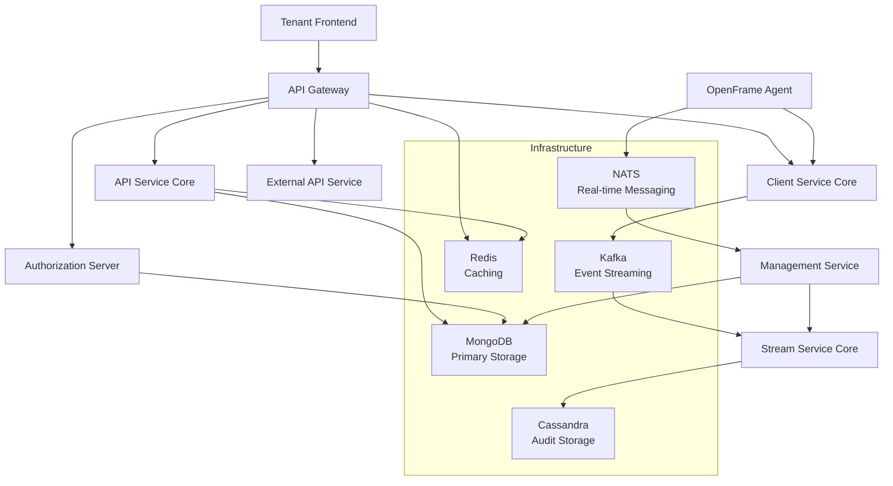

<div align="center">
  <picture>
    <source media="(prefers-color-scheme: dark)" srcset="https://raw.githubusercontent.com/flamingo-stack/openframe-oss-tenant/main/docs/assets/logo-openframe-full-dark-bg.png">
    <source media="(prefers-color-scheme: light)" srcset="https://raw.githubusercontent.com/flamingo-stack/openframe-oss-tenant/main/docs/assets/logo-openframe-full-light-bg.png">
    
  </picture>
</div>

<p align="center">
  <a href="LICENSE.md"></a>
</p>

# OpenFrame OSS Tenant

**OpenFrame** is the unified AI-powered MSP platform that replaces expensive proprietary software with open-source alternatives enhanced by intelligent automation. Built by [Flamingo](https://flamingo.run), OpenFrame integrates multiple MSP tools into a single AI-driven interface, automating IT support operations across the entire stack.

[](https://www.youtube.com/watch?v=bINdW0CQbvY)

## 🤖 AI-Powered MSP Platform

OpenFrame combines the power of open-source tools with intelligent AI assistants:

- **Mingo AI**: Intelligent technician assistant that augments MSP operations with AI-powered insights and automation
- **Fae AI**: Client-facing assistant that provides intelligent support and self-service capabilities
- **Enterprise Guardrails**: Secure and compliant AI assistance for production environments

## ✨ Key Features

### 🔧 Unified Platform
- **Single Interface** - One platform for all MSP tools and services
- **Centralized Management** - Device monitoring, user administration, and policy management
- **Integrated Authentication** - Multi-tenant OAuth2/OIDC with SSO support
- **Remote Operations** - Secure remote access and file management

### 🏗️ Enterprise Architecture
- **Multi-Tenant SaaS** - Isolated tenant environments for MSP service providers
- **Event-Driven Microservices** - Scalable, reactive architecture with Spring Boot
- **Real-Time Streaming** - Kafka and NATS JetStream for live updates
- **API-First Design** - Comprehensive REST and GraphQL APIs

### 💰 Cost-Effective Alternative
- **Open Source Foundation** - No vendor lock-in with transparent pricing
- **Reduced TCO** - Replace expensive proprietary MSP software stacks
- **Flexible Deployment** - Self-hosted or managed cloud options

### 🛡️ Security & Compliance
- **Zero-Trust Architecture** - End-to-end security with per-tenant isolation
- **Role-Based Access Control** - Granular permissions and policy enforcement
- **Audit & Compliance** - Complete activity logging with Cassandra storage
- **Enterprise SSO** - Azure AD, Google, and Microsoft authentication

## 🏛️ Technology Stack

| Component | Technology | Purpose |
|-----------|------------|---------|
| **Backend Runtime** | Java 21, Spring Boot 3.3.0 | Microservices foundation |
| **Frontend** | VoltAgent Core, Anthropic SDK | AI-driven user interface |
| **Authentication** | OAuth2/OIDC, JWT | Multi-tenant security |
| **Database** | MongoDB, Cassandra | Primary and audit storage |
| **Messaging** | Apache Kafka, NATS JetStream | Event streaming |
| **Caching** | Redis | Performance optimization |
| **Agent Runtime** | Rust | Cross-platform client agents |

## 🚀 Quick Start

Get OpenFrame running locally in 5 minutes:

```bash
# Clone the repository
git clone https://github.com/flamingo-stack/openframe-oss-tenant.git
cd openframe-oss-tenant

# Initialize development environment
./clients/openframe-client/scripts/setup_dev_init_config.sh

# Start infrastructure services
docker-compose up -d mongodb kafka redis nats cassandra

# Build and run backend services
mvn clean install -DskipTests
mvn spring-boot:run -pl openframe/services/openframe-gateway &
mvn spring-boot:run -pl openframe/services/openframe-authorization-server &
mvn spring-boot:run -pl openframe/services/openframe-api &

# Start frontend application
cd openframe/services/openframe-frontend
npm install && npm run dev
```

🎉 **Access OpenFrame at [http://localhost:3000](http://localhost:3000)**

For detailed setup instructions, see the [Quick Start Guide](./docs/README.md#getting-started).

## 🏗️ Architecture Overview

OpenFrame is built on a modern, event-driven microservices architecture:



### Core Services

| Service | Responsibility |
|---------|----------------|
| **API Gateway** | Request routing, JWT validation, CORS handling |
| **Authorization Server** | Multi-tenant OAuth2/OIDC identity provider |
| **API Service Core** | REST + GraphQL APIs for device/user management |
| **External API Service** | Public API with rate limiting and API key auth |
| **Client Service Core** | Agent lifecycle and control plane management |
| **Management Service** | Tool orchestration and system provisioning |
| **Stream Service Core** | Event processing, enrichment, and audit logging |

## 🎯 Use Cases

### For Managed Service Providers (MSPs)
- **Unified Tooling** - Replace multiple expensive tools with one platform
- **AI-Enhanced Operations** - Reduce manual tasks with intelligent automation
- **Client Portal** - Branded self-service interface for end customers
- **Multi-Tenant Management** - Isolated environments for each client

### For IT Service Organizations  
- **Centralized Control** - Single pane of glass for all IT operations
- **Remote Management** - Secure access to distributed endpoints
- **Compliance Reporting** - Automated audit trails and compliance dashboards
- **Integration Hub** - Connect existing tools via comprehensive APIs

### For System Administrators
- **Device Management** - Monitor and control endpoints across organizations
- **User Administration** - RBAC with SSO integration
- **Policy Enforcement** - Automated compliance and security policies
- **Operational Insights** - AI-powered analytics and recommendations

## 📚 Documentation

📚 See the [Documentation](./docs/README.md) for comprehensive guides including:

- **[Getting Started](./docs/README.md#getting-started)** - Prerequisites, quick start, and first steps
- **[Development](./docs/README.md#development)** - Local development, testing, and contribution guidelines  
- **[Reference](./docs/README.md#reference)** - Technical documentation for all services and APIs
- **[Architecture](./docs/README.md#diagrams)** - System design and component diagrams

### External Tools

The **OpenFrame CLI** is maintained in a separate repository:
- **Repository**: [flamingo-stack/openframe-cli](https://github.com/flamingo-stack/openframe-cli)
- **Installation**: [CLI Installation Guide](https://github.com/flamingo-stack/openframe-cli#installation)
- **Documentation**: [CLI Documentation](https://github.com/flamingo-stack/openframe-cli/tree/main/docs)

## 🌟 Key Differentiators

### vs. Traditional MSP Tools
✅ **Unified Platform** - One interface instead of 10+ separate tools  
✅ **AI-First Design** - Built-in intelligent automation, not bolt-on AI  
✅ **Open Source** - No vendor lock-in with transparent development  
✅ **Modern Architecture** - Cloud-native microservices vs. monolithic legacy systems  

### vs. Other Open Source Solutions
✅ **MSP-Focused** - Purpose-built for managed service providers  
✅ **Enterprise Ready** - Multi-tenancy, SSO, and compliance out of the box  
✅ **AI Integration** - Native AI assistants, not just API connectivity  
✅ **Commercial Support** - Professional services and support from Flamingo  

## 🤝 Community & Support

### 💬 Community
- **Slack Community**: Join [OpenMSP Slack](https://join.slack.com/t/openmsp/shared_invite/zt-36bl7mx0h-3~U2nFH6nqHqoTPXMaHEHA) for discussions and support
- **Website**: Visit [openframe.ai](https://openframe.ai) for latest updates
- **Flamingo Platform**: Learn more at [flamingo.run](https://flamingo.run)

### 📋 Contributing
We welcome contributions! See [CONTRIBUTING.md](./CONTRIBUTING.md) for:
- Development setup and workflow
- Code standards and review process  
- How to submit pull requests
- Community guidelines

### 📄 License
This project is licensed under the **Flamingo AI Unified License v1.0**. See [LICENSE.md](LICENSE.md) for details.

## 🎯 Roadmap & Vision

OpenFrame represents the future of MSP tooling by:

> "Combining the best of open source with enterprise-grade AI automation to deliver unparalleled value to service providers and their clients."

**Next Milestones:**
- Enhanced AI agent capabilities with multi-modal interactions
- Advanced automation playbooks and workflow orchestration  
- Expanded integration ecosystem with popular MSP tools
- Mobile applications for field technicians
- Advanced analytics and business intelligence dashboards

---

<div align="center">
  Built with 💛 by the <a href="https://www.flamingo.run/about"><b>Flamingo</b></a> team
</div>