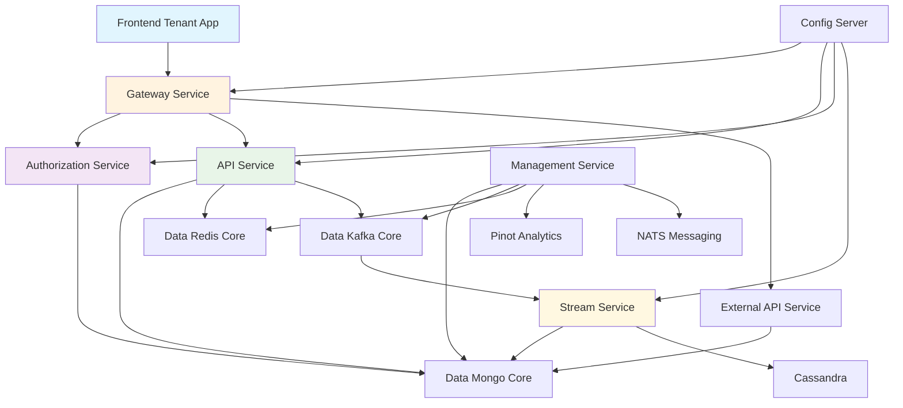

<div align="center">
  <picture>
    <source media="(prefers-color-scheme: dark)" srcset="https://shdrojejslhgnojzkzak.supabase.co/storage/v1/object/public/public/doc-orchestrator/logos/1771371901777-lc3cse-logo-openframe-full-dark-bg.png">
    <source media="(prefers-color-scheme: light)" srcset="https://shdrojejslhgnojzkzak.supabase.co/storage/v1/object/public/public/doc-orchestrator/logos/1771372526604-k3y1w-logo-openframe-full-light-bg.png">
    
  </picture>
</div>

<p align="center">
  <a href="LICENSE.md"></a>
</p>

# OpenFrame OSS Tenant

**The complete AI-driven MSP platform that powers the OpenFrame ecosystem.** OpenFrame OSS Tenant is a production-ready, multi-tenant, microservices-based SaaS architecture that revolutionizes IT infrastructure management through intelligent automation.

OpenFrame replaces expensive proprietary software with open-source alternatives enhanced by AI-powered automation (Mingo AI for technicians, Fae for clients), integrating multiple MSP tools into a single unified interface.

[](https://www.youtube.com/watch?v=a45pzxtg27k)

## 🚀 Key Features

### 🏢 **Multi-Tenant Architecture**
- Complete tenant isolation with per-tenant RSA signing keys
- OAuth2/OIDC with Google and Microsoft SSO integration
- Secure gateway-based JWT and API key enforcement
- Scalable tenant discovery and onboarding workflows

### 🤖 **AI-Powered Automation**
- **Mingo AI** for technicians - intelligent ticket triage and resolution
- **Fae AI** for clients - automated client communication and support
- Event-driven processing with real-time data enrichment
- Autonomous agents that actually fix infrastructure issues

### 🔌 **Integrated Tool Ecosystem**
- **Fleet MDM** integration for comprehensive device management
- **Tactical RMM** for remote monitoring and management
- **MeshCentral** for secure remote access
- Extensible architecture supporting custom tool integrations

### ⚡ **Event-Driven Architecture**
- Kafka-based event streaming with CDC (Change Data Capture)
- Real-time data ingestion and enrichment pipelines
- MongoDB and Cassandra persistence layers
- Redis-backed caching and distributed locking

### 🔐 **Enterprise-Grade Security**
- Multi-issuer JWT validation with caching
- Role-based authorization and tenant-scoped access control
- API key authentication for external integrations
- Comprehensive audit logging and compliance tracking

## 🏗️ Architecture Overview

OpenFrame follows a clean microservices architecture with clear separation of concerns:



### Core Services

| Service | Responsibility | Port |
|---------|---------------|------|
| **Gateway Service** | JWT validation, API routing, rate limiting, WebSocket proxy | 8082 |
| **Authorization Server** | OAuth2 + OIDC, SSO, tenant isolation, RSA signing | 8081 |
| **API Service** | Tenant-facing REST + GraphQL domain APIs | 8080 |
| **External API Service** | Public API key–secured REST endpoints | 8083 |
| **Stream Service** | Kafka ingestion, CDC processing, data enrichment | 8084 |
| **Management Service** | Infrastructure bootstrapping, schedulers, connectors | 8085 |
| **Config Server** | Centralized configuration management | 8888 |
| **Frontend Tenant App** | OAuth BFF + multi-tenant web interface | 3000 |

## 🛠️ Technology Stack

### Backend Technologies
- **Java 21** with **Spring Boot 3.3.0**
- **OAuth2 Authorization Server** with per-tenant keys
- **GraphQL** (Netflix DGS) and **REST APIs**
- **Apache Kafka** for event streaming
- **MongoDB** for document storage
- **Redis** for caching and distributed locking
- **Apache Cassandra** for time-series data

### Frontend & Clients
- **TypeScript/React** web application
- **Rust-based** desktop clients with **Tauri**
- **OAuth BFF** (Backend for Frontend) pattern
- **TailwindCSS** for responsive UI design

### Data & Integration
- **Debezium** for Change Data Capture
- **NATS** for lightweight messaging
- **Apache Pinot** for real-time analytics
- **Fleet MDM** and **Tactical RMM** integrations

## 🚀 Quick Start

Get OpenFrame running locally in 5 minutes:

```bash
# 1. Clone the repository
git clone https://github.com/flamingo-stack/openframe-oss-tenant.git
cd openframe-oss-tenant

# 2. Run the development setup script
./clients/openframe-client/scripts/setup_dev_init_config.sh

# 3. Build all services
mvn clean install

# 4. Start the config server first
cd openframe/services/openframe-config
mvn spring-boot:run &

# 5. Start core services (in separate terminals)
cd ../openframe-api && mvn spring-boot:run &
cd ../openframe-authorization-server && mvn spring-boot:run &
cd ../openframe-gateway && mvn spring-boot:run &

# 6. Start the frontend
cd ../openframe-frontend
npm install && npm run dev
```

Your OpenFrame instance will be available at `http://localhost:3000`!

For detailed setup instructions, see our [Quick Start Guide](docs/getting-started/quick-start.md).

[](https://www.youtube.com/watch?v=bINdW0CQbvY)

## 🎯 Platform Capabilities

### Multi-Tenant Identity & Security
- Per-tenant OAuth2/OIDC with Google and Microsoft SSO
- JWT validation with multi-issuer support and caching
- API key authentication for external service integrations
- Role-based authorization with tenant-scoped permissions

### Event-Driven Data Processing
- Kafka-based event streaming with Debezium CDC
- Real-time data ingestion from integrated tools
- Stream processing with enrichment and normalization
- MongoDB and Cassandra persistence with audit trails

### Operational Orchestration
- Infrastructure bootstrapping and self-healing automation
- Distributed scheduled jobs with Redis-based locking
- NATS stream provisioning and connector management
- Agent version publishing and client update automation

### Rich API Ecosystem
- **Internal API**: REST + GraphQL with DataLoader optimization
- **External API**: Public API key-secured endpoints with rate limiting
- **Tool Proxying**: Fleet MDM, Tactical RMM abstraction layers
- **Real-time Updates**: WebSocket support for live data streams

## 📚 Documentation

📚 Comprehensive documentation is available in the [Documentation Hub](./docs/README.md):

- **[Getting Started](./docs/getting-started/)** - Quick setup and first steps
- **[Development Guide](./docs/development/)** - Environment setup and workflows  
- **[Architecture Reference](./docs/architecture/)** - Technical specifications and design
- **[Contributing](./CONTRIBUTING.md)** - Code standards and contribution guidelines

## 🔧 CLI Tools

The OpenFrame CLI tools are maintained in a separate repository:

- **Repository**: [flamingo-stack/openframe-cli](https://github.com/flamingo-stack/openframe-cli)
- **Installation**: [Installation Guide](https://github.com/flamingo-stack/openframe-cli#installation)
- **Documentation**: [CLI Documentation](https://github.com/flamingo-stack/openframe-cli/tree/main/docs)

## 🌟 Why OpenFrame?

### For MSPs (Managed Service Providers)
- **Unified Platform**: Replace multiple expensive tools with one AI-driven interface
- **Cost Reduction**: Open-source foundation with enterprise-grade capabilities
- **Automation**: AI agents handle routine tasks, freeing up technical staff
- **Scalability**: Multi-tenant architecture grows with your business

### For Enterprise IT Teams
- **Integration**: Connect existing tools through standardized APIs
- **Visibility**: Centralized monitoring and management across all infrastructure
- **Efficiency**: Reduce context switching with unified workflows
- **Modern Stack**: Built on current technologies with active development

### For Developers & SaaS Companies
- **Production Ready**: Complete microservices architecture with security
- **Multi-Tenant**: Built-in tenant isolation and management
- **Event-Driven**: Kafka-based architecture for real-time processing
- **Extensible**: Clean APIs and plugin architecture for customization

## 🏢 Platform Benefits

✅ **Multi-tenant by design** - Complete tenant isolation and per-tenant configuration  
✅ **Event-driven CDC ingestion** - Real-time data processing and enrichment  
✅ **Reactive + blocking hybrid model** - Optimized performance for different use cases  
✅ **Cursor-based pagination everywhere** - Scalable data access patterns  
✅ **Distributed locking via Redis** - Safe concurrent operations  
✅ **Infrastructure bootstrapping automation** - Self-healing and auto-provisioning  
✅ **Clear contract isolation** - Maintainable modular architecture  
✅ **OAuth BFF frontend security** - Secure token management and refresh  

## 🤝 Community & Support

Join the OpenMSP community for support, discussions, and collaboration:

- **🚀 Slack Community**: [Join OpenMSP Workspace](https://join.slack.com/t/openmsp/shared_invite/zt-36bl7mx0h-3~U2nFH6nqHqoTPXMaHEHA)
- **🌐 OpenFrame Website**: [https://www.flamingo.run/openframe](https://www.flamingo.run/openframe)
- **🔗 Platform Site**: [https://openframe.ai](https://openframe.ai)
- **🦩 Main Company**: [https://flamingo.run](https://flamingo.run)

> **Important**: This project uses Slack for all discussions, issue tracking, and community support. GitHub Issues and Discussions are not monitored.

## 📋 Prerequisites

Before getting started, ensure you have:

- **Java 21** or higher
- **Maven 3.9+**
- **Node.js 18+** and **npm**
- **MongoDB 5.0+**
- **Redis 7+**
- **Apache Kafka 3.0+**

See our [Prerequisites Guide](docs/getting-started/prerequisites.md) for detailed setup instructions.

## 📄 License

This project is licensed under the **Flamingo AI Unified License v1.0** - see the [LICENSE.md](LICENSE.md) file for details.

## 🙏 Acknowledgments

OpenFrame OSS Tenant is built on top of excellent open-source technologies:

- **Spring Boot** - Application framework
- **Netflix DGS** - GraphQL implementation
- **Apache Kafka** - Event streaming
- **MongoDB** - Document database
- **Redis** - Caching and messaging
- **React** - Frontend framework

Special thanks to all contributors and the open-source community that makes projects like this possible.

---

<div align="center">
  Built with 💛 by the <a href="https://www.flamingo.run/about"><b>Flamingo</b></a> team
</div>