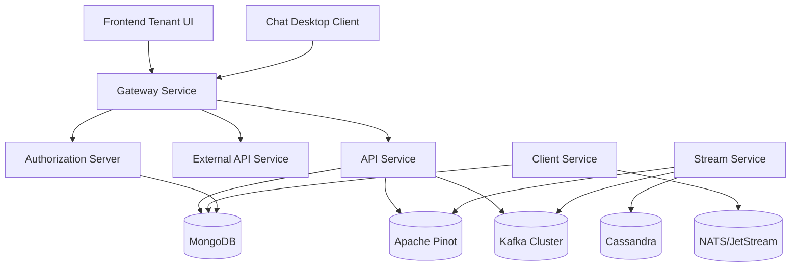
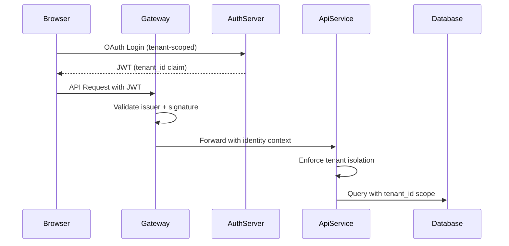

<div align="center">
  <picture>
    <source media="(prefers-color-scheme: dark)" srcset="https://shdrojejslhgnojzkzak.supabase.co/storage/v1/object/public/public/doc-orchestrator/logos/1771371901777-lc3cse-logo-openframe-full-dark-bg.png">
    <source media="(prefers-color-scheme: light)" srcset="https://shdrojejslhgnojzkzak.supabase.co/storage/v1/object/public/public/doc-orchestrator/logos/1771372526604-k3y1w-logo-openframe-full-light-bg.png">
    
  </picture>
</div>

<p align="center">
  <a href="LICENSE.md"></a>
</p>

# OpenFrame OSS Tenant

**The multi-service, multi-tenant open-source foundation of the OpenFrame platform** — An AI-powered MSP platform that replaces expensive proprietary software with open-source alternatives enhanced by intelligent automation.

OpenFrame provides the unified platform that integrates multiple MSP tools into a single AI-driven interface, featuring **Mingo AI** for technicians and **Fae** for clients, automating IT support operations across the stack.

[](https://www.youtube.com/watch?v=bINdW0CQbvY)

[](https://www.youtube.com/watch?v=er-z6IUnAps)

## ✨ Features

### 🤖 AI-Powered Automation
- **Mingo AI Assistant** - Autonomous agent architecture that handles incident triage, alert management, and automated response workflows
- **Fae Client Interface** - AI-powered client interface for streamlined communication
- **Intelligent Data Processing** - Real-time event normalization and enrichment with Kafka Streams

### 🏗️ Enterprise-Grade Architecture
- **Multi-Tenant by Design** - Complete tenant isolation across OAuth clients, JWT tokens, RSA keys, and database documents
- **Microservice Foundation** - Spring Boot 3.3.0 services with Java 21, designed for scalability and modularity
- **Event-Driven Backbone** - Kafka + Streams for real-time data flow and processing
- **Reactive Edge** - Spring WebFlux Gateway for high-performance request routing

### 🔌 Comprehensive Integration
- **MSP Tool Integration** - Fleet MDM, Tactical RMM, MeshCentral for device management and remote access
- **Data Pipeline** - Apache NiFi, MongoDB, Cassandra, Apache Pinot for analytics and storage
- **Real-Time Messaging** - NATS/JetStream for agent communication and event handling
- **Standardized APIs** - REST + GraphQL APIs with OpenAPI documentation

### 🔐 Security & Compliance
- **OAuth2/OIDC Multi-Tenant** - Complete authorization server with SSO integration (Google, Microsoft)
- **JWT Multi-Issuer Support** - Tenant-scoped authentication with cached validation
- **API Key Management** - Rate-limited external API access with proper authorization
- **End-to-End Security** - Gateway-enforced security with downstream identity context

## 🚀 Quick Start

Get OpenFrame running locally in under 5 minutes:

```bash
# Clone and setup
git clone https://github.com/flamingo-stack/openframe-oss-tenant.git
cd openframe-oss-tenant

# Start dependencies (MongoDB, Redis, Kafka, Cassandra, Pinot, NATS)
./scripts/dev-start-dependencies.sh

# Initialize configuration
./clients/openframe-client/scripts/setup_dev_init_config.sh

# Build and start services
mvn clean install -DskipTests
./scripts/start-all-services.sh

# Access the platform
open http://localhost:3000
```

Expected services after startup:
- **Frontend UI**: `http://localhost:3000`
- **API Service**: `http://localhost:8080`
- **Gateway**: `http://localhost:8081` 
- **Authorization Server**: `http://localhost:8082`

## 🏛️ Architecture

OpenFrame follows a **layered, event-driven, multi-tenant SaaS architecture**:



### Core Services

| Service | Purpose | Port | Technology |
|---------|---------|------|------------|
| **API Service** | Internal REST + GraphQL APIs | 8080 | Spring Boot, GraphQL |
| **Authorization Server** | Multi-tenant OAuth2/OIDC | 8082 | Spring Authorization Server |
| **Gateway** | Security, routing, WebSocket proxy | 8081 | Spring Cloud Gateway |
| **External API** | Public API endpoints | 8083 | Spring Boot REST |
| **Stream Service** | Event processing and enrichment | 8085 | Kafka Streams |
| **Client Service** | Agent lifecycle management | 8084 | Spring Boot, NATS |
| **Frontend UI** | Web-based tenant dashboard | 3000 | Node.js with AI/LLM |
| **Chat Client** | Desktop AI assistant | - | Rust/Tauri |

## 🔄 Multi-Tenant Security Flow



## 🛠️ Technology Stack

### Backend Services
- **Java 21** with **Spring Boot 3.3.0**
- **Spring Security** with OAuth2/OIDC support
- **Spring Cloud Gateway** for reactive routing
- **Apache Kafka** for event streaming
- **NATS/JetStream** for agent messaging

### Data Layer
- **MongoDB** - Primary transactional storage
- **Apache Cassandra** - Time-series and log persistence  
- **Apache Pinot** - Real-time analytics and querying
- **Redis** - Caching and session management

### AI & Automation
- **VoltAgent Core** - Intelligent automation framework
- **Anthropic SDK** and **OpenAI** integration
- **GraphQL** - Chat integration with streaming messages
- **Real-time dialog orchestration** - Zustand stores for message state

## 📚 Documentation

Comprehensive documentation is available in the [docs](./docs/README.md) directory:

- **[Getting Started](./docs/README.md#getting-started)** - Quick setup and introduction
- **[Reference Documentation](./docs/README.md#reference-documentation)** - Technical architecture and API specs  
- **[Development Guides](./docs/README.md#development)** - Contributing and development workflows

### CLI Tools

The OpenFrame CLI tools are maintained in a separate repository:
- **Repository**: [flamingo-stack/openframe-cli](https://github.com/flamingo-stack/openframe-cli)
- **Installation**: [Installation Guide](https://github.com/flamingo-stack/openframe-cli#installation)
- **Documentation**: [CLI Documentation](https://github.com/flamingo-stack/openframe-cli/tree/main/docs)

## 🤝 Contributing

We welcome contributions! Please see our [Contributing Guide](./CONTRIBUTING.md) for:

- Development workflow and branch naming
- Code style and conventions  
- Pull request process and review guidelines
- Testing requirements and quality standards

Join our community:
- **Slack**: [OpenMSP Community](https://join.slack.com/t/openmsp/shared_invite/zt-36bl7mx0h-3~U2nFH6nqHqoTPXMaHEHA)
- **Documentation**: [OpenFrame Docs](https://www.flamingo.run/openframe)

## 🏢 Enterprise & Support

- **Platform**: [Flamingo](https://flamingo.run) - AI-powered MSP platform
- **OpenFrame**: [Product Page](https://www.flamingo.run/openframe) - Unified MSP interface
- **Community**: [OpenMSP](https://www.openmsp.ai/) - Open source MSP community

## 📄 License

This project is licensed under the Flamingo AI Unified License v1.0 - see the [LICENSE.md](LICENSE.md) file for details.

---
<div align="center">
  Built with 💛 by the <a href="https://www.flamingo.run/about"><b>Flamingo</b></a> team
</div>