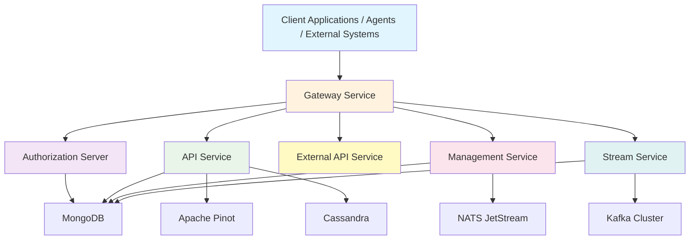
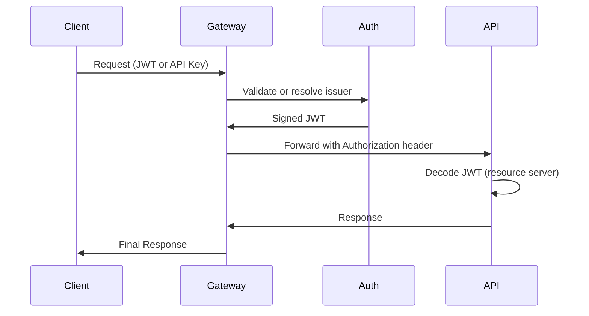
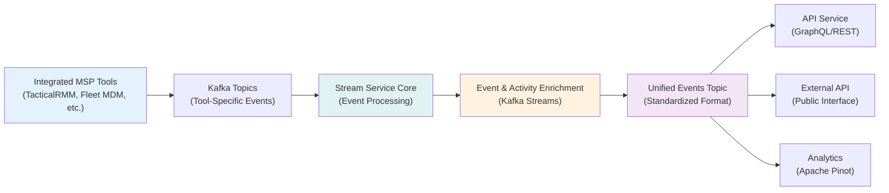

<div align="center">
  <picture>
    <source media="(prefers-color-scheme: dark)" srcset="https://shdrojejslhgnojzkzak.supabase.co/storage/v1/object/public/public/doc-orchestrator/logos/1771371901777-lc3cse-logo-openframe-full-dark-bg.png">
    <source media="(prefers-color-scheme: light)" srcset="https://shdrojejslhgnojzkzak.supabase.co/storage/v1/object/public/public/doc-orchestrator/logos/1771372526604-k3y1w-logo-openframe-full-light-bg.png">
    
  </picture>
</div>

<p align="center">
  <a href="LICENSE.md"></a>
</p>

# OpenFrame OSS Tenant

**The complete, production-grade multi-tenant backend stack for the OpenFrame platform.** A modern microservices architecture built with Spring Boot 3.3.0 and Java 21 that powers AI-driven MSP operations, multi-tenant identity management, and real-time event processing.

[](https://www.youtube.com/watch?v=a45pzxtg27k)

## Overview

OpenFrame OSS Tenant provides the foundational backend services for Flamingo's AI-powered MSP platform, replacing expensive proprietary software with open-source alternatives enhanced by intelligent automation. This repository contains a complete multi-service, multi-tenant backend stack designed for MSP-grade SaaS deployments.

## Key Features

### 🏗️ **Multi-Tenant Architecture**
- **Tenant-isolated identity & data** with OAuth2/OIDC per tenant
- **Per-tenant RSA signing keys** for secure JWT validation
- **Multi-issuer JWT validation** with tenant-scoped access control
- **Tenant context resolution** across all services

### 🔐 **Enterprise Security**
- **Gateway-based security enforcement** with JWT validation
- **API key-based external integrations** with rate limiting
- **Multi-tenant OAuth2 authorization server** 
- **Resource-server validation** in downstream services

### 🌊 **Real-Time Event Processing**
- **Kafka-based event streaming** with CDC ingestion support
- **Unified event modeling** across integrated tools
- **Event enrichment** via Kafka Streams joins
- **Multi-tenant stream isolation** with header-based routing

### 🚀 **Modern Microservices Stack**
- **Spring Boot 3.3.0** with Java 21
- **GraphQL + REST API orchestration**
- **Distributed persistence** (MongoDB, Kafka, Cassandra, Apache Pinot)
- **Infrastructure-as-Code** with automatic provisioning

### 🔌 **Extensible Integration**
- **Tool lifecycle management** for MSP integrations
- **Post-save hooks** and conditional processors
- **Overridable beans** for customization
- **API-first design** for easy integrations

## Architecture Overview

OpenFrame follows a layered microservices architecture with clear separation of concerns:



### Service Responsibilities

| Service | Purpose | Port |
|---------|---------|------|
| **Gateway Service** | Edge routing, JWT validation, API key enforcement | 8443 |
| **Authorization Server** | Multi-tenant OAuth2 + OIDC identity management | 9000 |
| **API Service** | Internal GraphQL + REST API orchestration | 8080 |
| **External API Service** | API key-based public REST interface with rate limiting | 8084 |
| **Management Service** | Tool lifecycle + infrastructure initialization | 8082 |
| **Stream Service** | Kafka-based real-time processing & event enrichment | 8083 |

### Authentication & Request Flow



## Technology Stack

### Backend Technologies
- **Java 21** with **Spring Boot 3.3.0**
- **Spring Cloud** for microservices coordination
- **Spring Security** with OAuth2/OIDC
- **Apache Kafka** for event streaming and CDC
- **MongoDB** for operational data storage
- **Apache Pinot** for real-time analytics
- **Apache Cassandra** for time-series data
- **NATS JetStream** for messaging

### AI & Automation
- **Anthropic Claude** integration via `@anthropic-ai/sdk`
- **VoltAgent Core** (`@voltagent/core`) for AI workflows
- Custom AI enrichment pipelines for intelligent event processing
- Automated event correlation and anomaly detection

### Data Processing
- **Kafka Streams** for real-time event processing
- **Debezium** for Change Data Capture (CDC)
- **Apache NiFi** integration for data pipelines
- Multi-model persistence strategy

## Quick Start

Get OpenFrame running locally in under 5 minutes using Docker Compose.

### Prerequisites

- **Java 21** (OpenJDK or Oracle JDK)
- **Maven 3.6+**
- **Docker & Docker Compose**
- **Node.js 18+** (for frontend components)

### 1. Clone and Setup

```bash
# Clone the repository
git clone https://github.com/your-org/openframe-oss-tenant.git
cd openframe-oss-tenant

# Start infrastructure services
docker-compose -f docker/docker-compose.dev.yml up -d

# Verify services are running
docker-compose -f docker/docker-compose.dev.yml ps
```

### 2. Build and Initialize

```bash
# Build all services
mvn clean install -DskipTests

# Initialize configuration
chmod +x clients/openframe-client/scripts/setup_dev_init_config.sh
./clients/openframe-client/scripts/setup_dev_init_config.sh
```

### 3. Start Services

```bash
# Start all OpenFrame services
java -jar openframe/services/openframe-gateway/target/openframe-gateway-1.0.0-SNAPSHOT.jar &
java -jar openframe/services/openframe-authorization-server/target/openframe-authorization-server-1.0.0-SNAPSHOT.jar &
java -jar openframe/services/openframe-api/target/openframe-api-1.0.0-SNAPSHOT.jar &
java -jar openframe/services/openframe-management/target/openframe-management-1.0.0-SNAPSHOT.jar &
java -jar openframe/services/openframe-stream/target/openframe-stream-1.0.0-SNAPSHOT.jar &
java -jar openframe/services/openframe-external-api/target/openframe-external-api-1.0.0-SNAPSHOT.jar &
```

### 4. Verify Installation

```bash
# Test the API endpoint
curl -k https://localhost:8443/health
# Expected: {"status":"UP"}

# Test GraphQL endpoint
curl -X POST https://localhost:8443/graphql \
  -H "Content-Type: application/json" \
  -H "Authorization: Bearer dev-token-123" \
  -d '{"query": "{ __schema { types { name } } }"}'
```

**✅ Success!** Your OpenFrame development environment is now running with all microservices, databases, and AI-powered features ready for use.

## Core Components

OpenFrame is organized into reusable service libraries and executable applications:

### Service Libraries (`openframe-oss-lib`)

**API & GraphQL:**
- `api-service-core` - GraphQL schema, resolvers, and REST endpoints
- `api-lib-contracts-and-services` - Shared contracts and service interfaces

**Security & Identity:**
- `authorization-service-core` - Multi-tenant OAuth2/OIDC server
- `gateway-service-core` - Edge routing, JWT validation, API keys

**Event Processing:**
- `stream-service-core` - Kafka event processing and enrichment
- `data-layer-kafka` - Kafka integration and stream processing

**Data Persistence:**
- `data-layer-mongo` - MongoDB operations and multi-tenant data access
- `data-layer-core` - Core data structures and repositories

**Operations & Management:**
- `management-service-core` - Tool lifecycle and infrastructure management
- `external-api-service-core` - Public API with rate limiting

### Service Applications (`openframe/services`)

Executable Spring Boot applications that compose the above libraries:

| Application | Purpose | Technology |
|-------------|---------|------------|
| `openframe-api` | Internal GraphQL + REST API | Spring WebFlux, GraphQL |
| `openframe-authorization-server` | OAuth2 multi-tenant server | Spring Authorization Server |
| `openframe-gateway` | Edge security & routing | Spring Cloud Gateway |
| `openframe-external-api` | Public REST API | Spring Boot REST |
| `openframe-management` | Tool lifecycle management | Spring Boot |
| `openframe-stream` | Kafka event processor | Kafka Streams |
| `openframe-client` | Tenant runtime service | Rust |
| `openframe-config` | Configuration server | Spring Cloud Config |

## Event-Driven Architecture

OpenFrame uses an event-driven backbone for real-time processing and tool integration:



### Core Event Processing Features

- **CDC Integration** - Debezium-based change data capture
- **Tool-Specific Mapping** - Transform tool events to unified format  
- **Activity Enrichment** - Kafka Streams joins for context
- **Multi-Tenant Isolation** - Header-based message routing
- **Real-Time Analytics** - Stream events to Apache Pinot

## CLI Tools

The OpenFrame CLI provides powerful command-line tools for management and automation:

- **Repository**: [flamingo-stack/openframe-cli](https://github.com/flamingo-stack/openframe-cli)
- **Installation**: [Installation Guide](https://github.com/flamingo-stack/openframe-cli#installation)
- **Documentation**: [CLI Documentation](https://github.com/flamingo-stack/openframe-cli/tree/main/docs)

> **Note**: The CLI tools are maintained in a separate repository and are not included in this backend stack.

## Documentation

📚 **Comprehensive documentation is available in the [docs](./docs/README.md) directory:**

- **[Getting Started](./docs/README.md#getting-started)** - Setup guides and quick start tutorials
- **[Architecture Reference](./docs/README.md#reference)** - Technical documentation for each service
- **[Development Guides](./docs/README.md#development)** - Development workflows and contributing
- **[Visual Diagrams](./docs/README.md#diagrams)** - Mermaid architecture diagrams

### Quick Navigation

| Section | Description |
|---------|-------------|
| [Prerequisites](./docs/README.md#getting-started) | Development environment setup |
| [Quick Start](./docs/README.md#getting-started) | Get running in 5 minutes |
| [API Service Core](./docs/README.md#reference) | GraphQL and REST API documentation |
| [Authorization Service](./docs/README.md#reference) | OAuth2/OIDC identity management |
| [Gateway Service](./docs/README.md#reference) | Edge routing and security |
| [Stream Processing](./docs/README.md#reference) | Event processing and Kafka integration |

## Community & Support

OpenFrame is backed by a vibrant open-source community:

### 💬 **Primary Community Hub**
- **OpenMSP Slack Workspace**: https://www.openmsp.ai/
- **Join Slack**: https://join.slack.com/t/openmsp/shared_invite/zt-36bl7mx0h-3~U2nFH6nqHqoTPXMaHEHA

### 🌐 **Official Resources**
- **Flamingo Platform**: https://flamingo.run
- **OpenFrame Product Page**: https://www.flamingo.run/openframe

### 📢 **Important Note**
> All project management, feature discussions, bug reports, and support happen in our **OpenMSP Slack community**. We don't use GitHub Issues or GitHub Discussions - join Slack for the most active and responsive community support!

## Contributing

We welcome contributions from developers of all skill levels! OpenFrame is built by and for the MSP community.

### Getting Started with Contributing

1. **Join the Community**: Connect with us on [OpenMSP Slack](https://www.openmsp.ai/)
2. **Read the Guidelines**: See our [Contributing Guide](./CONTRIBUTING.md)
3. **Set Up Development**: Follow the [development setup guide](./docs/README.md#development)
4. **Find Your First Issue**: Ask in `#development` channel for newcomer-friendly tasks

### Types of Contributions

- **🐛 Bug Reports & Fixes** - Help improve platform stability
- **✨ Feature Development** - Build new MSP capabilities  
- **📖 Documentation** - Improve guides and API docs
- **🧪 Testing** - Add test coverage and quality assurance
- **🔧 Performance** - Optimize services and queries
- **🛡️ Security** - Enhance security measures and practices

## Design Principles

OpenFrame is built on these foundational principles:

### ✅ **Multi-Tenant First**
- Tenant context resolution throughout the stack
- Per-tenant signing keys and data isolation
- Tenant-scoped Kafka streams and data filtering

### ✅ **Clear Separation of Concerns**
- **Transport Layer** - Gateway service handles routing and edge security
- **Identity Layer** - Authorization service manages multi-tenant OAuth2
- **Orchestration Layer** - API service provides GraphQL/REST coordination  
- **Infrastructure Layer** - Data layers abstract persistence complexity
- **Streaming Layer** - Stream service handles real-time event processing

### ✅ **Event-Driven Backbone**
- Kafka-based integration for MSP tool events
- CDC-ready architecture for real-time data synchronization
- Unified event modeling across diverse tool ecosystems

### ✅ **Extension-Friendly Architecture**
- Post-save hooks for custom business logic
- Conditional processors for workflow customization
- Overridable Spring beans for deep customization
- Plugin architecture for MSP tool integrations

### ✅ **Infrastructure-as-Code**
- Automatic Kafka stream and topic provisioning
- Database index creation and optimization
- Keyspace initialization for Cassandra
- Configuration-driven service discovery

## What Makes OpenFrame Different?

Unlike traditional MSP platforms, OpenFrame provides:

🔄 **Event-Driven by Design** - Real-time processing and automation built-in  
🏗️ **True Multi-Tenancy** - Not just data separation, but complete tenant isolation  
🤖 **AI-Native Architecture** - Intelligence integrated at the platform level  
📖 **Open Source Foundation** - Built with and extends proven OSS technologies  
⚡ **Modern Tech Stack** - Spring Boot 3, Java 21, and cloud-native patterns  
🔌 **API-First Design** - Everything is programmable and integrable  

---
<div align="center">
  Built with 💛 by the <a href="https://www.flamingo.run/about"><b>Flamingo</b></a> team
</div>