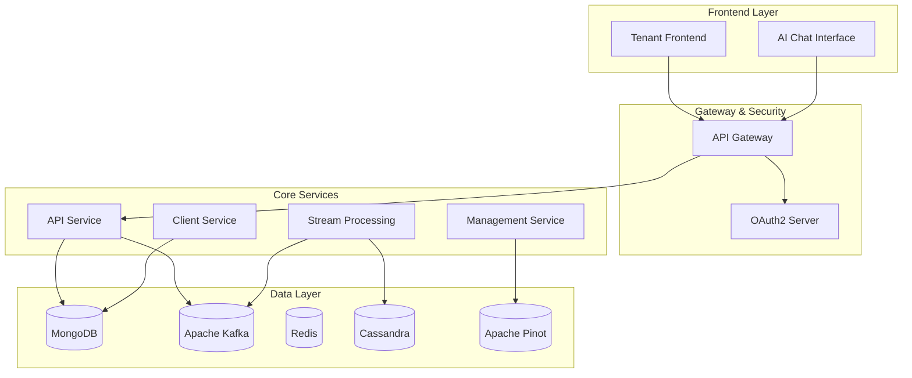

# OpenFrame Documentation

Welcome to the comprehensive documentation for **OpenFrame**, the unified AI-powered MSP platform that replaces expensive proprietary software with open-source alternatives enhanced by intelligent automation.

## 📚 Table of Contents

### Getting Started

Quick start guides and essential setup information:

- **[Introduction](./getting-started/introduction.md)** - Platform overview and key features
- **[Prerequisites](./getting-started/prerequisites.md)** - System requirements and dependencies  
- **[Quick Start](./getting-started/quick-start.md)** - Get OpenFrame running in 5 minutes
- **[First Steps](./getting-started/first-steps.md)** - Essential features and configurations

### Development

Development guides, environment setup, and architecture documentation:

- **[Development Overview](./development/README.md)** - Complete development documentation index
- **[Environment Setup](./development/setup/environment.md)** - Configure your IDE and development tools
- **[Local Development](./development/setup/local-development.md)** - Running and debugging OpenFrame locally
- **[System Architecture](./development/architecture/README.md)** - High-level design and component overview

### Reference

Technical reference documentation for core services and components:

#### Core Services
- **[Authorization Server Core](./architecture/authorization-server-core/authorization-server-core.md)** - OAuth2/OIDC identity provider
- **[Gateway Service Core](./architecture/gateway-service-core/gateway-service-core.md)** - Edge routing and security
- **[API Service Core](./architecture/openframe-api-service-core/openframe-api-service-core.md)** - GraphQL and REST APIs
- **[Stream Service Core](./architecture/stream-service-core/stream-service-core.md)** - Real-time event processing
- **[Management Service Core](./architecture/management-service-core/management-service-core.md)** - System orchestration
- **[Client Service Core](./architecture/client-service-core/client-service-core.md)** - Agent registration and management
- **[External API Service Core](./architecture/external-api-service-core/external-api-service-core.md)** - Third-party integrations

#### Infrastructure & Shared Components  
- **[Data Storage and Messaging Core](./architecture/data-storage-and-messaging-core/data-storage-and-messaging-core.md)** - Database and messaging patterns
- **[API Contracts](./architecture/openframe-api-contracts/openframe-api-contracts.md)** - Shared DTOs and contracts
- **[Service Applications](./architecture/service-applications/service-applications.md)** - Spring Boot application structure
- **[Security OAuth BFF](./architecture/security-oauth-bff/security-oauth-bff.md)** - Backend-for-Frontend OAuth flow

#### Frontend Components
- **[Tenant Frontend API Clients & Hooks](./architecture/tenant-frontend-api-clients-and-hooks/tenant-frontend-api-clients-and-hooks.md)** - Frontend integration layers
- **[Chat Frontend Core](./architecture/chat-frontend-core/chat-frontend-core.md)** - AI chat interface contracts

- **[Reference Overview](./architecture/README.md)** - Complete repository structure and architecture

### Diagrams

Visual architecture documentation:
- **Architecture Diagrams**: [View Mermaid diagrams](./architecture/diagrams/) - Service interactions, data flows, and system architecture

### CLI Tools

The OpenFrame CLI tools are maintained in a separate repository:
- **Repository**: [flamingo-stack/openframe-cli](https://github.com/flamingo-stack/openframe-cli)
- **Installation**: [Installation Guide](https://github.com/flamingo-stack/openframe-cli#installation)
- **Documentation**: [CLI Documentation](https://github.com/flamingo-stack/openframe-cli/tree/main/docs)

**Note**: CLI tools are NOT located in this repository. Always refer to the external repository for installation and usage.

## 🚀 Quick Navigation

### For New Users
1. Start with [Introduction](./getting-started/introduction.md) to understand OpenFrame
2. Follow the [Quick Start Guide](./getting-started/quick-start.md) to get running
3. Complete the [First Steps](./getting-started/first-steps.md) tutorial

### For Developers
1. Set up your [Development Environment](./development/setup/environment.md)
2. Understand the [System Architecture](./development/architecture/README.md)
3. Review the [Contributing Guidelines](../CONTRIBUTING.md)

### For Integrators
1. Explore [External API Service Core](./architecture/external-api-service-core/external-api-service-core.md)
2. Review [API Contracts](./architecture/openframe-api-contracts/openframe-api-contracts.md)
3. Check the [CLI Tools](https://github.com/flamingo-stack/openframe-cli) for automation

### For System Administrators
1. Review [Prerequisites](./getting-started/prerequisites.md) for deployment requirements
2. Understand [Data Storage and Messaging](./architecture/data-storage-and-messaging-core/data-storage-and-messaging-core.md) patterns
3. Configure [Authorization Server](./architecture/authorization-server-core/authorization-server-core.md) for your organization

## 🏗️ Architecture Overview

OpenFrame is built on a modern microservices architecture with these key principles:

- **Multi-tenant isolation** at every layer
- **Gateway-first security** enforcement
- **Event-driven architecture** with Kafka streaming
- **AI-powered automation** through Mingo and Fae
- **Tool-agnostic** integration framework

## 📖 Quick Links

- **[Project README](../README.md)** - Main project README with overview and features
- **[Contributing Guide](../CONTRIBUTING.md)** - How to contribute to OpenFrame
- **[License](../LICENSE.md)** - License information and terms

## 🌐 External Resources

- **Website**: [https://flamingo.run](https://flamingo.run)
- **OpenFrame Product**: [https://www.flamingo.run/openframe](https://www.flamingo.run/openframe)
- **OpenMSP Community**: [Join our Slack](https://join.slack.com/t/openmsp/shared_invite/zt-36bl7mx0h-3~U2nFH6nqHqoTPXMaHEHA)

## 🤝 Community & Support

We use our **OpenMSP Slack community** for all discussions, support, and collaboration. We do not use GitHub Issues or GitHub Discussions.

### Slack Channels
- **#general** - General discussions and announcements
- **#development** - Development questions and technical discussions  
- **#architecture** - System design and architecture discussions
- **#getting-started** - Help for new users and contributors
- **#feature-requests** - Ideas and feature discussions

### Getting Help
1. **Search the documentation** - Most questions are answered here
2. **Join the Slack community** - Connect with other users and developers
3. **Ask in the right channel** - Use topic-specific channels for faster help
4. **Be specific** - Include details about your environment and what you've tried

---

*Documentation generated by [OpenFrame Doc Orchestrator](https://github.com/flamingo-stack/openframe-oss-tenant)*

**Ready to get started?** Begin with our [Introduction Guide](./getting-started/introduction.md) or jump straight to the [Quick Start](./getting-started/quick-start.md)!