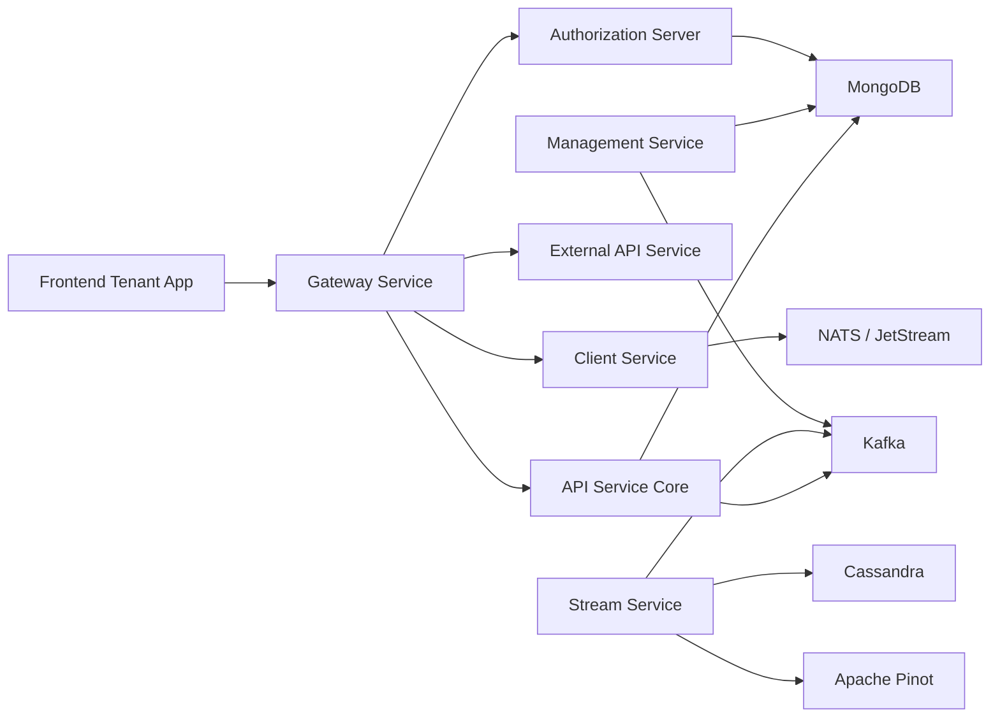

# OpenFrame Documentation

Welcome to the comprehensive documentation for **OpenFrame** - the AI-powered MSP platform that replaces expensive proprietary software with open-source alternatives enhanced by intelligent automation.

## 📚 Table of Contents

### 🚀 Getting Started

Step-by-step guides to get you up and running with OpenFrame:

- [Introduction](./getting-started/introduction.md) - What is OpenFrame and key concepts
- [Prerequisites](./getting-started/prerequisites.md) - System requirements and preparation
- [Quick Start](./getting-started/quick-start.md) - Get OpenFrame running in 5 minutes
- [First Steps](./getting-started/first-steps.md) - Initial configuration and exploration

### 🛠️ Development

Resources for developers contributing to or extending OpenFrame:

- [Development Overview](./development/README.md) - Development documentation index
- [Environment Setup](./development/setup/environment.md) - Configure your development environment
- [Local Development](./development/setup/local-development.md) - Local development workflow
- [Testing Guide](./development/testing/README.md) - Testing standards and practices
- [Contributing Guidelines](./development/contributing/guidelines.md) - How to contribute to OpenFrame
- [Security Guidelines](./development/security/README.md) - Security practices and requirements
- [Architecture Guide](./development/architecture/README.md) - Development architecture patterns

### 📖 Reference Documentation

Technical reference documentation for all OpenFrame components:

- [API Service Core](./architecture/api_service_core_rest_graphql/api_service_core_rest_graphql.md) - REST + GraphQL APIs and business logic
- [Authorization Server Core](./architecture/authorization_server_core_and_tenant_context/authorization_server_core_and_tenant_context.md) - OAuth2/OIDC authentication and multi-tenancy
- [Gateway Service Core](./architecture/gateway_service_core_edge_security_and_ws_proxy/gateway_service_core_edge_security_and_ws_proxy.md) - Edge security and WebSocket proxy
- [Client Service Core](./architecture/client_service_core_agent_endpoints_and_listeners/client_service_core_agent_endpoints_and_listeners.md) - Agent management and NATS listeners
- [Stream Service Core](./architecture/stream_service_core_kafka_listeners_deserializers_and_handlers/stream_service_core_kafka_listeners_deserializers_and_handlers.md) - Event streaming and data processing
- [Management Service Core](./architecture/management_service_core_initialization_and_schedulers/management_service_core_initialization_and_schedulers.md) - System initialization and scheduling
- [External API Service](./architecture/external_api_service_core_rest_proxy/external_api_service_core_rest_proxy.md) - Public REST API endpoints
- [Data Layer - MongoDB](./architecture/data_layer_mongo_documents_and_repositories/data_layer_mongo_documents_and_repositories.md) - MongoDB documents and repositories
- [Data Layer - Streaming](./architecture/data_layer_streaming_kafka_pinot_cassandra/data_layer_streaming_kafka_pinot_cassandra.md) - Kafka, Pinot, and Cassandra integration
- [Frontend Tenant App](./architecture/frontend_tenant_app_api_clients_and_mingo/frontend_tenant_app_api_clients_and_mingo.md) - React frontend and Mingo AI integration
- [Chat Frontend Client](./architecture/chat_frontend_client_openframe_chat/chat_frontend_client_openframe_chat.md) - Tauri desktop chat application
- [Security OAuth BFF](./architecture/security_oauth_bff_and_jwt_support/security_oauth_bff_and_jwt_support.md) - OAuth Backend-for-Frontend and JWT support
- [API Contracts & DTOs](./architecture/api_contracts_dtos_and_mapping/api_contracts_dtos_and_mapping.md) - API contracts and data mapping
- [Services App Entrypoints](./architecture/services_app_entrypoints/services_app_entrypoints.md) - Service startup and configuration

### 📊 Architecture Diagrams

Visual documentation of OpenFrame's architecture and component interactions:

- **Component Architecture** - View Mermaid diagrams in: [./architecture/diagrams/](./architecture/diagrams/)
- **Service Interactions** - Detailed service flow diagrams
- **Data Flow** - Request lifecycle and data processing flows
- **Security Architecture** - Authentication and authorization patterns

### 🔧 CLI Tools

The OpenFrame CLI tools are maintained in a separate repository:

- **Repository**: [flamingo-stack/openframe-cli](https://github.com/flamingo-stack/openframe-cli)
- **Installation**: [Installation Guide](https://github.com/flamingo-stack/openframe-cli#installation)
- **Documentation**: [CLI Documentation](https://github.com/flamingo-stack/openframe-cli/tree/main/docs)

**Note**: CLI tools are NOT located in this repository. Always refer to the external repository for installation and usage.

## 🏗️ Architecture Overview

OpenFrame follows a **microservices architecture** with strict multi-tenancy and event-driven design:

### Key Principles

1. **Strict Multi-Tenancy** - TenantContext isolation, per-tenant JWT issuers, tenant-aware repositories
2. **Event-Driven Architecture** - Debezium CDC, Kafka streaming, Pinot analytics, Cassandra storage  
3. **Separation of Bounded Contexts** - Authorization, Gateway, API, Streaming, Management, External APIs
4. **Extensibility** - Tool deserializers, post-save hooks, processor extension points, pluggable schedulers
5. **Secure-by-Default** - RSA JWT, PKCE, API key rate limiting, HttpOnly cookies, RBAC

## 📖 Quick Links

- [Project README](../README.md) - Main project README with overview and quick start
- [Contributing Guide](../CONTRIBUTING.md) - How to contribute to OpenFrame
- [License](../LICENSE.md) - License information and terms

## 🌐 Community & Support

- **Website**: [https://flamingo.run](https://flamingo.run)
- **OpenFrame**: [https://openframe.ai](https://openframe.ai)
- **Slack Community**: [OpenMSP Slack](https://join.slack.com/t/openmsp/shared_invite/zt-36bl7mx0h-3~U2nFH6nqHqoTPXMaHEHA)
- **OpenMSP**: [https://www.openmsp.ai/](https://www.openmsp.ai/)

> **Note**: We don't use GitHub Issues or GitHub Discussions. All support and community discussions happen in our OpenMSP Slack community.

---

*Documentation generated by [OpenFrame Doc Orchestrator](https://github.com/flamingo-stack/openframe-oss-tenant)*