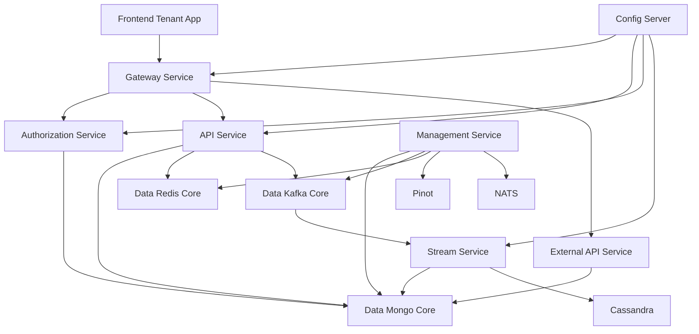
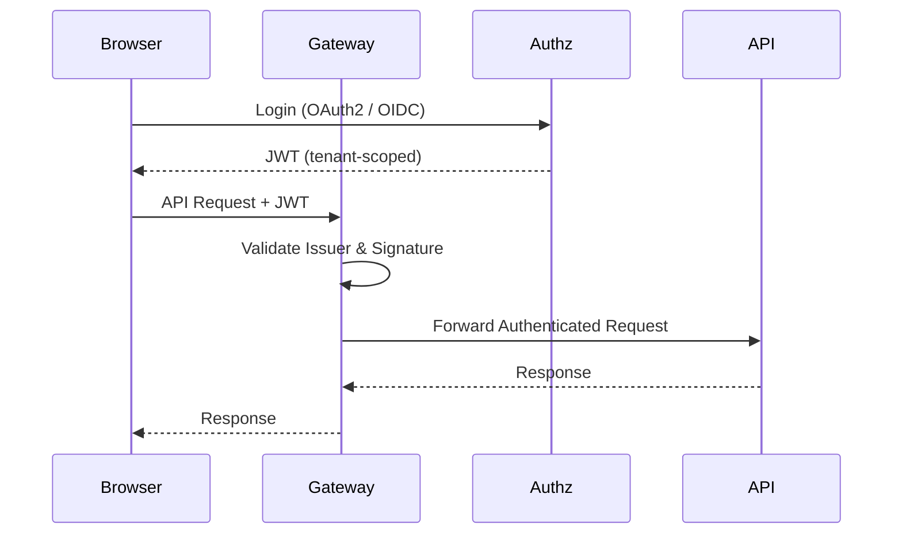
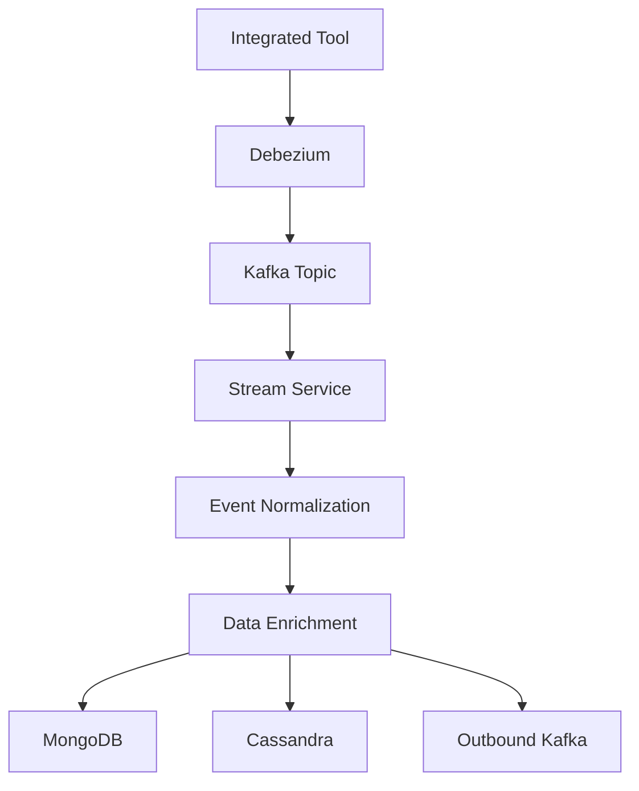
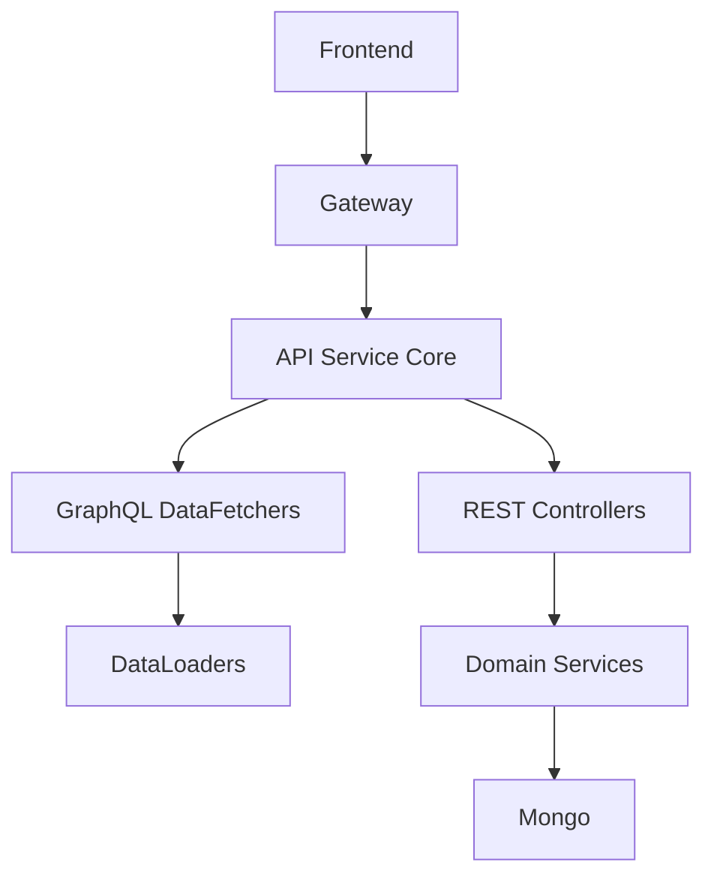
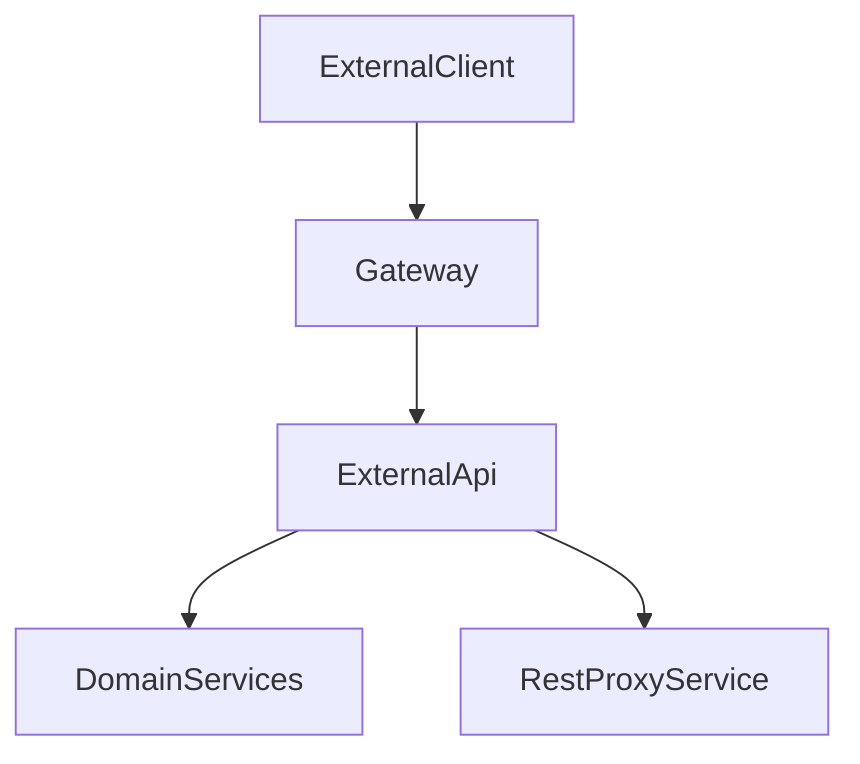
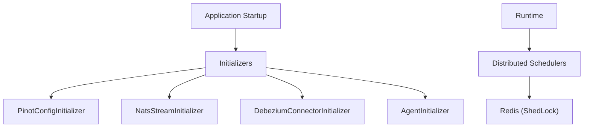
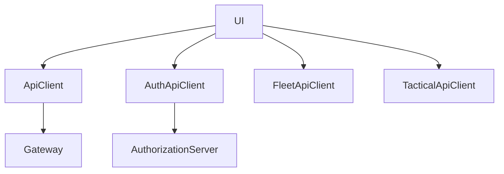

# OpenFrame OSS Tenant Repository

The **`openframe-oss-tenant`** repository is the full multi-service, multi-tenant SaaS platform powering OpenFrame — the AI-driven MSP infrastructure behind Flamingo.

It provides:

- ✅ Multi-tenant identity and OAuth2 (OIDC + SSO)
- ✅ Gateway-based JWT and API key enforcement
- ✅ Tenant-scoped REST + GraphQL APIs
- ✅ Event-driven ingestion and enrichment (Kafka + Debezium)
- ✅ Redis-backed caching and distributed locking
- ✅ MongoDB-based domain persistence
- ✅ Tool proxying (Fleet MDM, Tactical RMM, etc.)
- ✅ Operational orchestration (connectors, Pinot, NATS, schedulers)
- ✅ Frontend tenant application with secure OAuth BFF

This repository represents a **complete, production-ready, event-driven, microservices SaaS architecture**.

---

# Repository Architecture (End-to-End)

The platform follows a clean separation of concerns:

---

# Core Runtime Services

The repository builds multiple deployable Spring Boot applications:

| Service | Responsibility |
|----------|---------------|
| **Gateway** | JWT validation, API key auth, routing, rate limiting, WebSocket proxy |
| **Authorization Server** | OAuth2 + OIDC, SSO, tenant isolation, per-tenant RSA signing |
| **API Service** | Tenant-facing REST + GraphQL domain APIs |
| **External API Service** | Public API key–secured REST surface |
| **Stream Service** | Kafka ingestion, CDC processing, enrichment, persistence |
| **Management Service** | Infrastructure bootstrapping, schedulers, connectors |
| **Config Server** | Centralized configuration |
| **Frontend Tenant App** | OAuth BFF + API clients |

---

# Identity & Security Model

### Security Layers

- **Authorization Service Core**
  - OAuth2 Authorization Server
  - Per-tenant RSA signing keys
  - Google + Microsoft SSO
  - Invitation onboarding
  - Password reset
  - Tenant discovery

- **Gateway Service Core**
  - Reactive JWT validation
  - Multi-issuer caching
  - API key authentication (`/external-api/**`)
  - Rate limiting
  - WebSocket proxy security
  - Role-based authorization

---

# Data & Event Architecture

OpenFrame is event-driven and CDC-powered.

### Data Modules

- **Data Mongo Core**
  - All domain documents
  - Cursor pagination
  - Multi-tenant indexing
  - Reactive + blocking repositories

- **Data Kafka Core**
  - Producer + consumer infrastructure
  - Debezium message modeling
  - Topic auto-provisioning

- **Data Redis Core**
  - Tenant-aware key prefixing
  - Spring Cache integration
  - Reactive + blocking support

---

# API Layer

The platform exposes two API surfaces:

## 1️⃣ Internal Tenant API (Api Service Core)

- REST Controllers
- GraphQL (Netflix DGS)
- DataLoaders for N+1 prevention
- Multi-tenant JWT validation
- Business rule enforcement
- Extension hooks

---

## 2️⃣ External Public API (External API Service Core)

- API key–secured
- Cursor pagination
- Filtering + sorting
- Tool REST proxying

---

# Management & Operational Control Plane

The **Management Service Core** bootstraps and maintains infrastructure.

Responsibilities:

- Debezium connector management
- NATS stream provisioning
- Agent version publishing
- Client version updates
- Distributed scheduled jobs
- API key stats synchronization

---

# Frontend Tenant App Core

The frontend provides:

- OAuth BFF orchestration
- Token refresh safety
- Tool-specific API clients
- Multi-tenant host resolution

It guarantees:

- Single-flight token refresh
- Safe redirect resolution
- SaaS subdomain support
- Dev ticket mode support

---

# Repository Structure Overview

```mermaid
flowchart TD
    Repo["openframe-oss-tenant"]

    Repo --> Services["/services (Spring Boot Apps)"]
    Repo --> ApiCore["api-service-core"]
    Repo --> AuthCore["authorization-service-core"]
    Repo --> GatewayCore["gateway-service-core"]
    Repo --> StreamCore["stream-service-core"]
    Repo --> MgmtCore["management-service-core"]
    Repo --> ExternalCore["external-api-service-core"]

    Repo --> MongoCore["data-mongo-core"]
    Repo --> KafkaCore["data-kafka-core"]
    Repo --> RedisCore["data-redis-core"]

    Repo --> OAuthCore["security-oauth-core"]
    Repo --> ApiContracts["api-lib-contracts"]
    Repo --> Frontend["frontend-tenant-app-core"]
```

---

# Core Modules Documentation References

| Module | Documentation Section |
|--------|----------------------|
| API Service Core | `api-service-core` |
| Authorization Service Core | `authorization-service-core` |
| Gateway Service Core | `gateway-service-core` |
| Stream Service Core | `stream-service-core` |
| Management Service Core | `management-service-core` |
| External API Service Core | `external-api-service-core` |
| Data Mongo Core | `data-mongo-core` |
| Data Kafka Core | `data-kafka-core` |
| Data Redis Core | `data-redis-core` |
| Security OAuth Core | `security-oauth-core` |
| API Lib Contracts | `api-lib-contracts` |
| Service Applications | `services/` |
| Frontend Tenant App Core | `openframe-frontend` |

Each module is independently documented and designed for composability and extensibility.

---

# Architectural Characteristics

✅ Multi-tenant by design  
✅ Per-tenant JWT signing keys  
✅ Event-driven CDC ingestion  
✅ Reactive + blocking hybrid model  
✅ Cursor-based pagination everywhere  
✅ Distributed locking via Redis  
✅ Infrastructure bootstrapping automation  
✅ Clear contract isolation layer  
✅ OAuth BFF frontend security  
✅ Tool proxy abstraction  

---

# Conclusion

The **`openframe-oss-tenant`** repository is a complete, modular, cloud-native SaaS platform implementing:

- Multi-tenant identity
- Secure edge routing
- Rich domain APIs
- Event-driven ingestion
- Operational self-healing infrastructure
- Frontend OAuth orchestration

It serves as the backbone of OpenFrame — enabling AI-powered MSP automation across tenants while maintaining strict security isolation, scalable data pipelines, and clean modular architecture.