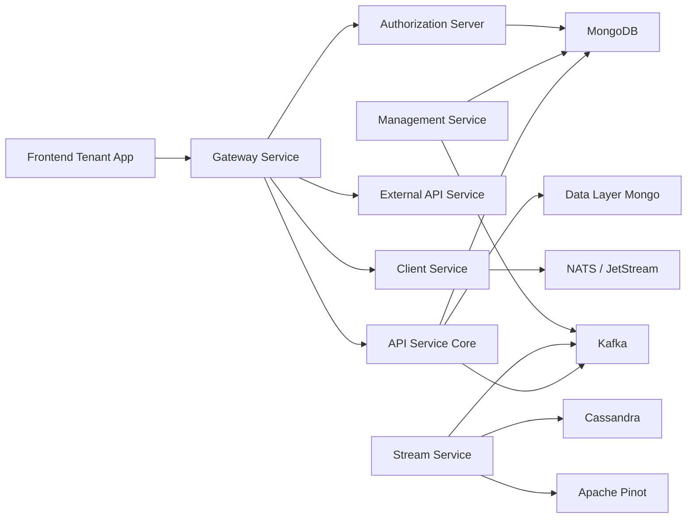
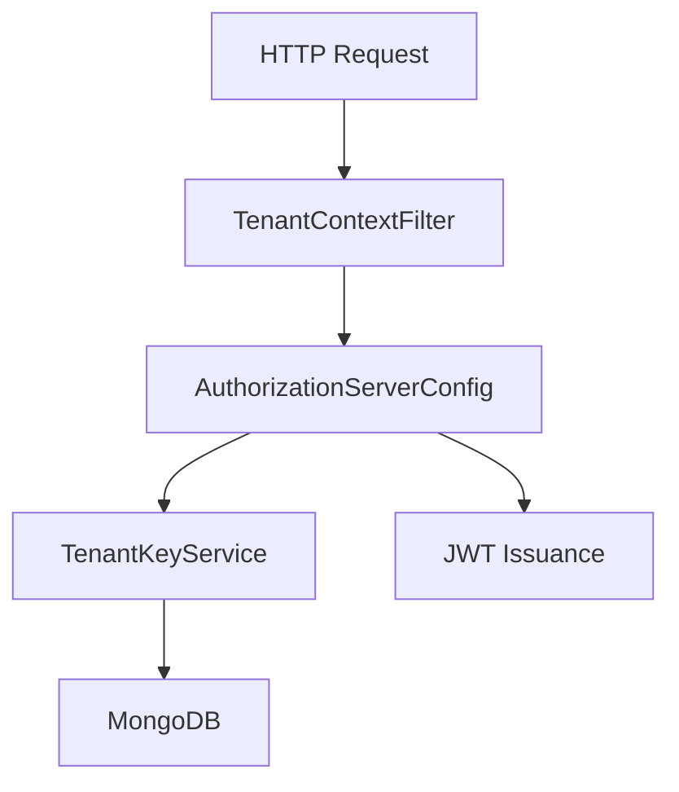
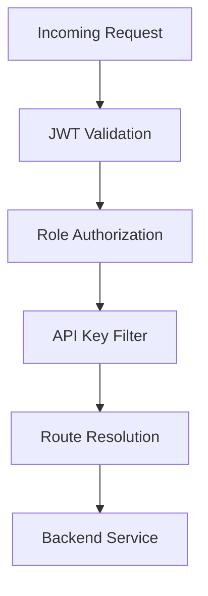
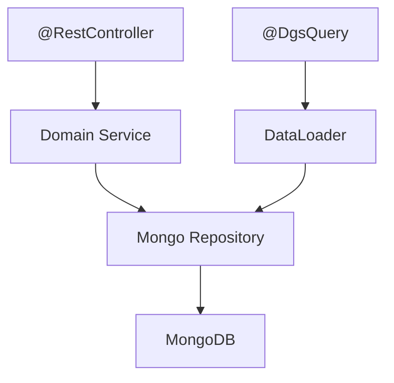
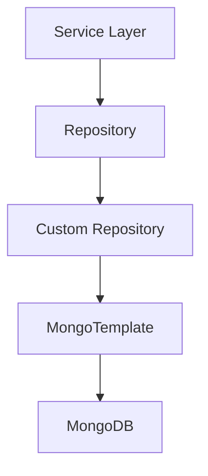
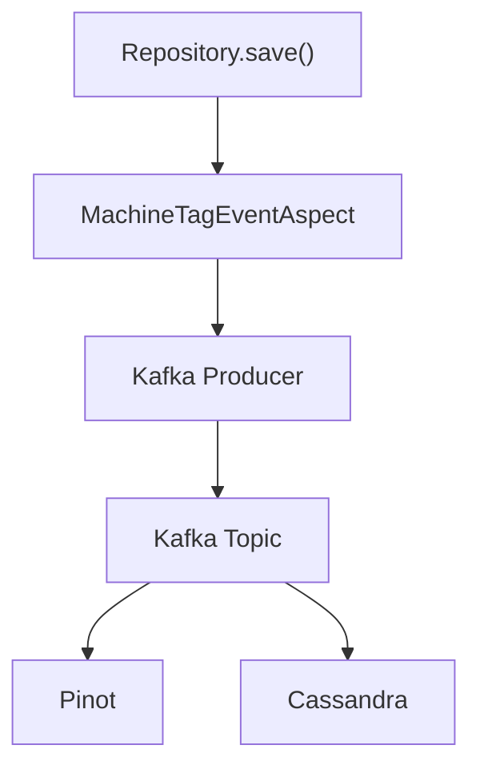
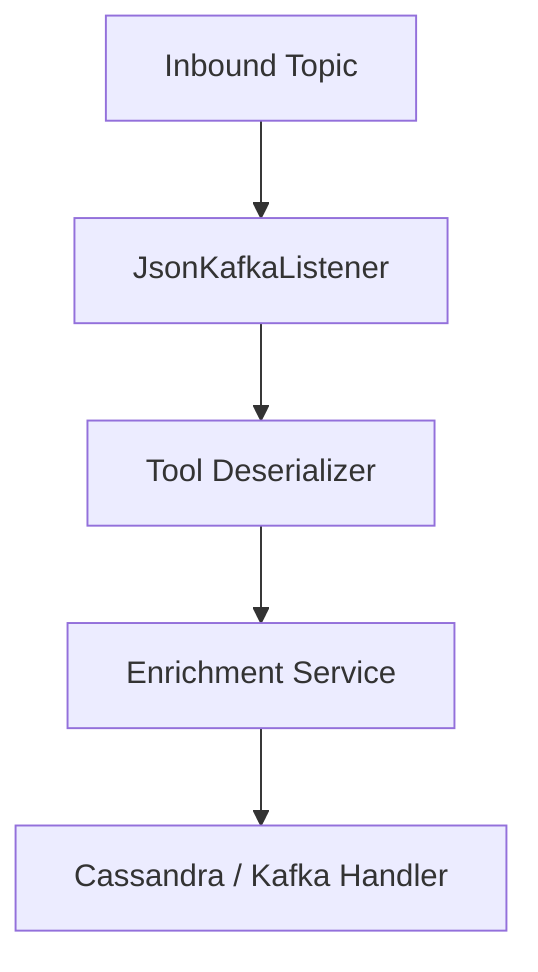
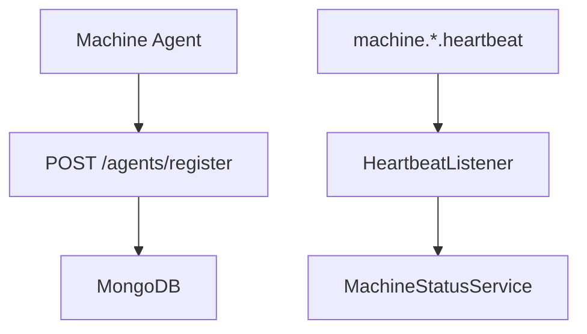
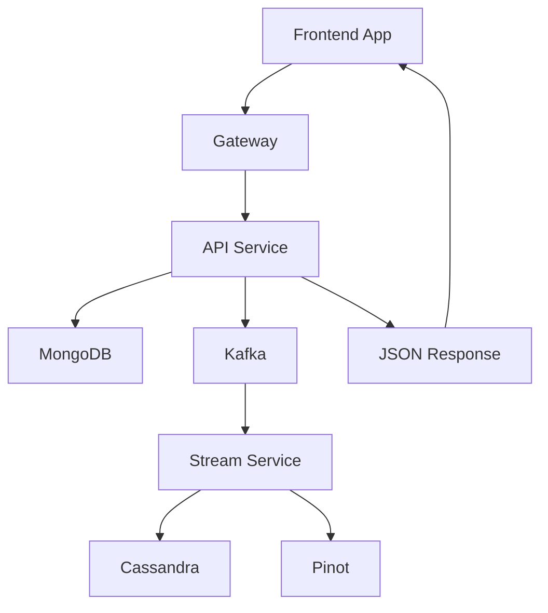

# OpenFrame OSS Tenant – Repository Overview

The **`openframe-oss-tenant`** repository contains the complete multi-service backend and frontend stack for running an OpenFrame tenant.

It delivers:

- ✅ Multi-tenant OAuth2 / OIDC authentication  
- ✅ Secure edge gateway with JWT + API key enforcement  
- ✅ REST + GraphQL core API  
- ✅ Device, organization, event, and tool management  
- ✅ Streaming pipeline (Kafka, Debezium, Pinot, Cassandra)  
- ✅ AI-powered chat (Mingo) and dialog system  
- ✅ Agent lifecycle management and NATS-based listeners  
- ✅ External integration APIs  
- ✅ Management bootstrapping and distributed schedulers  
- ✅ Full tenant frontend application  

This repository represents a **production-grade, multi-tenant, event-driven MSP platform** foundation.

---

# 1. End-to-End System Architecture

At runtime, the platform is composed of independently deployable services.

### Architectural Layers

| Layer | Services |
|-------|----------|
| Edge | Gateway |
| Identity | Authorization Server |
| Core API | API Service Core |
| Agents | Client Service |
| Streaming | Stream Service |
| Management | Management Service |
| External | External API Service |
| Persistence | Mongo, Cassandra, Pinot |
| Frontend | Tenant App |
| Desktop Chat | OpenFrame Chat Client |

---

# 2. Core Service Entrypoints

All deployable services are defined in:

**`openframe/services`**

Each service has its own Spring Boot entrypoint:

| Service | Entrypoint Class |
|----------|------------------|
| API Service | `ApiApplication` |
| Authorization Server | `OpenFrameAuthorizationServerApplication` |
| Gateway | `GatewayApplication` |
| External API | `ExternalApiApplication` |
| Client (Agents) | `ClientApplication` |
| Stream | `StreamApplication` |
| Management | `ManagementApplication` |
| Config Server | `ConfigServerApplication` |

📘 See: **Services App Entrypoints**

---

# 3. Core Modules Documentation

Below are the main bounded contexts and their responsibilities.

---

## 3.1 Authorization Server Core And Tenant Context

**Path:**  
`openframe-oss-lib/openframe-authorization-service-core`

Provides:

- OAuth2 Authorization Server (Spring Authorization Server)
- OpenID Connect (OIDC)
- Per-tenant RSA signing keys
- PKCE support
- TenantContext ThreadLocal isolation
- SSO (Google / Microsoft)
- Invitation + tenant registration flows
- Mongo-backed OAuth persistence

📘 See: **Authorization Server Core And Tenant Context**

---

## 3.2 Gateway Service Core – Edge Security And WS Proxy

**Path:**  
`openframe-oss-lib/openframe-gateway-service-core`

Acts as:

- Reactive API Gateway
- JWT resource server
- Multi-tenant issuer resolver
- API key + rate limiting
- Role-based authorization
- WebSocket proxy (tools + NATS)

📘 See: **Gateway Service Core Edge Security And Ws Proxy**

---

## 3.3 API Service Core – REST + GraphQL

**Path:**  
`openframe-oss-lib/openframe-api-service-core`

Primary business API engine:

- REST controllers
- Netflix DGS GraphQL layer
- DataLoader batching
- Domain services
- SSO configuration
- Device & event filtering
- Cursor pagination

📘 See: **Api Service Core Rest Graphql**

---

## 3.4 Data Layer – Mongo Documents And Repositories

**Path:**  
`openframe-oss-lib/openframe-data-mongo`

Defines:

- Mongo `@Document` entities
- Base repositories
- Reactive + blocking repositories
- Custom cursor-based pagination
- Multi-tenant indexed collections

📘 See: **Data Layer Mongo Documents And Repositories**

---

## 3.5 Data Layer Streaming – Kafka, Pinot, Cassandra

**Path:**  
`openframe-oss-lib/openframe-data-kafka`  
`openframe-oss-lib/openframe-data`

Enables:

- Kafka producer auto-configuration
- Repository save → Kafka via AOP
- Cassandra keyspace auto-creation
- Pinot analytics repository
- Machine snapshot streaming

📘 See: **Data Layer Streaming Kafka Pinot Cassandra**

---

## 3.6 Stream Service – Kafka Listeners & Event Normalization

**Path:**  
`openframe-oss-lib/openframe-stream-service-core`

Handles:

- Debezium CDC ingestion
- Tool-specific deserializers
- UnifiedEventType mapping
- Redis-based enrichment
- Cassandra persistence
- Outbound Kafka event publication
- Kafka Streams joins

📘 See: **Stream Service Core Kafka Listeners Deserializers And Handlers**

---

## 3.7 Client Service – Agent Endpoints And NATS Listeners

**Path:**  
`openframe-oss-lib/openframe-client-core`

Provides:

- Agent authentication (`/oauth/token`)
- Agent registration
- Tool agent binary delivery
- NATS JetStream listeners:
  - Machine heartbeat
  - Tool connections
  - Installed agents
  - Client connections

📘 See: **Client Service Core Agent Endpoints And Listeners**

---

## 3.8 Management Service – Initialization & Schedulers

**Path:**  
`openframe-oss-lib/openframe-management-service-core`

Responsible for:

- NATS stream creation
- Pinot schema deployment
- Debezium connector initialization
- Agent secret bootstrapping
- Distributed schedulers via ShedLock
- API key usage sync
- Version update fallback publishing

📘 See: **Management Service Core Initialization And Schedulers**

---

## 3.9 External API Service – Public REST Proxy

**Path:**  
`openframe-oss-lib/openframe-external-api-service-core`

Provides:

- API key protected REST endpoints
- Devices, logs, events, organizations
- Tool REST proxy
- Pagination & filter DTO layer
- OpenAPI documentation

📘 See: **External Api Service Core Rest Proxy**

---

## 3.10 Security OAuth BFF And JWT Support

**Path:**  
`openframe-oss-lib/openframe-security-core`  
`openframe-oss-lib/openframe-security-oauth`

Provides:

- RSA-based JWT encoder/decoder
- OAuth Backend-for-Frontend controller
- PKCE utilities
- Secure HttpOnly cookie handling
- Dev ticket exchange support

📘 See: **Security Oauth Bff And Jwt Support**

---

## 3.11 Frontend Tenant App

**Path:**  
`openframe/services/openframe-frontend`

Provides:

- Tenant-aware authentication
- React Query-based API integration
- GraphQL dialog system
- Mingo AI chat
- Zustand state stores
- Fleet & Tactical tool clients
- Deployment detection

📘 See: **Frontend Tenant App Api Clients And Mingo**

---

## 3.12 Desktop Chat Client (Tauri)

**Path:**  
`clients/openframe-chat`

Provides:

- Token bridge via Tauri (Rust → React)
- GraphQL dialog retrieval
- Supported AI models discovery
- Debug mode context

📘 See: **Chat Frontend Client Openframe Chat**

---

# 4. End-to-End Request Lifecycle

Example: User accesses devices.

---

# 5. Design Principles

The repository follows:

1. **Strict Multi-Tenancy**
   - TenantContext
   - Per-tenant JWT issuer
   - Tenant-aware repositories

2. **Event-Driven Architecture**
   - Debezium CDC
   - Kafka streaming
   - Pinot analytics
   - Cassandra event storage

3. **Separation of Bounded Contexts**
   - Authorization
   - Gateway
   - API
   - Streaming
   - Management
   - External APIs

4. **Extensibility**
   - Tool deserializers
   - Post-save hooks
   - Processor extension points
   - Pluggable schedulers

5. **Secure-by-Default**
   - RSA JWT
   - PKCE
   - API key rate limiting
   - HttpOnly cookies
   - Role-based access control

---

# 6. Summary

The **`openframe-oss-tenant`** repository is a complete, production-ready, multi-tenant backend and frontend platform composed of:

- Identity and token issuance
- Secure edge gateway
- Core REST + GraphQL APIs
- Agent runtime and NATS listeners
- Streaming ingestion and normalization
- Real-time analytics (Pinot + Cassandra)
- Tool integration and proxying
- External API surface
- Distributed schedulers and bootstrapping
- Frontend tenant application
- Desktop AI chat client

It provides a fully modular, horizontally scalable architecture suitable for modern MSP, AI-driven IT automation, and multi-tenant SaaS environments.