# OpenFrame OSS Tenant – Repository Overview

The **`openframe-oss-tenant`** repository contains the full multi-tenant backend and frontend stack powering OpenFrame — Flamingo’s unified MSP platform runtime.

It is a modular, event-driven, OAuth-secured microservice architecture composed of:

- Multi-tenant Authorization Server
- Reactive API Gateway
- Internal API (REST + GraphQL)
- External API (API key–secured)
- Client / Agent Control Plane
- Stream Processing Engine
- Management & Orchestration Services
- Shared Data Access Layers (Mongo + Kafka)
- Security Core & OAuth BFF
- Tenant Frontend Application

This repository represents the **complete SaaS runtime layer** of OpenFrame.

---

# High-Level End-to-End Architecture

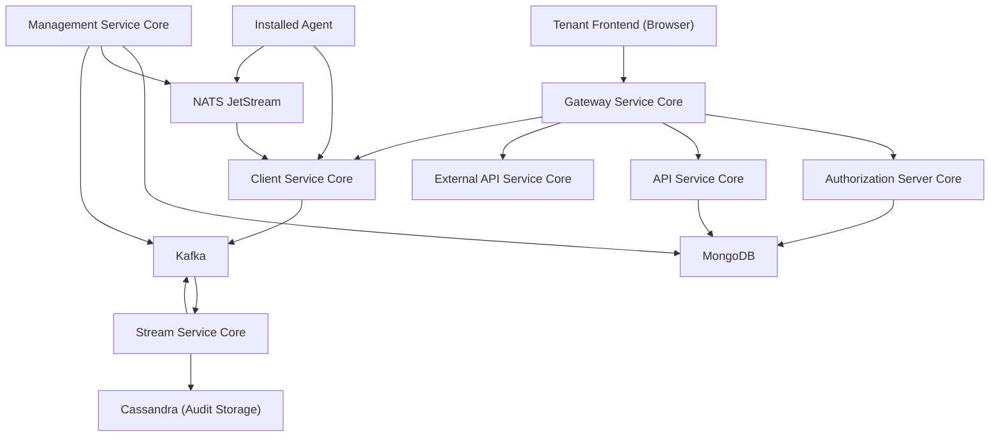

---

# Repository Structure

The repository is divided into:

## 1. Shared Core Libraries (`openframe-oss-lib/`)
Infrastructure and reusable modules.

## 2. Deployable Service Applications (`openframe/services`)
Spring Boot applications composing the platform runtime.

## 3. Tenant Frontend (`openframe/services/openframe-frontend`)
Browser-based SaaS tenant UI.

---

# Core Modules Documentation

Below is a structured overview of each major module and its role.

---

## 1️⃣ API Service Core  
Path: `openframe-oss-lib/openframe-api-service-core`

### Purpose
Primary internal API layer exposing:
- REST (mutations / commands)
- GraphQL (queries via Netflix DGS)
- JWT resource server
- DataLoader-based N+1 prevention

### Responsibilities
- Device management
- Organizations
- Users
- Logs & Events
- Tools
- SSO configuration

### Internal Architecture

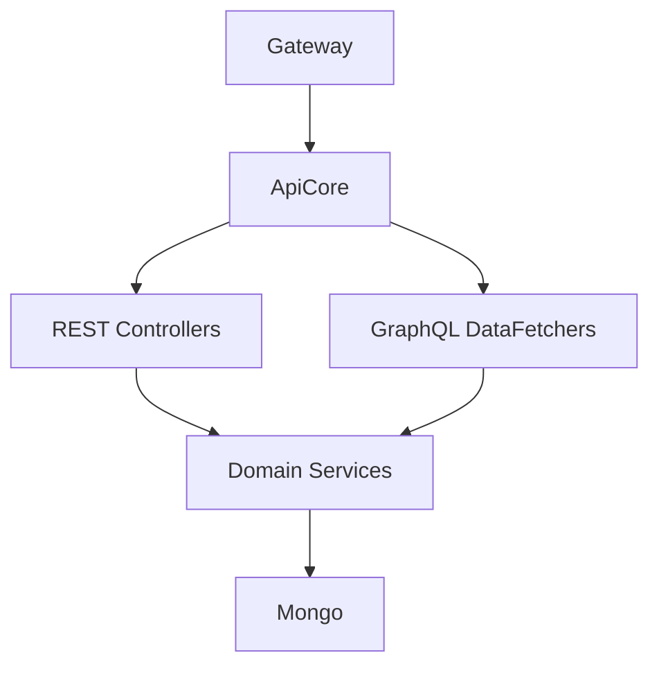

📖 See module documentation:  
**Api Service Core**

---

## 2️⃣ API Lib – Contracts and Shared Services  
Path: `openframe-oss-lib/openframe-api-lib`

### Purpose
Defines:
- DTO contracts
- Cursor pagination models
- Filter objects
- Mappers
- Shared batch services

### Enables
- Consistent REST + GraphQL schemas
- Batch loading support
- Unified domain language

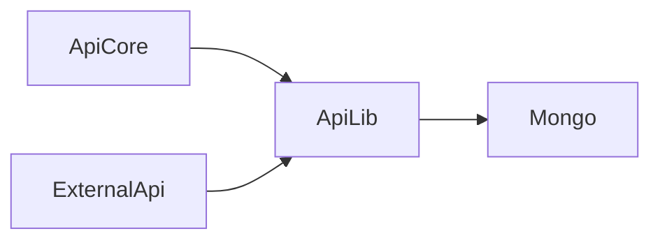

📖 See module documentation:  
**Api Lib Contracts And Services**

---

## 3️⃣ Authorization Server Core  
Path: `openframe-oss-lib/openframe-authorization-service-core`

### Purpose
Multi-tenant OAuth2 / OIDC identity provider.

### Capabilities
- Per-tenant RSA key generation
- JWT issuance with custom claims
- Google + Microsoft SSO
- Invitation onboarding
- Tenant discovery
- Mongo-backed authorization storage

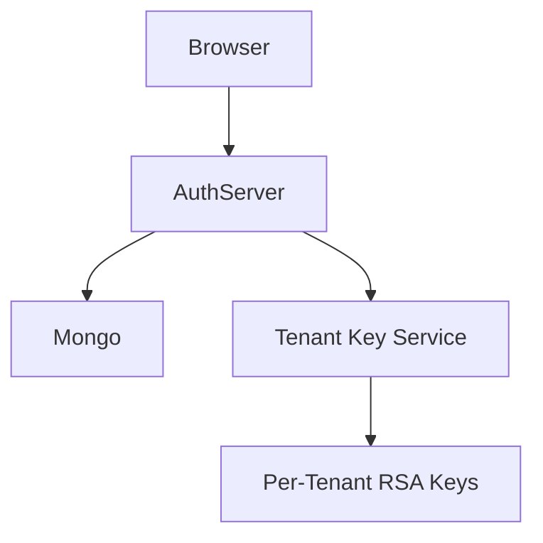

📖 See module documentation:  
**Authorization Server Core**

---

## 4️⃣ Gateway Service Core  
Path: `openframe-oss-lib/openframe-gateway-service-core`

### Purpose
Reactive edge gateway (Spring Cloud Gateway).

### Responsibilities
- JWT validation (multi-issuer)
- API key enforcement
- CORS
- WebSocket routing
- Authorization header normalization
- Role-based access control

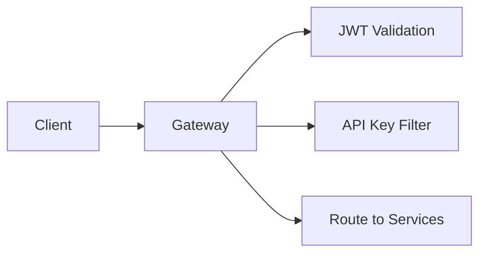

📖 See module documentation:  
**Gateway Service Core**

---

## 5️⃣ External API Service Core  
Path: `openframe-oss-lib/openframe-external-api-service-core`

### Purpose
Public REST API for third-party integrations.

### Features
- API key secured
- Rate limited
- OpenAPI documented
- Tool proxying
- Cursor pagination

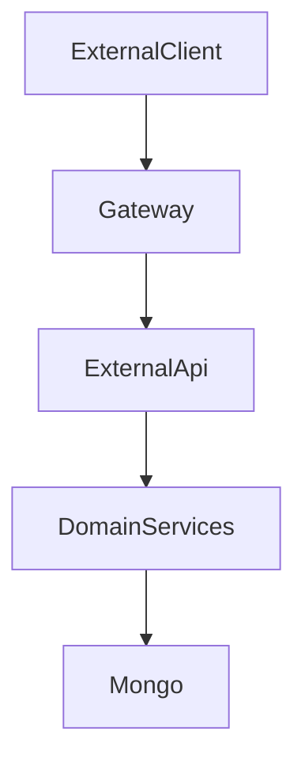

📖 See module documentation:  
**External Api Service Core**

---

## 6️⃣ Client Service Core  
Path: `openframe-oss-lib/openframe-client-core`

### Purpose
Agent control plane.

### Responsibilities
- Agent registration
- OAuth-style agent token issuance
- Machine heartbeat processing
- Tool connection tracking
- Installed agent events

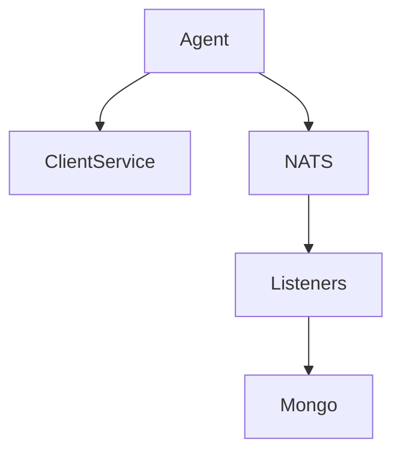

📖 See module documentation:  
**Client Service Core**

---

## 7️⃣ Management Service Core  
Path: `openframe-oss-lib/openframe-management-service-core`

### Purpose
Operational control plane.

### Responsibilities
- Integrated tool lifecycle
- Debezium connector orchestration
- NATS stream provisioning
- Agent secret initialization
- Release version propagation

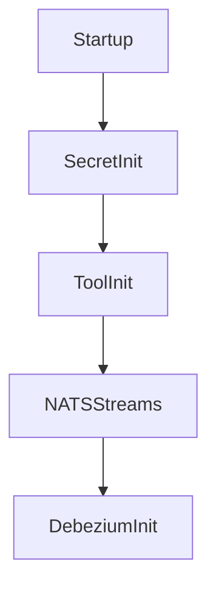

📖 See module documentation:  
**Management Service Core**

---

## 8️⃣ Stream Service Core  
Path: `openframe-oss-lib/openframe-stream-service-core`

### Purpose
Event ingestion, normalization, enrichment.

### Responsibilities
- Debezium CDC handling
- Tool event mapping
- Redis-based enrichment
- Kafka republishing
- Cassandra persistence
- Kafka Streams joins

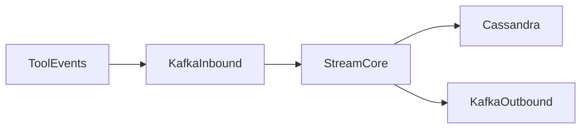

📖 See module documentation:  
**Stream Service Core**

---

## 9️⃣ Data Access Mongo  
Path: `openframe-oss-lib/openframe-data-mongo`

### Purpose
MongoDB persistence layer.

### Features
- Blocking + Reactive repositories
- Cursor pagination
- Multi-tenant indexing
- OAuth token storage
- Custom repository implementations

📖 See module documentation:  
**Data Access Mongo**

---

## 🔟 Data Access Kafka  
Path: `openframe-oss-lib/openframe-data-kafka`

### Purpose
Tenant-aware Kafka auto-configuration.

### Provides
- ProducerFactory
- ConsumerFactory
- KafkaTemplate
- Topic auto-registration
- Tenant property namespace

📖 See module documentation:  
**Data Access Kafka**

---

## 1️⃣1️⃣ Security Core & OAuth BFF  
Path:  
- `openframe-oss-lib/openframe-security-core`  
- `openframe-oss-lib/openframe-security-oauth`

### Purpose
Frontend-facing OAuth orchestration layer.

### Features
- RSA JWT encoder/decoder
- PKCE utilities
- Secure cookie handling
- OAuth BFF controller
- Redirect resolution
- Dev ticket support

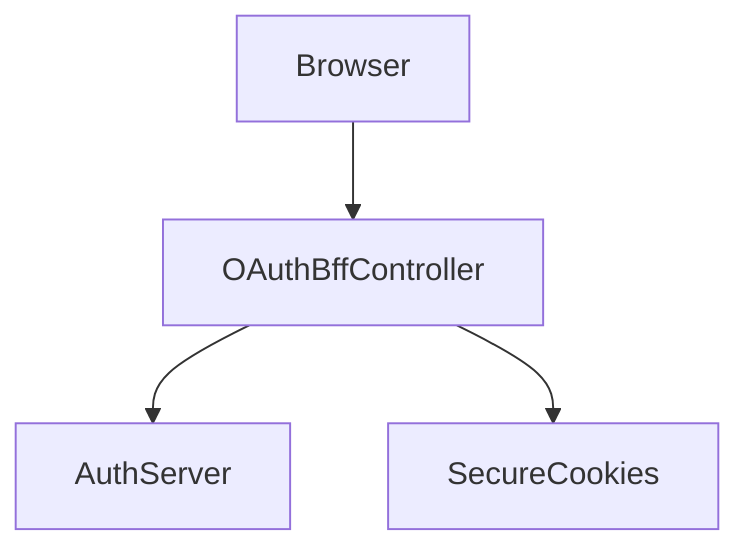

📖 See module documentation:  
**Security Core And Oauth Bff**

---

## 1️⃣2️⃣ Service Applications  
Path: `openframe/services`

Deployable Spring Boot services:

- `openframe-api`
- `openframe-authorization-server`
- `openframe-gateway`
- `openframe-external-api`
- `openframe-client`
- `openframe-management`
- `openframe-stream`
- `openframe-config`

These wire together all core libraries into runtime services.

📖 See module documentation:  
**Service Applications**

---

## 1️⃣3️⃣ Tenant Frontend App Core  
Path: `openframe/services/openframe-frontend`

### Purpose
Browser-based SaaS tenant UI.

### Core Clients
- `ApiClient`
- `AuthApiClient`

### Capabilities
- Cookie-based authentication
- Automatic token refresh
- Dev ticket mode
- Multi-tenant URL resolution
- SaaS onboarding support

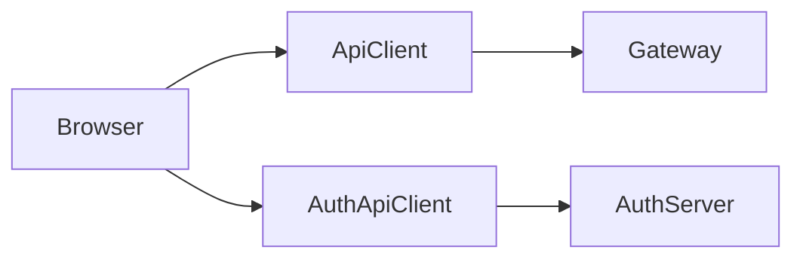

📖 See module documentation:  
**Tenant Frontend App Core**

---

# End-to-End Request Lifecycle

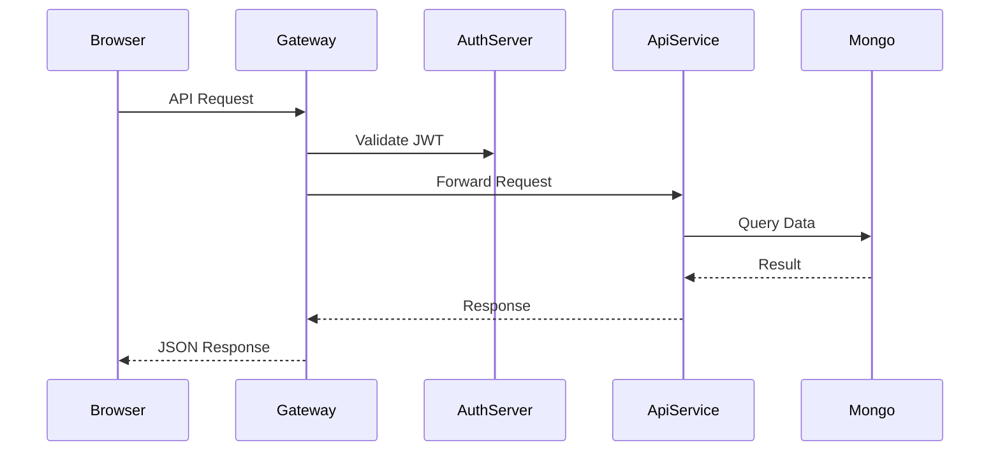

---

# Architectural Characteristics

- ✅ Strict multi-tenancy
- ✅ Per-tenant JWT signing keys
- ✅ Cursor-based pagination
- ✅ Reactive gateway edge
- ✅ Event-driven Kafka + NATS architecture
- ✅ CDC via Debezium
- ✅ Cassandra audit storage
- ✅ Secure OAuth BFF pattern
- ✅ Extensible via processors & hooks
- ✅ Fully modular microservice design

---

# Summary

The **`openframe-oss-tenant`** repository is the complete, production-grade SaaS runtime for OpenFrame.

It delivers:

- Identity and tenant isolation
- Secure API access
- Agent lifecycle control
- Stream normalization and audit storage
- Integration management
- Frontend SaaS experience
- Infrastructure auto-configuration

Together, these modules form a **scalable, multi-tenant, event-driven MSP platform foundation** for OpenFrame and Flamingo.