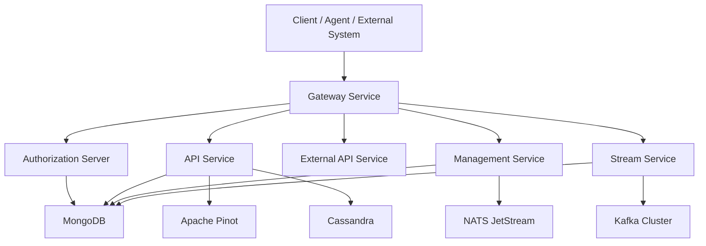
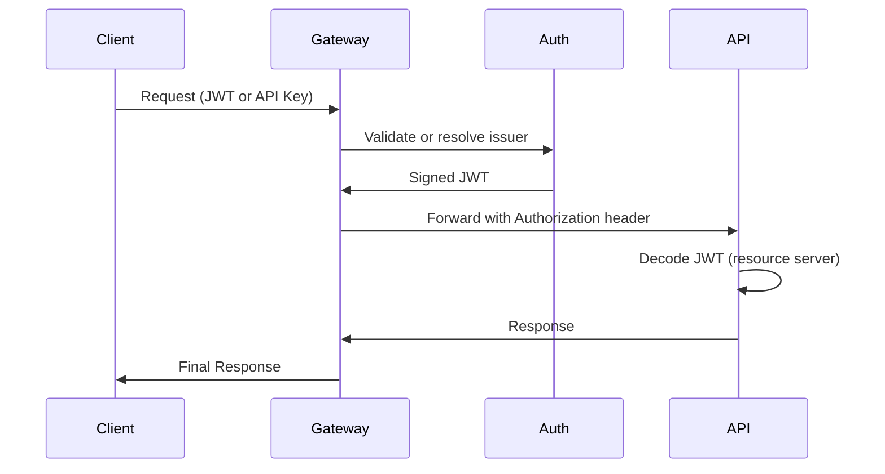
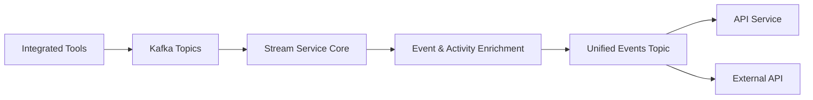
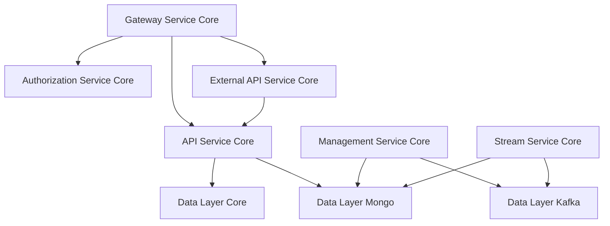
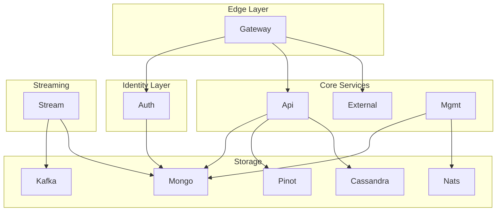

# OpenFrame OSS Tenant – Repository Overview

The **`openframe-oss-tenant`** repository contains the full multi-service, multi-tenant backend stack of the OpenFrame platform. It is a modular, Spring Boot–based architecture that powers:

- Multi-tenant identity & authorization (OAuth2 / OIDC)
- API orchestration (GraphQL + REST)
- Event-driven streaming & enrichment
- API key–based external integrations
- Distributed data persistence (Mongo, Kafka, Cassandra, Pinot)
- Operational management & tool lifecycle
- Edge routing & security enforcement

This repository represents a **complete, production-grade OSS tenant deployment** of OpenFrame.

---

# 1. Purpose of the Repository

The `openframe-oss-tenant` repository provides:

✅ A fully multi-tenant architecture  
✅ Microservice boundaries with shared libraries  
✅ OAuth2 authorization server per tenant  
✅ Gateway-based security enforcement  
✅ Real-time streaming & CDC processing  
✅ External API surface with rate limiting  
✅ Multi-model data storage (Mongo, Kafka, Cassandra, Pinot)  
✅ Tool integration lifecycle management  

It is designed to support:

- MSP-grade SaaS deployments  
- Tenant-isolated identity & data  
- Real-time telemetry ingestion  
- Unified event modeling across integrated tools  

---

# 2. End-to-End Architecture

## 2.1 High-Level Platform Architecture

### Architectural Layers

| Layer | Responsibility |
|-------|---------------|
| Gateway | Edge routing, JWT validation, API key enforcement |
| Authorization | Multi-tenant OAuth2 + OIDC |
| API | GraphQL + internal REST orchestration |
| External API | API key–based public REST interface |
| Management | Tool lifecycle + infra initialization |
| Stream | Kafka-based real-time processing |
| Data Layer | Mongo, Kafka, Cassandra, Pinot |

---

## 2.2 Authentication & Request Flow

Key Properties:

- Per-tenant RSA signing keys
- Multi-issuer JWT validation
- API key rate limiting at Gateway
- Resource-server validation in downstream services

---

## 2.3 Event Processing Architecture

Core Capabilities:

- Debezium CDC ingestion
- Tool-specific → unified event mapping
- Kafka Streams joins (activity enrichment)
- Multi-tenant stream isolation
- Header-based message routing

---

# 3. Repository Structure

The repository is divided into:

## 3.1 Core Service Libraries (`openframe-oss-lib`)

Reusable modules providing domain logic and infrastructure.

### API & Contracts

- **api-service-core**
- **api-lib-contracts-and-services**

See:
- `api-service-core/api-service-core.md`
- `api-lib-contracts-and-services/api-lib-contracts-and-services.md`

---

### Security & Identity

- **authorization-service-core**
- **gateway-service-core**

See:
- `authorization-service-core/authorization-service-core.md`
- `gateway-service-core/gateway-service-core.md`

---

### Streaming & Messaging

- **stream-service-core**
- **data-layer-kafka**

See:
- `stream-service-core/stream-service-core.md`
- `data-layer-kafka/data-layer-kafka.md`

---

### Persistence

- **data-layer-mongo**
- **data-layer-core**

See:
- `data-layer-mongo/data-layer-mongo.md`
- `data-layer-core/data-layer-core.md`

---

### Operational & Tooling

- **management-service-core**
- **external-api-service-core**

See:
- `management-service-core/management-service-core.md`
- `external-api-service-core/external-api-service-core.md`

---

## 3.2 Service Applications (`openframe/services`)

Executable Spring Boot applications that assemble the above modules.

| Application | Purpose |
|-------------|----------|
| `openframe-api` | Internal GraphQL + REST API |
| `openframe-authorization-server` | OAuth2 multi-tenant server |
| `openframe-gateway` | Edge security & routing |
| `openframe-external-api` | Public REST API |
| `openframe-management` | Tool lifecycle management |
| `openframe-stream` | Kafka event processor |
| `openframe-client` | Tenant runtime service |
| `openframe-config` | Configuration server |

See:
- `services/service-applications.md`

---

# 4. Core Module Responsibilities

Below is a condensed mapping of responsibility boundaries:

---

# 5. Design Principles

### ✅ Multi-Tenant First
- TenantContext resolution
- Per-tenant signing keys
- Tenant-scoped Kafka & data filtering

### ✅ Clear Separation of Concerns
- Transport (Gateway)
- Identity (Authorization)
- Orchestration (API)
- Infrastructure (Data layers)
- Streaming (Stream Service)

### ✅ Event-Driven Backbone
- Kafka-based integration
- CDC-ready
- Unified event modeling

### ✅ Extension-Friendly
- Post-save hooks
- Conditional processors
- Overridable beans

### ✅ Infrastructure-as-Code
- Automatic stream provisioning
- Index creation
- Keyspace initialization
- Topic auto-creation

---

# 6. Complete System Interaction Overview

---

# 7. Summary

The **`openframe-oss-tenant`** repository is a complete multi-tenant backend platform composed of:

- Modular service cores
- Executable microservices
- Distributed persistence layers
- Event-driven streaming infrastructure
- Multi-tenant identity enforcement
- Secure external integration surface

It provides the foundational backend stack for OpenFrame deployments and serves as the backbone of Flamingo’s unified AI-powered MSP platform.

For deeper technical documentation, refer to the individual module documentation:

- API Service Core  
- Authorization Service Core  
- Gateway Service Core  
- Stream Service Core  
- Data Layer Mongo  
- Data Layer Kafka  
- Data Layer Core  
- Management Service Core  
- External API Service Core  
- Service Applications  

Each module is independently documented and designed for composability within the OpenFrame ecosystem.