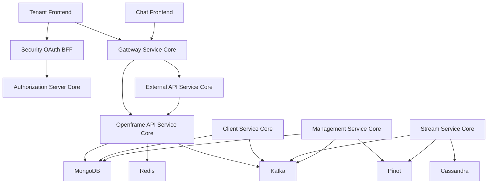
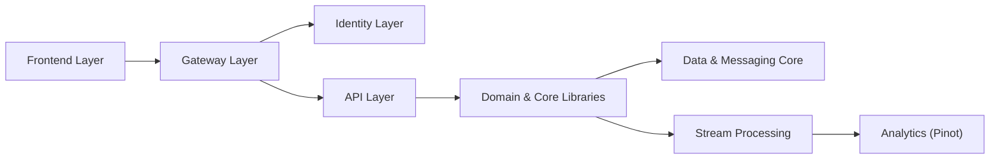
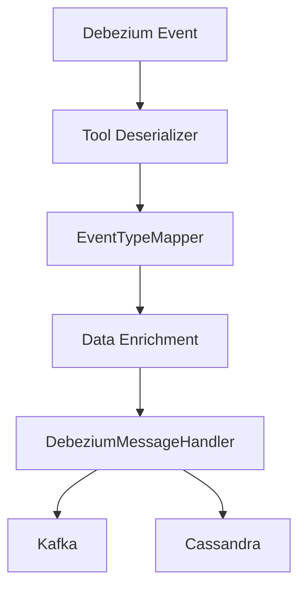
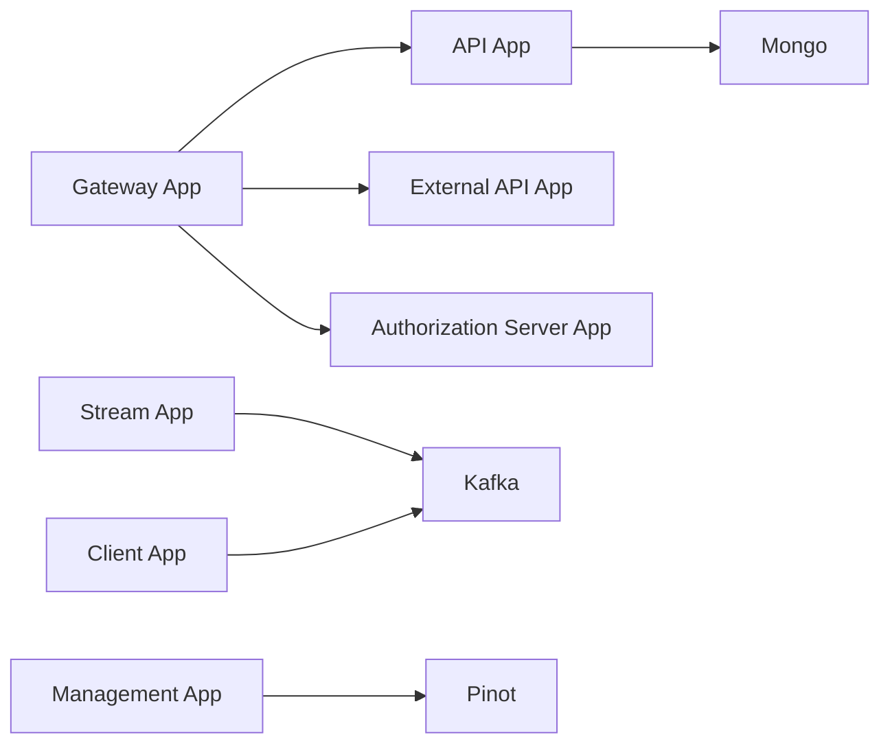
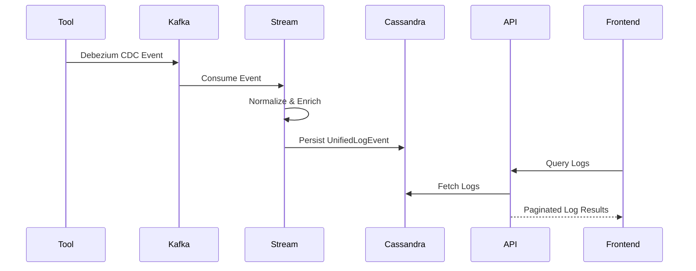

# OpenFrame OSS Tenant – Repository Overview

The **`openframe-oss-tenant`** repository contains the complete multi-tenant OpenFrame platform implementation. It is a modular, microservice-based system designed to power Flamingo’s AI-driven MSP platform and OpenFrame unified IT operations layer.

This repository includes:

- ✅ Identity & multi-tenant OAuth infrastructure  
- ✅ API services (REST + GraphQL)  
- ✅ Gateway & edge security  
- ✅ Real-time stream processing  
- ✅ Tool & agent lifecycle management  
- ✅ Data storage & messaging infrastructure  
- ✅ External integration APIs  
- ✅ Tenant frontend + Chat frontend core  

It represents a **production-grade, event-driven, multi-tenant SaaS architecture**.

---

# 🎯 Purpose of the Repository

`openframe-oss-tenant` provides the **full open-source tenant stack** of OpenFrame, enabling:

- Multi-tenant SaaS deployments
- AI-powered device and log monitoring
- Tool integrations (Fleet MDM, Tactical RMM, MeshCentral)
- Real-time event ingestion & normalization
- Secure OAuth2 / OIDC authentication
- API key–based external integrations
- Agent lifecycle and machine management
- Frontend tenant UI + AI chat interface

It is structured as:

- Reusable **core libraries**
- Thin **service applications**
- Frontend integration layers
- Streaming and data infrastructure modules

---

# 🏗 End-to-End Architecture

Below is the complete system flow across edge, identity, API, streaming, storage, and frontend.

---

# 🧠 Logical Architecture Layers

OpenFrame follows a layered architecture:

---

# 📦 Repository Structure

The repository is organized into reusable **core modules** and runnable **service applications**.

---

# 1️⃣ Core Libraries

These modules contain the domain logic and infrastructure.

---

## 🔐 Authorization Server Core

**Path:** `openframe-oss-lib/openframe-authorization-service-core`

### Purpose
- OAuth2 Authorization Server
- OpenID Connect provider
- Multi-tenant identity isolation
- Dynamic SSO registration (Google, Microsoft)
- Tenant-scoped JWT signing keys

### Key Concepts
- TenantContext (ThreadLocal isolation)
- RSA per-tenant JWK signing
- PKCE + OIDC flows
- Invitation & onboarding flows

📖 See: `authorization-server-core` documentation

---

## 🌐 Gateway Service Core

**Path:** `openframe-oss-lib/openframe-gateway-service-core`

### Purpose
- Edge routing
- JWT validation (multi-issuer)
- API key authentication
- Rate limiting
- WebSocket proxying

### Capabilities
- JWT resource server
- API key filter
- Tool HTTP proxy
- Tool WebSocket routing
- CORS & header enrichment

📖 See: `gateway-service-core` documentation

---

## 🧩 Openframe API Service Core

**Path:** `openframe-oss-lib/openframe-api-service-core`

### Purpose
- GraphQL (Netflix DGS)
- Internal REST APIs
- Organization, device, user management
- SSO configuration
- API key lifecycle
- Invitation management

### Key Design
- Gateway-first security
- DataLoader batching
- Cursor-based pagination
- Pluggable processors

📖 See: `openframe-api-service-core` documentation

---

## 📜 Openframe API Contracts

**Path:** `openframe-oss-lib/openframe-api-lib`

Defines:

- Shared DTOs
- Filter models
- Pagination contracts
- Mappers
- Domain service helpers

This module is the **contract spine** between REST, GraphQL, and persistence.

📖 See: `openframe-api-contracts` documentation

---

## 📡 Stream Service Core

**Path:** `openframe-oss-lib/openframe-stream-service-core`

### Purpose
- Debezium CDC consumption
- Tool event deserialization
- Event normalization
- Unified event taxonomy
- Cassandra persistence
- Kafka outbound publishing
- Kafka Streams joins

### Event Flow

📖 See: `stream-service-core` documentation

---

## 🗄 Data Storage and Messaging Core

**Path:** `openframe-oss-lib/openframe-data-*`

Provides:

- MongoDB documents & repositories
- Redis cache layer
- Kafka producer configuration
- Debezium message models
- Cassandra config
- Pinot analytics repositories

This module guarantees **multi-tenant safety** across storage systems.

📖 See: `data-storage-and-messaging-core` documentation

---

## 🛠 Management Service Core

**Path:** `openframe-oss-lib/openframe-management-service-core`

### Responsibilities
- Tool lifecycle management
- Debezium connector initialization
- Pinot schema deployment
- NATS stream provisioning
- Client configuration bootstrapping
- Release coordination

It acts as the **control plane** of OpenFrame.

📖 See: `management-service-core` documentation

---

## 🖥 Client Service Core

**Path:** `openframe-oss-lib/openframe-client-core`

### Responsibilities
- Agent registration
- Agent OAuth authentication
- Machine heartbeat processing
- Tool connection listeners
- Tool agent ID transformation

It is the runtime bridge between installed agents and backend services.

📖 See: `client-service-core` documentation

---

## 🌍 External API Service Core

**Path:** `openframe-oss-lib/openframe-external-api-service-core`

Provides:

- Versioned REST APIs (`/api/v1`)
- API key–secured access
- Filtering & pagination
- Tool proxy endpoints
- OpenAPI documentation

Designed for third-party integrations.

📖 See: `external-api-service-core` documentation

---

## 🔐 Security OAuth BFF

Implements:

- Backend-for-Frontend OAuth flow
- PKCE
- Cookie-based token lifecycle
- JWT key management

Prevents browser token exposure.

📖 See: `security-oauth-bff` documentation

---

## 💬 Chat Frontend Core

Defines:

- Streaming message types
- Segment-based rendering contracts
- Tool execution & approval message models
- WebSocket streaming contracts
- Chunk processors & buffer managers

📖 See: `chat-frontend-core` documentation

---

## 🎨 Tenant Frontend API Clients & Hooks

Provides:

- ApiClient abstraction
- AuthApiClient
- Fleet & Tactical tool clients
- Chat (Mingo AI) integration
- Zustand chat state store
- Tenant discovery & SSO hooks

📖 See: `tenant-frontend-api-clients-and-hooks` documentation

---

# 🚀 Service Applications

**Path:** `openframe/services`

These are thin Spring Boot applications wiring the core modules into deployable services:

- `openframe-api`
- `openframe-authorization-server`
- `openframe-gateway`
- `openframe-external-api`
- `openframe-stream`
- `openframe-management`
- `openframe-client`
- `openframe-config`

Each application only bootstraps modules and enables infrastructure.

📖 See: `service-applications` documentation

---

# 🔄 End-to-End Data Flow Example

### Device Event Ingestion

---

# 🧩 Design Principles

- ✅ Multi-tenant isolation at every layer  
- ✅ Gateway-first security enforcement  
- ✅ Event-driven architecture  
- ✅ Cursor-based pagination  
- ✅ Pluggable processors for SaaS overrides  
- ✅ Strong contract boundary via API Contracts  
- ✅ Idempotent infrastructure bootstrapping  
- ✅ Tool-agnostic streaming normalization  

---

# 📌 Summary

The **`openframe-oss-tenant`** repository is the complete OpenFrame multi-tenant SaaS stack.

It provides:

- Identity & OAuth infrastructure  
- Edge security & routing  
- GraphQL + REST APIs  
- Real-time event ingestion & normalization  
- Multi-database persistence  
- Tool integration & agent lifecycle  
- AI-powered chat frontend contracts  
- Versioned external integration APIs  

It is the **foundation of Flamingo’s AI-powered MSP platform and OpenFrame unified IT automation layer**.