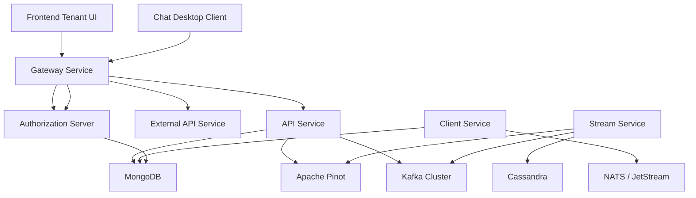
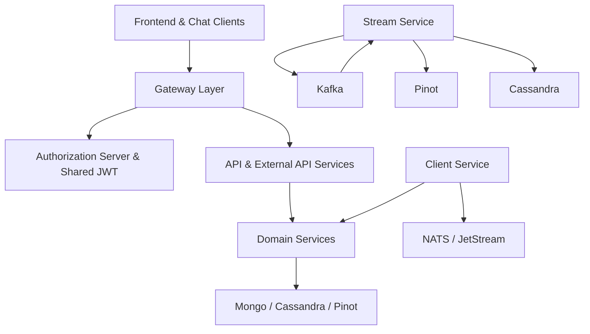
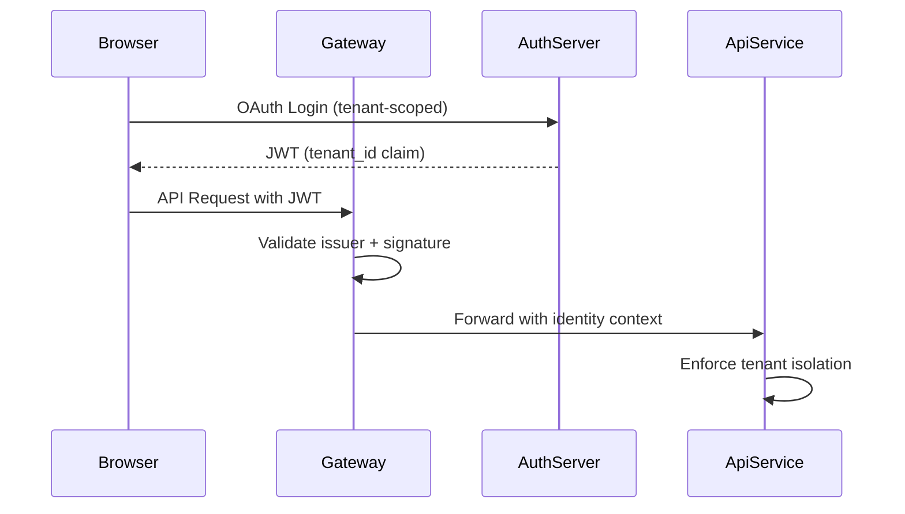
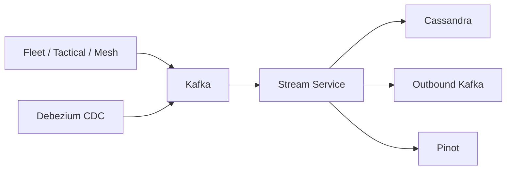
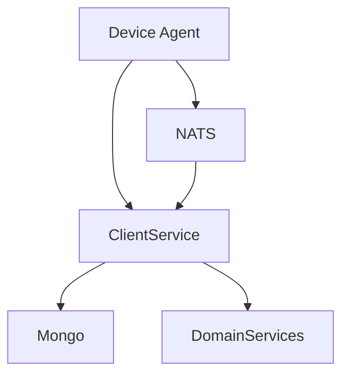

# OpenFrame OSS Tenant – Repository Overview

The **`openframe-oss-tenant`** repository is the multi-service, multi-tenant open-source foundation of the OpenFrame platform. It provides the full backend and frontend stack required to run a tenant-aware, AI-enabled MSP platform including:

- ✅ API Service (REST + GraphQL)
- ✅ Authorization Server (OAuth2 / OIDC, multi-tenant)
- ✅ Gateway (JWT validation, API keys, WebSocket proxy)
- ✅ Stream Service (Kafka Streams, enrichment, CDC processing)
- ✅ Client Service (agent lifecycle & NATS listeners)
- ✅ External API Service (public API-key interface)
- ✅ Data Layer (MongoDB, Cassandra, Pinot)
- ✅ Kafka infrastructure
- ✅ Shared Security & OAuth BFF
- ✅ Frontend Tenant UI + Mingo AI
- ✅ Chat Desktop Client services

This repository is not a single application — it is a **modular microservice architecture** built from reusable core libraries and service entrypoints.

---

# 1. End-to-End Architecture

The OpenFrame OSS Tenant platform follows a layered, event-driven, multi-tenant SaaS architecture.

## High-Level System Topology



---

# 2. Layered Architecture

OpenFrame is composed of reusable **core libraries** and deployable **service applications**.

## Architectural Layers



---

# 3. Core Service Applications

Located under:

```
openframe/services
```

These are Spring Boot entrypoints that wire the core libraries into deployable services.

### Key Services

- **API Service** – REST + GraphQL internal platform APIs
- **Authorization Server** – Multi-tenant OAuth2/OIDC
- **Gateway** – JWT validation, API key enforcement, WebSocket proxy
- **External API** – Public, API-key–secured integration surface
- **Stream Service** – Kafka Streams processing & enrichment
- **Client Service** – Agent registration & lifecycle management
- **Management Service** – Operational tooling
- **Config Server** – Centralized configuration

Documentation reference:
- See **Service Applications Entrypoints**

---

# 4. Identity & Multi-Tenancy Model

OpenFrame enforces tenant isolation across:

- JWT claims
- OAuth clients
- RSA signing keys
- Mongo documents
- SSO provider configuration

## Multi-Tenant Security Flow



Documentation references:
- **Authorization Server Core And Tenant Context**
- **Authorization Server Keys And Persistence**
- **Security OAuth BFF And Shared JWT**

---

# 5. API Layer

The API layer is split into:

- **Internal API Service**
- **External API Service**
- **Gateway Controllers**

## Internal API Service

- REST Controllers
- GraphQL Fetchers
- DataLoaders
- Cursor-based pagination
- Tenant-aware authentication

Documentation:
- **Api Service Core Config And Security**
- **Api Service Core Rest Controllers**
- **Api Service Core GraphQL Fetchers And Dataloaders**

---

## External API Service

- `/api/v1/**`
- API-key authentication
- Rate limiting
- Structured DTO contracts
- Tool proxying

Documentation:
- **External Api Service Core Rest And Dto**

---

# 6. Streaming & Event Processing

The Stream Service normalizes and enriches events from:

- Fleet MDM
- MeshCentral
- Tactical RMM
- Debezium CDC

## Streaming Architecture



Core modules:
- **Stream Service Core Kafka Streams And Deserialization**
- **Stream Service Core Message Handling And Enrichment**
- **Data Streaming Kafka Config And Models**

---

# 7. Data Layer

The repository includes multiple data systems:

| Technology | Purpose |
|------------|----------|
| MongoDB | Primary transactional storage |
| Cassandra | Time-series & log persistence |
| Apache Pinot | Real-time analytics |
| Kafka | Event backbone |
| NATS / JetStream | Agent event messaging |

Documentation:
- **Data Mongo Core And Documents**
- **Data Mongo Repositories**
- **Data Pinot Repositories And Models**
- **Data Platform Config And Health**

---

# 8. Client & Agent Lifecycle

The Client Service handles:

- Agent authentication
- Machine registration
- Tool agent downloads
- NATS-based heartbeats
- Installed agent tracking
- Tool connection events

## Agent Event Flow



Documentation:
- **Client Service Core Http And Listeners**

---

# 9. Gateway Layer

The Gateway is the reactive edge:

- JWT issuer validation
- API key enforcement
- Rate limiting
- CORS
- WebSocket proxying

Documentation:
- **Gateway Core Security And Websocket Proxy**
- **Gateway Rest Controllers**

---

# 10. Frontend & AI (Mingo)

The frontend integrates:

- Centralized `ApiClient`
- SaaS-aware authentication
- Tool API wrappers
- Mingo AI dialog orchestration
- Streaming message store
- GraphQL chat integration

Documentation:
- **Frontend Tenant Api Clients And Mingo**
- **Chat Client Services And Debug**

---

# 11. Repository Design Principles

### ✅ Modular Monorepo
Reusable core libraries shared across services.

### ✅ Multi-Tenant by Design
Tenant ID embedded at:
- Token level
- Database level
- OAuth client level
- Key management level

### ✅ Event-Driven Backbone
Kafka + Streams for normalization and enrichment.

### ✅ Reactive Edge
Gateway built with Spring WebFlux.

### ✅ AI-Ready
Integrated Mingo AI chat system with streaming messages and tool execution workflows.

### ✅ Extensible
Most services provide:
- Conditional beans
- Strategy interfaces
- Overridable processors

---

# 12. Core Modules Documentation Index

Below are the primary documentation modules in this repository:

### API Layer
- Api Service Core Config And Security  
- Api Service Core Rest Controllers  
- Api Service Core GraphQL Fetchers And Dataloaders  
- Api Lib DTO And Mapping  
- Api Lib Domain Services  

### Authorization
- Authorization Server Core And Tenant Context  
- Authorization Server Rest Controllers  
- Authorization Server Keys And Persistence  
- Authorization Server SSO And Registration Flow  

### Data
- Data Mongo Core And Documents  
- Data Mongo Repositories  
- Data Platform Config And Health  
- Data Pinot Repositories And Models  
- Data Streaming Kafka Config And Models  

### Gateway
- Gateway Core Security And Websocket Proxy  
- Gateway Rest Controllers  

### Stream
- Stream Service Core Kafka Streams And Deserialization  
- Stream Service Core Message Handling And Enrichment  

### Client
- Client Service Core Http And Listeners  

### Security
- Security OAuth BFF And Shared JWT  

### Frontend
- Frontend Tenant Api Clients And Mingo  
- Chat Client Services And Debug  

### Applications
- Service Applications Entrypoints  

---

# Conclusion

The **`openframe-oss-tenant`** repository is the full-stack, multi-tenant OpenFrame SaaS platform foundation.

It combines:

- OAuth2 multi-tenant identity
- JWT-secured microservices
- Reactive gateway edge
- REST + GraphQL APIs
- Event-driven streaming
- Analytics via Pinot
- Agent lifecycle orchestration
- API-key public interface
- AI-powered chat (Mingo)
- Frontend + Desktop clients

It is designed for scalability, extensibility, and strict tenant isolation — enabling OpenFrame to function as a unified AI-driven MSP platform.