# Api Lib Contracts And Services

## Overview

The **Api Lib Contracts And Services** module provides the shared data contracts, filter models, mappers, and reusable service components that power the OpenFrame platform APIs. It acts as the foundational library used by:

- API Service Core (GraphQL layer)
- External API Service Core (REST layer)
- Gateway and client-facing services
- Management and stream services (indirectly via shared DTOs and entities)

This module ensures:

- Consistent DTOs across GraphQL and REST APIs
- Standardized filtering and pagination models
- Reusable service logic for cross-cutting concerns
- Clean separation between transport contracts and persistence entities

It is intentionally framework-light and focused on contracts and reusable logic rather than HTTP endpoint definitions.

---

## Architectural Role in the Platform

At a high level, Api Lib Contracts And Services sits between:

- Transport layers (GraphQL controllers, REST controllers)
- Data access layers (Mongo repositories, Kafka, etc.)

It defines:

- DTOs for requests and responses
- Filter and pagination models
- Mappers between domain entities and API responses
- Shared services used by DataLoaders and controllers

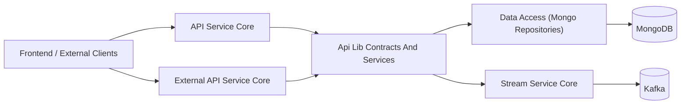

This layered structure allows:

- Reuse of DTOs across multiple services
- Centralized mapping logic
- Consistent filtering semantics across APIs

---

## Module Structure

The module can be logically divided into four main areas:

1. **DTO Contracts**
2. **Filtering and Pagination Models**
3. **Mappers**
4. **Reusable Services and Processors**

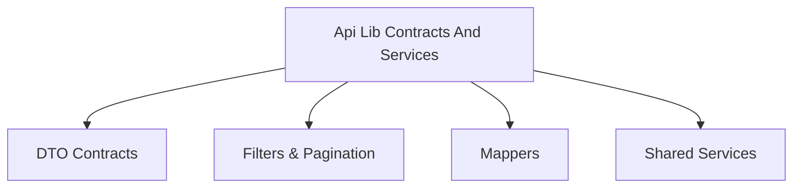

---

# 1. DTO Contracts

DTOs (Data Transfer Objects) define the public contract between services and clients. They are shared by both GraphQL and REST layers.

## 1.1 Generic Query Results

### CountedGenericQueryResult

`CountedGenericQueryResult<T>` extends a base `GenericQueryResult<T>` and adds:

- `filteredCount` — number of items matching filter criteria

This pattern is commonly used for:

- Filtered list queries
- Paginated results with metadata

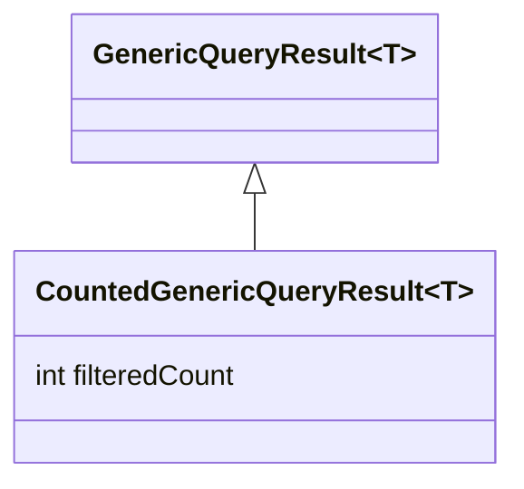

---

## 1.2 Audit and Log DTOs

These DTOs represent security and operational logs across tools and devices.

### LogEvent

Represents a summarized audit log event:

- `toolEventId`
- `eventType`
- `toolType`
- `severity`
- `userId`
- `deviceId`
- `organizationId`
- `timestamp`

### LogDetails

Extends the event view with:

- `message`
- `details`
- `summary`

Used when a detailed inspection of an audit event is required.

### LogFilterOptions and LogFilters

- `LogFilterOptions` – input filter model (date range, event types, severities, etc.)
- `LogFilters` – enriched filter representation used in UI responses

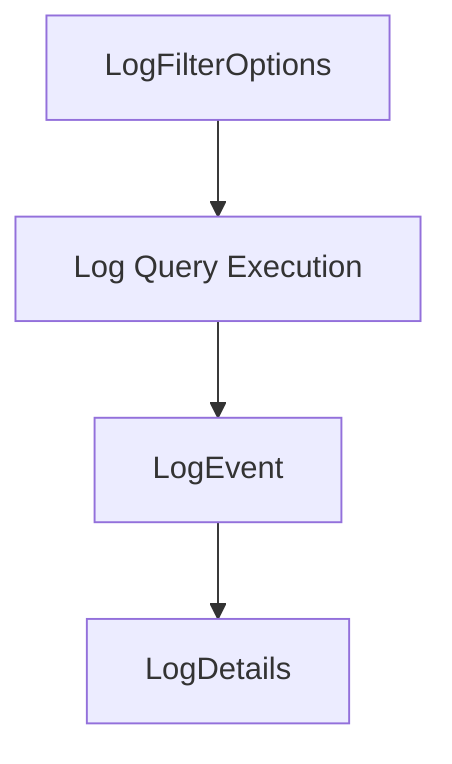

---

## 1.3 Device DTOs

Device-related contracts enable consistent filtering and metadata exposure.

### DeviceFilterOption

Represents a selectable filter value:

- `value`
- `label`
- `count`

### DeviceFilterOptions

Defines available filtering dimensions:

- Statuses
- Device types
- OS types
- Organization IDs
- Tag names

### DeviceFilters

Represents enriched filter data including:

- Lists of `DeviceFilterOption`
- `filteredCount`

This separation allows:

- Clear input model (raw filter parameters)
- Rich output model (UI-ready filter options with counts)

---

## 1.4 Event DTOs

Event filtering supports user and event-type-based queries.

- `EventFilterOptions` – includes user IDs and date range
- `EventFilters` – simplified filter representation

Used by both API Service Core and External API Service Core.

---

## 1.5 Organization DTOs

Organization contracts are shared across GraphQL and REST APIs.

### OrganizationResponse

Represents a full organization view:

- Identity fields (`id`, `organizationId`)
- Business metadata (category, employees, revenue)
- Contract lifecycle (start/end dates)
- Soft-delete metadata
- Nested contact information

### OrganizationList

Wrapper DTO for lists of organizations.

### OrganizationFilterOptions

Internal filtering metadata:

- Category
- Employee range
- Active contract flag

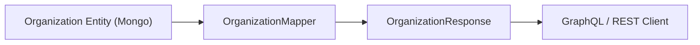

---

## 1.6 Tool DTOs

Tool-related DTOs standardize integration metadata.

- `ToolFilterOptions` – filtering dimensions (enabled, type, category)
- `ToolFilters` – filter selections
- `ToolList` – wrapper around `IntegratedTool` entities

These DTOs support both internal and external API use cases.

---

## 1.7 Shared Pagination

### CursorPaginationInput

Defines cursor-based pagination:

- `limit` (1–100, validated)
- `cursor`

This ensures:

- Consistent pagination limits
- Controlled query sizes
- Uniform client-side behavior

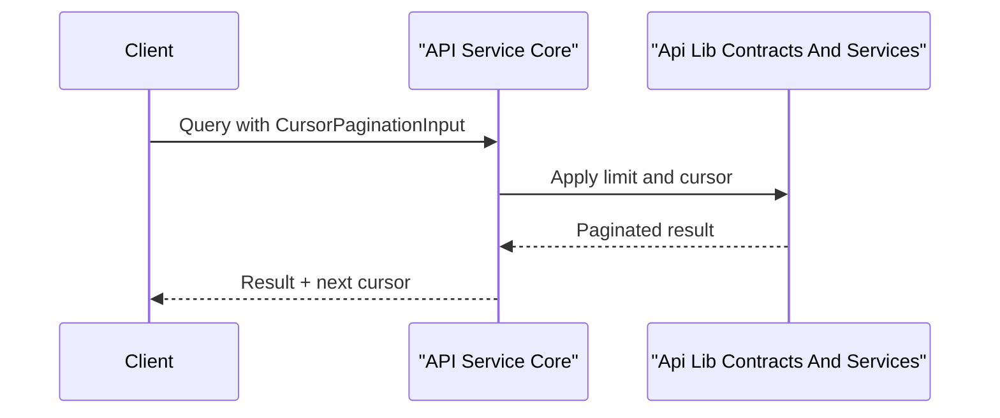

---

# 2. Mappers

## OrganizationMapper

`OrganizationMapper` is a central component responsible for converting between:

- DTOs (`CreateOrganizationRequest`, `UpdateOrganizationRequest`, `OrganizationResponse`)
- Mongo entities (`Organization`, `ContactInformation`, `Address`, etc.)

### Key Responsibilities

1. Generate `organizationId` as UUID on creation
2. Support partial updates (non-null fields only)
3. Keep `organizationId` immutable
4. Handle nested contact and address mapping
5. Support `mailingAddressSameAsPhysical` logic

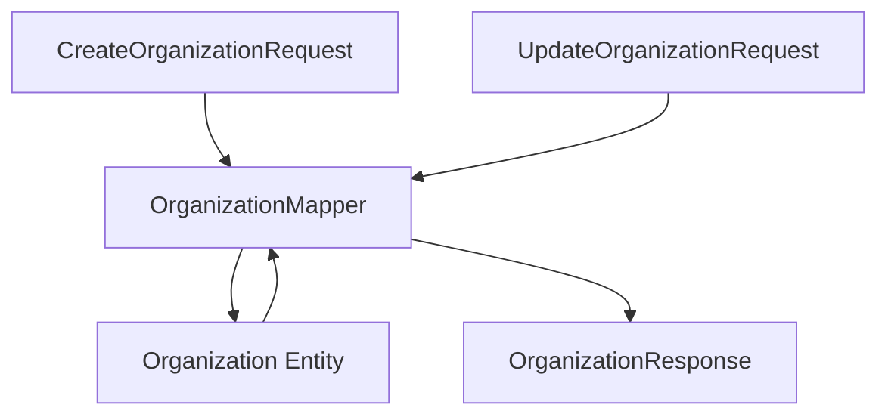

By centralizing mapping logic here:

- Controllers remain thin
- DTO evolution is isolated
- Entity integrity rules remain consistent

---

# 3. Shared Services

These services provide reusable business logic used by GraphQL DataLoaders and controllers.

## 3.1 InstalledAgentService

Provides retrieval logic for `InstalledAgent` entities.

### Key Features

- Batch loading for multiple machine IDs
- Grouping results by machine ID
- Optimized for GraphQL DataLoader usage

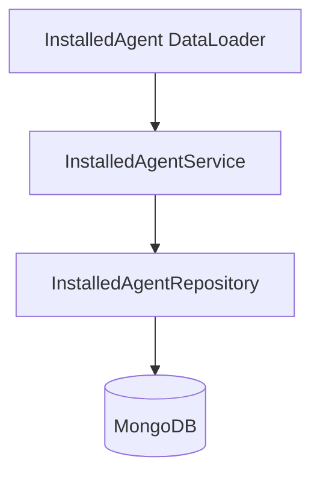

Batch method:

- `getInstalledAgentsForMachines(List<String> machineIds)`
  - Fetches all agents in one query
  - Groups by machine ID
  - Returns ordered results matching input list

This avoids the N+1 query problem in GraphQL resolvers.

---

## 3.2 ToolConnectionService

Similar in structure to InstalledAgentService, but for `ToolConnection` entities.

### Responsibilities

- Batch loading by machine IDs
- Single-machine lookup
- Read-only transactional behavior

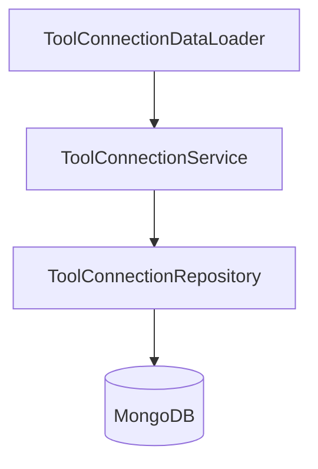

---

## 3.3 DefaultDeviceStatusProcessor

A default implementation of `DeviceStatusProcessor`.

Characteristics:

- Marked with `@ConditionalOnMissingBean`
- Used only if no custom implementation is provided
- Logs device status updates

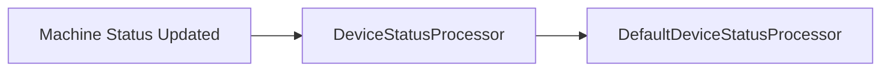

This design allows:

- Overriding behavior in higher-level services
- Pluggable post-processing logic

---

# Design Principles

The Api Lib Contracts And Services module follows these core principles:

## 1. Contract Stability

DTOs are designed to:

- Be transport-safe
- Avoid leaking persistence-specific logic
- Provide backward-compatible evolution paths

## 2. Clear Separation of Concerns

- DTOs → transport contracts
- Mappers → transformation logic
- Services → reusable business logic
- Repositories → persistence (external module)

## 3. Cross-Service Reuse

Shared by:

- API Service Core (GraphQL)
- External API Service Core (REST)
- Management and integration flows

## 4. Performance Awareness

Batch-loading methods in services support:

- DataLoader patterns
- Reduced database round-trips
- Efficient aggregation

---

# How It Fits into the Overall System

The Api Lib Contracts And Services module is not a standalone service. Instead, it is:

- A shared library
- A contract definition layer
- A reusable business logic component

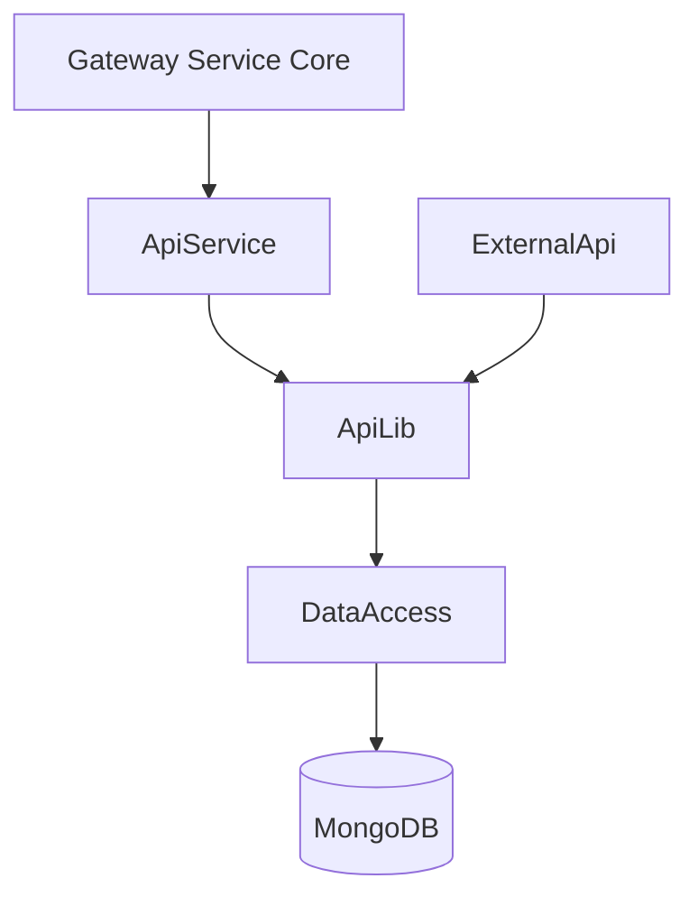

It provides the consistent language that all services in the OpenFrame ecosystem use when:

- Returning organization data
- Filtering devices and logs
- Paginating results
- Loading related entities

By centralizing contracts and shared services here, the platform achieves:

- Reduced duplication
- Stronger consistency
- Easier evolution of API schemas
- Safer multi-service refactoring

---

# Summary

The **Api Lib Contracts And Services** module is the foundational contract and shared logic layer of the OpenFrame platform.

It delivers:

- Unified DTO contracts for devices, logs, events, organizations, and tools
- Standardized filter and pagination models
- Centralized mapping logic via OrganizationMapper
- Batch-friendly reusable services for agents and tool connections
- Extensible processing hooks for device status handling

This module ensures that all API-facing services speak the same domain language while remaining cleanly decoupled from persistence and transport-specific concerns.