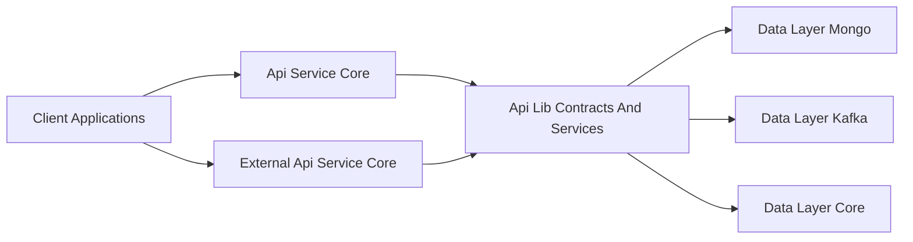
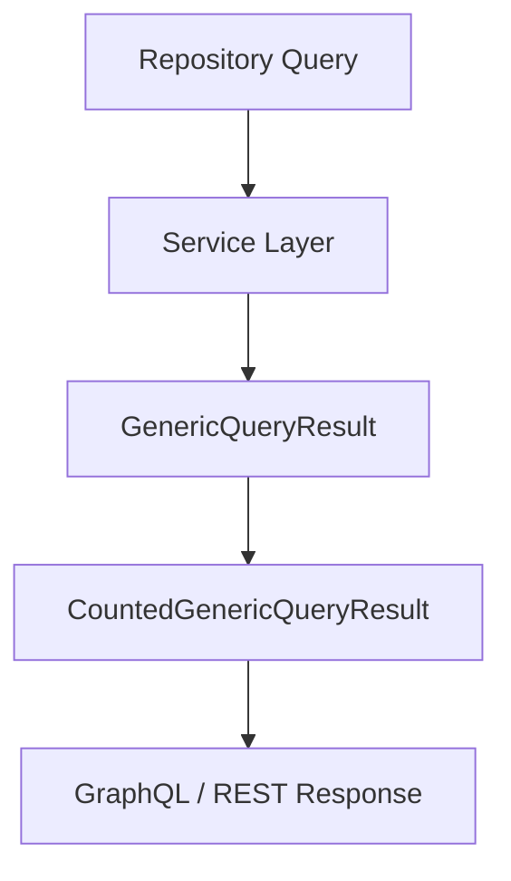
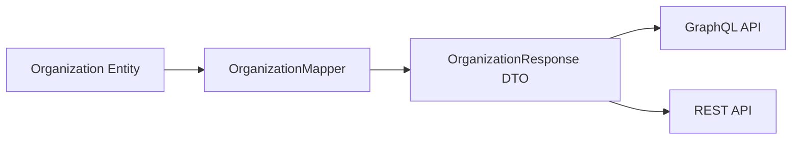
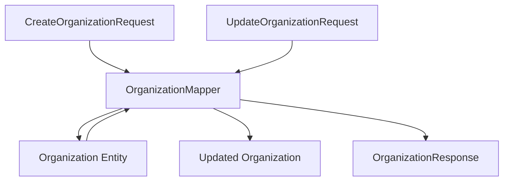
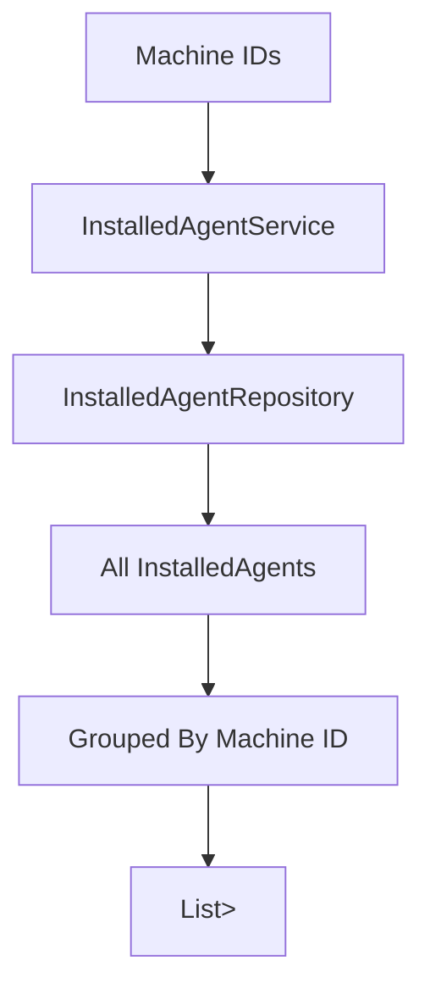
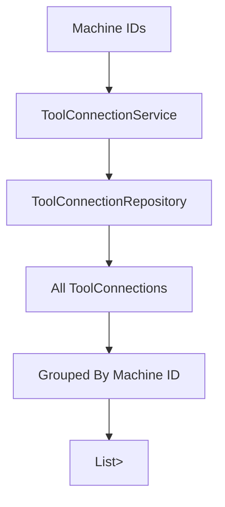
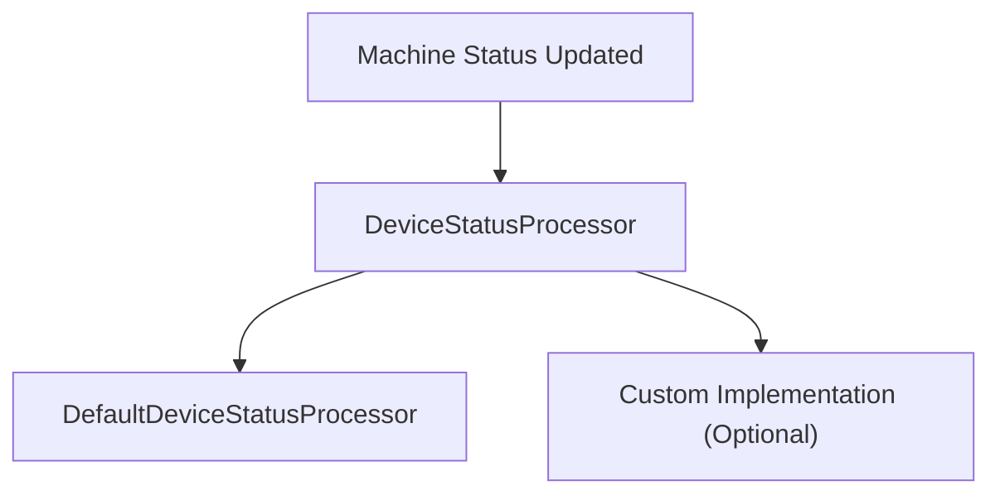

# Api Lib Contracts And Services

## Overview

The **Api Lib Contracts And Services** module provides shared API contracts, data transfer objects (DTOs), mappers, and reusable service components used across multiple OpenFrame backend services.

It acts as a **cross-service contract layer** between:

- API-facing modules (GraphQL and REST)
- Data-layer modules (Mongo, Kafka, Pinot, Cassandra)
- Business service modules

This module ensures:

- Consistent DTO structures across APIs
- Shared mapping logic between entities and responses
- Reusable service abstractions for common domain operations
- Standardized pagination and query result models

It is consumed primarily by:

- [Api Service Core](../api-service-core/api-service-core.md)
- [External Api Service Core](../external-api-service-core/external-api-service-core.md)
- [Management Service Core](../management-service-core/management-service-core.md)

---

## Architectural Role in the Platform

The Api Lib Contracts And Services module sits between transport-layer services and the data layer.



### Responsibilities

1. Define shared DTOs for REST and GraphQL
2. Provide entity-to-DTO mapping logic
3. Offer reusable domain services
4. Standardize pagination and result wrappers
5. Provide extension hooks (e.g., processors)

It contains **no controllers** and **no transport-layer configuration**. It focuses strictly on reusable contracts and business-support services.

---

# Core Areas

The module can be logically divided into four areas:

1. Query Result & Pagination Models
2. Organization DTOs & Mapping
3. Shared Domain Services
4. Extension Processors

---

# 1. Query Result & Pagination Models

## CountedGenericQueryResult

```java
public class CountedGenericQueryResult<T> extends GenericQueryResult<T> {
    private int filteredCount;
}
```

### Purpose

Extends a generic query result with:

- `filteredCount` — total number of records after filtering

This allows APIs to return:

- The current page of results
- The total filtered size
- Cursor or paging metadata (from the base class)

### Usage Pattern



This model is typically returned from services and then serialized by:

- GraphQL data fetchers in Api Service Core
- REST controllers in External Api Service Core

---

## CursorPaginationInput

```java
public class CursorPaginationInput {
    @Min(1)
    @Max(100)
    private Integer limit;
    private String cursor;
}
```

### Purpose

Standardized cursor-based pagination input across APIs.

### Key Features

- Enforces limit between 1 and 100
- Supports opaque cursor strings
- Works with GraphQL and REST consistently

### Benefits

- Prevents unbounded queries
- Improves API performance
- Provides consistent paging semantics across services

---

# 2. Organization DTOs & Mapping

This section defines shared organization contracts used by both GraphQL and REST APIs.

## OrganizationResponse

A shared DTO used across multiple services.

### Key Characteristics

- Decouples persistence entity from API response
- Includes metadata (createdAt, updatedAt, deleted)
- Includes business fields (category, revenue, contract dates)
- Supports nested contact information

### Cross-Service Usage



This ensures that:

- Both APIs expose identical organization structures
- Business rules remain centralized
- Mapping logic is not duplicated

---

## OrganizationList

```java
public class OrganizationList {
    private List<Organization> organizations;
}
```

A simple wrapper for returning multiple organizations.

Used when:

- Bulk fetching organizations
- Returning filtered lists
- Internal service-to-service responses

---

## OrganizationMapper

The central mapping component between:

- `Organization` entity (Mongo)
- Create/Update requests
- `OrganizationResponse` DTO

### Mapping Responsibilities

1. Create entity from request
2. Update entity partially
3. Convert entity to response DTO
4. Map nested contact information

### Mapping Flow



### Important Design Decisions

- `organizationId` is generated automatically using UUID
- `organizationId` is immutable after creation
- Partial updates only modify non-null fields
- Mailing address may mirror physical address automatically

This prevents:

- ID tampering
- Accidental data overwrites
- Repeated mapping logic across controllers

---

# 3. Shared Domain Services

These services encapsulate reusable data-access logic.

They are used by higher-level modules such as:

- Api Service Core
- Management Service Core

---

## InstalledAgentService

Provides operations for installed agents associated with machines.

### Core Capabilities

- Fetch agents for multiple machines (batch)
- Fetch agents for a single machine
- Retrieve by ID
- Retrieve by machine and agent type

### Optimized Batch Pattern



This pattern is optimized for:

- GraphQL DataLoader batching
- Reducing N+1 query problems

---

## ToolConnectionService

Provides retrieval logic for tool connections associated with machines.

### Similar Batch Strategy



This mirrors InstalledAgentService behavior and ensures:

- Consistent batching logic
- Efficient machine-level lookups
- Reusable service implementation

---

# 4. Extension Processors

## DefaultDeviceStatusProcessor

```java
@Component
@ConditionalOnMissingBean(DeviceStatusProcessor.class)
public class DefaultDeviceStatusProcessor implements DeviceStatusProcessor
```

### Purpose

Provides a default implementation of device status post-processing.

### Key Feature

Uses Spring's `@ConditionalOnMissingBean` so that:

- Custom implementations can override it
- Default behavior exists if none is provided

### Extension Pattern



This supports:

- Plug-in architecture
- Custom business logic injection
- Clean separation of extension points

---

# Integration With Other Modules

The Api Lib Contracts And Services module is consumed by several core services.

## Used By Api Service Core

- GraphQL DataFetchers rely on DTOs
- Services use shared mappers
- Batch loading uses InstalledAgentService

See: [Api Service Core](../api-service-core/api-service-core.md)

---

## Used By External Api Service Core

- REST controllers return OrganizationResponse
- Shared pagination models used in endpoints

See: [External Api Service Core](../external-api-service-core/external-api-service-core.md)

---

## Depends On Data Layer Modules

This module relies on:

- Mongo entities and repositories
- Shared data configuration

See:

- [Data Layer Mongo](../data-layer-mongo/data-layer-mongo.md)
- [Data Layer Core](../data-layer-core/data-layer-core.md)

---

# Design Principles

1. Transport Agnostic
   - No REST or GraphQL annotations
   - Pure DTOs and services

2. Reusable Across Services
   - Shared between API, management, and external services

3. Extension Friendly
   - Default processors are overridable

4. Separation of Concerns
   - Controllers live elsewhere
   - Persistence logic remains in repositories
   - Mapping is centralized

---

# Summary

The **Api Lib Contracts And Services** module is the shared contract and service backbone of the OpenFrame platform.

It provides:

- Standardized DTOs
- Shared mapping logic
- Reusable domain services
- Extension points
- Pagination and query wrappers

By centralizing these components, the platform achieves:

- Reduced duplication
- API consistency across services
- Clean modular architecture
- Easier long-term evolution of contracts

This module is foundational for maintaining consistency between GraphQL, REST, and internal service integrations.