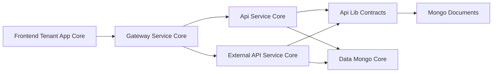
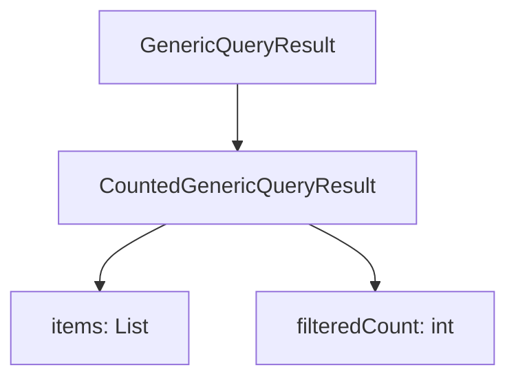
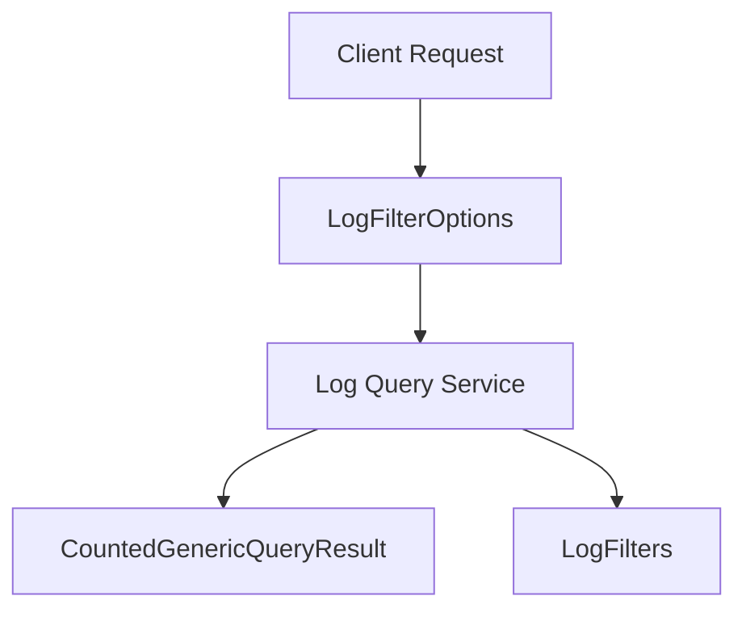
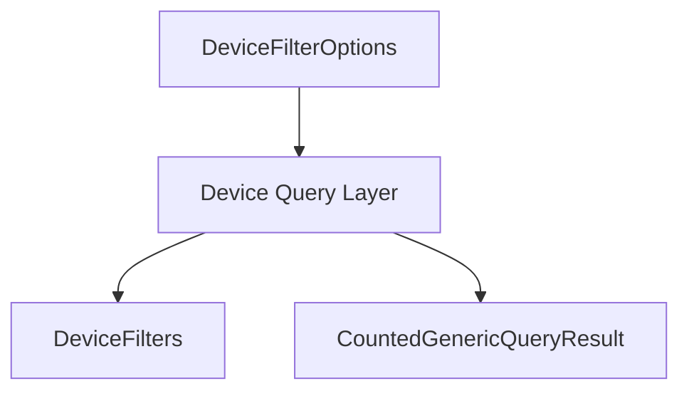
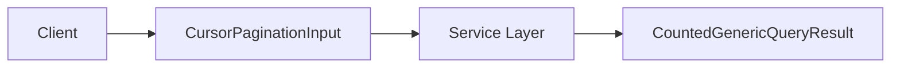
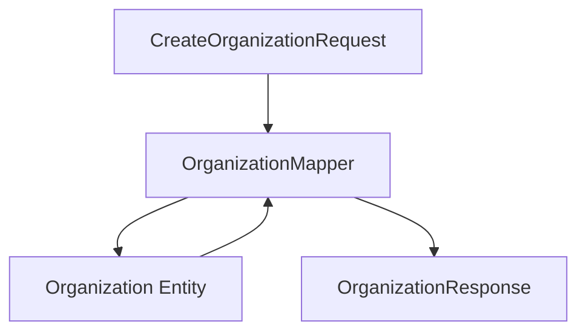
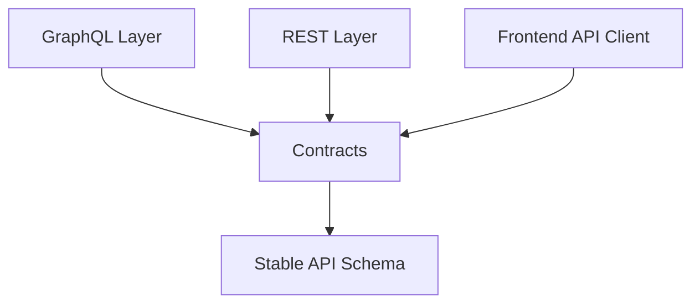

# Api Lib Contracts

## Overview

**Api Lib Contracts** is the shared contract module for the OpenFrame platform. It defines:

- Data Transfer Objects (DTOs) used across services
- Filter and pagination contracts
- Shared response wrappers
- Entity-to-DTO mappers

This module contains **no business logic and no infrastructure code**. Instead, it provides a stable contract layer consumed by:

- Api Service Core (GraphQL APIs)
- External API Service Core (REST APIs)
- Gateway Service Core (proxy and edge layer)
- Frontend Tenant App Core (TypeScript API clients)
- Management and Stream services (when exposing or consuming API DTOs)

By centralizing API contracts in a single module, OpenFrame ensures:

- Consistent request/response shapes
- Decoupling between services
- Safer refactoring and versioning
- Clear separation between persistence models and API models

---

## Architectural Role in the Platform



### Key Principles

1. **Contracts are shared, not duplicated**  
   Both GraphQL and REST layers reuse the same DTO definitions.

2. **Persistence models are not directly exposed**  
   Mongo entities are mapped into API-safe DTOs.

3. **Filtering and pagination are standardized**  
   Devices, logs, events, tools, and organizations all follow consistent filter contracts.

---

## Module Structure

The Api Lib Contracts module is organized into:

- `dto` – Shared request/response models
- `dto.audit` – Log and audit contracts
- `dto.device` – Device filtering and aggregation contracts
- `dto.event` – Event filtering contracts
- `dto.organization` – Organization responses and filtering
- `dto.tool` – Tool listing and filtering
- `dto.shared` – Cross-cutting contracts (pagination)
- `mapper` – Entity-to-DTO mapping logic

---

# Core Components

## 1. Generic Query Wrappers

### CountedGenericQueryResult

```java
public class CountedGenericQueryResult<T> extends GenericQueryResult<T> {
    private int filteredCount;
}
```

### Purpose

Extends a generic query result with an additional `filteredCount` field.

Used when:
- Cursor-based or paginated queries are executed
- The total filtered result size must be returned
- UI needs both result list and metadata

### Conceptual Structure



This ensures consistent metadata handling across APIs.

---

## 2. Audit and Log Contracts

Located under `dto.audit`.

### LogEvent
Lightweight event representation for list views.

### LogDetails
Extended representation including:

- `message`
- `details`
- Full metadata

### LogFilterOptions
Defines filter input parameters:

- Date range
- Event types
- Tool types
- Severities
- Organization IDs
- Device ID

### LogFilters
Represents filter aggregation results for UI dropdowns.

### Log Query Flow



This separation enables:

- Efficient filtering
- Faceted UI filters
- Clean separation between filter inputs and filter aggregations

---

## 3. Device Contracts

Located under `dto.device`.

### DeviceFilterOption
Represents a single selectable filter item:

- `value`
- `label`
- `count`

Used for UI dropdowns and faceted search.

### DeviceFilterOptions
Defines available filter input values:

- Statuses
- Device types
- OS types
- Organization IDs
- Tag names

### DeviceFilters
Aggregated filter result including:

- Lists of `DeviceFilterOption`
- `filteredCount`

### Device Filtering Model



This enables:

- Faceted device search
- Efficient filter recalculation
- UI-friendly filter grouping

---

## 4. Event Contracts

Located under `dto.event`.

### EventFilterOptions
Input filter:

- User IDs
- Event types
- Date range

### EventFilters
Filter aggregation results:

- User IDs
- Event types

Used in dashboards and audit exploration workflows.

---

## 5. Organization Contracts

Located under `dto.organization`.

### OrganizationResponse
Shared response DTO used by both:

- GraphQL (Api Service Core)
- REST (External API Service Core)

Includes:

- Identity fields
- Contract information
- Contact information
- Revenue
- Lifecycle metadata (`createdAt`, `deleted`, etc.)

### OrganizationList
Wrapper around a list of organizations.

### OrganizationFilterOptions
Internal filtering contract:

- Category
- Employee range
- Active contract flag

---

## 6. Tool Contracts

Located under `dto.tool`.

### ToolFilterOptions
Filter input:

- Enabled
- Type
- Category
- Platform category

### ToolFilters
Filter aggregation output:

- Types
- Categories
- Platform categories

### ToolList
Wrapper around a list of `IntegratedTool` entities.

---

## 7. Shared Pagination Contract

### CursorPaginationInput

```java
public class CursorPaginationInput {
    @Min(1)
    @Max(100)
    private Integer limit;
    private String cursor;
}
```

### Characteristics

- Enforces limit between 1 and 100
- Cursor-based pagination (stateless)
- Compatible with GraphQL and REST endpoints

### Pagination Flow



---

# OrganizationMapper

## Purpose

`OrganizationMapper` bridges:

- API DTOs
- Mongo `Organization` entities

It ensures:

- API layer is decoupled from persistence layer
- Safe field exposure
- Controlled partial updates

## Responsibilities

1. Convert `CreateOrganizationRequest` → `Organization`
2. Update existing `Organization` from `UpdateOrganizationRequest`
3. Convert `Organization` → `OrganizationResponse`
4. Map nested contact and address structures
5. Generate immutable `organizationId` (UUID)

## Mapping Flow



### Important Design Decisions

- `organizationId` is immutable once generated
- Partial updates only modify non-null fields
- Mailing address can mirror physical address
- Nested mapping is fully encapsulated in the mapper

This keeps controller and service layers clean.

---

# Cross-Service Contract Consistency

The Api Lib Contracts module ensures that:

- GraphQL resolvers in Api Service Core
- REST controllers in External API Service Core
- Frontend API clients

all operate on identical DTO definitions.



This prevents:

- Diverging response models
- Duplicate DTO definitions
- Inconsistent filtering logic

---

# Design Philosophy

Api Lib Contracts follows these principles:

1. **Contracts First** – API shapes are defined explicitly and centrally.
2. **No Business Logic** – DTOs are pure data carriers.
3. **Mapper-Based Isolation** – Entities are never directly exposed.
4. **Faceted Filtering Standardization** – All major domains follow consistent filter patterns.
5. **Pagination Consistency** – Cursor-based pagination across services.

---

# Summary

Api Lib Contracts is the foundational API schema layer for OpenFrame.

It:

- Standardizes API DTOs
- Encapsulates filter and pagination contracts
- Bridges persistence and API models
- Enables GraphQL and REST reuse
- Ensures frontend and backend alignment

Without this module, each service would redefine its own DTOs, leading to duplication, drift, and maintenance risk. With it, the platform maintains a clean, stable, and extensible contract layer across all services.
