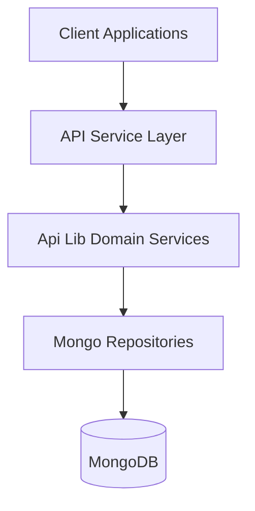
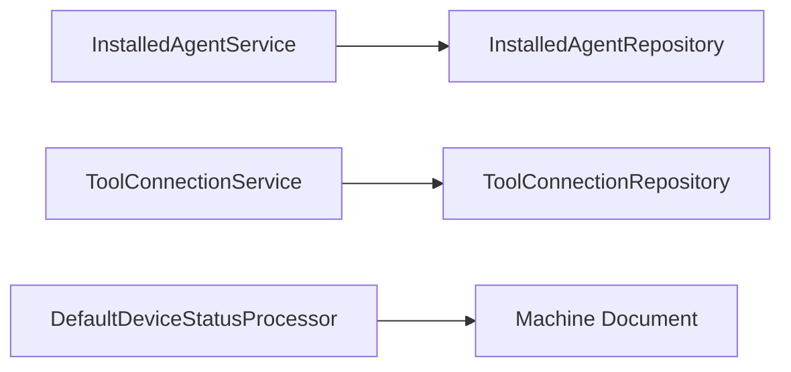
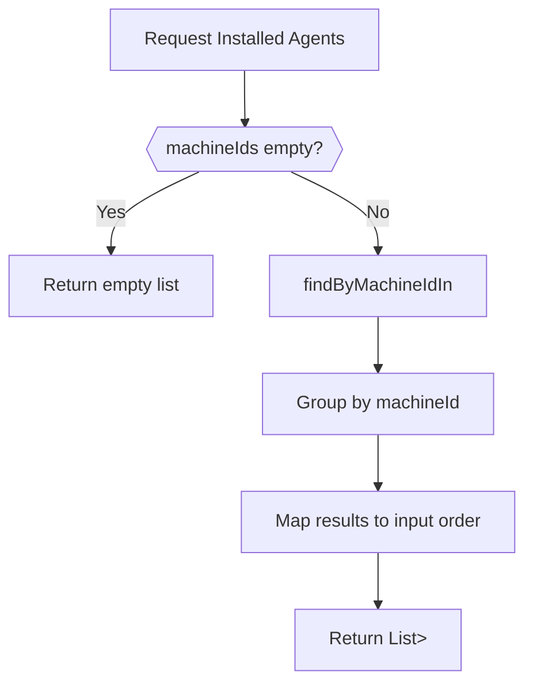
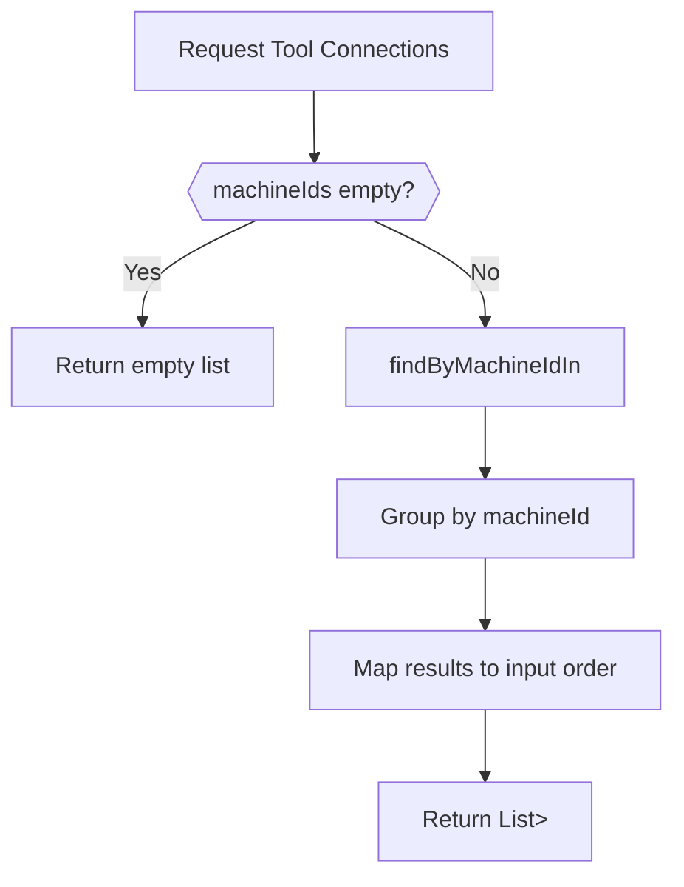
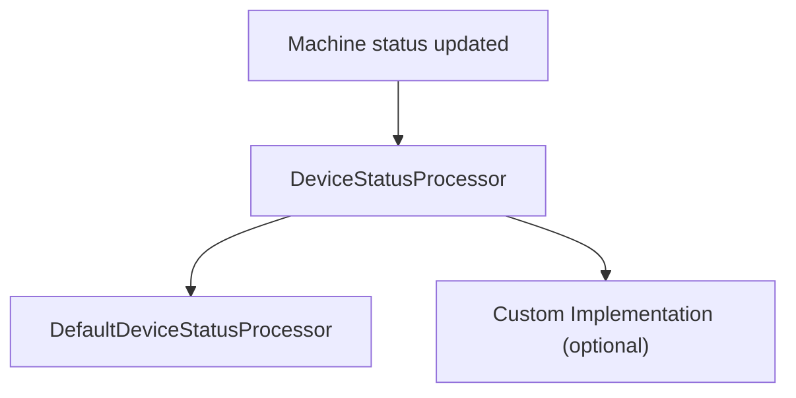

# Api Lib Domain Services

## Overview

The **Api Lib Domain Services** module provides core domain-level business services that sit between the API layer (REST and GraphQL) and the persistence layer (Mongo repositories and documents). It encapsulates reusable business logic that is shared across API services, GraphQL data fetchers, and potentially other backend components.

This module focuses on:

- Installed agent management per machine
- Tool connection aggregation per machine
- Device status post-processing hooks
- Batch-friendly service methods for GraphQL DataLoader usage

By centralizing this logic, the platform ensures consistent behavior across API surfaces and prevents duplication in controllers or data fetchers.

---

## Architectural Context

The Api Lib Domain Services module is part of the API library layer and interacts primarily with:

- Mongo document models (for example, InstalledAgent, ToolConnection, Machine)
- Mongo repositories (for example, InstalledAgentRepository, ToolConnectionRepository)
- GraphQL DataLoaders and REST controllers in the API service layer

### High-Level Placement in the System



### Internal Structure



---

## Core Components

### InstalledAgentService

**Component:**
`deps.openframe-oss-lib.openframe-api-lib.src.main.java.com.openframe.api.service.InstalledAgentService.InstalledAgentService`

#### Responsibilities

The InstalledAgentService encapsulates business logic for retrieving installed agents associated with machines.

Key responsibilities:

- Retrieve installed agents for a single machine
- Retrieve installed agents for multiple machines (batch mode)
- Fetch all installed agents
- Retrieve installed agents by ID
- Retrieve installed agent by machine ID and agent type

#### Batch-Oriented Design for GraphQL

The method:

```text
getInstalledAgentsForMachines(List<String> machineIds)
```

is specifically designed to support GraphQL DataLoader patterns. Instead of executing one query per machine, it:

1. Fetches all agents using a single repository call with `findByMachineIdIn`.
2. Groups results by machine ID.
3. Returns a list of lists that aligns with the input order.

This approach:

- Prevents N+1 query issues
- Reduces database round-trips
- Preserves input ordering for DataLoader compatibility

#### Processing Flow



---

### ToolConnectionService

**Component:**
`deps.openframe-oss-lib.openframe-api-lib.src.main.java.com.openframe.api.service.ToolConnectionService.ToolConnectionService`

#### Responsibilities

The ToolConnectionService provides read-only access to tool connections associated with machines.

Key responsibilities:

- Retrieve tool connections for a single machine
- Retrieve tool connections for multiple machines (batch mode)

The service is annotated with `@Transactional(readOnly = true)` to explicitly define its intent as a read-focused service.

#### Batch Strategy for DataLoader

Similar to InstalledAgentService, the method:

```text
getToolConnectionsForMachines(List<String> machineIds)
```

implements a batch loading strategy:

1. Fetch all connections with `findByMachineIdIn`.
2. Group results by machine ID.
3. Reconstruct ordered result sets aligned with the input list.

This ensures consistent performance characteristics for GraphQL queries resolving nested tool connection data.

#### Processing Flow



---

### DefaultDeviceStatusProcessor

**Component:**
`deps.openframe-oss-lib.openframe-api-lib.src.main.java.com.openframe.api.service.processor.DefaultDeviceStatusProcessor.DefaultDeviceStatusProcessor`

#### Purpose

DefaultDeviceStatusProcessor is a pluggable post-processing hook for device status updates.

It implements the DeviceStatusProcessor interface and is annotated with:

- `@Component`
- `@ConditionalOnMissingBean`

This means:

- It acts as the default implementation.
- If another DeviceStatusProcessor bean is defined in the application context, that implementation will override this one.

#### Behavior

When a device status changes, the processor:

- Receives the updated Machine object.
- Logs the machine ID and new status at debug level.

This provides:

- A safe default behavior.
- A clean extension point for custom business logic such as:
  - Triggering notifications
  - Emitting domain events
  - Auditing status transitions

#### Extension Pattern



If a custom implementation is provided, Spring will inject it instead of the default.

---

## Design Principles

### 1. Batch-First Design

Both InstalledAgentService and ToolConnectionService are designed with batch operations as first-class citizens. This aligns with:

- GraphQL DataLoader best practices
- High-performance query resolution
- Reduced database load

### 2. Thin but Focused Domain Layer

The services:

- Do not contain heavy orchestration logic
- Delegate persistence concerns to repositories
- Focus on aggregation, grouping, and result shaping

This keeps them reusable and testable.

### 3. Extensibility via Conditional Beans

DefaultDeviceStatusProcessor demonstrates a pattern where:

- A safe default is provided.
- Applications can override behavior without modifying core library code.

This supports tenant-level or deployment-specific customization.

---

## Interaction with Other Layers

### With API Services (REST and GraphQL)

- REST controllers may call InstalledAgentService and ToolConnectionService directly.
- GraphQL data fetchers typically use batch methods to avoid N+1 issues.

### With Mongo Persistence Layer

- InstalledAgentRepository
- ToolConnectionRepository

These repositories abstract MongoDB access and are responsible for:

- Query construction
- Index usage
- Persistence mapping

### With Streaming and Eventing

Device status changes may originate from streaming services or Kafka consumers. Once persisted, post-processing logic can be applied via DeviceStatusProcessor implementations.

---

## Summary

The **Api Lib Domain Services** module provides a clean, reusable domain service layer for:

- Installed agent retrieval and aggregation
- Tool connection aggregation
- Device status post-processing hooks

It is optimized for:

- GraphQL batch loading
- Performance-sensitive read paths
- Extensibility through Spring’s conditional bean mechanism

By isolating these responsibilities, the platform maintains a clear separation between:

- API surface (controllers and data fetchers)
- Domain services (this module)
- Persistence layer (Mongo repositories and documents)

This modular design supports scalability, maintainability, and multi-tenant extensibility across the OpenFrame ecosystem.
