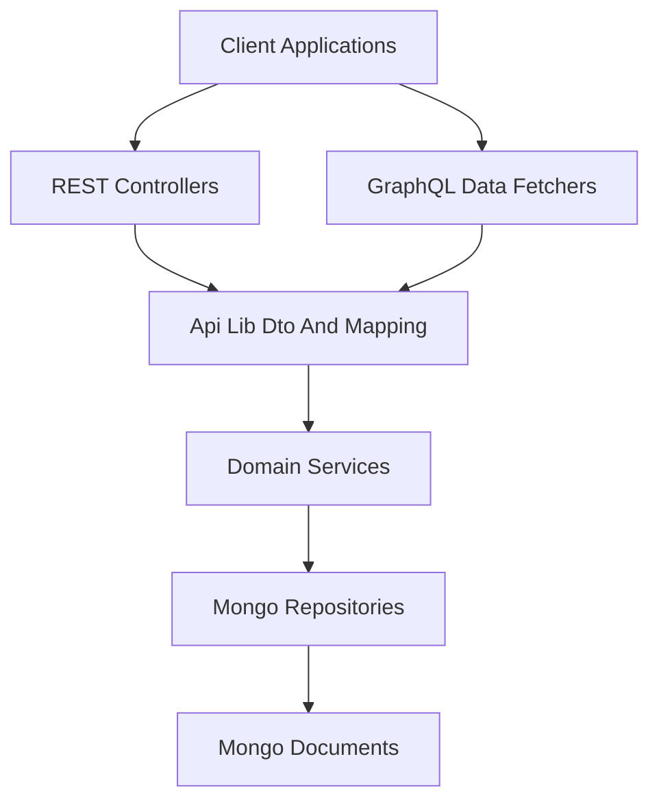
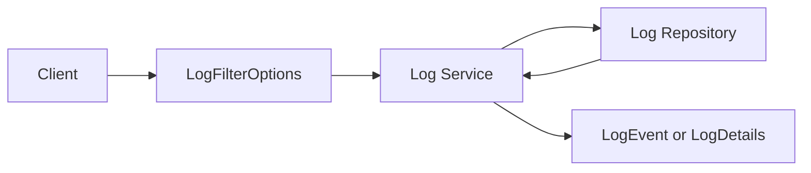
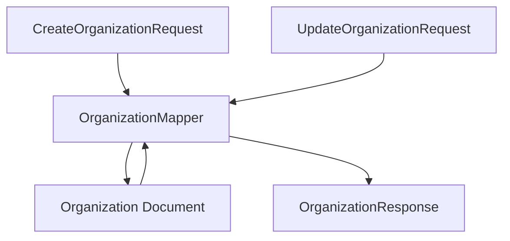

# Api Lib Dto And Mapping

## Overview

The **Api Lib Dto And Mapping** module provides the shared Data Transfer Objects (DTOs), filter models, pagination inputs, and entity mappers used across the OpenFrame platform.

It acts as the contract layer between:

- API layers (REST controllers and GraphQL data fetchers)
- Domain services
- Persistence layer (Mongo documents and repositories)
- External API adapters

By centralizing DTOs and mapping logic, this module ensures:

- Consistent API contracts across internal and external services
- Clear separation between persistence models and API representations
- Reusable filtering and pagination models
- Controlled entity mutation through structured mappers

---

## Architectural Role in the Platform

The Api Lib Dto And Mapping module sits between the API service layer and the data/domain layers.



### Responsibilities in the Flow

- **Controllers / Data Fetchers** use DTOs defined in this module.
- **Domain Services** return or consume DTOs where appropriate.
- **Mappers** translate between Mongo document entities and API response models.
- **Filter and Pagination DTOs** standardize querying behavior across REST and GraphQL.

This module does **not**:

- Contain business logic
- Interact directly with repositories
- Perform persistence

It strictly defines data contracts and mapping logic.

---

# Module Structure

The module can be logically grouped into the following areas:

1. Generic Query Results
2. Audit and Log DTOs
3. Device DTOs and Filters
4. Event DTOs and Filters
5. Organization DTOs and Mapping
6. Tool DTOs and Filters
7. Shared Pagination Models

---

# 1. Generic Query Result Models

## CountedGenericQueryResult

```java
public class CountedGenericQueryResult<T> extends GenericQueryResult<T> {
    private int filteredCount;
}
```

### Purpose

Extends a generic query result with an additional `filteredCount` field.

### Why It Exists

When implementing filtered list endpoints (devices, logs, tools, etc.), APIs often need to return:

- A list of results
- Pagination metadata
- The total number of items matching filters

`filteredCount` enables the UI to:

- Show total filtered results
- Render pagination controls correctly

This model is used across multiple resource types to enforce consistency.

---

# 2. Audit and Log DTOs

These DTOs define the structure of audit logs and log filtering behavior.

## LogEvent

Represents a lightweight log entry.

Key fields:

- `toolEventId`
- `eventType`
- `toolType`
- `severity`
- `userId`
- `deviceId`
- `organizationId`
- `timestamp`

Used for:

- Log listings
- Summary views
- Aggregated result sets

## LogDetails

Extends the event concept with full message content:

- `message`
- `details`

Used when retrieving a specific log entry for inspection.

## LogFilterOptions

Defines input criteria when querying logs:

- Date range (`startDate`, `endDate`)
- Event types
- Tool types
- Severities
- Organization IDs
- Device ID

## LogFilters

Represents available filter values returned to the client:

- Available tool types
- Available event types
- Available severities
- Organization filter options

## OrganizationFilterOption

Represents a dropdown-ready organization option:

- `id`
- `name`

### Log Filtering Flow



This separation ensures:

- Clear input filtering model
- Clear output filter metadata model
- Consistent UI-driven filtering

---

# 3. Device DTOs and Filters

The device DTO layer supports complex filtering and UI-driven dashboards.

## DeviceFilterOptions

Represents raw filter input values such as:

- Statuses
- Device types
- OS types
- Organization IDs
- Tag names

These correspond closely to underlying persistence fields.

## DeviceFilters

Represents structured filter metadata returned to clients.

Includes:

- `DeviceFilterOption` lists
- `TagFilterOption` lists
- `filteredCount`

Each filter option contains:

- `value`
- `label`
- `count`

This enables UI components to show:

- Filter values
- Human-readable labels
- Number of matching devices

## TagFilterOption

Specifically supports tag-based filtering with count metadata.

---

# 4. Event DTOs and Filters

## EventFilterOptions

Defines filtering criteria for events:

- `userIds`
- `eventTypes`
- `startDate`
- `endDate`

## EventFilters

Represents simplified filter sets:

- `userIds`
- `eventTypes`

These are used in both REST and GraphQL layers to standardize event querying.

---

# 5. Organization DTOs and Mapping

This is the most structurally rich area of the module.

## OrganizationResponse

Shared response DTO used by:

- Internal GraphQL APIs
- External REST APIs

Key properties include:

- Identification fields
- Category and employee counts
- Financial metadata
- Contract dates
- Audit metadata (`createdAt`, `updatedAt`)
- Soft-delete flags

This ensures one consistent organization representation across the platform.

## OrganizationList

Wraps a list of organization entities for list-style responses.

## OrganizationFilterOptions

Internal filtering DTO for organization-specific queries:

- Category
- Employee range
- Active contract status

---

## OrganizationMapper

The `OrganizationMapper` is a Spring component responsible for translating between:

- Organization persistence documents
- OrganizationResponse DTOs
- Create and update request models

### Mapping Responsibilities



### Key Design Decisions

1. Organization ID is generated internally using UUID.
2. Organization ID is immutable after creation.
3. Update logic performs partial updates (null-safe field checks).
4. Contact information is deeply mapped:
   - Contact persons
   - Physical and mailing addresses
   - Copy-on-write for mailing address when flagged as same as physical

### Deep Mapping Example

The mapper handles nested conversions:

- ContactInformationDto → ContactInformation
- ContactPersonDto → ContactPerson
- AddressDto → Address

This isolates entity structure from API representation.

---

# 6. Tool DTOs and Filters

## ToolFilterOptions

Defines filtering criteria for tools:

- Enabled flag
- Tool type
- Category
- Platform category

## ToolFilters

Represents aggregated filter metadata:

- Types
- Categories
- Platform categories

## ToolList

Wraps a list of integrated tools for response purposes.

Used when returning tool catalogs or integration lists.

---

# 7. Shared Pagination Model

## CursorPaginationInput

Defines cursor-based pagination input.

Fields:

- `limit` (1 to 100, validated)
- `cursor`

### Why Cursor Pagination?

- Efficient for large datasets
- Stable ordering
- Better performance than offset-based pagination

Used across:

- Device queries
- Log queries
- Event queries
- Tool queries

---

# Cross-Cutting Design Principles

## 1. Clear Separation of Concerns

- DTOs define structure only.
- Mappers define transformation logic.
- Services define business logic.
- Repositories define persistence behavior.

## 2. UI-Driven Filter Design

Many filter DTOs include:

- Lists of values
- Count metadata
- Label/value separation

This reflects a deliberate design for:

- Dashboard filtering
- Faceted search
- Dynamic filter dropdowns

## 3. Reusability Across APIs

The same DTOs are reused by:

- Internal API service
- External API service
- GraphQL layer

This guarantees consistent contracts across the platform.

## 4. Safe Entity Mutation

The OrganizationMapper demonstrates best practices:

- Partial updates
- Immutable identifiers
- Deep nested mapping
- Defensive null checks

---

# Summary

The **Api Lib Dto And Mapping** module is the canonical contract layer for the OpenFrame backend.

It provides:

- Shared DTO definitions
- Standardized filter models
- Cursor pagination structures
- Entity-to-DTO mapping logic

Without this module:

- API contracts would fragment
- Mapping logic would duplicate across services
- Filter behavior would become inconsistent

By centralizing these responsibilities, the platform maintains clean architectural boundaries and consistent data models across REST, GraphQL, and external APIs.