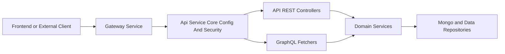
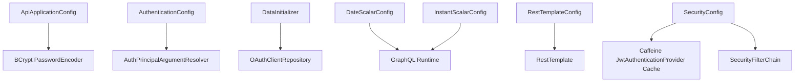
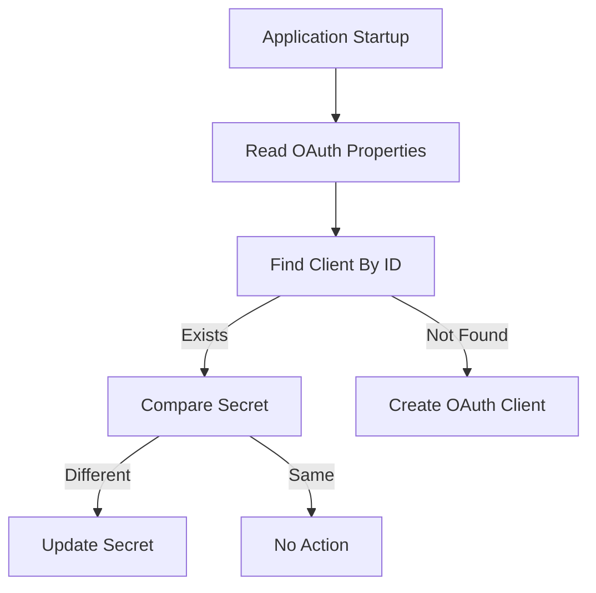
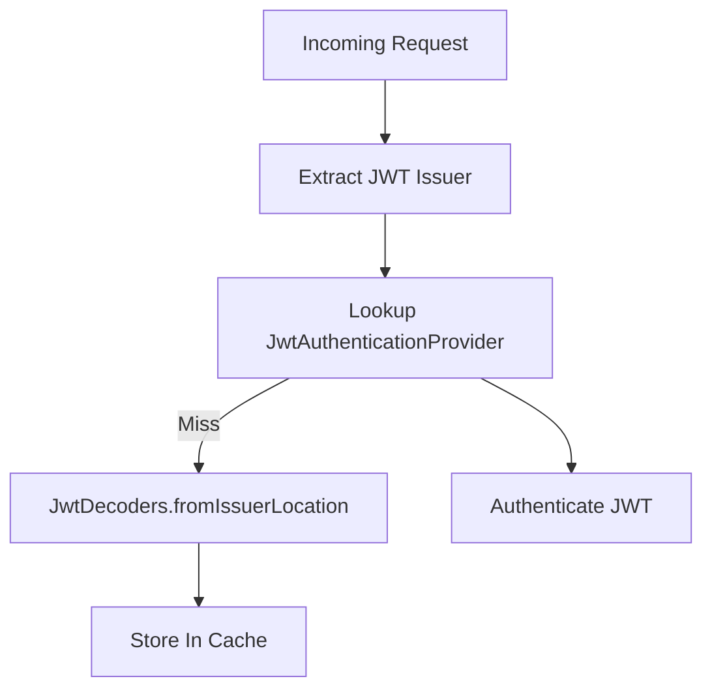
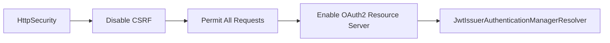
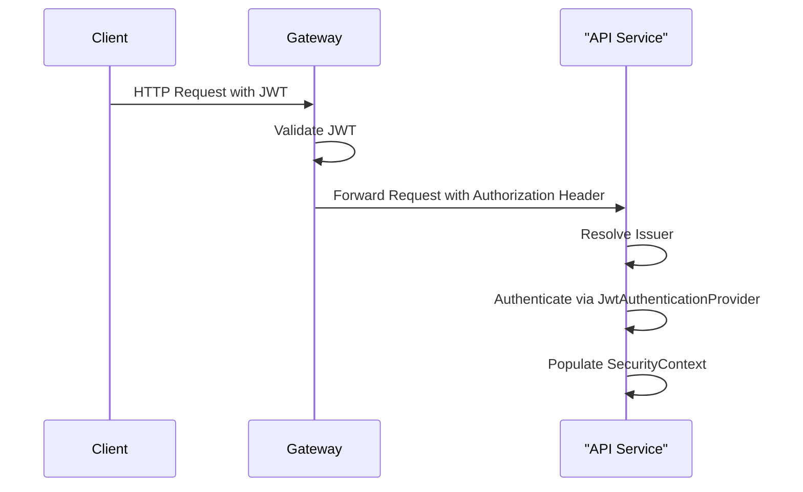

# Api Service Core Config And Security

## Overview

The **Api Service Core Config And Security** module provides the foundational configuration and security wiring for the OpenFrame API service. It is responsible for:

- Core Spring beans (password encoding, HTTP clients)
- Authentication argument resolution for controllers
- OAuth client bootstrapping
- GraphQL scalar configuration
- OAuth2 Resource Server setup with multi-issuer JWT support

This module acts as the **infrastructure layer** for the API service. It does not implement business logic itself, but enables REST controllers, GraphQL fetchers, and domain services to operate securely and consistently.

---

## Architectural Context

Within the overall platform, the Api Service Core Config And Security module sits between the Gateway and the API business layers.



### Responsibility Boundaries

- **Gateway Service**
  - JWT validation at the edge
  - Rate limiting
  - CORS
  - Header normalization

- **Api Service Core Config And Security**
  - OAuth2 Resource Server integration
  - JWT issuer-based authentication manager resolution
  - Authentication principal injection
  - GraphQL scalar support
  - Bootstrap configuration

- **Controllers and Fetchers**
  - Business endpoints
  - GraphQL query/mutation logic

For details on REST endpoints, see the corresponding REST controller module documentation in your project structure.

---

## Internal Configuration Architecture

The module is composed of the following configuration components:



Each configuration class contributes a specific capability to the API runtime.

---

## Component Breakdown

### 1. ApiApplicationConfig

**Purpose:** Defines core application-level beans.

**Key Bean:**

- `PasswordEncoder` → `BCryptPasswordEncoder`

This encoder is used across the API service for hashing and verifying credentials when needed by domain services.

```java
@Bean
public PasswordEncoder passwordEncoder() {
    return new BCryptPasswordEncoder();
}
```

This ensures:
- Secure password hashing
- Compatibility with Spring Security
- Centralized encoder definition

---

### 2. AuthenticationConfig

**Purpose:** Enables injection of authenticated principals into controller methods.

Registers a custom `AuthPrincipalArgumentResolver`, allowing controller methods to declare authenticated user parameters such as:

```java
public ResponseEntity<?> endpoint(@AuthenticationPrincipal AuthPrincipal principal)
```

This avoids manual extraction of authentication details from the security context and ensures consistent access to tenant and user information.

---

### 3. DataInitializer

**Purpose:** Bootstraps a default OAuth client at application startup.

Implements a `CommandLineRunner` that:

- Reads properties:
  - `oauth.client.default.id`
  - `oauth.client.default.secret`
- Checks if the client exists
- Creates or updates it if necessary



Default configuration includes:
- Grant types: `password`, `refresh_token`
- Scopes: `read`, `write`

This ensures the API service always has a valid OAuth client configured in the data layer.

---

### 4. DateScalarConfig (GraphQL)

**Purpose:** Provides a custom GraphQL scalar for `Date`.

- Backed by `LocalDate`
- Format: `yyyy-MM-dd`
- Validates input values
- Serializes consistently

If invalid formats are provided, descriptive `CoercingParseValueException` or `CoercingParseLiteralException` are thrown.

This ensures:
- Type-safe date handling in GraphQL
- Strict format enforcement
- Predictable client-server behavior

---

### 5. InstantScalarConfig (GraphQL)

**Purpose:** Provides a custom GraphQL scalar for `Instant`.

- Backed by `java.time.Instant`
- Uses ISO-8601 format
- Strict parsing and serialization

Together, `DateScalarConfig` and `InstantScalarConfig` standardize time handling across GraphQL queries and mutations.

---

### 6. RestTemplateConfig

**Purpose:** Defines a shared `RestTemplate` bean.

```java
@Bean
public RestTemplate restTemplate() {
    return new RestTemplate();
}
```

Used for:
- Internal service-to-service calls
- External API integrations
- Authorization or metadata lookups

Centralizing this bean ensures consistent configuration and future extensibility (timeouts, interceptors, tracing).

---

### 7. SecurityConfig

**Purpose:** Configures the API service as an OAuth2 Resource Server.

This configuration is intentionally minimal because the **Gateway** already handles:

- JWT validation at the edge
- PermitAll path configuration
- Authorization header propagation

The API service enables resource server support primarily for:
- `@AuthenticationPrincipal`
- Security context population

#### JWT Provider Cache

A Caffeine `LoadingCache` stores `JwtAuthenticationProvider` instances per issuer.



Configuration properties:
- `openframe.security.jwt.cache.expire-after`
- `openframe.security.jwt.cache.refresh-after`
- `openframe.security.jwt.cache.maximum-size`

This enables:
- Multi-tenant JWT validation
- Efficient issuer-based authentication
- Reduced decoder re-creation overhead

#### Security Filter Chain

- CSRF disabled
- All requests permitted at HTTP layer
- OAuth2 Resource Server enabled with issuer resolver



Even though requests are permitted, authentication is still processed so that downstream components can rely on a populated `SecurityContext`.

---

## Security Flow Summary



Key principle: **Gateway enforces security, API consumes identity context.**

---

## Integration with Other Modules

The Api Service Core Config And Security module enables:

- REST controllers to inject authenticated principals
- GraphQL fetchers to use custom date/time scalars
- Domain services to rely on secure password encoding
- Multi-tenant JWT validation across issuers

It integrates with:
- Data repositories for OAuth client initialization
- Gateway for upstream authentication enforcement
- GraphQL runtime for scalar coercion

---

## Design Principles

1. **Separation of Concerns** – Gateway handles edge security, API handles identity context.
2. **Multi-Tenant Ready** – Issuer-based JWT resolution.
3. **Minimal HTTP-Level Authorization** – Business rules enforced in services.
4. **Centralized Configuration** – All security and scalar wiring in one module.
5. **Extensibility** – Cache tuning, scalar extensions, and HTTP client customization are configurable.

---

## Conclusion

The **Api Service Core Config And Security** module is the infrastructure backbone of the OpenFrame API service. It ensures:

- Secure password handling
- Consistent authentication principal resolution
- OAuth client bootstrapping
- Efficient multi-issuer JWT validation
- Strict GraphQL date/time handling

While lightweight in terms of business logic, it is critical to the correctness, security, and stability of the API layer.