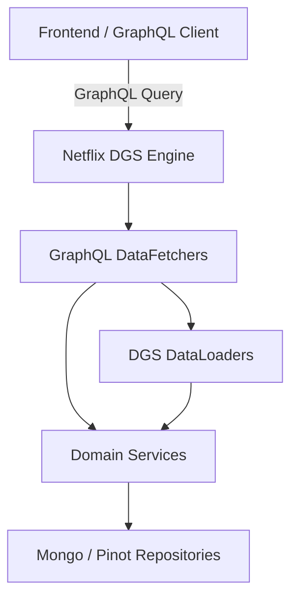
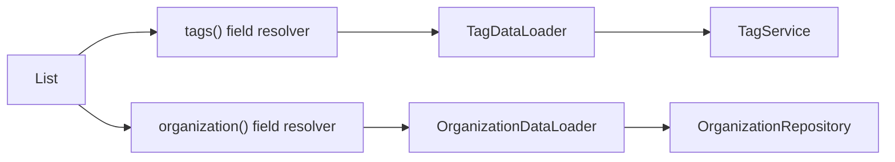
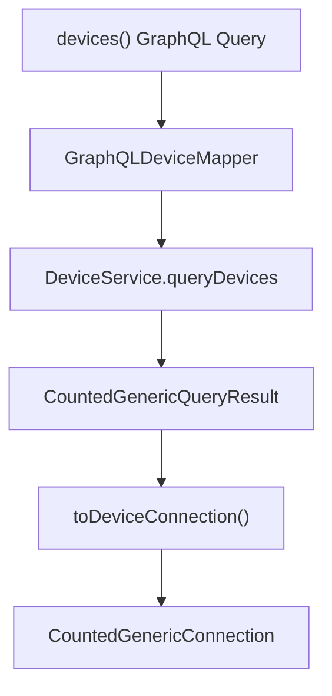
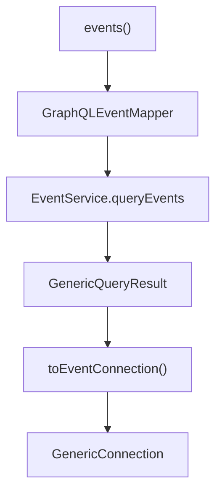
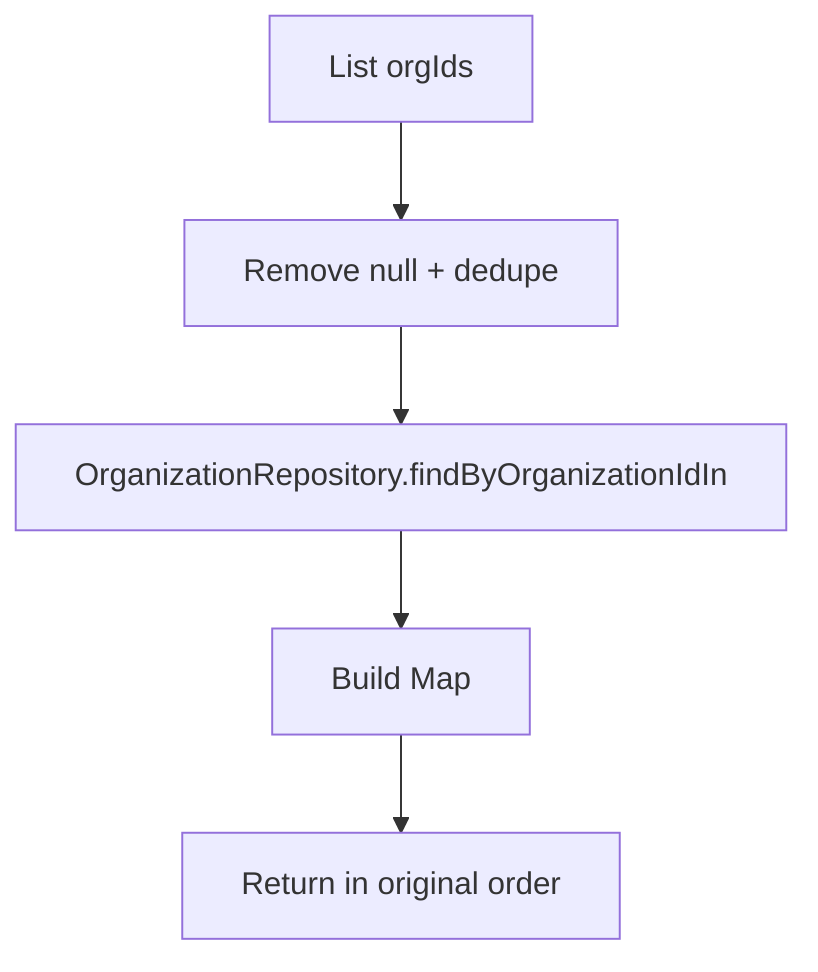
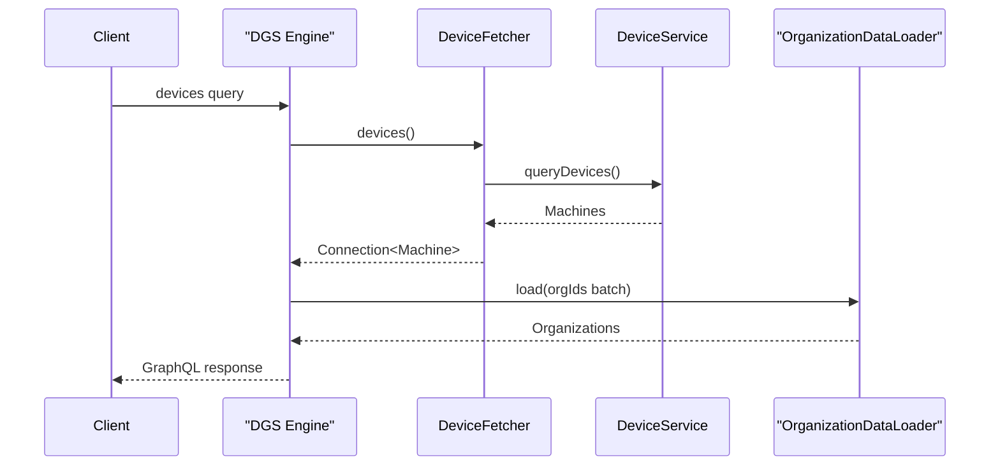

# Api Service Core Graphql Fetchers And Dataloaders

## Overview

The **Api Service Core Graphql Fetchers And Dataloaders** module is the GraphQL execution layer of the OpenFrame API service. It exposes query and mutation endpoints using Netflix DGS and coordinates:

- Domain services (device, event, log, organization, tool)
- DTO mappers for GraphQL input/output transformation
- Cursor-based pagination and filtering
- Batched data loading to eliminate N+1 query problems

This module sits between the GraphQL schema and the domain/service layer, acting as a thin orchestration layer that:

1. Validates and maps GraphQL inputs
2. Delegates to application/domain services
3. Maps results to connection-based GraphQL responses
4. Resolves nested fields using DataLoaders

---

## Architectural Positioning



### Responsibilities

- **DataFetchers**: Define GraphQL queries and mutations.
- **Mappers**: Convert GraphQL inputs to domain filter objects and results to connection types.
- **Services**: Execute business logic and query persistence layers.
- **DataLoaders**: Batch and cache nested object loading per request.

---

## Core Concepts

### 1. Cursor-Based Pagination

The module uses cursor-based pagination via:

- `CursorPaginationInput`
- `CursorPaginationCriteria`
- `GenericConnection` / `CountedGenericConnection`
- `GenericEdge`

This ensures:

- Stable pagination across large datasets
- Efficient forward/backward traversal
- Total count support where needed

---

### 2. Filter Mapping Pattern

Each DataFetcher follows a consistent pattern:

```text
GraphQL Input
    ↓
GraphQL Mapper
    ↓
FilterOptions (domain DTO)
    ↓
Service Query
    ↓
GenericQueryResult / CountedGenericQueryResult
    ↓
GraphQL Connection Mapper
```

This enforces strict separation between:

- GraphQL schema models
- Domain filter objects
- Persistence-layer queries

---

### 3. N+1 Query Elimination with DataLoader

Nested fields (e.g., tags, organization, installed agents) use DGS DataLoaders.



Instead of executing one query per machine, the DataLoader batches all keys into a single service/repository call per request.

---

# DataFetchers

## DeviceDataFetcher

### Responsibilities

- Query devices with filtering and pagination
- Fetch single device by machineId
- Resolve nested fields on `Machine` type:
  - tags
  - toolConnections
  - installedAgents
  - organization

### Query Flow



### Nested Field Resolution

Each nested resolver retrieves a named DataLoader from the DGS context:

- `tagDataLoader`
- `toolConnectionDataLoader`
- `installedAgentDataLoader`
- `organizationDataLoader`

All return `CompletableFuture` to support async execution.

---

## EventDataFetcher

### Responsibilities

- Query events with pagination
- Retrieve event by ID
- Provide available event filters
- Create and update events via mutations

### Query Structure



### Mutations

- `createEvent`
- `updateEvent`

Events are built using a builder pattern and timestamped with `Instant.now()` when created.

---

## LogDataFetcher

### Responsibilities

- Retrieve audit log filters
- Query logs with pagination
- Fetch detailed log entry by composite identifiers

### Composite Lookup Pattern

`logDetails` requires:

- ingestDay
- toolType
- eventType
- timestamp
- toolEventId

This indicates logs are stored in a time-partitioned and tool-partitioned structure.

---

## OrganizationDataFetcher

### Responsibilities

- Query organizations with pagination and filtering
- Fetch by database ID
- Fetch by organizationId (business identifier)

Uses:

- `OrganizationQueryService` for complex paginated queries
- `OrganizationService` for direct lookup

---

## ToolsDataFetcher

### Responsibilities

- Query integrated tools with filtering and sorting
- Provide available tool filter options

Returns a `ToolList` abstraction instead of a generic connection, indicating a simpler result model.

---

# DataLoaders

All DataLoaders implement DGS `BatchLoader` and are registered via `@DgsDataLoader`.

## InstalledAgentDataLoader

- Batches machine IDs
- Delegates to `InstalledAgentService.getInstalledAgentsForMachines`
- Returns `List<List<InstalledAgent>>`

---

## OrganizationDataLoader

### Key Characteristics

- Deduplicates organization IDs
- Filters soft-deleted organizations
- Preserves request order



This ensures GraphQL contract compliance while preventing redundant database calls.

---

## TagDataLoader

- Batches machine IDs
- Delegates to `TagService.getTagsForMachines`
- Eliminates per-device tag queries

---

## ToolConnectionDataLoader

- Batches machine IDs
- Delegates to `ToolConnectionService.getToolConnectionsForMachines`

---

# End-to-End Execution Example

## Query: Devices with Nested Fields



---

# Design Principles

## 1. Thin Resolver Layer

DataFetchers contain no business logic. They:

- Map inputs
- Call services
- Map results

All logic resides in domain services.

---

## 2. Strict DTO Boundaries

GraphQL inputs are converted into:

- `DeviceFilterOptions`
- `EventFilterOptions`
- `LogFilterOptions`
- `OrganizationFilterOptions`
- `ToolFilterOptions`

This prevents GraphQL-specific concerns from leaking into the domain layer.

---

## 3. Asynchronous Execution

- Nested resolvers return `CompletableFuture`
- DataLoaders batch asynchronously
- Improves throughput under high concurrency

---

## 4. Performance Optimization

- Cursor pagination
- Batch loading
- Deduplication
- Soft-delete filtering

All designed to minimize:

- Database round trips
- Duplicate repository calls
- GraphQL over-fetching issues

---

# Summary

The **Api Service Core Graphql Fetchers And Dataloaders** module provides the GraphQL orchestration layer for OpenFrame’s API service. It:

- Exposes typed GraphQL queries and mutations
- Enforces consistent pagination and filtering patterns
- Eliminates N+1 issues via DataLoaders
- Delegates all business logic to domain services
- Maintains strict separation between GraphQL, service, and persistence layers

It is a performance-conscious, schema-driven adapter between the frontend GraphQL contract and the backend domain model.