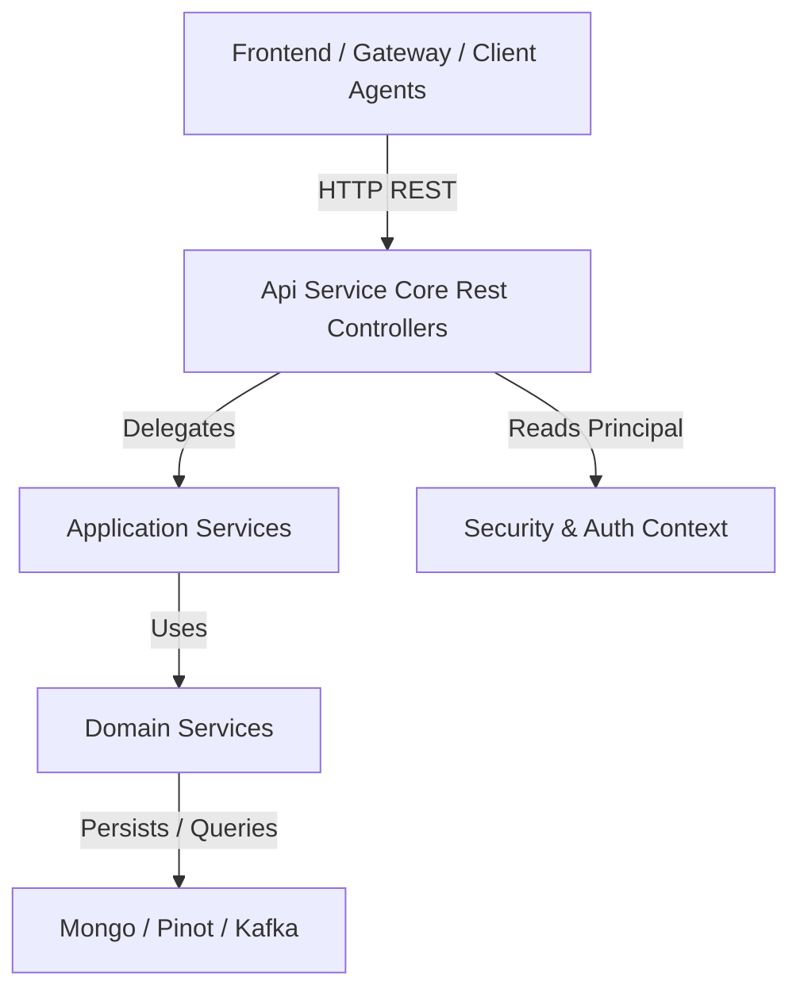
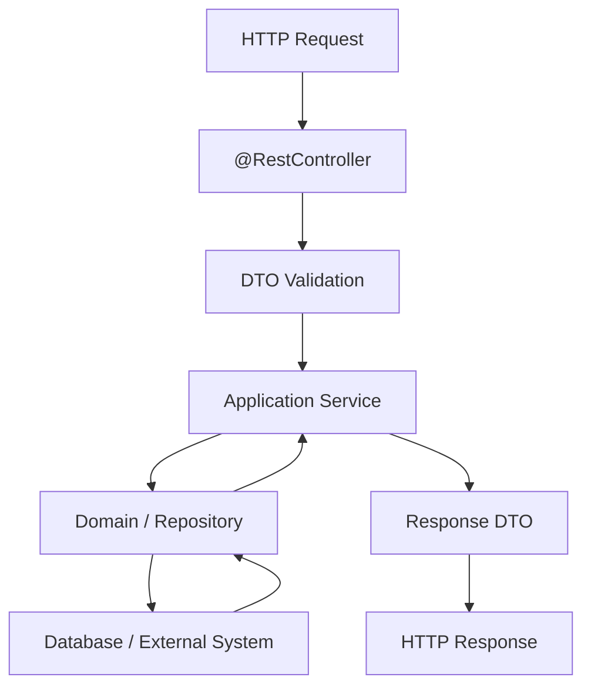
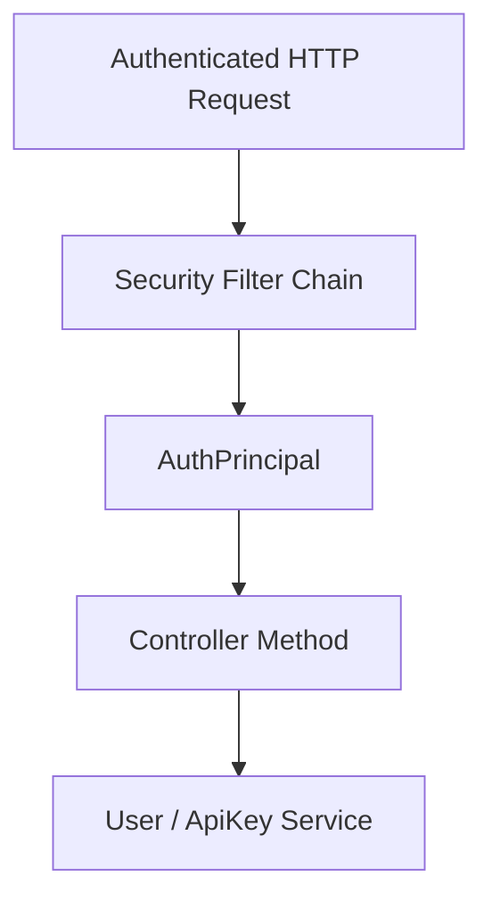
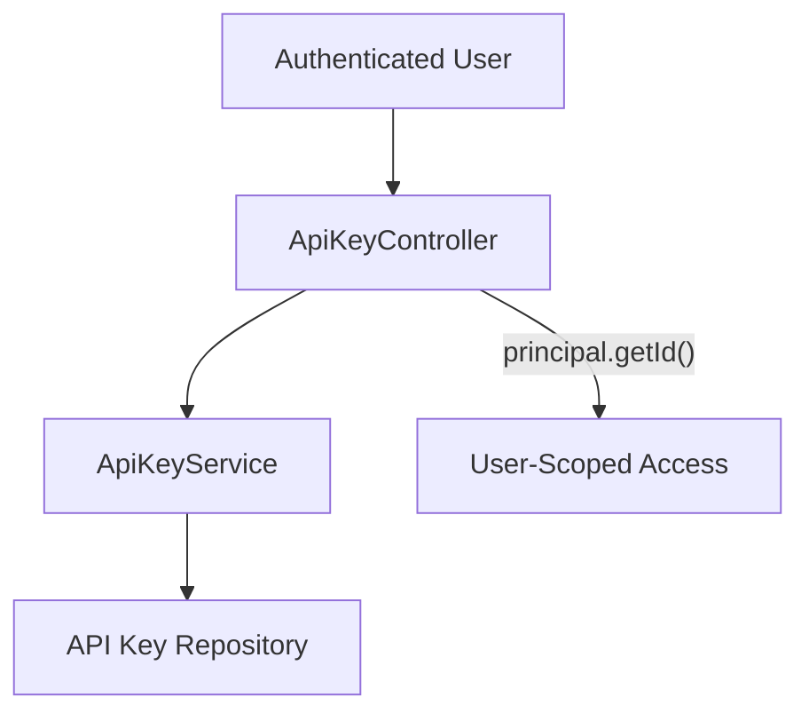
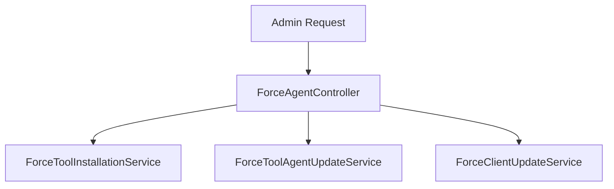
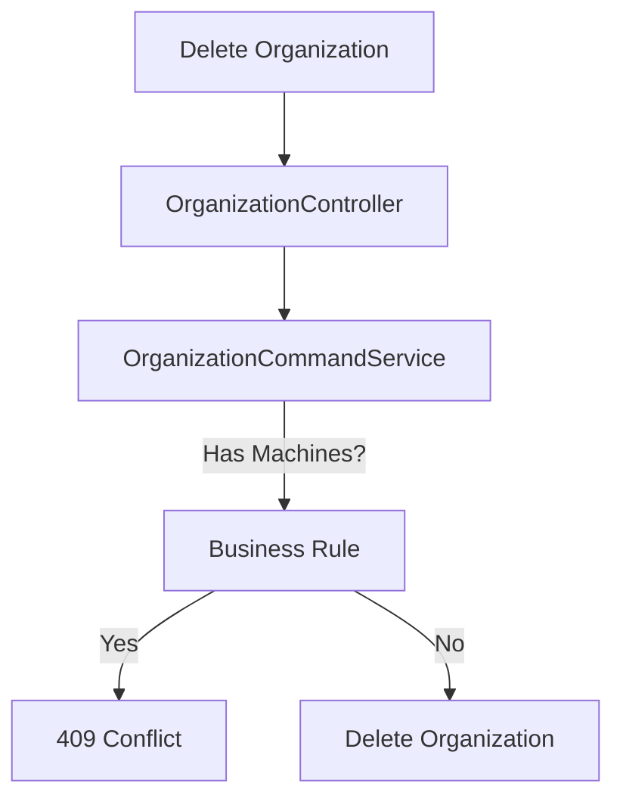
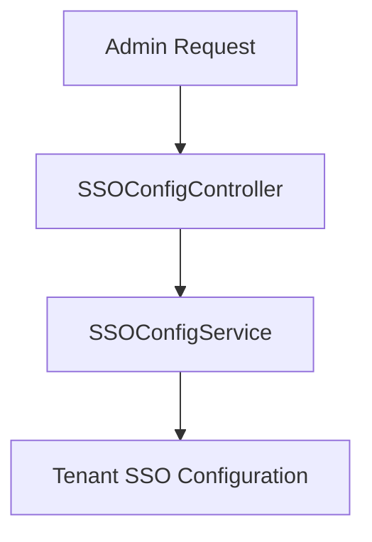

# Api Service Core Rest Controllers

## Overview

The **Api Service Core Rest Controllers** module exposes the primary internal REST endpoints for the OpenFrame API service. It acts as the HTTP boundary layer between external clients (Frontend, Gateway, Client Agents, and Internal Services) and the underlying domain services, repositories, and security infrastructure.

This module is responsible for:

- Handling authenticated and tenant-aware REST requests
- Delegating business logic to application and domain services
- Validating and mapping request/response DTOs
- Enforcing HTTP semantics (status codes, resource paths, idempotency)
- Providing operational and configuration endpoints

It is part of the broader `openframe-api-service-core` library and runs inside the API application entry point.

---

## Architectural Context

Within the overall platform, the Api Service Core Rest Controllers module sits between:

- Security and authentication infrastructure (JWT, OAuth2, tenant context)
- Application services (command/query services)
- Domain services and repositories (Mongo, Kafka, Pinot, etc.)

### High-Level Position in the System



### Layered Responsibility Model



The controllers are intentionally thin: they orchestrate request handling and defer business logic to services.

---

## Controller Inventory and Responsibilities

The module contains the following controllers:

- AgentRegistrationSecretController
- ApiKeyController
- DeviceController
- ForceAgentController
- HealthController
- InvitationController
- MeController
- OpenFrameClientConfigurationController
- OrganizationController
- ReleaseVersionController
- SSOConfigController
- UserController

Each controller focuses on a well-defined domain boundary.

---

## Authentication and Principal Usage

Several controllers rely on `@AuthenticationPrincipal AuthPrincipal` to retrieve:

- User ID
- Email
- Display name
- Roles
- Tenant ID

Example flow:



Controllers such as:

- ApiKeyController
- MeController
- UserController (for delete auditing)

rely on the principal for user-scoped operations and tenant isolation.

---

# Detailed Controller Breakdown

## 1. AgentRegistrationSecretController

**Base Path:** `/agent/registration-secret`

### Purpose

Manages secrets used for agent registration. These secrets are typically consumed by client-side components during onboarding.

### Endpoints

- `GET /agent/registration-secret/active` – Retrieve active secret
- `GET /agent/registration-secret` – List all secrets
- `POST /agent/registration-secret/generate` – Generate a new secret

### Characteristics

- Delegates to `AgentRegistrationSecretService`
- Logs secret generation events
- Returns DTO responses without exposing internal models

---

## 2. ApiKeyController

**Base Path:** `/api-keys`

### Purpose

Manages user-scoped API keys for programmatic access.

### Endpoints

- `GET /api-keys` – List API keys for current user
- `POST /api-keys` – Create API key
- `GET /api-keys/{keyId}` – Retrieve specific key
- `PUT /api-keys/{keyId}` – Update key metadata
- `DELETE /api-keys/{keyId}` – Delete key
- `POST /api-keys/{keyId}/regenerate` – Regenerate secret

### Security Model



All operations are scoped by the authenticated user ID.

---

## 3. DeviceController

**Base Path:** `/devices`

### Purpose

Provides internal APIs for device state updates.

### Endpoint

- `PATCH /devices/{machineId}` – Update device status

This endpoint is typically invoked by internal systems or agents to update operational state.

---

## 4. ForceAgentController

**Base Path:** `/force`

### Purpose

Triggers forced actions across clients and tool agents.

### Categories of Operations

- Tool installation
- Tool update
- Tool reinstallation
- Client update
- Bulk operations (`/all` variants)

### Example Interaction Flow



This controller orchestrates operational commands but does not directly manipulate infrastructure.

---

## 5. HealthController

**Endpoint:** `GET /health`

### Purpose

Provides a lightweight health check endpoint returning `200 OK` with body `OK`.

Used by:

- Load balancers
- Kubernetes readiness/liveness probes
- Monitoring systems

---

## 6. InvitationController

**Base Path:** `/invitations`

### Purpose

Manages user invitations within a tenant.

### Endpoints

- `POST /invitations` – Create invitation
- `GET /invitations` – Paginated list
- `DELETE /invitations/{id}` – Revoke
- `POST /invitations/{id}/resend` – Renew invitation

Delegates to `InvitationService` for lifecycle management.

---

## 7. MeController

**Endpoint:** `GET /me`

### Purpose

Returns current authenticated user context.

### Response Structure

```text
{
  "authenticated": true,
  "user": {
    "id": "...",
    "email": "...",
    "displayName": "...",
    "roles": [...],
    "tenantId": "..."
  }
}
```

If no principal is present, returns `401 Unauthorized`.

---

## 8. OpenFrameClientConfigurationController

**Base Path:** `/openframe-client/configuration`

### Purpose

Exposes runtime configuration required by OpenFrame clients.

- `GET /openframe-client/configuration`

Delegates to `OpenFrameClientConfigurationQueryService`.

---

## 9. OrganizationController

**Base Path:** `/organizations`

### Purpose

Handles organization mutations (create, update, delete).

Read-only organization queries are handled elsewhere (e.g., external API layer).

### Endpoints

- `POST /organizations`
- `PUT /organizations/{id}`
- `DELETE /organizations/{id}`

### Exception Handling

- `IllegalArgumentException` → `404 Not Found`
- `OrganizationHasMachinesException` → `409 Conflict`



---

## 10. ReleaseVersionController

**Base Path:** `/release-version`

### Purpose

Exposes the current release version metadata.

- `GET /release-version`

Returns `404` if no release version is present.

---

## 11. SSOConfigController

**Base Path:** `/sso`

### Purpose

Manages Single Sign-On provider configuration.

### Functional Areas

- List enabled providers
- List available providers
- Retrieve provider configuration
- Create or update configuration
- Toggle provider enabled state
- Delete configuration

### Provider Management Flow



Supports multi-tenant SSO configuration.

---

## 12. UserController

**Base Path:** `/users`

### Purpose

Manages user accounts within a tenant.

### Endpoints

- `GET /users` – Paginated list
- `GET /users/{id}` – Retrieve user
- `PUT /users/{id}` – Update user
- `DELETE /users/{id}` – Soft delete

Deletion uses both:

- Target user ID
- Acting principal ID (for auditing or authorization)

---

# Cross-Cutting Concerns

## Validation

- Uses `@Valid` for request DTO validation
- Relies on Jakarta Validation annotations

## Logging

- Controllers use SLF4J
- Sensitive operations (e.g., key generation, organization creation) are logged

## HTTP Semantics

- `201 Created` for resource creation
- `204 No Content` for successful deletions
- `404 Not Found` for missing resources
- `409 Conflict` for domain rule violations

---

# Summary

The **Api Service Core Rest Controllers** module provides the internal REST interface for the API service. It:

- Defines clear domain-oriented HTTP endpoints
- Enforces security and tenant context
- Delegates business logic to services
- Encapsulates HTTP-specific concerns (status codes, validation, mapping)

By keeping controllers thin and service-driven, the module ensures:

- Maintainability
- Clear separation of concerns
- Consistent REST semantics
- Extensibility for new API capabilities

This module forms the primary HTTP backbone of the OpenFrame API service.