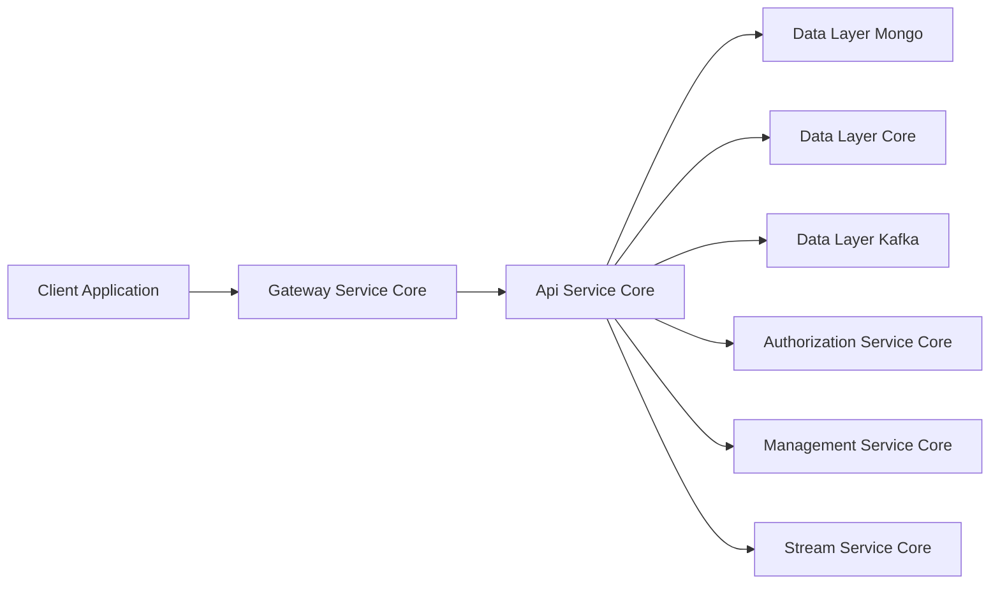
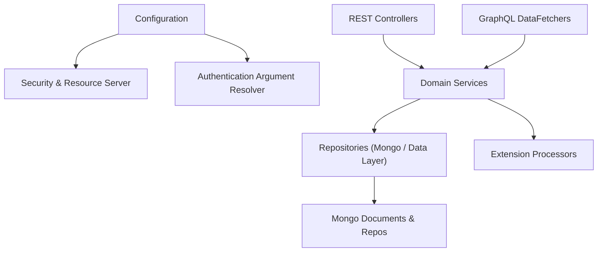
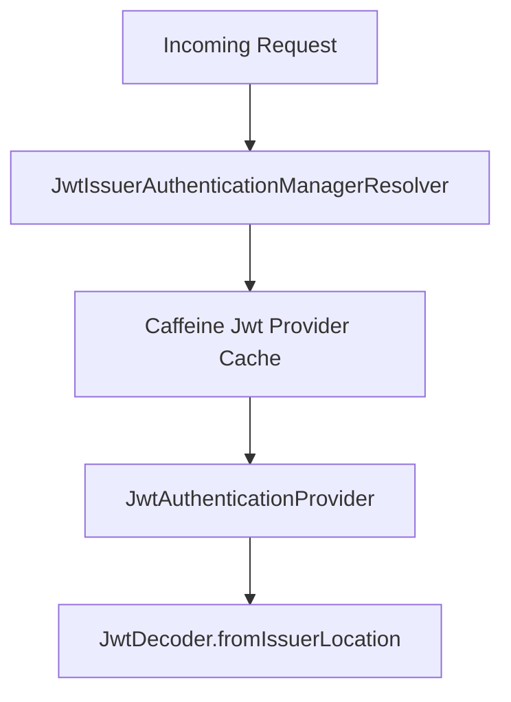
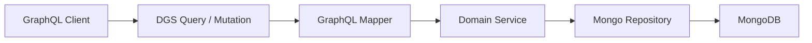
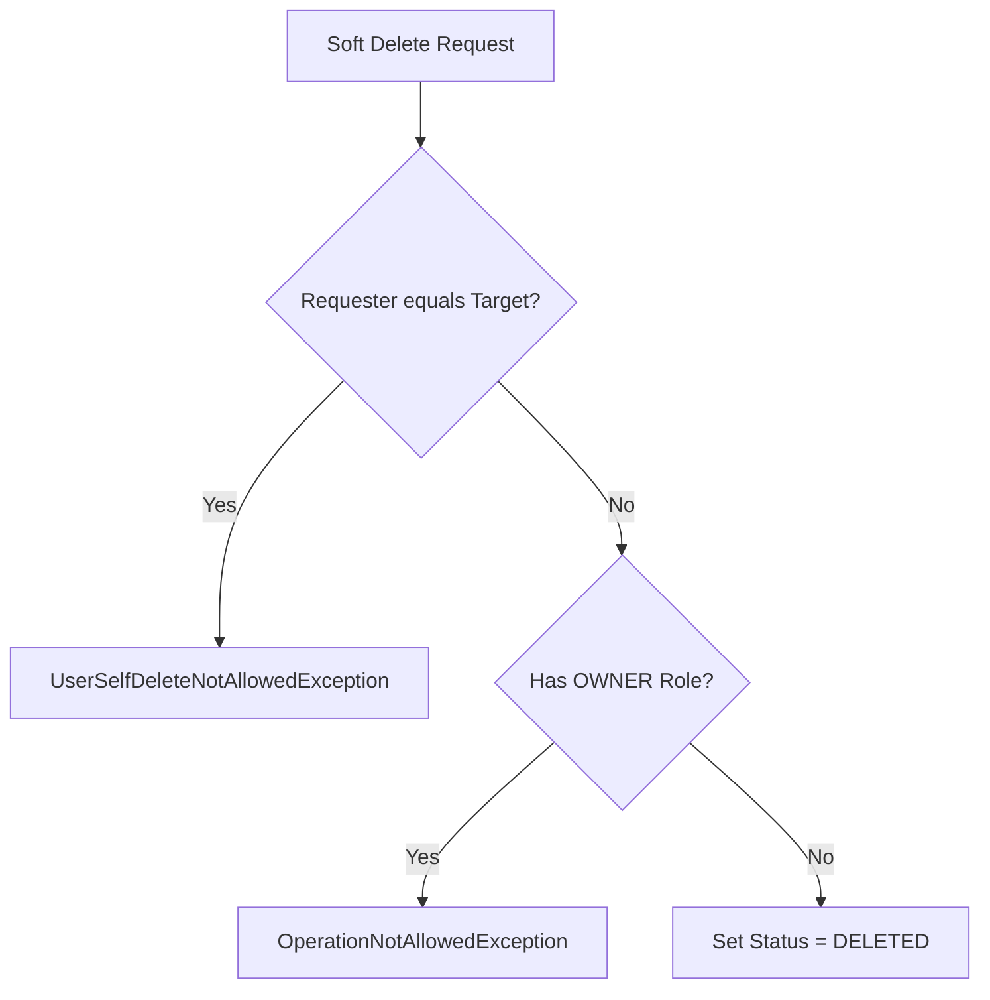

# Api Service Core

## Overview

The **Api Service Core** module is the internal application service responsible for:

- Exposing internal REST endpoints for management and mutations
- Providing a GraphQL API (via Netflix DGS) for rich query capabilities
- Coordinating domain services from data and management layers
- Acting as a secure resource server behind the Gateway

It is designed to operate **behind the Gateway Service Core**, which handles authentication, authorization enforcement, and token propagation. The Api Service Core focuses on domain orchestration, query/mutation handling, and DTO mapping.

---

## Architectural Context

Within the OpenFrame service landscape, the Api Service Core sits between the Gateway and the underlying data and stream layers.



### Responsibilities Split

- **Gateway Service Core**: JWT validation, API key auth, header enrichment, tenant routing
- **Authorization Service Core**: OAuth2 authorization server, tenant registration, login flows
- **Api Service Core**: Resource server, GraphQL queries, internal REST mutations, business orchestration
- **Data Layers**: Persistence (MongoDB), analytics (Pinot), messaging (Kafka)

---

## High-Level Architecture

The Api Service Core is structured into the following logical areas:



### Main Building Blocks

1. **Configuration Layer**
   - `ApiApplicationConfig`
   - `AuthenticationConfig`
   - `SecurityConfig`

2. **REST Controllers**
   - DeviceController
   - OrganizationController
   - MeController
   - HealthController

3. **GraphQL DataFetchers (Netflix DGS)**
   - DeviceDataFetcher
   - EventDataFetcher
   - LogDataFetcher
   - OrganizationDataFetcher
   - ToolsDataFetcher

4. **Domain Services & Processors**
   - UserService
   - DefaultUserProcessor
   - DefaultInvitationProcessor

---

## Configuration Layer

### ApiApplicationConfig

Provides core beans for the application.

- Defines a `PasswordEncoder` using `BCryptPasswordEncoder`
- Used by services that manage user credentials

```java
@Bean
public PasswordEncoder passwordEncoder() {
    return new BCryptPasswordEncoder();
}
```

---

### AuthenticationConfig

Registers a custom argument resolver:

- Adds `AuthPrincipalArgumentResolver`
- Enables usage of `@AuthenticationPrincipal AuthPrincipal` in controllers

This allows controllers like `MeController` to receive a strongly typed principal object extracted from the JWT.

---

### SecurityConfig

Configures the Api Service Core as an **OAuth2 Resource Server**.

Key characteristics:

- CSRF disabled (API-only service)
- All requests permitted at HTTP level (`permitAll()`)
- JWT validation delegated to a dynamic issuer resolver
- Uses a Caffeine `LoadingCache` to cache `JwtAuthenticationProvider` instances per issuer



### Why `permitAll()`?

The Gateway Service Core already:

- Validates JWT tokens
- Handles public vs protected routes
- Adds `Authorization` headers from cookies

The Api Service Core only needs to:

- Decode JWT
- Populate `@AuthenticationPrincipal`

---

## REST Controllers

The REST layer is primarily used for **internal mutations and management operations**.

### HealthController

- `GET /health`
- Returns `OK`
- Used by liveness/readiness probes

---

### MeController

- `GET /me`
- Returns authenticated user information
- Uses `@AuthenticationPrincipal AuthPrincipal`

Response structure:

```json
{
  "authenticated": true,
  "user": {
    "id": "...",
    "email": "...",
    "displayName": "...",
    "roles": ["..."],
    "tenantId": "..."
  }
}
```

If no principal is present, returns `401 Unauthorized`.

---

### DeviceController

- `PATCH /devices/{machineId}`
- Updates device status
- Delegates to `DeviceService.updateStatusByMachineId`

This endpoint is typically used internally (e.g., by automation or stream processors).

---

### OrganizationController

Handles organization mutations:

- `POST /organizations` → Create
- `PUT /organizations/{id}` → Update
- `DELETE /organizations/{id}` → Delete

Behavioral highlights:

- Uses `OrganizationCommandService`
- Maps entities using `OrganizationMapper`
- Returns `409 Conflict` when organization has machines
- Returns `404 Not Found` when ID does not exist

Read operations are exposed via GraphQL and the External API Service Core.

---

## GraphQL Layer (Netflix DGS)

The Api Service Core exposes a GraphQL API using Netflix DGS.

### Query Flow



### DeviceDataFetcher

Provides:

- `devices(...)` with cursor-based pagination
- `device(machineId)`
- `deviceFilters(...)`
- Field resolvers using `DataLoader`:
  - tags
  - toolConnections
  - installedAgents
  - organization

Uses:

- `DeviceService`
- `DeviceFilterService`
- `GraphQLDeviceMapper`

Implements N+1 mitigation via `DataLoader`.

---

### EventDataFetcher

Provides:

- `events(...)`
- `eventById(id)`
- `eventFilters(...)`
- Mutations: `createEvent`, `updateEvent`

Uses:

- `EventService`
- `GraphQLEventMapper`

Supports:

- Cursor pagination
- Filtering
- Sorting
- Free-text search

---

### LogDataFetcher

Provides audit log queries:

- `logs(...)`
- `logFilters(...)`
- `logDetails(...)`

Delegates to `LogService` and `GraphQLLogMapper`.

---

### OrganizationDataFetcher

Provides:

- `organizations(...)`
- `organization(id)`
- `organizationByOrganizationId(organizationId)`

Uses:

- `OrganizationQueryService`
- `OrganizationService`
- `GraphQLOrganizationMapper`

---

### ToolsDataFetcher

Provides:

- `integratedTools(...)`
- `toolFilters()`

Delegates to `ToolService` and `GraphQLToolMapper`.

---

## User Management

### UserService

Encapsulates user domain logic.

Key operations:

- `listUsers(page, size)`
- `getUserById(id)`
- `updateUser(id, request)`
- `softDeleteUser(id, requesterUserId)`

### Deletion Rules



- Prevents self-deletion
- Prevents deletion of OWNER accounts
- Performs soft delete by setting status to `DELETED`

---

## Extension Processors

The Api Service Core provides extension hooks via processors.

### DefaultInvitationProcessor

- Logs invitation created / revoked
- Used when no custom `InvitationProcessor` is provided

### DefaultUserProcessor

- Hooks after:
  - User fetched
  - User updated
  - User deleted

Both use `@ConditionalOnMissingBean`, allowing override in tenant-specific services.

---

## Interaction With Other Modules

The Api Service Core integrates with several sibling modules:

- [Authorization Service Core](../authorization-service-core/authorization-service-core.md)
- [Gateway Service Core](../gateway-service-core/gateway-service-core.md)
- [Data Layer Mongo](../data-layer-mongo/data-layer-mongo.md)
- [Data Layer Core](../data-layer-core/data-layer-core.md)
- [Data Layer Kafka](../data-layer-kafka/data-layer-kafka.md)
- [Management Service Core](../management-service-core/management-service-core.md)
- [Stream Service Core](../stream-service-core/stream-service-core.md)
- [External Api Service Core](../external-api-service-core/external-api-service-core.md)

Each module owns its own responsibilities, and the Api Service Core orchestrates them without duplicating logic.

---

## Summary

The **Api Service Core** module:

- Acts as a GraphQL-first internal API service
- Exposes internal REST mutation endpoints
- Operates as a JWT-based OAuth2 Resource Server
- Delegates authentication enforcement to the Gateway
- Orchestrates domain services across Mongo, Kafka, and analytics layers
- Provides extension points via processors

It is the central application layer for tenant-scoped domain operations within the OpenFrame platform.