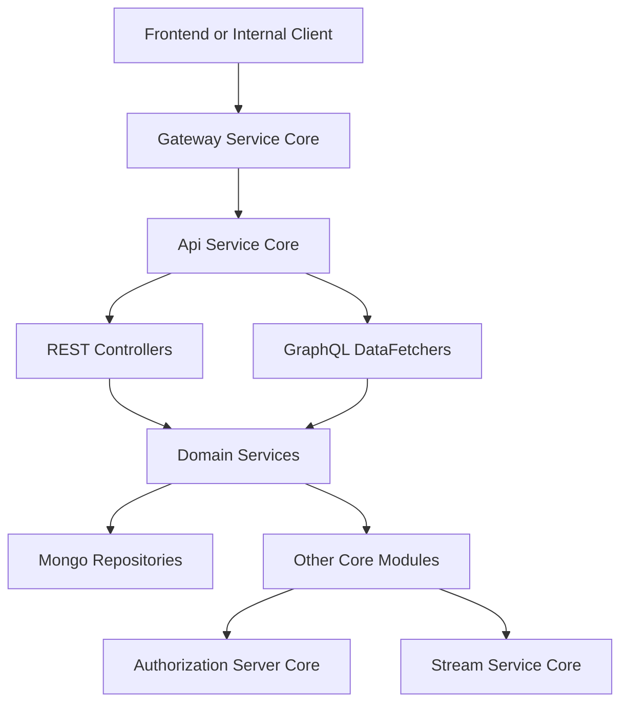
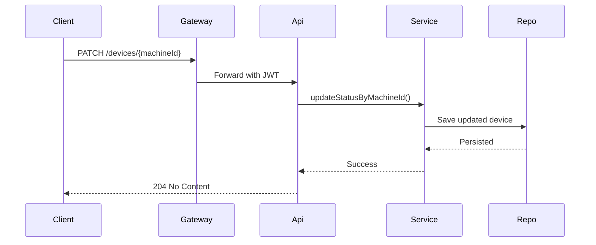
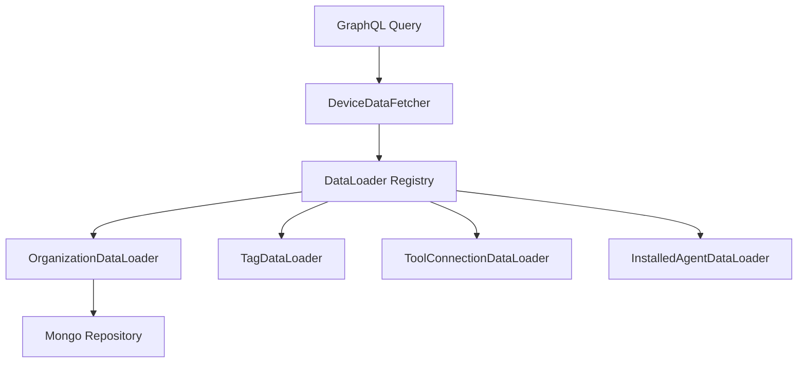
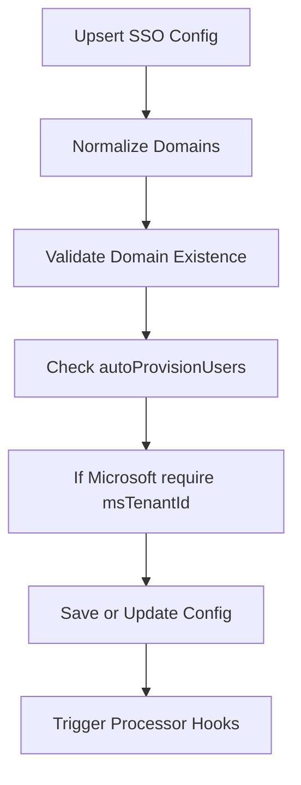
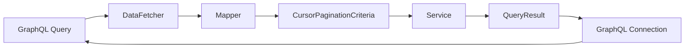

# Api Service Core

## Overview

The **Api Service Core** module is the primary internal API layer of the OpenFrame platform. It exposes REST and GraphQL endpoints used by the Gateway, frontend applications, and other internal services to manage users, organizations, devices, events, logs, tools, and SSO configuration.

This module acts as:

- ✅ The internal REST API for command-style operations (mutations)
- ✅ The GraphQL query layer (via Netflix DGS)
- ✅ A resource server for JWT-based authentication
- ✅ A bridge between domain services and transport layers

It integrates closely with:

- Data persistence modules (Mongo repositories)
- Security and OAuth infrastructure
- Stream and event services
- Gateway service (which handles primary authentication enforcement)

---

## High-Level Architecture

The Api Service Core sits behind the Gateway and exposes both REST and GraphQL endpoints.

### Key Responsibilities

| Layer | Responsibility |
|--------|----------------|
| Configuration | Security, authentication, password encoding |
| REST Controllers | Internal command APIs (create, update, delete) |
| GraphQL DataFetchers | Query APIs with cursor pagination |
| DataLoaders | Batch loading to avoid N+1 problems |
| Services | Business logic and domain orchestration |

---

## Security Model

The Api Service Core is configured as a **Spring OAuth2 Resource Server**, but it does not enforce strict path-level authorization.

Authentication responsibilities are split:

- ✅ Gateway validates JWT tokens and injects headers
- ✅ Api Service Core resolves `@AuthenticationPrincipal`
- ✅ JWT issuer resolution is cached via Caffeine

### Security Flow

### Security Components

- **SecurityConfig** – Configures OAuth2 Resource Server
- **AuthenticationConfig** – Registers `AuthPrincipalArgumentResolver`
- **ApiApplicationConfig** – Defines password encoder bean

The `/me` endpoint demonstrates principal resolution using `@AuthenticationPrincipal`.

---

## REST Layer

REST endpoints are primarily used for command operations (mutations).

### Controllers

| Controller | Responsibility |
|------------|---------------|
| DeviceController | Update device status |
| OrganizationController | Create, update, delete organizations |
| UserController | Manage users |
| OpenFrameClientConfigurationController | Client configuration retrieval |
| HealthController | Health checks |
| MeController | Current user identity |

### REST Interaction Example

---

## GraphQL Layer (Netflix DGS)

The Api Service Core provides a rich GraphQL API for querying domain entities with:

- Cursor-based pagination
- Filtering and sorting
- Search support
- Efficient batch loading

### Main DataFetchers

| DataFetcher | Domain |
|-------------|--------|
| DeviceDataFetcher | Devices, tags, agents, connections |
| EventDataFetcher | Events and mutations |
| LogDataFetcher | Audit logs |
| OrganizationDataFetcher | Organizations |
| ToolsDataFetcher | Integrated tools |

Each DataFetcher:

1. Validates input arguments
2. Maps DTO input to filter options
3. Calls a service layer
4. Maps results to GraphQL connections

---

## DataLoader Architecture

To avoid N+1 query problems, the module uses DGS DataLoaders.

### Implemented DataLoaders

- InstalledAgentDataLoader
- OrganizationDataLoader
- TagDataLoader
- ToolConnectionDataLoader

These batch load related entities by IDs and return results in request order.

---

## Core Service Layer

Services encapsulate business logic and coordinate repositories and processors.

### Notable Services

#### UserService

Handles:

- Pagination and listing
- Updates
- Soft deletes
- Owner protection
- Self-delete prevention

Business constraints enforced:

- Owner accounts cannot be deleted
- Users cannot delete themselves
- Deletions are soft (status set to DELETED)

#### SSOConfigService

Responsible for:

- Managing SSO provider configuration
- Encrypting and decrypting client secrets
- Validating allowed domains
- Enforcing Microsoft tenant rules
- Post-processing configuration changes

### SSO Validation Logic

---

## Integration with Other Modules

The Api Service Core collaborates with several platform modules:

### Authorization Server Core

- Provides JWT issuance
- Handles login and tenant discovery
- Supplies issuer-based JWT validation support

### Data Access (Mongo)

- UserRepository
- OrganizationRepository
- SSOConfigRepository
- OAuth token storage

### Gateway Service Core

- Performs authentication enforcement
- Injects Authorization headers
- Handles CORS and routing

### Stream Service Core

- Event ingestion
- Activity enrichment
- Change event processing

---

## Pagination Model

GraphQL queries use cursor-based pagination.

Core DTOs involved:

- CursorPaginationInput
- CursorPaginationCriteria
- CountedGenericQueryResult
- GenericConnection

Flow:

---

## Health and Observability

The module provides:

- `/health` endpoint for liveness checks
- Structured logging
- Debug-level tracing in DataFetchers
- Informational logs for mutation endpoints

---

## Design Principles

The Api Service Core follows several architectural principles:

1. **Thin Controllers** – Business logic resides in services
2. **Clear Separation of Command vs Query** – REST for commands, GraphQL for queries
3. **Batching for Performance** – DataLoader usage to prevent N+1
4. **Security Delegation** – Gateway handles enforcement, API resolves identity
5. **Extensibility** – New domains can plug in via DataFetcher + Service + Mapper

---

## Summary

The **Api Service Core** is the central internal API module of OpenFrame. It:

- Exposes REST and GraphQL APIs
- Resolves authenticated principals
- Coordinates domain services
- Implements cursor-based pagination
- Prevents N+1 via DataLoaders
- Manages SSO configuration and user lifecycle rules

It plays a critical role in translating authenticated platform requests into domain operations while remaining cleanly separated from authentication enforcement, persistence mechanics, and stream processing concerns.