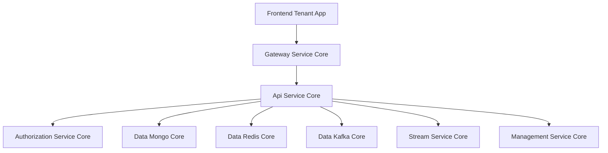
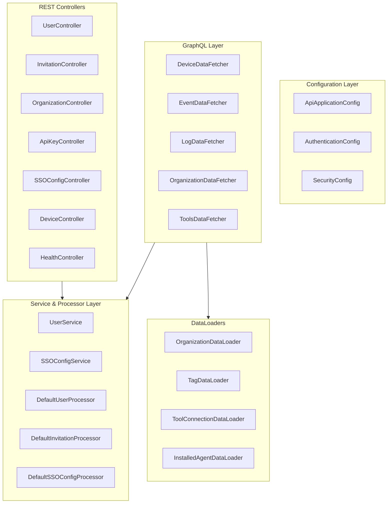
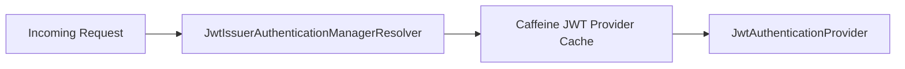
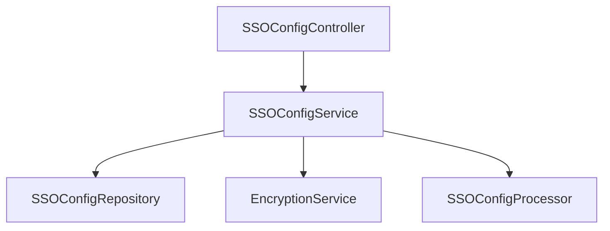
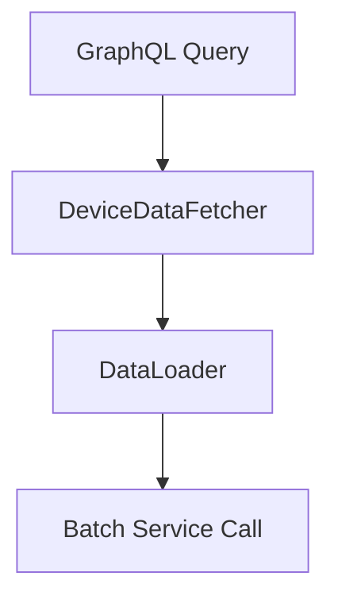
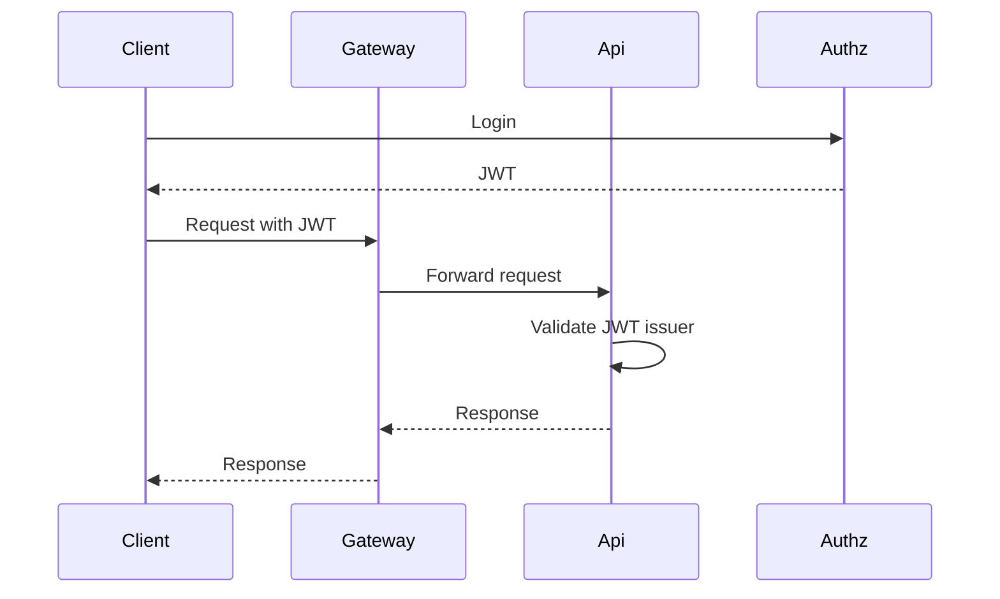

# Api Service Core

## Overview

The **Api Service Core** module is the primary internal API layer of the OpenFrame platform. It exposes REST and GraphQL endpoints for tenant-facing operations such as:

- User and invitation management  
- Organization lifecycle management  
- API key management  
- Device, event, and log querying  
- SSO configuration management  
- Client configuration and release metadata  

It acts as the orchestration layer between:

- The **Gateway Service Core** (edge routing and JWT validation)  
- The **Authorization Service Core** (OAuth2 / OIDC flows and token issuance)  
- Data modules such as **Data Mongo Core**, **Data Kafka Core**, and **Data Redis Core**  
- Stream and Management services for enrichment and system configuration  

The module is implemented using:

- Spring Boot (REST controllers)  
- Spring Security (OAuth2 Resource Server)  
- Netflix DGS (GraphQL)  
- Spring Data (MongoDB repositories)  

---

## High-Level Architecture



### Responsibilities in the Request Chain

1. **Gateway Service Core**  
   - Validates JWTs  
   - Handles cookies and CORS  
   - Forwards authenticated requests  

2. **Api Service Core**  
   - Exposes REST + GraphQL endpoints  
   - Maps DTOs to domain objects  
   - Enforces business rules  
   - Coordinates persistence and enrichment  

3. **Authorization Service Core**  
   - Issues JWT tokens  
   - Handles login, SSO, tenant discovery  

---

## Internal Module Structure



---

# Configuration Layer

## ApiApplicationConfig

Defines shared application beans.  
Currently provides:

- `PasswordEncoder` using `BCryptPasswordEncoder`

This encoder is used for secure password handling where applicable.

---

## AuthenticationConfig

Registers a custom argument resolver:

- `AuthPrincipalArgumentResolver`

This enables use of:

```java
@AuthenticationPrincipal AuthPrincipal principal
```

inside REST controllers, allowing direct access to authenticated user context.

---

## SecurityConfig

The **Api Service Core** is configured as a minimal OAuth2 Resource Server.

Key points:

- CSRF disabled  
- `anyRequest().permitAll()` (Gateway enforces path rules)  
- OAuth2 JWT resource server enabled  
- Multi-issuer support using `JwtIssuerAuthenticationManagerResolver`  
- Caffeine-based cache for `JwtAuthenticationProvider`



This design allows:

- Multi-tenant JWT validation  
- Cached decoder instances per issuer  
- Reduced overhead for repeated token validation  

---

# REST Controllers

## User Management

### UserController

Endpoints:

- `GET /users`  
- `GET /users/{id}`  
- `PUT /users/{id}`  
- `DELETE /users/{id}` (soft delete)

Backed by:

- `UserService`
- `UserProcessor` (extension hook)

### Business Rules

- Users cannot delete themselves  
- Owner accounts cannot be deleted  
- Soft delete sets status to `DELETED`  

---

## Invitation Management

### InvitationController

Endpoints:

- `POST /invitations`  
- `GET /invitations`  
- `DELETE /invitations/{id}`  
- `POST /invitations/{id}/resend`  

Extension point:

- `InvitationProcessor`  
- Default: `DefaultInvitationProcessor`

---

## Organization Management

### OrganizationController

Mutation endpoints only (read handled externally):

- `POST /organizations`  
- `PUT /organizations/{id}`  
- `DELETE /organizations/{id}`  

Key rule:

- Deletion blocked if organization has machines  
  → `OrganizationHasMachinesException` → HTTP 409  

---

## API Key Management

### ApiKeyController

Endpoints:

- Create  
- List  
- Update  
- Delete  
- Regenerate  

All operations are scoped to the authenticated user via `AuthPrincipal`.

---

## SSO Configuration

### SSOConfigController

Endpoints:

- `GET /sso/providers`  
- `GET /sso/providers/available`  
- `GET /sso/{provider}`  
- `POST /sso/{provider}`  
- `PATCH /sso/{provider}/toggle`  
- `DELETE /sso/{provider}`  

Backed by:

- `SSOConfigService`
- `SSOConfigProcessor`

### SSOConfigService Responsibilities

- Encrypt/decrypt client secrets  
- Validate allowed domains  
- Validate auto-provision constraints  
- Persist SSO configuration  
- Trigger post-processing hooks  



---

## Device & System Endpoints

- `DeviceController` → internal device status updates  
- `HealthController` → `/health` readiness endpoint  
- `OpenFrameClientConfigurationController` → client config  
- `ReleaseVersionController` → current release metadata  

---

# GraphQL Layer (Netflix DGS)

The GraphQL layer supports cursor-based pagination and advanced filtering.

## Core DataFetchers

- `DeviceDataFetcher`  
- `EventDataFetcher`  
- `LogDataFetcher`  
- `OrganizationDataFetcher`  
- `ToolsDataFetcher`  

Each DataFetcher:

1. Accepts filter DTOs  
2. Converts them to domain filter options  
3. Applies pagination & sorting  
4. Returns connection-based results  

---

## N+1 Prevention with DataLoaders

DataLoaders batch related queries:

- `OrganizationDataLoader`  
- `TagDataLoader`  
- `ToolConnectionDataLoader`  
- `InstalledAgentDataLoader`  



This ensures efficient batched lookups instead of per-row database calls.

---

# Service & Processor Layer

The service layer contains business logic and extension hooks.

## UserService

Handles:

- Pagination  
- Update logic  
- Soft delete enforcement  
- Owner protection rules  

Uses:

- `UserRepository` (Mongo)  
- `UserMapper`  
- `UserProcessor`  

---

## Extension Points

The module supports overrideable processors using `@ConditionalOnMissingBean`:

- `DefaultUserProcessor`  
- `DefaultInvitationProcessor`  
- `DefaultSSOConfigProcessor`  
- `DefaultDomainExistenceValidator`  

This allows SaaS or enterprise deployments to inject:

- Custom provisioning logic  
- Email triggers  
- Audit integrations  
- Domain policy enforcement  

---

# Multi-Tenant & Security Model

The **Api Service Core** assumes:

- Gateway validates JWT signatures  
- Authorization Service Core issues tokens  
- Issuer-based validation supports multi-tenancy  



---

# Integration with Other Core Modules

- Authorization flows → **Authorization Service Core**  
- JWT enforcement & routing → **Gateway Service Core**  
- Data persistence → **Data Mongo Core**  
- Streaming events → **Stream Service Core**  
- System configuration → **Management Service Core**  
- Public read APIs → **External API Service Core**  

---

# Summary

The **Api Service Core** module is the central tenant-facing API engine of OpenFrame.  
It provides:

- REST + GraphQL endpoints  
- Business logic orchestration  
- Multi-tenant JWT validation  
- Domain-driven validation rules  
- Extension hooks for customization  
- Efficient data loading with DataLoader batching  

It is intentionally lightweight in security enforcement, delegating edge concerns to the Gateway while focusing on domain-level logic and tenant operations.