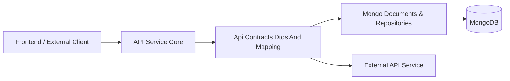
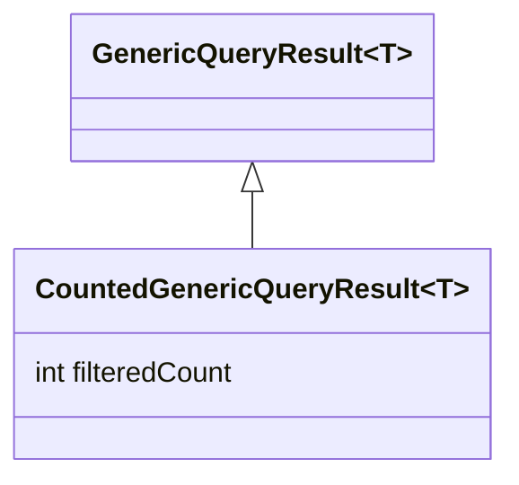
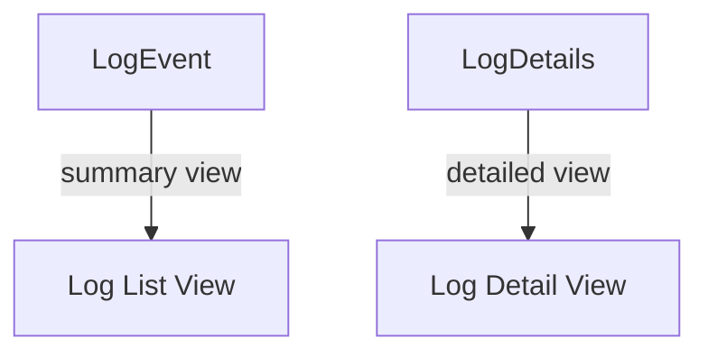
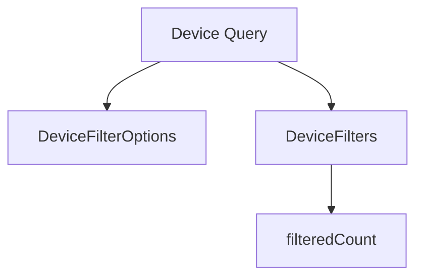
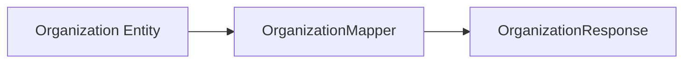
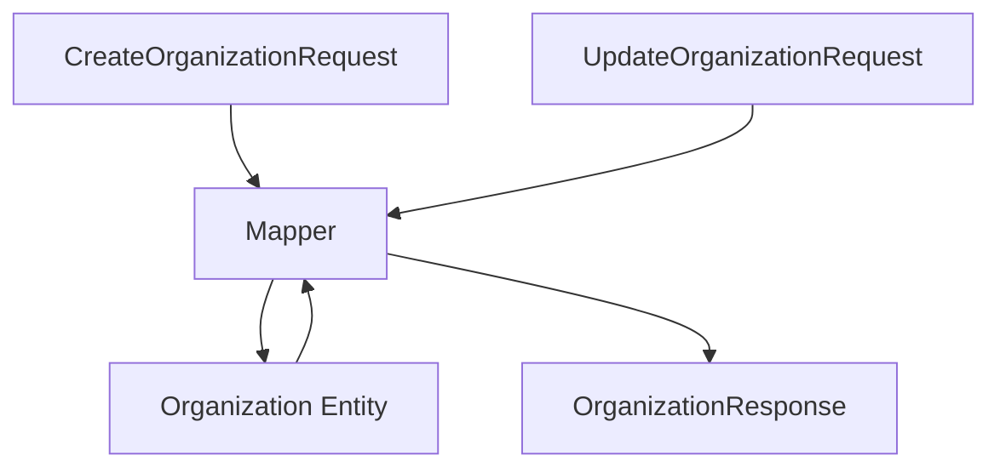
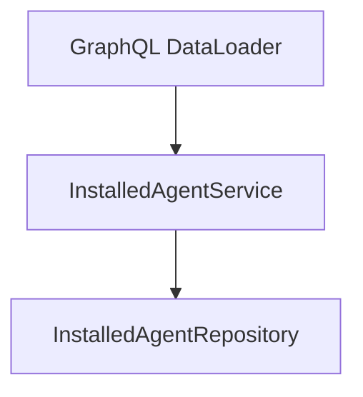
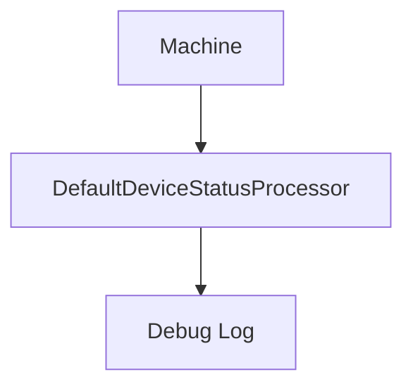
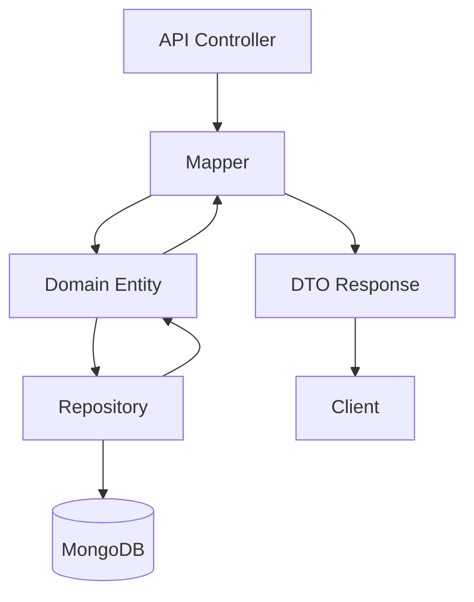

# Api Contracts Dtos And Mapping

## Overview

The **Api Contracts Dtos And Mapping** module defines the shared data transfer objects (DTOs), filter contracts, pagination inputs, list wrappers, and mapping logic used across the OpenFrame platform.

It acts as the **contract boundary layer** between:

- API services (REST + GraphQL)
- Data layer (Mongo documents and repositories)
- Streaming and enrichment services
- External API exposure layer

This module ensures that:

- API schemas remain stable and consistent
- Domain entities are not leaked directly to clients
- Filtering and pagination follow uniform patterns
- Mapping logic is centralized and reusable

---

## Architectural Role in the Platform

The module sits between the API layer and the persistence layer, providing a clean separation between internal documents and external contracts.



### Responsibilities

1. ✅ Define response DTOs
2. ✅ Define filter input DTOs
3. ✅ Define pagination contracts
4. ✅ Provide list wrapper objects
5. ✅ Provide shared mapping components
6. ✅ Provide service utilities used by DataLoaders and processors

---

# DTO Categories

The module is structured by domain areas:

- Audit & Logs
- Devices
- Events
- Organizations
- Tools
- Shared (Pagination & Generic Results)

---

# Shared Query & Pagination Contracts

## CountedGenericQueryResult

Extends a generic query result with a filtered count.



### Purpose

- Used for queries where both:
  - paginated results
  - total filtered count

are required (for example, table UIs).

---

## CursorPaginationInput

```text
Fields:
- limit (1-100)
- cursor (String)
```

### Characteristics

- Enforces min/max limits via validation
- Supports cursor-based pagination
- Designed for scalable GraphQL and REST endpoints

---

# Audit & Log DTOs

## LogEvent vs LogDetails



### LogEvent
Lightweight representation used in list results.

Key fields:
- toolEventId
- eventType
- severity
- organizationName
- timestamp

### LogDetails
Extended representation including:
- message
- details
- full metadata

Used for:
- Drill-down views
- Forensic inspection
- Detailed audit analysis

---

## Log Filtering Contracts

### LogFilterOptions
Input-based filtering:

```text
- startDate
- endDate
- eventTypes
- toolTypes
- severities
- organizationIds
- deviceId
```

### LogFilters
Response-side filter metadata:

- toolTypes
- eventTypes
- severities
- organizations (id + name)

### OrganizationFilterOption
Represents dropdown-friendly organization filter entries.

---

# Device DTOs & Filtering

Device filtering is designed for faceted UI filtering.



## DeviceFilterOptions
Internal filter input structure:

- statuses
- deviceTypes
- osTypes
- organizationIds
- tagNames

## DeviceFilters
Represents:

- Filter values
- Label
- Count per option
- Overall filteredCount

### DeviceFilterOption

```text
value
label
count
```

### TagFilterOption
Same pattern for tag-based filtering.

---

# Event DTOs

## EventFilterOptions

- userIds
- eventTypes
- startDate
- endDate

## EventFilters

Simplified filter response object containing:

- userIds
- eventTypes

These contracts are used by event querying endpoints and stream-backed aggregations.

---

# Organization DTOs & Mapping

This module centralizes all organization-related API contracts.

## OrganizationResponse

Shared DTO used by both:

- GraphQL API
- REST External API



Key characteristics:

- Contains business-safe fields
- Includes contract lifecycle dates
- Includes contact information
- Hides internal persistence details

---

## OrganizationList

Wrapper object for returning multiple organizations.

## OrganizationFilterOptions

Internal filtering structure supporting:

- category
- employee range
- active contract flag

---

# OrganizationMapper

Centralized mapping component.



## Responsibilities

### 1. Create Mapping
- Generates UUID-based organizationId
- Initializes defaults
- Maps nested contact structures

### 2. Partial Update Logic
- Only updates non-null fields
- Protects immutable organizationId

### 3. Entity → DTO Mapping
- Converts nested objects
- Maps addresses and contact persons
- Handles mailingAddressSameAsPhysical logic

### 4. Deep Copy Logic
- Copies address when required

This prevents duplication of mapping logic across multiple API services.

---

# Tool DTOs

## ToolFilterOptions

Filtering input structure:

- enabled
- type
- category
- platformCategory

## ToolFilters

Response filter aggregation object:

- types
- categories
- platformCategories

## ToolList

Wrapper for returning integrated tool documents.

---

# Service Utilities

Although primarily a contract module, it also includes reusable services.

## InstalledAgentService



### Key Capabilities

- Batch loading by machineIds
- Grouping results per machine
- Avoiding N+1 query problems
- Supporting GraphQL data fetchers

Core method:

```text
getInstalledAgentsForMachines(List<String> machineIds)
```

---

## ToolConnectionService

Provides batch loading for tool connections per machine.

Supports:

- DataLoader integration
- Efficient grouping by machineId

---

## DefaultDeviceStatusProcessor

Default implementation of DeviceStatusProcessor.



### Purpose

- Hook for post-processing status updates
- Conditional bean override support
- Extensibility point for custom implementations

---

# Data Flow Summary



---

# Design Principles

## 1. Contract Stability

DTOs shield internal documents from:

- Persistence schema changes
- Internal refactoring
- Domain-specific logic

## 2. Explicit Filtering Contracts

Filter objects are:

- Structured
- Type-safe
- Frontend-friendly

## 3. Separation of Concerns

- Entities → Data Layer
- DTOs → API Contract Layer
- Mappers → Translation Layer

## 4. Reusability Across APIs

OrganizationResponse and shared DTOs are consumed by:

- Core API service
- External API service

---

# How This Module Fits Into the System

| Layer | Role |
|-------|------|
| API Service | Uses DTOs for requests & responses |
| Data Layer | Provides entities mapped to DTOs |
| External API | Reuses same response contracts |
| Streaming Layer | Supplies data consumed into DTO responses |

The **Api Contracts Dtos And Mapping** module is the canonical contract layer that ensures consistency across all platform services.

It is foundational for maintaining:

- Multi-service interoperability
- Schema clarity
- Safe API evolution

---

# Conclusion

The **Api Contracts Dtos And Mapping** module:

- Defines the platform's shared API vocabulary
- Encapsulates filter and pagination semantics
- Centralizes entity-to-DTO transformations
- Enables consistent API behavior across REST and GraphQL

It is a core building block for maintaining a clean, scalable, and evolvable API architecture across OpenFrame services.