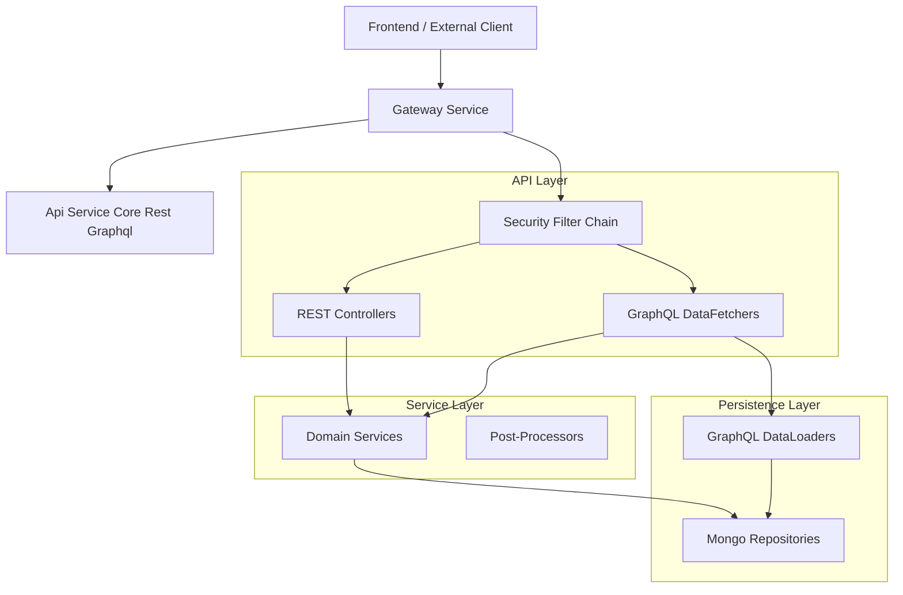
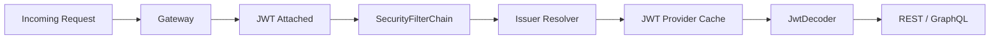
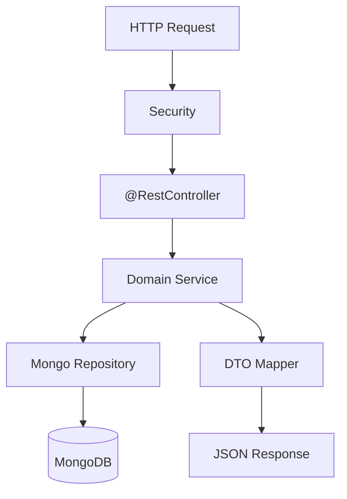
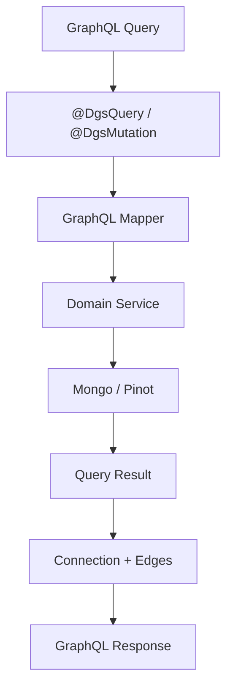
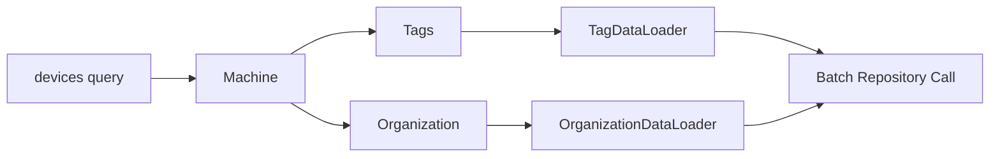
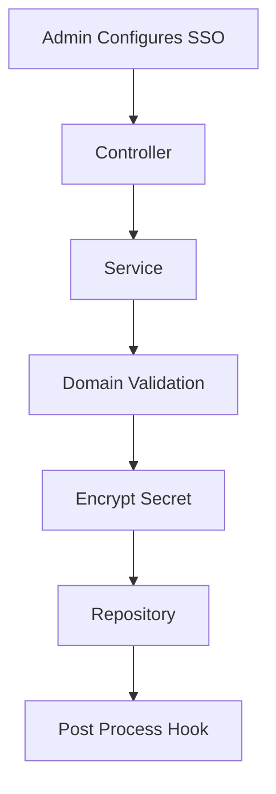
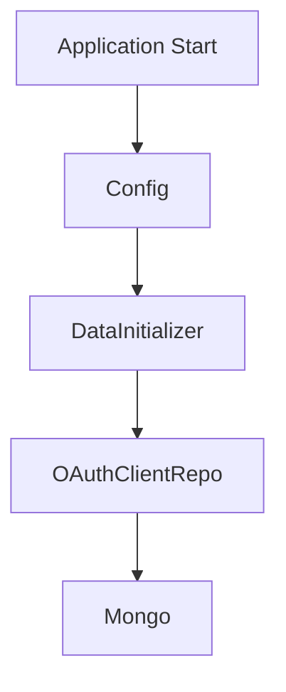

# Api Service Core Rest Graphql

## Overview

The **Api Service Core Rest Graphql** module is the central application layer for the OpenFrame tenant backend. It exposes:

- ✅ REST endpoints for internal and administrative operations  
- ✅ GraphQL queries and mutations for rich, client-driven data access  
- ✅ OAuth2 resource server support for JWT-based authentication  
- ✅ Domain services for users, organizations, SSO, API keys, devices, and more  

This module sits behind the Gateway service and acts as the primary business API surface for the platform.

It integrates with:

- Data Layer Mongo Documents and Repositories (persistence)
- Authorization Server Core and Tenant Context (JWT issuer + identity)
- Security OAuth BFF and JWT Support (token structures and PKCE)
- Data Layer Streaming (Kafka/Pinot/Cassandra) via services

---

## High-Level Architecture

---

## Security Model

The Api Service Core Rest Graphql module is configured as a **Spring OAuth2 Resource Server**, but it relies on the Gateway for primary enforcement.

### Key Responsibilities

- ✅ Accept JWTs issued by the Authorization Server  
- ✅ Resolve issuer dynamically using `JwtIssuerAuthenticationManagerResolver`  
- ✅ Cache `JwtAuthenticationProvider` instances using Caffeine  
- ✅ Expose `@AuthenticationPrincipal` via custom argument resolver  

### Security Flow

### Core Security Components

- `SecurityConfig` – Configures OAuth2 resource server and JWT caching
- `AuthenticationConfig` – Registers `AuthPrincipalArgumentResolver`
- `ApiApplicationConfig` – Provides `PasswordEncoder`
- `DataInitializer` – Bootstraps default OAuth clients

---

## REST API Layer

The REST layer exposes administrative and internal endpoints.

### Core Controllers

| Controller | Responsibility |
|------------|---------------|
| HealthController | Liveness check (`/health`) |
| MeController | Current authenticated user |
| ApiKeyController | API key lifecycle |
| UserController | User CRUD and soft delete |
| OrganizationController | Organization management |
| InvitationController | User invitations |
| SSOConfigController | SSO provider configuration |
| DeviceController | Internal device status updates |
| ForceAgentController | Tool/client forced updates |
| ReleaseVersionController | Current release metadata |
| OpenFrameClientConfigurationController | Client configuration delivery |
| AgentRegistrationSecretController | Agent registration secret lifecycle |

### REST Processing Flow

---

## GraphQL Layer (Netflix DGS)

The module uses **Netflix DGS** to provide a GraphQL API for rich querying.

### Core DataFetchers

- `DeviceDataFetcher`
- `EventDataFetcher`
- `LogDataFetcher`
- `OrganizationDataFetcher`
- `ToolsDataFetcher`

These implement:

- Cursor-based pagination
- Filtering + sorting
- Search support
- Query + mutation operations

### GraphQL Query Flow

---

## GraphQL DataLoader Optimization

To avoid N+1 problems, the module uses DataLoader batching.

### Registered DataLoaders

- `InstalledAgentDataLoader`
- `OrganizationDataLoader`
- `TagDataLoader`
- `ToolConnectionDataLoader`

### Batch Loading Flow

---

## Domain Services Layer

The service layer orchestrates business logic.

### Notable Services

- `UserService` – user lifecycle and soft delete logic
- `SSOConfigService` – SSO configuration and domain validation
- `DeviceService` – machine status and filtering
- `EventService` – event persistence
- `LogService` – audit log queries
- `ApiKeyService` – API key lifecycle

### Post-Processors (Extension Points)

The module defines conditional extension hooks:

- `DefaultInvitationProcessor`
- `DefaultSSOConfigProcessor`
- `DefaultUserProcessor`

These allow downstream modules to override behavior without modifying core logic.

---

## SSO Configuration Flow

The SSOConfigService handles:

- Encrypted client secrets
- Domain validation
- Auto-provisioning rules
- Provider toggling

---

## Pagination Model

GraphQL uses cursor-based pagination:

- `CursorPaginationInput`
- `CursorPaginationCriteria`
- `CountedGenericQueryResult`
- `GenericConnection`

This provides:

- Stable ordering
- Efficient large dataset navigation
- Relay-compatible edge model

---

## Multi-Tenancy Considerations

While tenant context is primarily handled in the Authorization Server and Gateway layers, this module:

- Extracts tenant ID from `AuthPrincipal`
- Operates on tenant-scoped repositories
- Respects soft-delete semantics

---

## Startup Initialization

On application startup:

- `DataInitializer` ensures default OAuth client exists
- JWT issuer cache is configured
- Password encoder is registered

---

## Error Handling Patterns

- `IllegalArgumentException` → 404 Not Found
- Domain-specific exceptions → 409 Conflict
- Validation via `@Valid`
- Soft delete enforcement in `UserService`

---

## Summary

The **Api Service Core Rest Graphql** module is the primary backend API engine of OpenFrame. It:

- Bridges Gateway and persistence layers
- Exposes REST + GraphQL APIs
- Implements JWT-based authentication
- Uses DataLoader for performance
- Supports extensible post-processing hooks
- Enforces domain and business rules

It is intentionally modular and extensible, allowing other modules in the system to plug into its processing pipelines without altering core behavior.
