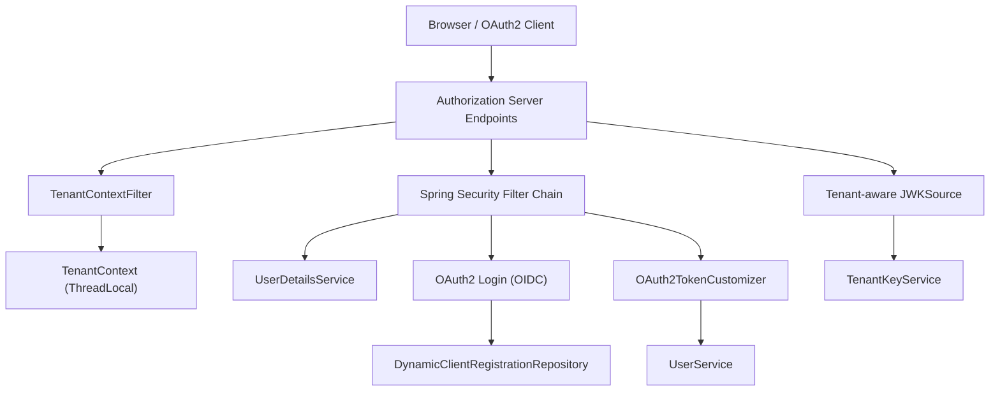
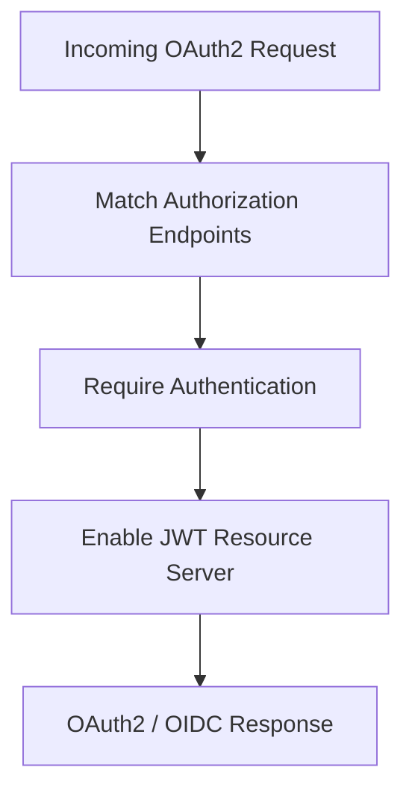
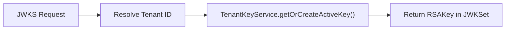
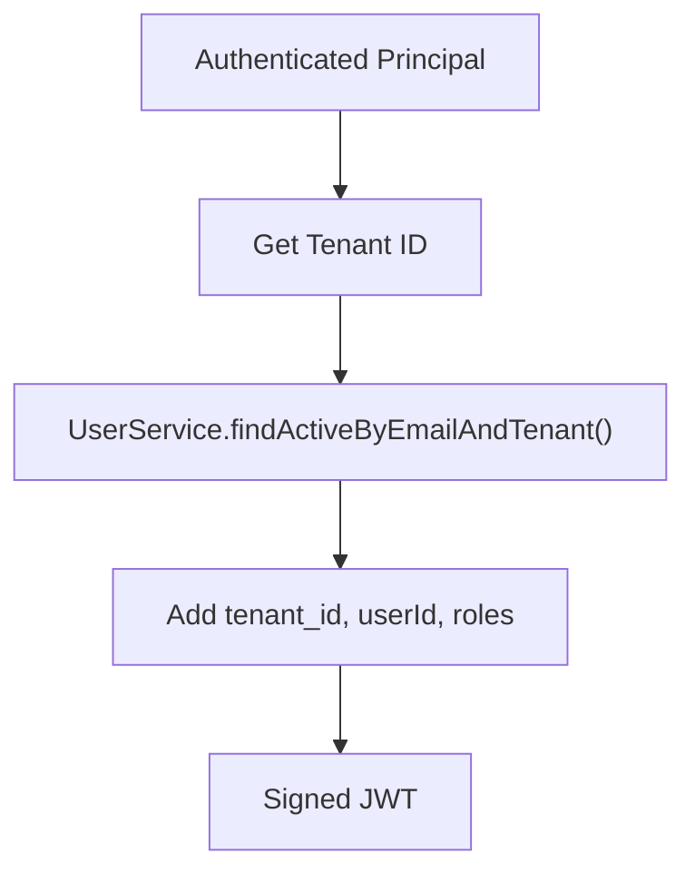
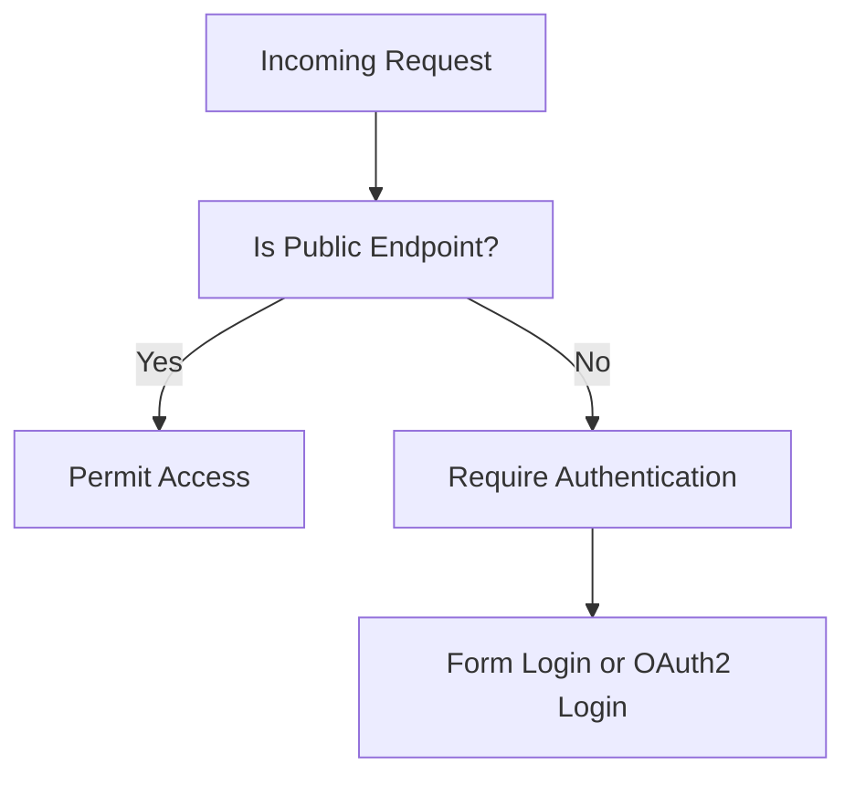
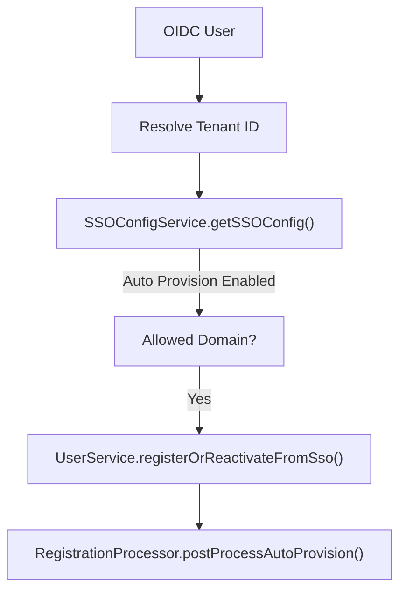
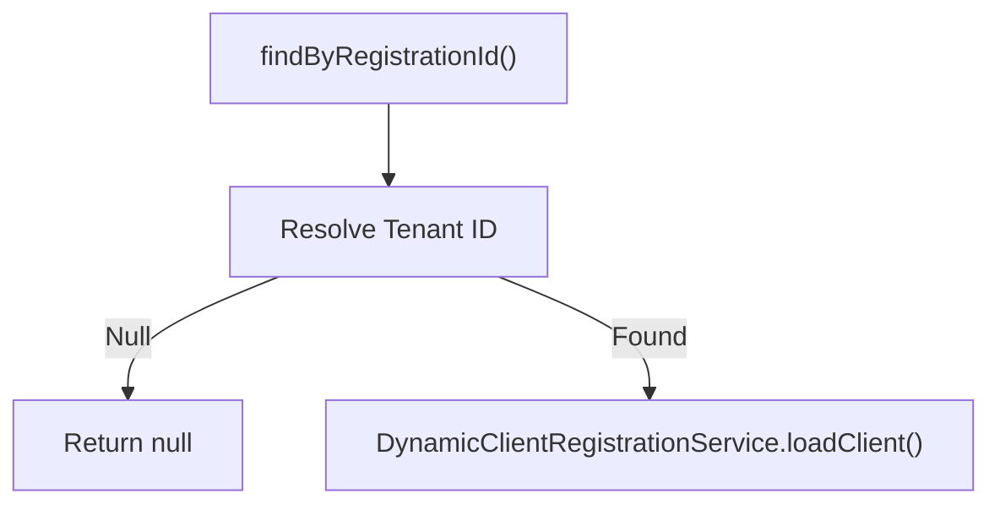
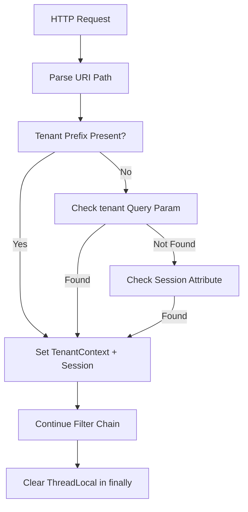
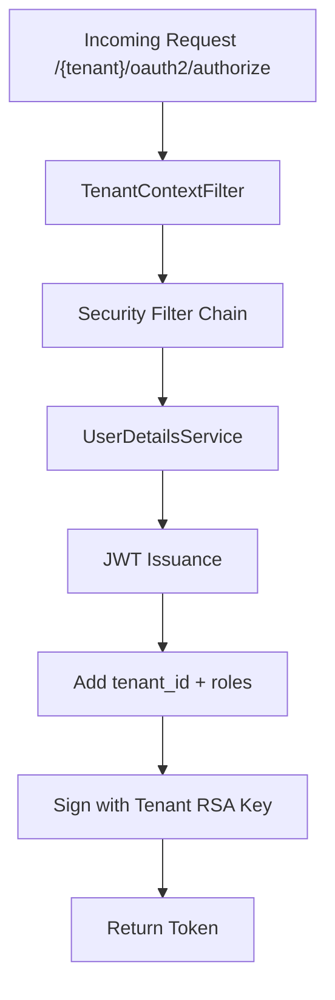

# Authorization Server Core And Tenant Context

## Overview

The **Authorization Server Core And Tenant Context** module is the foundation of OpenFrame’s multi-tenant OAuth2 and OpenID Connect (OIDC) authorization infrastructure. It is responsible for:

- Hosting a Spring Authorization Server
- Issuing tenant-aware JWT access tokens
- Managing per-tenant signing keys (JWKS)
- Resolving and enforcing tenant context per request
- Supporting dynamic OAuth2 client registrations per tenant
- Integrating with user services for authentication and claim enrichment

This module is used by the OpenFrame Authorization Server application entrypoint and works closely with persistence, SSO, and user domain services.

---

## Architectural Role in the Platform

At a high level, this module sits between:

- The **HTTP layer** (login, OAuth2 endpoints, OIDC flows)
- The **User and Tenant domain services**
- The **Key management and persistence layer**
- The **Multi-tenant routing logic**

### High-Level Architecture

The key differentiator of this module is that **every critical operation (authentication, token issuance, key resolution)** is tenant-aware.

---

# Core Components

## 1. AuthorizationServerConfig

**Class:** `AuthorizationServerConfig`

This class configures the Spring Authorization Server and core security infrastructure for OAuth2 and OIDC.

### Responsibilities

- Enables OAuth2 Authorization Server
- Allows multiple issuers (`multipleIssuersAllowed(true)`) to support multi-tenant deployments
- Configures JWT encoding and decoding
- Provides tenant-aware JWK source
- Customizes JWT claims
- Defines authentication manager and password encoding

### Authorization Server Security Filter Chain

- Uses `OAuth2AuthorizationServerConfigurer`
- Secures only authorization server endpoints
- Disables CORS and CSRF for matched endpoints
- Uses a custom `ProviderAwareAuthenticationEntryPoint` for HTML flows

---

### Tenant-Aware JWKSource

The `jwkSource` bean dynamically resolves signing keys per tenant.

Key characteristics:

- Extracts tenant ID from `TenantContext`
- Fails fast if tenant is not resolved
- Uses `TenantKeyService` to fetch or generate RSA keys
- Ensures each tenant has isolated signing keys

---

### JWT Token Customization

The `OAuth2TokenCustomizer<JwtEncodingContext>` enriches access tokens with domain-specific claims.

#### Added Claims

- `tenant_id`
- `userId`
- `roles`

#### Role Normalization

If a user has role `OWNER`, the system implicitly adds `ADMIN`.

This ensures:

- Tokens are tenant-scoped
- Downstream services can rely on embedded tenant and role data

---

### Authentication Infrastructure

`AuthorizationServerConfig` also defines:

- `UserDetailsService` (tenant-aware user lookup)
- `PasswordEncoder` (BCrypt)
- `AuthenticationManager` using `DaoAuthenticationProvider`

User resolution always uses:

- Lowercased email
- Active user lookup
- Tenant context isolation

---

## 2. SecurityConfig

**Class:** `SecurityConfig`

This configuration handles all **non-authorization-server** security concerns.

It defines the default Spring Security filter chain.

### Responsibilities

- Configures form login
- Configures OAuth2 login (OIDC)
- Defines public vs authenticated routes
- Integrates SSO auto-provisioning
- Customizes JWT validation (Microsoft multi-tenant support)

---

### Default Security Flow

Permitted endpoints include:

- `/oauth/**`
- `/login`
- `/password-reset/**`
- `/.well-known/**`
- `/tenant/**`

All other routes require authentication.

---

### OAuth2 Login and OIDC Integration

The module configures:

- Custom `AuthSuccessHandler`
- Custom `SsoAuthorizationRequestResolver`
- Custom failure handler
- OIDC user service with auto-provisioning

#### Microsoft Issuer Validation

A specialized `JwtDecoderFactory` supports Microsoft multi-tenant issuers using a regex-based issuer validator.

---

### Auto-Provisioning Logic

During OIDC login:

If:

- SSO config is enabled
- Auto-provisioning is enabled
- Email domain is allowed

Then a new user is automatically registered.

This ensures smooth enterprise onboarding flows.

---

## 3. DynamicClientRegistrationRepository

**Class:** `DynamicClientRegistrationRepository`

Implements `ClientRegistrationRepository`.

### Purpose

Loads OAuth2 client registrations dynamically per tenant.

### Tenant Resolution Strategy

1. Check `TenantContext`
2. Fallback to HTTP session attribute
3. Return `null` if unresolved

This enables:

- Per-tenant Google / Microsoft credentials
- Dynamic provider configuration
- Isolation of client IDs and secrets

---

## 4. TenantContext

**Class:** `TenantContext`

A lightweight static utility that stores the current tenant ID in a `ThreadLocal`.

### Methods

- `setTenantId(String tenantId)`
- `getTenantId()`
- `clear()`

This enables:

- Tenant propagation across service layers
- Token customization
- Key resolution
- User lookup isolation

---

## 5. TenantContextFilter

**Class:** `TenantContextFilter`

A `OncePerRequestFilter` that resolves and enforces tenant context for every request.

### Resolution Strategy

1. Extract from URL path prefix
2. Fallback to `tenant` query parameter
3. Fallback to session attribute

Excluded contexts:

- `login`
- `sso`
- `public`
- `.well-known`

---

### Tenant Extraction Flow

### Session Switching Logic

If a tenant changes mid-session:

- Switching from onboarding tenant is allowed
- Switching between unrelated tenants invalidates the session

This prevents cross-tenant session leakage.

---

# Multi-Tenancy Model

The module enforces tenant isolation at multiple layers:

| Layer | Mechanism |
|--------|-----------|
| Request | TenantContextFilter |
| Thread Scope | TenantContext (ThreadLocal) |
| Authentication | Tenant-aware UserDetailsService |
| Token | Custom JWT claims |
| Key Management | Per-tenant RSA keys |
| OAuth Clients | DynamicClientRegistrationRepository |

This layered enforcement ensures:

- No shared signing keys
- No cross-tenant user lookup
- No token reuse across tenants

---

# Interaction with Other Platform Modules

The Authorization Server Core And Tenant Context module collaborates with:

- User domain services for authentication and provisioning
- Key management services for RSA generation
- Mongo repositories for OAuth client and authorization persistence
- SSO configuration services for provider-specific settings
- Registration processors for post-provisioning workflows

It acts as the **security backbone** of the OpenFrame platform.

---

# Request Lifecycle Summary

---

# Key Design Principles

1. **Tenant Isolation First** – every operation is tenant-scoped.
2. **Dynamic Provider Support** – OAuth clients are not static.
3. **Pluggable Provisioning** – SSO provisioning is extensible.
4. **Standards-Based** – built on Spring Authorization Server and OIDC.
5. **Secure by Default** – BCrypt hashing, JWT validation, issuer enforcement.

---

# Conclusion

The **Authorization Server Core And Tenant Context** module provides the secure, multi-tenant identity backbone of OpenFrame. By combining:

- Spring Authorization Server
- Tenant-aware context propagation
- Dynamic client resolution
- Per-tenant key isolation
- Token-level claim enrichment

It ensures that authentication and authorization are both scalable and strongly isolated across tenants.

This module is critical to the security posture and SaaS architecture of the OpenFrame platform.