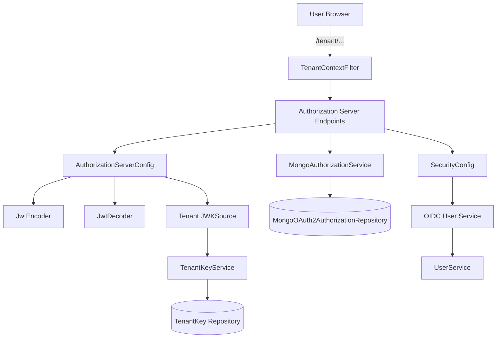
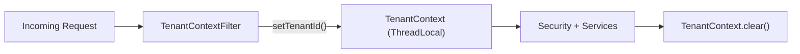
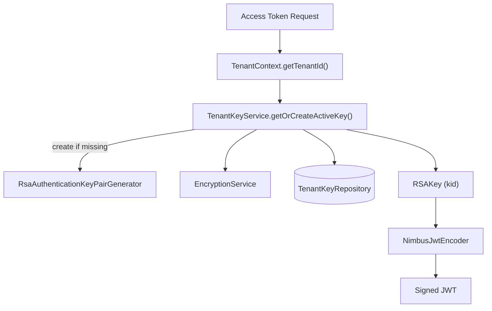
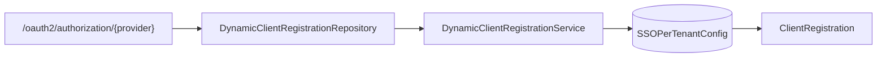
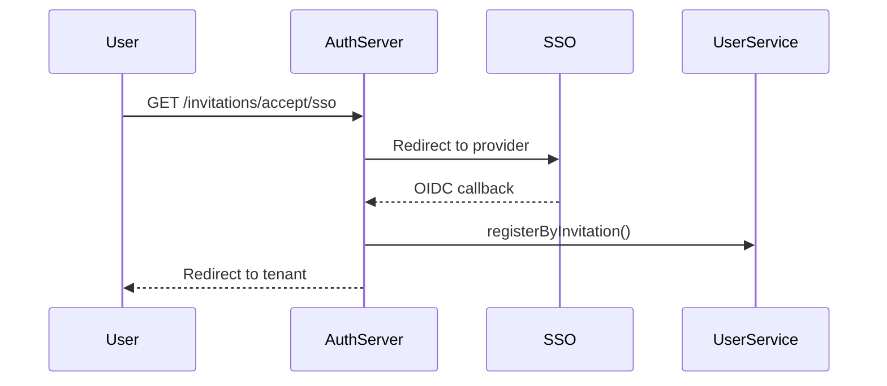
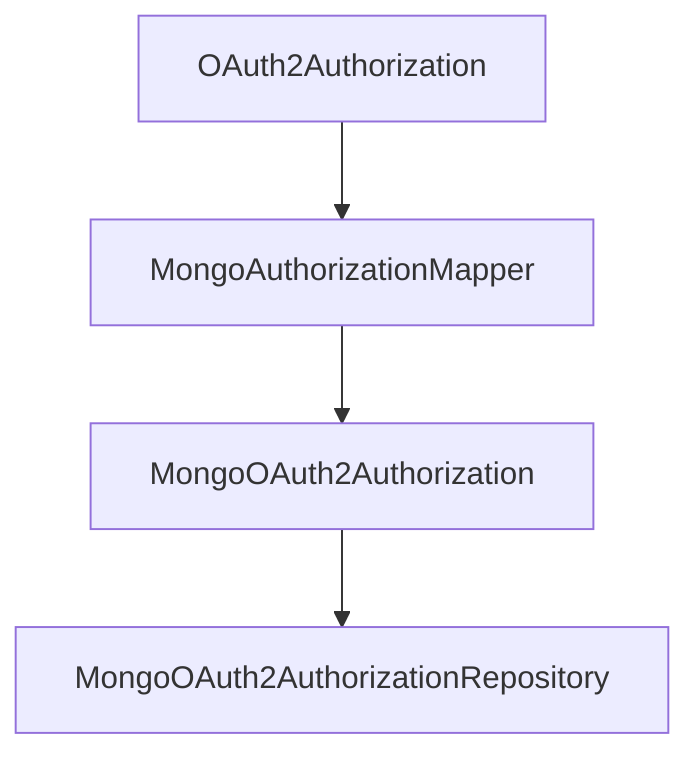

# Authorization Server Core

The **Authorization Server Core** module is the identity and OAuth2/OpenID Connect (OIDC) backbone of the OpenFrame platform. It provides multi-tenant authentication, token issuance, SSO integration (Google and Microsoft), tenant onboarding, invitation-based registration, and secure key management.

Built on top of Spring Security and Spring Authorization Server, this module issues JWT access tokens per tenant, persists OAuth2 authorizations in MongoDB, and dynamically configures identity providers at runtime.

---

## 1. Purpose and Responsibilities

The Authorization Server Core is responsible for:

- ✅ OAuth2 Authorization Server endpoints (authorization, token, JWKs, OIDC)
- ✅ Multi-tenant request resolution and isolation
- ✅ JWT issuance with tenant-scoped signing keys
- ✅ Dynamic SSO client registration (Google, Microsoft)
- ✅ Invitation-based and SSO-based registration flows
- ✅ Password-based authentication and password reset
- ✅ OAuth2 authorization persistence with PKCE support
- ✅ Tenant discovery and onboarding

It integrates closely with the data storage layer (MongoDB repositories), user management services, and the Gateway and API services that consume issued JWT tokens.

---

## 2. High-Level Architecture

### Architectural Layers

1. **Web Layer** – Controllers for login, SSO, tenant discovery, invitations, and password reset.
2. **Security Layer** – Spring Security filter chains for OAuth2 and default application security.
3. **Authorization Layer** – OAuth2AuthorizationService and RegisteredClientRepository implementations.
4. **Tenant Isolation Layer** – Thread-local tenant context resolution and enforcement.
5. **Key Management Layer** – Per-tenant RSA key generation and JWK exposure.
6. **Persistence Layer** – MongoDB-backed storage for clients, tokens, and keys.

---

## 3. Multi-Tenancy Model

Multi-tenancy is foundational to the Authorization Server Core.

### Tenant Resolution

`TenantContextFilter` extracts the tenant ID from:

- Path prefix (e.g., `/sas/{tenantId}/oauth2/...`)
- Query parameter `tenant`
- Existing HTTP session

The resolved tenant is stored in `TenantContext`, a `ThreadLocal` holder.

### Why ThreadLocal?

- Ensures isolation between concurrent requests
- Guarantees correct tenant-scoped key usage
- Avoids cross-tenant token issuance

---

## 4. OAuth2 Authorization Server Configuration

Implemented in `AuthorizationServerConfig`.

### Key Features

- Enables OpenID Connect (OIDC)
- Supports multiple issuers per server
- Uses a tenant-aware `JWKSource`
- Customizes JWT tokens with tenant and role claims
- Provides `UserDetailsService`, `PasswordEncoder`, and `AuthenticationManager`

### Token Customization

The `OAuth2TokenCustomizer` enriches access tokens with:

- `tenant_id`
- `userId`
- `roles`

Additionally:

- If user has role `OWNER`, `ADMIN` is automatically included
- `lastLogin` timestamp is updated on refresh token usage

---

## 5. Tenant-Scoped JWT Signing

Each tenant has its own RSA signing key.

### Flow

### Characteristics

- RSA 2048-bit keys
- Private keys encrypted before storage
- Automatic key creation if none exists
- JWK endpoint serves per-tenant public keys

This design guarantees:

- Strong tenant isolation
- Key rotation capability
- Separate trust domains per tenant

---

## 6. Security Configuration

Defined in `SecurityConfig`.

Two filter chains are configured:

1. **Authorization Server Chain (Order 1)**
   - Secures OAuth2 endpoints
   - Enables OIDC
   - JWT resource server support

2. **Default Security Chain (Order 2)**
   - Secures login, SSO, invitation, and registration flows
   - Supports form login
   - Supports OAuth2 login (Google, Microsoft)

---

## 7. Dynamic SSO Client Registration

`DynamicClientRegistrationRepository` loads OAuth2 client registrations per tenant.

### Providers Supported

- Google
- Microsoft

Each provider has:

- Default configuration (`GoogleDefaultProviderConfig`, `MicrosoftDefaultProviderConfig`)
- Strategy-based dynamic registration

Microsoft-specific validation includes:

- Custom issuer pattern validation for multi-tenant ID tokens
- Enhanced JWT decoder factory

---

## 8. SSO-Based Registration and Invitations

The module supports two advanced flows:

### 8.1 Invitation-Based Registration

Handled by `InvitationRegistrationController` and `InviteSsoHandler`.

Flow:

### 8.2 SSO Tenant Registration (Onboarding)

Handled by `TenantRegistrationController` and `TenantRegSsoHandler`.

- Uses onboarding pseudo-tenant (`sso-onboarding`)
- Stores short-lived signed cookies
- Creates tenant after successful SSO authentication

---

## 9. Password Reset Flow

Managed by `PasswordResetController` and `PasswordResetService`.

Steps:

1. User submits email
2. Reset token generated using `ResetTokenUtil`
3. Token validated
4. Password updated with BCrypt hashing

Password policy enforces:

- Minimum 8 characters
- Uppercase, lowercase, digit, and special character

---

## 10. OAuth2 Authorization Persistence (MongoDB)

`MongoAuthorizationService` persists authorizations using `MongoAuthorizationMapper`.

### Stored Elements

- Authorization code
- Access token
- Refresh token
- PKCE parameters
- OAuth2AuthorizationRequest snapshot

Special care is taken to:

- Preserve PKCE (`code_challenge`, `code_challenge_method`)
- Restore attributes during token exchange
- Rehydrate principal for authorization processing

---

## 11. Authentication Success Handling

`AuthSuccessHandler` performs post-authentication logic:

- Updates `lastLogin`
- Optionally marks email as verified (Google, Microsoft)
- Delegates to SSO flow handler when required

This ensures seamless onboarding and login continuity.

---

## 12. Extension Points

The module provides pluggable processors:

- `RegistrationProcessor`
- `UserDeactivationProcessor`
- `UserEmailVerifiedProcessor`
- `GlobalDomainPolicyLookup`

Default implementations are no-ops and can be overridden.

This enables:

- Custom provisioning rules
- Domain-based tenant auto-mapping
- Custom auditing or external integrations

---

## 13. Integration Within the Platform

The Authorization Server Core issues JWTs consumed by:

- Gateway Service Core (JWT validation)
- API Service Core (secured APIs)
- External API Service Core
- Client Service Core

All downstream services rely on:

- `tenant_id` claim
- `roles` claim
- `userId` claim

This module is therefore the **trust anchor** of the entire OpenFrame platform.

---

## 14. Summary

The Authorization Server Core provides:

- Multi-tenant OAuth2 and OIDC support
- Per-tenant cryptographic isolation
- Secure SSO with Google and Microsoft
- Dynamic client registration
- Invitation and onboarding flows
- PKCE-compliant authorization persistence

It acts as the central identity authority for OpenFrame and ensures secure, isolated, and extensible authentication across the entire ecosystem.

---

**End of Authorization Server Core Documentation**
