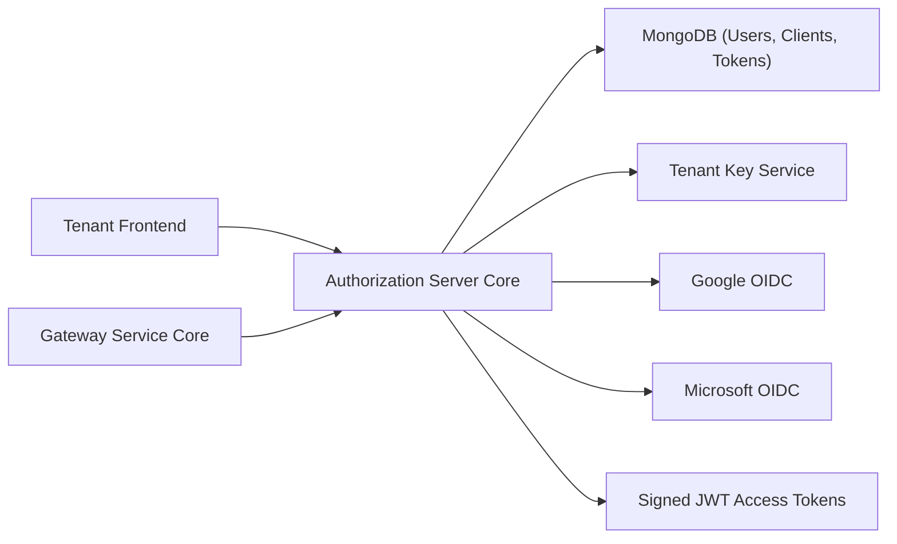
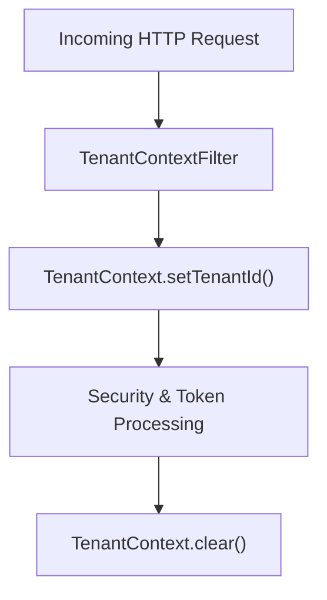
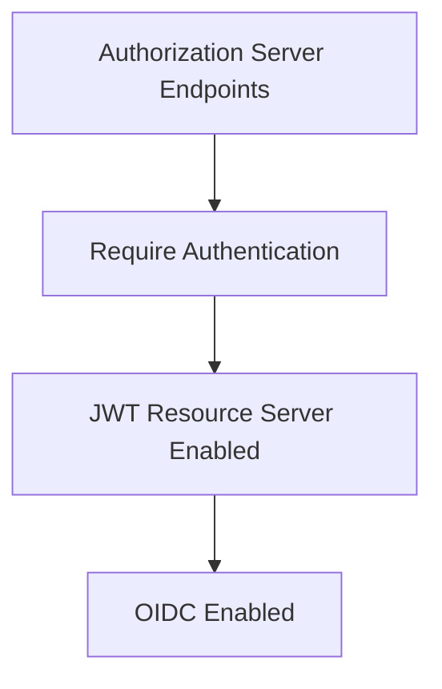
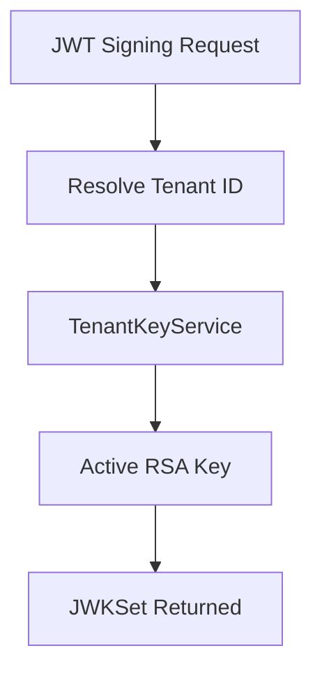
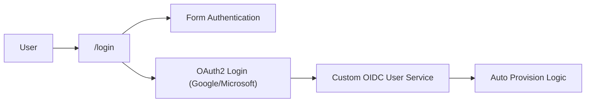
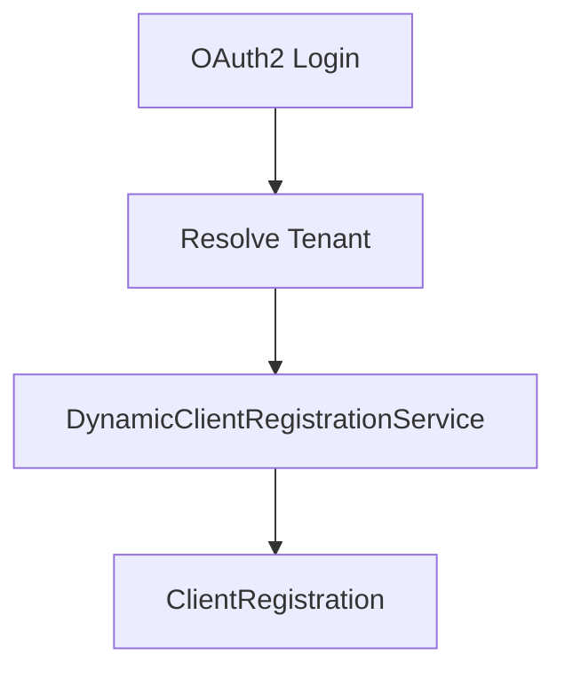
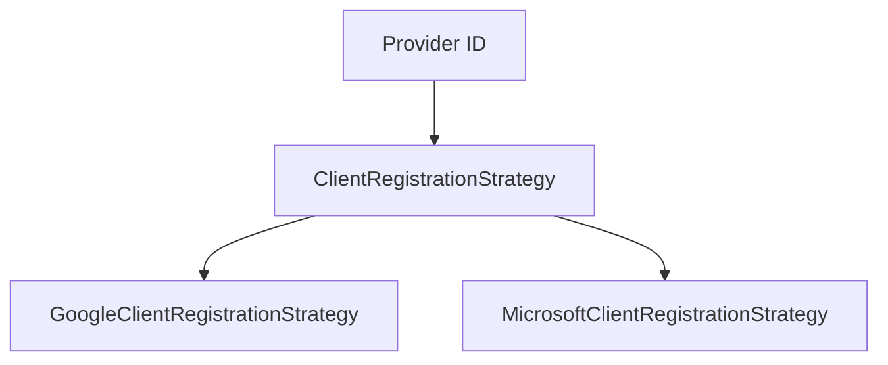
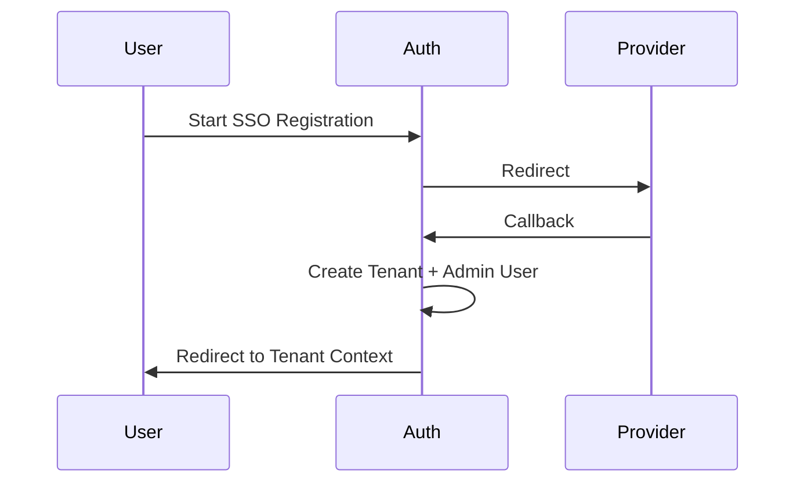
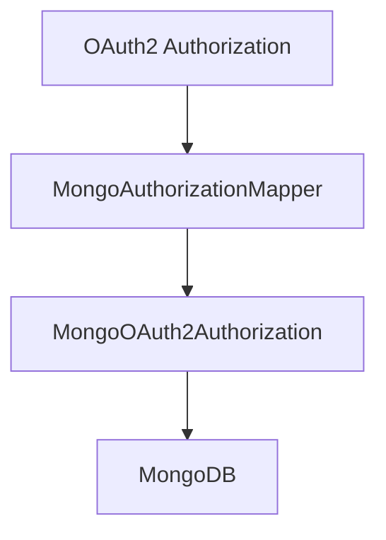
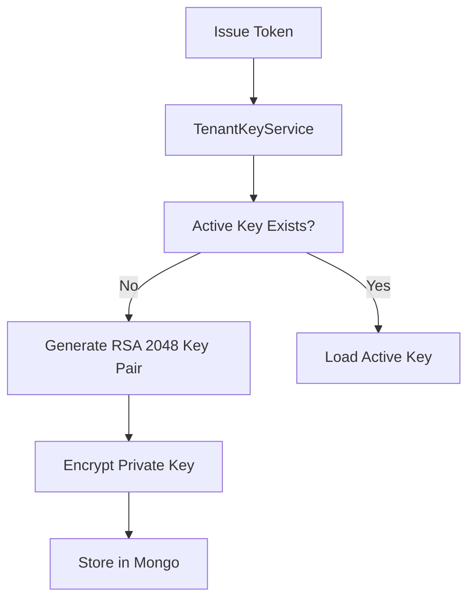

# Authorization Server Core

The **Authorization Server Core** module is the central identity and OAuth2 authorization component of the OpenFrame platform. It is responsible for:

- Multi-tenant OAuth2 / OpenID Connect (OIDC) authorization
- JWT issuance and signing per tenant
- User authentication (form login + SSO)
- Tenant-aware security enforcement
- Client registration and token persistence
- Invitation-based and SSO-based onboarding flows

This module is built on **Spring Authorization Server** and **Spring Security**, extended with strict multi-tenancy, dynamic SSO provider support, and MongoDB-backed token persistence.

---

## 1. Architectural Overview

At a high level, Authorization Server Core sits between frontend clients (tenant UI, BFF, gateway) and downstream services, issuing signed JWT tokens per tenant.



### Core Responsibilities

1. **Tenant Resolution** – Every request is mapped to a tenant context.
2. **OAuth2 Authorization Server** – Handles authorization code, refresh tokens, PKCE.
3. **JWT Customization** – Injects tenant and role claims into access tokens.
4. **SSO Integration** – Google and Microsoft per-tenant OIDC configuration.
5. **User Lifecycle Flows** – Registration, invitations, password reset.
6. **Persistent Authorization Store** – Mongo-backed authorization and client storage.

---

## 2. Multi-Tenant Architecture

Multi-tenancy is enforced at the security and cryptographic layers.

### 2.1 Tenant Context

`TenantContext` uses a `ThreadLocal` to store the current tenant ID.



### 2.2 Tenant Resolution Strategy

`TenantContextFilter` resolves the tenant ID from:

- URL path segment
- `tenant` query parameter
- HTTP session

It ensures:

- Session isolation across tenants
- Safe switching from onboarding pseudo-tenant
- Automatic cleanup after request completion

This guarantees strict separation of:

- Users
- OAuth clients
- Signing keys
- Tokens

---

## 3. OAuth2 Authorization Server Configuration

The `AuthorizationServerConfig` class configures Spring Authorization Server.

### 3.1 Security Filter Chain (Order 1)



Key behaviors:

- OIDC support enabled
- Multiple issuers allowed (multi-tenant)
- JWT-based resource server support
- Custom authentication entry point
- CSRF disabled for auth endpoints

### 3.2 JWT Signing per Tenant

The `jwkSource` bean dynamically serves a JWK based on the current tenant.



Each tenant has:

- Independent RSA key pair
- Unique `kid`
- Encrypted private key storage

---

## 4. JWT Customization

The `OAuth2TokenCustomizer` enriches access tokens with tenant-aware claims.

### Injected Claims

```text
{
  "tenant_id": "tenant-123",
  "userId": "user-abc",
  "roles": ["ADMIN", "USER"]
}
```

Behavior:

- Resolves `AuthUser` by tenant
- Adds effective roles (OWNER implies ADMIN)
- Updates last login on refresh token

This ensures downstream services can:

- Enforce RBAC
- Validate tenant isolation
- Avoid additional user lookups

---

## 5. Default Security Configuration (Non-AS Endpoints)

`SecurityConfig` configures form login and SSO flows.



### Features

- Custom login page
- OAuth2 login with dynamic client resolution
- Microsoft multi-tenant issuer validation
- Auto-provision users from allowed domains
- Domain-based global onboarding fallback

---

## 6. Dynamic Client Registration

`DynamicClientRegistrationRepository` resolves `ClientRegistration` per:

- Provider ID
- Tenant ID



This allows:

- Per-tenant client credentials
- Different redirect URIs
- Custom provider configuration

---

## 7. SSO Providers and Strategies

Supported providers:

- Google
- Microsoft (multi-tenant aware)

### Strategy Pattern



Each strategy:

- Loads default provider configuration
- Applies tenant overrides
- Builds `ClientRegistration`

---

## 8. Registration & Onboarding Flows

### 8.1 Tenant Registration

- `POST /oauth/register`
- `GET /oauth/register/sso`

SSO-based registration uses short-lived HMAC cookies to preserve onboarding state.



### 8.2 Invitation Registration

- `POST /invitations/accept`
- `GET /invitations/accept/sso`

Invite-based SSO flow:

1. Validate invitation
2. Set signed cookie
3. Complete OIDC flow
4. Register user under tenant

---

## 9. Password Reset

Endpoints:

- `POST /password-reset/request`
- `POST /password-reset/confirm`

`ResetTokenUtil` generates secure 256-bit URL-safe tokens.

Password validation enforces:

- Minimum 8 characters
- Uppercase
- Lowercase
- Digit
- Special character

---

## 10. Persistent OAuth2 Storage

### 10.1 Registered Clients

`MongoRegisteredClientRepository` maps between:

- `RegisteredClient`
- `MongoRegisteredClient`

Supports:

- PKCE enforcement
- Token TTL configuration
- Refresh token reuse

### 10.2 Authorization Storage

`MongoAuthorizationService` persists:

- Authorization codes
- Access tokens
- Refresh tokens
- PKCE parameters



PKCE parameters are:

- Stored in authorization metadata
- Rehydrated during token exchange
- Normalized across key naming variations

---

## 11. Tenant Key Management

`TenantKeyService` ensures each tenant has exactly one active RSA signing key.



Private keys are:

- Encrypted at rest
- Decrypted only during signing
- Served via JWKS endpoint per tenant

---

## 12. Authentication Success Handling

`AuthSuccessHandler`:

- Updates last login timestamp
- Marks email verified when asserted by trusted providers
- Delegates to SSO flow handlers

Flow handlers:

- `InviteSsoHandler`
- `TenantRegSsoHandler`

These complete SSO onboarding workflows after successful authentication.

---

## 13. Security Considerations

- Tenant isolation enforced at filter level
- Per-tenant signing keys prevent cross-tenant token replay
- PKCE required for public clients
- Microsoft issuer validation hardened with regex
- Secure, HTTP-only cookies for SSO flows
- ThreadLocal tenant cleared after every request

---

## 14. How It Fits in the Platform

Authorization Server Core acts as:

- Identity provider for Gateway and API services
- Token issuer for frontend and BFF
- Central authority for tenant onboarding
- Security backbone of the OpenFrame multi-tenant architecture

All other services validate JWTs issued by this module and rely on embedded claims for authorization decisions.

---

# Summary

The **Authorization Server Core** module provides:

- Multi-tenant OAuth2 + OIDC
- Dynamic per-tenant SSO configuration
- Secure JWT issuance with custom claims
- Invitation and onboarding workflows
- Mongo-backed authorization persistence
- Per-tenant RSA key management

It is the foundation of identity, tenant isolation, and secure service-to-service communication within OpenFrame.