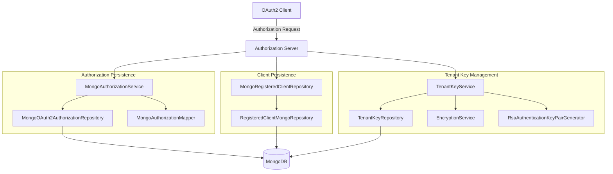
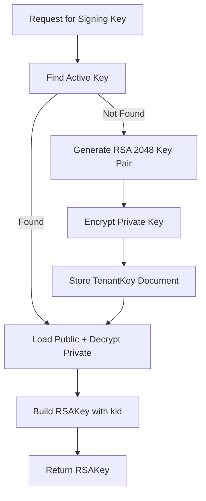
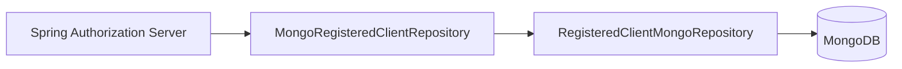
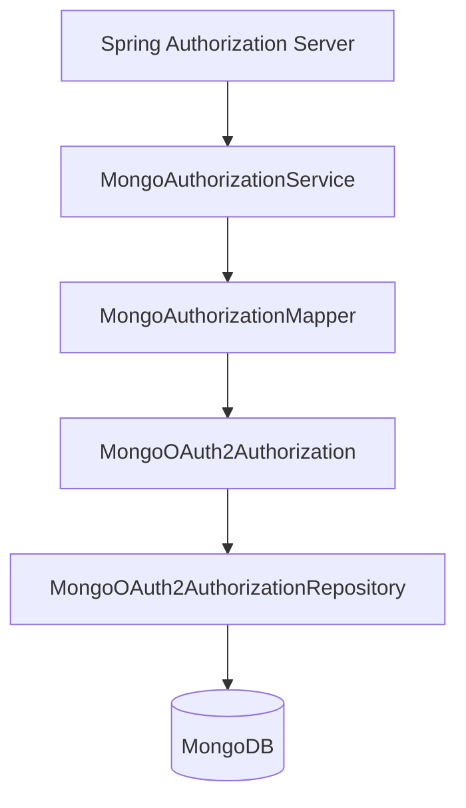
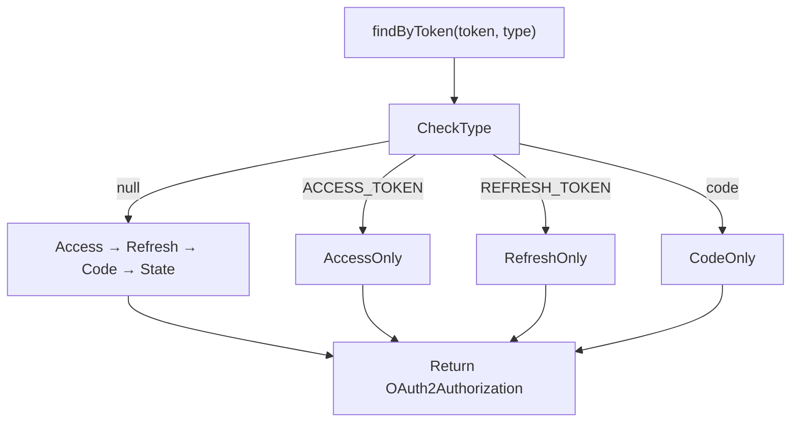
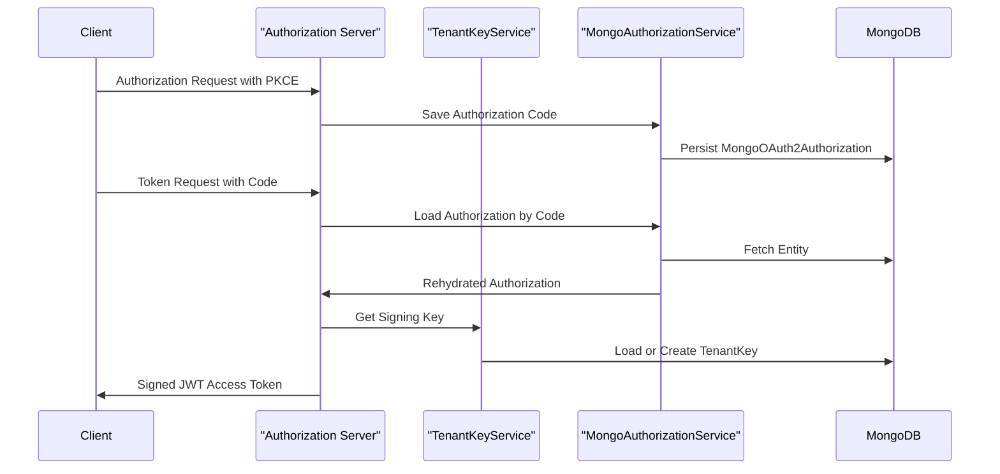

# Authorization Server Keys And Persistence

## Overview

The **Authorization Server Keys And Persistence** module is responsible for:

- Generating and managing per-tenant RSA signing keys
- Persisting OAuth2 clients in MongoDB
- Persisting OAuth2 authorizations (authorization codes, access tokens, refresh tokens)
- Preserving PKCE metadata across the authorization lifecycle

It forms the cryptographic and persistence backbone of the Authorization Server, ensuring:

- Each tenant signs tokens with its own RSA key
- OAuth2 clients are dynamically stored and resolved
- Authorization state survives restarts
- PKCE flows remain secure and standards-compliant

This module works closely with:

- Authorization Server Core And Tenant Context
- Authorization Server Rest Controllers
- Data Mongo Core And Documents
- Data Mongo Repositories

---

## High-Level Architecture

The module is structured into three main concerns:

1. **Tenant Key Management** – RSA key generation and storage
2. **Client Registration Persistence** – OAuth2 client configuration storage
3. **Authorization Persistence** – Tokens and authorization state storage

---

## 1. Tenant Key Management

### Purpose

Each tenant in the system must have its own signing key to:

- Issue JWT access tokens
- Provide JWK metadata
- Isolate cryptographic trust boundaries

The `TenantKeyService` ensures there is always exactly one active signing key per tenant.

### Key Components

- `PemUtil`
- `RsaAuthenticationKeyPairGenerator`
- `TenantKeyService`

### Key Generation Flow

### TenantKeyService

Responsibilities:

- Detect multiple active keys and log warnings
- Generate new RSA 2048 key pairs when needed
- Encrypt private keys before persistence
- Persist keys using `TenantKeyRepository`
- Build `RSAKey` objects (Nimbus JOSE) for signing

Key behaviors:

- Private keys are encrypted using `EncryptionService`
- Public keys are stored in PEM format
- Key IDs are generated as `kid-<uuid>`
- Keys are tenant-scoped

### RsaAuthenticationKeyPairGenerator

- Uses `KeyPairGenerator` with RSA
- 2048-bit key size
- Converts keys to PEM using `PemUtil`
- Returns both raw key objects and PEM strings

### PemUtil

Handles:

- Parsing PEM → `RSAPublicKey` / `RSAPrivateKey`
- Converting RSA keys → PEM format
- Base64 encoding/decoding
- 64-character line wrapping

This utility ensures compatibility with standard X509 (public) and PKCS8 (private) formats.

---

## 2. OAuth2 Client Persistence

### Purpose

The Authorization Server requires persistent storage of registered OAuth2 clients.

`MongoRegisteredClientRepository` acts as an adapter between:

- Spring Authorization Server `RegisteredClient`
- MongoDB document `MongoRegisteredClient`

### Architecture

### MongoRegisteredClientRepository

Implements:

- `RegisteredClientRepository`

Responsibilities:

- Convert `RegisteredClient` → `MongoRegisteredClient`
- Convert `MongoRegisteredClient` → `RegisteredClient`
- Persist authentication methods
- Persist grant types
- Persist redirect URIs and scopes
- Persist token TTL configuration

#### Stored Client Settings

- `requireProofKey`
- `requireAuthorizationConsent`

#### Stored Token Settings

- Access token TTL
- Refresh token TTL
- Reuse refresh tokens flag

This design allows dynamic client registration and runtime rehydration.

---

## 3. OAuth2 Authorization Persistence

### Purpose

The Authorization Server must persist:

- Authorization codes
- Access tokens
- Refresh tokens
- PKCE parameters
- State values

`MongoAuthorizationService` provides a Mongo-backed implementation of `OAuth2AuthorizationService`.

---

## Authorization Persistence Architecture

---

## MongoAuthorizationService

Implements:

- `OAuth2AuthorizationService`

Key operations:

- `save(authorization)`
- `remove(authorization)`
- `findById(id)`
- `findByToken(token, tokenType)`

### Token Lookup Strategy

This flexible resolution ensures compatibility with different validation flows.

---

## MongoAuthorizationMapper

This class handles complex bidirectional mapping between:

- `OAuth2Authorization` (Spring domain model)
- `MongoOAuth2Authorization` (Mongo document)

### Responsibilities

- Persist authorization metadata
- Persist PKCE parameters
- Rehydrate `OAuth2AuthorizationRequest`
- Rebuild token metadata
- Preserve code challenge and method
- Set TTL based on token expiration

### PKCE Preservation

Special handling ensures:

- `code_challenge`
- `code_challenge_method`

are stored in:

- Authorization request additional parameters
- Authorization code metadata

and correctly restored when loading from Mongo.

This guarantees PKCE validation works after server restarts.

---

## Data Model Dependencies

This module relies on MongoDB document models defined in:

- Data Mongo Core And Documents
- Data Mongo Repositories

Key documents:

- `TenantKey`
- `MongoRegisteredClient`
- `MongoOAuth2Authorization`

These provide:

- Tenant-scoped signing keys
- OAuth2 client configuration
- Full token lifecycle persistence

---

## Security Considerations

### Private Key Protection

- Private keys are encrypted before storage
- Decrypted only in memory
- Never exposed externally

### Multi-Tenant Isolation

- Keys are tenant-scoped
- Authorization records reference client ID
- Clients resolved through repository lookup

### PKCE Integrity

- PKCE parameters stored redundantly
- Restored consistently
- Compatible with Authorization Code + PKCE flow

---

## End-to-End Flow Summary

---

## Summary

The **Authorization Server Keys And Persistence** module provides:

- ✅ Per-tenant RSA key lifecycle management
- ✅ Secure private key encryption
- ✅ Mongo-backed OAuth2 client persistence
- ✅ Mongo-backed OAuth2 authorization persistence
- ✅ Robust PKCE metadata preservation
- ✅ Full compatibility with Spring Authorization Server

It is the critical persistence and cryptographic layer that ensures the Authorization Server remains secure, multi-tenant aware, and stateless at runtime while retaining durable authorization state in MongoDB.
