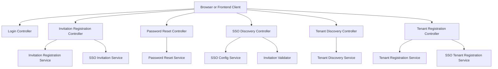
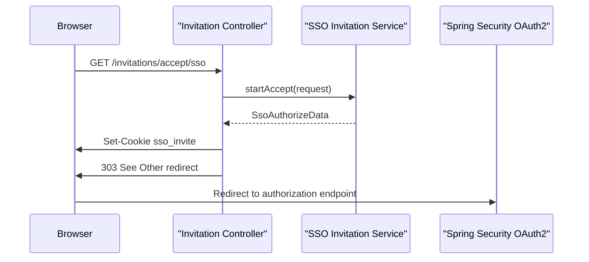
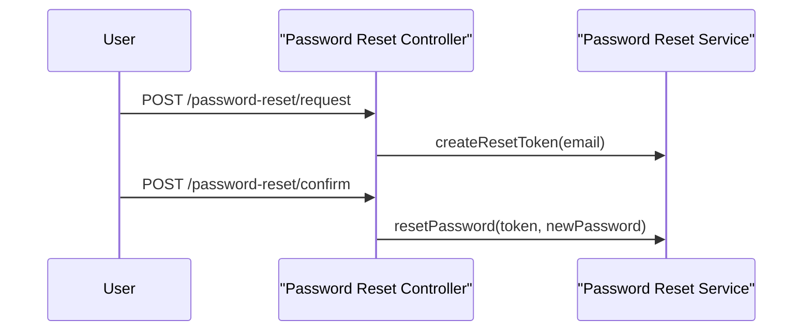
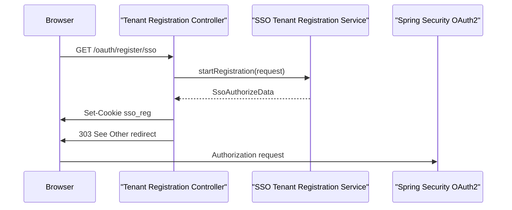
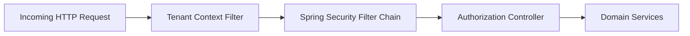

# Authorization Server Rest Controllers

The **Authorization Server Rest Controllers** module exposes the HTTP endpoints that drive authentication, tenant onboarding, invitation acceptance, password reset, and SSO discovery for the OpenFrame multi-tenant Authorization Server.

This module sits at the edge of the Authorization Server service and translates incoming HTTP requests into domain-level operations handled by services in the core authorization modules.

It is part of the Authorization Server application entrypoint:

- `OpenFrameAuthorizationServerApplication` (service-applications-entrypoints)

For core authorization configuration, tenant context handling, and security filter chains, see:

- [Authorization Server Core And Tenant Context](../authorization-server-core-and-tenant-context/authorization-server-core-and-tenant-context.md)

---

## 1. Responsibilities

The Authorization Server Rest Controllers module is responsible for:

- Handling user login view rendering.
- Managing invitation-based user registration.
- Orchestrating SSO-based invitation acceptance.
- Supporting password reset flows.
- Discovering SSO providers (per-tenant and global defaults).
- Discovering tenant context during login.
- Supporting tenant registration (standard and SSO-based).

These controllers are thin HTTP adapters and delegate business logic to services in:

- `authorization-server-sso-and-registration-flow`
- `authorization-server-core-and-tenant-context`
- `authorization-server-keys-and-persistence`
- `data-mongo-core-and-documents`

---

## 2. High-Level Architecture



Each controller focuses on request validation, HTTP concerns (cookies, redirects, status codes), and delegates domain logic to dedicated services.

---

## 3. Controller Overview

### 3.1 Invitation Registration Controller

**Class:** `InvitationRegistrationController`  
**Base Path:** `/invitations`

#### Endpoints

1. `POST /invitations/accept`
   - Accepts an `InvitationRegistrationRequest`.
   - Delegates to `InvitationRegistrationService.registerByInvitation`.
   - Returns an `AuthUser`.

2. `GET /invitations/accept/sso`
   - Accepts `SsoInvitationAcceptRequest` via query parameters.
   - Clears any previous authentication state.
   - Starts SSO-based invitation acceptance via `SsoInvitationService.startAccept`.
   - Sets a short-lived, secure, HTTP-only cookie (`COOKIE_SSO_INVITE`).
   - Responds with a `303 See Other` redirect to the OAuth2 authorization endpoint.

#### SSO Invitation Flow



Key characteristics:

- Secure cookie (`HttpOnly`, `Secure`, path `/`).
- Short TTL based on `cookieTtlSeconds()`.
- Stateless redirect-based SSO orchestration.

---

### 3.2 Login Controller

**Class:** `LoginController`  
**Paths:** `/login`, `/`

This is a traditional Spring MVC controller returning server-rendered views:

- `GET /login`
  - Adds error message when `?error` parameter is present.
  - Injects optional password reset URL from configuration (`openframe.password-reset.page-url`).
  - Returns the `login` view.

- `GET /`
  - Returns a simple `index` view.

This controller integrates with Spring Security’s authentication filter chain defined in the Authorization Server configuration.

---

### 3.3 Password Reset Controller

**Class:** `PasswordResetController`  
**Base Path:** `/password-reset`

#### Endpoints

1. `POST /password-reset/request`
   - Accepts `ResetRequest`.
   - Normalizes email to lowercase.
   - Delegates to `PasswordResetService.createResetToken`.
   - Returns `202 Accepted`.

2. `POST /password-reset/confirm`
   - Accepts `ResetConfirm`.
   - Delegates to `PasswordResetService.resetPassword`.
   - Returns `204 No Content`.

#### Reset Flow



The controller is intentionally minimal and delegates all security-sensitive logic to the service layer.

---

### 3.4 SSO Discovery Controller

**Class:** `SsoDiscoveryController`  
**Base Path:** `/sso/providers`

This controller exposes available SSO providers based on context.

#### Endpoints

1. `GET /sso/providers/invite?invitationId=...`
   - Validates invitation via `InvitationValidator`.
   - Extracts tenant ID from `AuthInvitation`.
   - Returns effective providers via `SSOConfigService.getEffectiveProvidersForTenant`.

2. `GET /sso/providers/registration`
   - Returns global default SSO providers via `SSOConfigService.getDefaultProviders`.

Response type:

```text
ProvidersResponse
  - providers: List<String>
```

This enables frontend clients to dynamically render SSO buttons (e.g., Google, Microsoft) depending on tenant or global configuration.

---

### 3.5 Tenant Discovery Controller

**Class:** `TenantDiscoveryController`  
**Base Path:** `/tenant`

#### Endpoint

- `GET /tenant/discover?email=...`
  - Validates email format.
  - Normalizes to lowercase.
  - Delegates to `TenantDiscoveryService.discoverTenantForEmail`.
  - Returns `TenantDiscoveryResponse`.

This endpoint powers the multi-tenant login flow, where the system determines:

- Which tenant the user belongs to.
- Which authentication mechanisms (password, SSO providers) are available.

---

### 3.6 Tenant Registration Controller

**Class:** `TenantRegistrationController`  
**Base Path:** `/oauth`

#### Endpoints

1. `POST /oauth/register`
   - Accepts `TenantRegistrationRequest`.
   - Delegates to `TenantRegistrationService.registerTenant`.
   - Returns created `Tenant`.

2. `GET /oauth/register/sso`
   - Accepts `SsoTenantRegistrationInitRequest`.
   - Clears previous authentication state.
   - Starts SSO-based tenant registration via `SsoTenantRegistrationService.startRegistration`.
   - Sets secure, HTTP-only cookie (`COOKIE_SSO_REG`).
   - Redirects to OAuth2 authorization endpoint.

#### SSO Tenant Registration Flow



This mirrors the invitation SSO flow but targets tenant onboarding instead of user invitation acceptance.

---

## 4. Multi-Tenant and Security Context Integration

The Authorization Server Rest Controllers module operates within a multi-tenant context:



Key aspects:

- Tenant resolution is handled before controller invocation.
- SSO flows rely on short-lived HMAC-backed cookies.
- Controllers use `clearAuthState` to prevent stale authentication artifacts.
- Redirects use `seeOther` (HTTP 303) for proper OAuth2 transitions.

---

## 5. Error Handling and HTTP Semantics

The module carefully uses HTTP semantics:

- `200 OK` for successful synchronous operations.
- `202 Accepted` for asynchronous password reset token creation.
- `204 No Content` for successful reset confirmation.
- `303 See Other` for SSO redirect flows.

Validation is handled through:

- `@Valid` on request bodies.
- Constraint annotations like `@Email` and `@NotBlank`.

Security-sensitive operations are delegated to services rather than implemented in controllers.

---

## 6. How This Module Fits in the Overall System

The Authorization Server Rest Controllers module:

- Provides the public authentication and onboarding surface of OpenFrame.
- Bridges frontend clients (e.g., login UI, onboarding UI) and the authorization core.
- Coordinates OAuth2, SSO providers, and tenant context.
- Works closely with:
  - Authorization Server Core And Tenant Context (security and tenant filters)
  - Authorization Server SSO And Registration Flow (SSO orchestration and policies)
  - Data Mongo Core And Documents (users, tenants, invitations)

It is a critical boundary layer that ensures:

- Clean separation of HTTP concerns from business logic.
- Secure cookie and redirect handling for OAuth2.
- Multi-tenant-aware authentication and onboarding flows.

---

## 7. Design Principles

- **Thin Controllers:** Minimal logic, delegate to services.
- **Explicit HTTP Semantics:** Clear status codes and redirect usage.
- **Secure-by-Default Cookies:** `HttpOnly`, `Secure`, path-scoped.
- **Tenant-Aware Flows:** Invitation and registration dynamically adapt to tenant configuration.
- **Extensible SSO:** Provider discovery decoupled from controller logic.

This structure keeps the Authorization Server modular, testable, and aligned with Spring Security and OAuth2 best practices in a multi-tenant SaaS environment.
