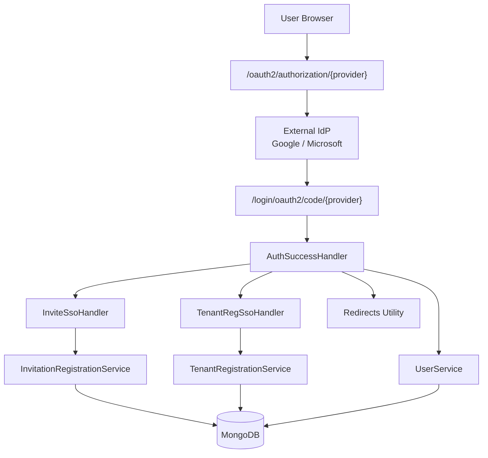
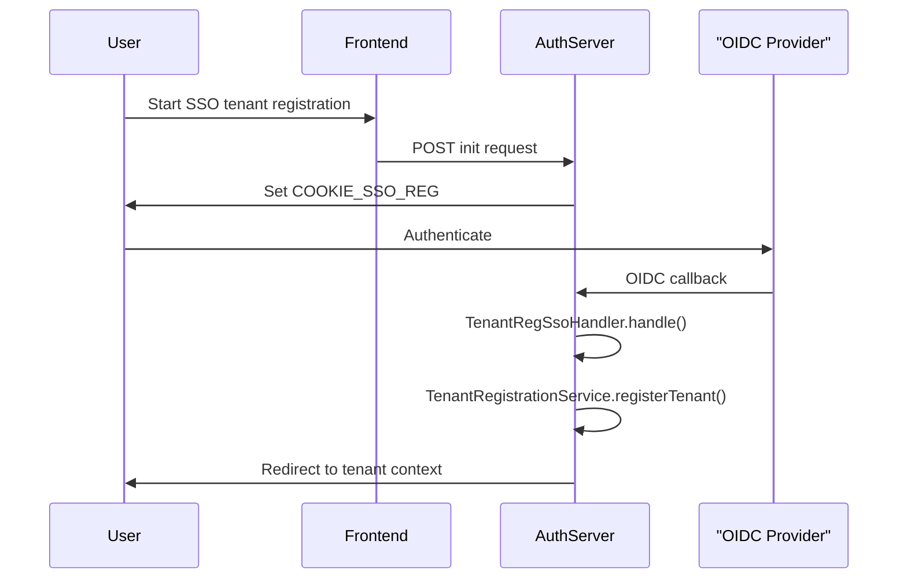
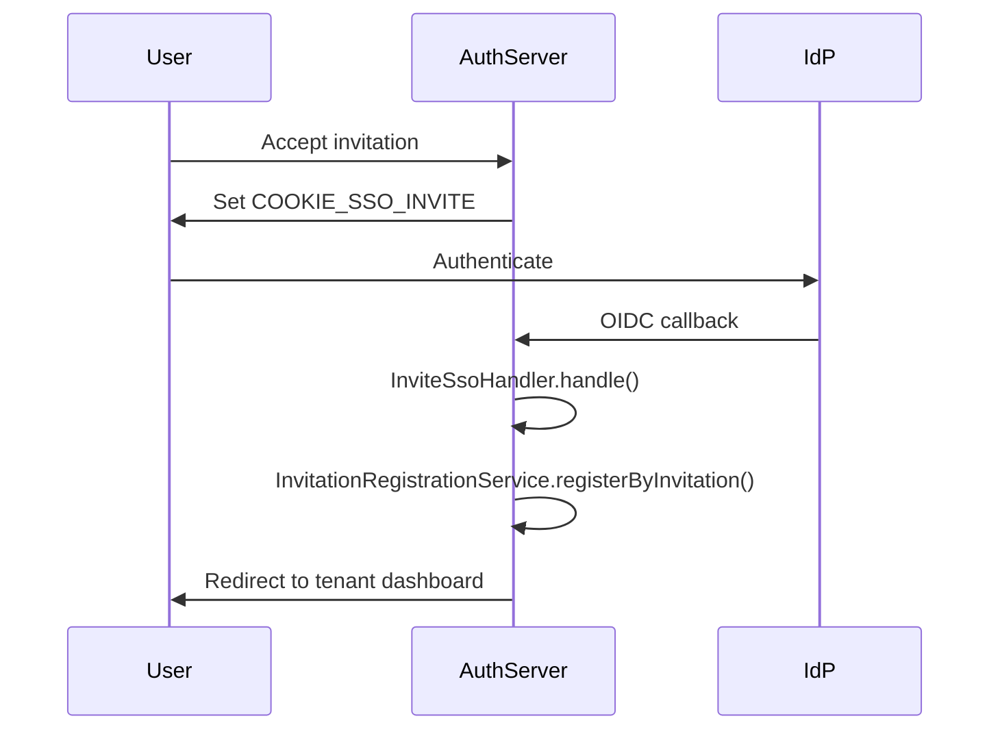
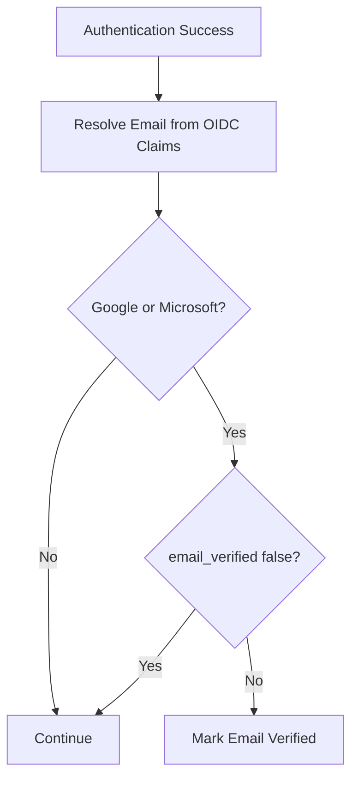
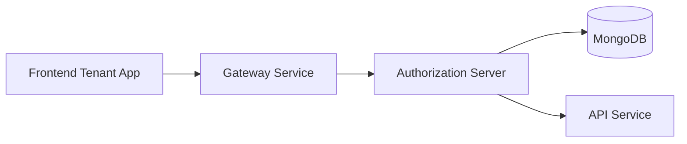

# Authorization Server Sso And Registration Flow

The **Authorization Server Sso And Registration Flow** module orchestrates multi-tenant user onboarding, Single Sign-On (SSO) integration, invitation-based registration, tenant self-registration, and password reset flows within the OpenFrame Authorization Server.

It acts as the glue between:

- Spring Security OAuth2 / OIDC authentication
- Tenant-aware context resolution
- Mongo-backed user and tenant persistence
- Customizable registration and lifecycle processors
- Frontend-driven onboarding and redirect flows

This module does not operate in isolation. It builds on:

- Authorization Server Core And Tenant Context
- Authorization Server Rest Controllers
- Authorization Server Keys And Persistence
- Data Mongo Core And Documents

---

## 1. High-Level Responsibilities

The Authorization Server Sso And Registration Flow module is responsible for:

1. Handling SSO-based tenant registration (Google, Microsoft)
2. Handling SSO-based invitation acceptance
3. Managing password reset requests and confirmations
4. Supporting multi-tenant registration with domain validation
5. Updating login metadata and email verification state
6. Providing extension hooks for custom registration logic
7. Managing secure cookies and post-authentication redirects

---

## 2. Architecture Overview



### Key Concepts

- **Tenant-aware authentication**: Every flow runs inside a resolved Tenant Context.
- **Cookie-driven SSO flow orchestration**: Temporary SSO cookies determine which post-login handler executes.
- **Extensible processors**: Registration and lifecycle events can be customized via strategy interfaces.
- **OIDC claim normalization**: Email resolution works across Google and Microsoft providers.

---

## 3. Core Flow Categories

### 3.1 Tenant Self-Registration (SSO-Based)

Handled by:

- `SsoTenantRegistrationInitRequest`
- `TenantRegSsoHandler`
- `TenantRegistrationRequest`
- `DefaultRegistrationProcessor`

Flow:



Key behaviors:

- Extract email via `OidcUserUtils.resolveEmail()`.
- Normalize tenant domain to lowercase.
- Generate random internal password for SSO users.
- Clear SSO cookie after successful registration.
- Execute optional pre/post registration hooks via `RegistrationProcessor`.

---

### 3.2 Invitation-Based Registration (SSO)

Handled by:

- `InvitationRegistrationRequest`
- `SsoInvitationAcceptRequest`
- `InviteSsoHandler`
- `DefaultRegistrationProcessor`

Flow:



Notable details:

- Invitation ID is embedded in secure SSO cookie.
- User names are derived from OIDC claims.
- Password is randomly generated (SSO-managed account).
- Optional `switchTenant` flag enables cross-tenant onboarding.

---

### 3.3 Password Reset Flow

DTOs:

- `PasswordResetDtos.ResetRequest`
- `PasswordResetDtos.ResetConfirm`
- `ResetTokenUtil`

Password policy (enforced via annotations):

- Minimum 8 characters
- At least one uppercase letter
- At least one lowercase letter
- At least one digit
- At least one special character

Token generation:

```text
- 32 random bytes
- SecureRandom source
- Base64 URL-safe encoding
- No padding
```

Security characteristics:

- Cryptographically strong reset token
- Stateless token format (opaque string)
- Validation and expiration handled in service layer

---

## 4. Authentication Success Orchestration

`AuthSuccessHandler` is the central post-login coordinator.

Responsibilities:

1. Update `lastLogin` timestamp
2. Conditionally mark email as verified for trusted IdPs
3. Delegate to SSO registration success handler

### Email Verification Logic

For Google and Microsoft:

- If `email_verified` claim exists and is false → do not verify
- If claim is true or absent for trusted provider → mark verified



---

## 5. SSO Provider Strategy Model

Client registration strategies:

- `GoogleClientRegistrationStrategy`
- `MicrosoftClientRegistrationStrategy`

Default provider configurations:

- `GoogleDefaultProviderConfig`
- `MicrosoftDefaultProviderConfig`

Design principles:

- Provider-specific configuration encapsulated behind strategy abstraction
- Tenant-specific SSO configuration resolved dynamically
- Default credentials available when tenant overrides are absent

---

## 6. Tenant Discovery & Availability

DTOs:

- `TenantDiscoveryResponse`
- `TenantAvailabilityResponse`

These enable:

- Discovering existing accounts by email
- Identifying available auth providers per tenant
- Checking tenant domain availability
- Suggesting alternative tenant URLs

This supports smart login UX in the frontend.

---

## 7. Cookie & Redirect Utilities

### SSO Flow Cookies

Defined in `SsoRegistrationConstants`:

```text
COOKIE_SSO_REG
COOKIE_SSO_INVITE
ONBOARDING_TENANT_ID
```

These cookies:

- Encode temporary SSO context
- Are cleared after successful processing
- Preserve OAuth session continuity

### Redirect Handling

`Redirects` utility provides:

- 302 (Found)
- 303 (See Other)
- Root-level redirect helper

### Auth State Cleanup

`AuthStateUtils`:

- Invalidates session
- Clears `JSESSIONID`
- Ensures secure cookie flags

---

## 8. Extension & Customization Points

The module is designed for override via Spring conditional beans:

- `RegistrationProcessor`
- `UserDeactivationProcessor`
- `UserEmailVerifiedProcessor`
- `GlobalDomainPolicyLookup`

Default implementations are no-op and activated only when no custom bean exists.

This allows:

- Custom onboarding logic
- Domain-based auto-tenant resolution
- Email verification side effects
- External provisioning integration

---

## 9. Integration Within the Platform



The Authorization Server Sso And Registration Flow module:

- Establishes identity and tenant context
- Issues OAuth2 tokens
- Ensures users are properly provisioned
- Bridges external identity providers with internal multi-tenant data model

---

## 10. Summary

The **Authorization Server Sso And Registration Flow** module is the identity onboarding backbone of OpenFrame.

It provides:

- Secure SSO onboarding
- Multi-tenant registration
- Invitation-based user creation
- Password reset mechanisms
- Extensible lifecycle hooks
- OIDC claim normalization
- Safe cookie and redirect orchestration

By separating flow orchestration, provider strategy, tenant resolution, and persistence integration, this module enables flexible enterprise-grade authentication while preserving strict tenant isolation and security guarantees.
