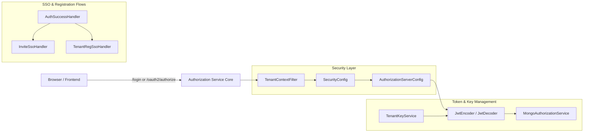
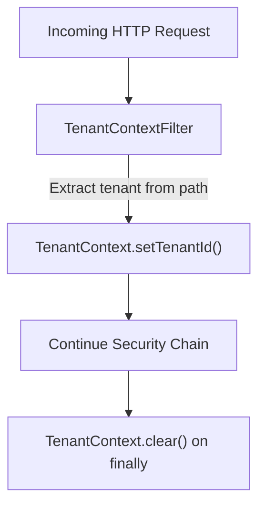
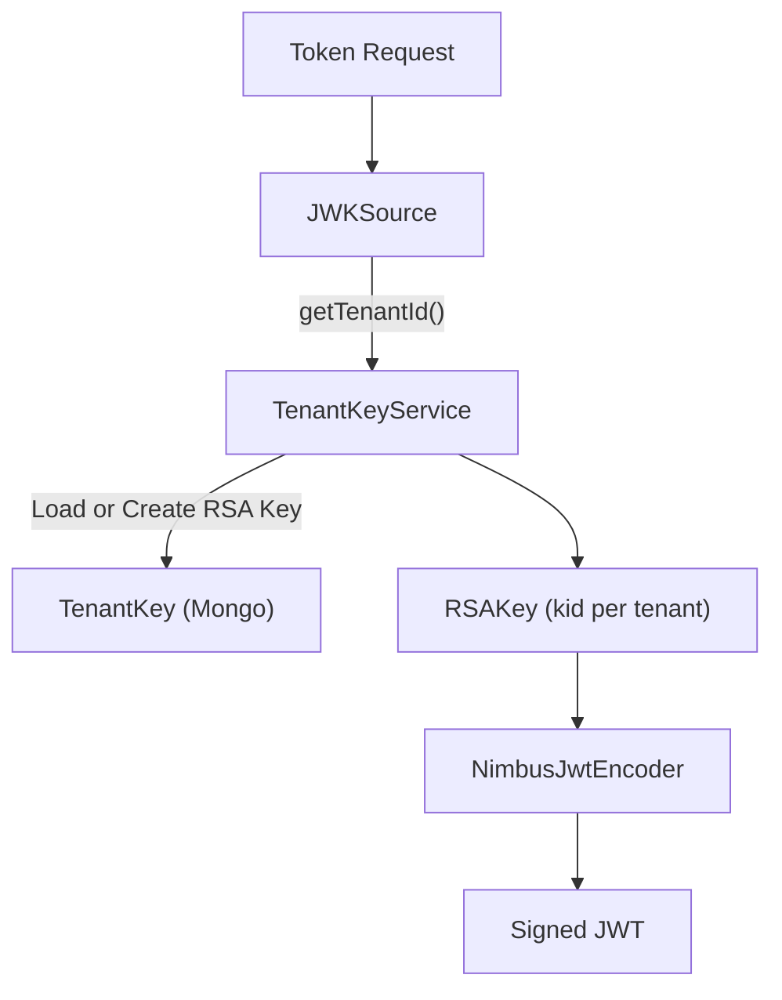
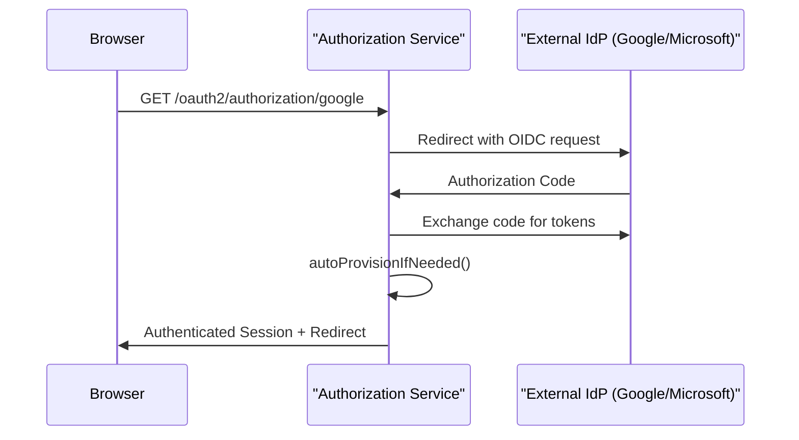
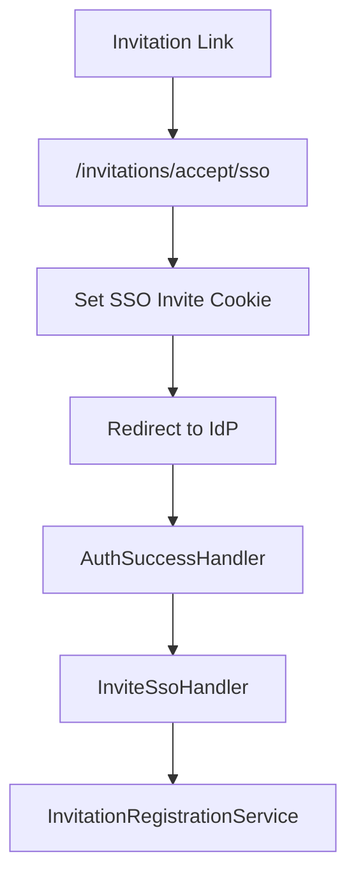
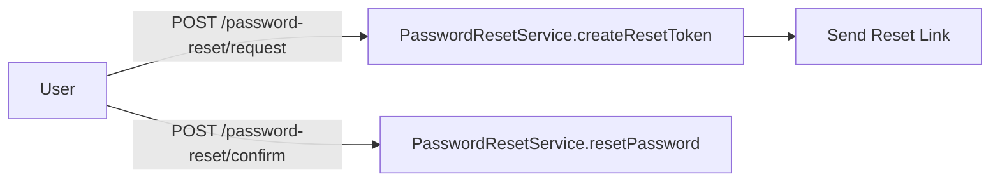

# Authorization Service Core

The **Authorization Service Core** module is the heart of OpenFrame’s multi-tenant identity and OAuth2 infrastructure. It implements a fully-fledged OAuth2 Authorization Server with OpenID Connect (OIDC) support, multi-tenant isolation, SSO integration (Google, Microsoft), invitation-based onboarding, and tenant-aware JWT issuance.

This module powers the `OpenFrameAuthorizationServerApplication` and integrates with MongoDB (via data-mongo-core), Spring Authorization Server, and tenant-specific key management.

---

## 1. Purpose and Responsibilities

The Authorization Service Core is responsible for:

- ✅ OAuth2 Authorization Server (Authorization Code + PKCE, Refresh Token)
- ✅ OpenID Connect (OIDC) support
- ✅ Multi-tenant authentication and token isolation
- ✅ Tenant-scoped JWT signing keys
- ✅ SSO integration (Google & Microsoft)
- ✅ Invitation-based registration
- ✅ Tenant self-registration (password & SSO)
- ✅ Password reset flows
- ✅ Token persistence in MongoDB

It acts as the **identity provider (IdP)** for the OpenFrame platform.

---

## 2. High-Level Architecture



---

## 3. Multi-Tenancy Model

Multi-tenancy is enforced at **authentication, token, and key levels**.

### 3.1 Tenant Context

Core components:

- `TenantContext`
- `TenantContextFilter`

The tenant ID is resolved from:

- URL path prefix (e.g. `/tenantA/oauth2/authorize`)
- Query parameter (`tenant`)
- HTTP session



The tenant ID is stored in a `ThreadLocal`, ensuring isolation per request.

---

## 4. OAuth2 Authorization Server

Core configuration:

- `AuthorizationServerConfig`
- `MongoAuthorizationService`
- `MongoRegisteredClientRepository`
- `MongoAuthorizationMapper`

### 4.1 Security Filter Chains

Two filter chains are defined:

1. **Authorization Server Chain (Order 1)**  
   Handles `/oauth2/**`, `/connect/**`, OIDC endpoints.
2. **Default Security Chain (Order 2)**  
   Handles login, SSO, invitations, password reset, tenant discovery.

### 4.2 JWT Issuance Per Tenant

Each tenant has its own RSA signing key:

- `TenantKeyService`
- `RsaAuthenticationKeyPairGenerator`
- `PemUtil`



If no active key exists for a tenant, one is generated automatically and stored encrypted.

---

## 5. JWT Customization

The `OAuth2TokenCustomizer` in `AuthorizationServerConfig` adds:

- `tenant_id`
- `userId`
- `roles`

Role handling:

- `OWNER` automatically implies `ADMIN`

This ensures downstream services (Gateway, API Service Core) can authorize requests based on embedded claims.

---

## 6. SSO (Google & Microsoft)

Core components:

- `SecurityConfig`
- `GoogleClientRegistrationStrategy`
- `MicrosoftClientRegistrationStrategy`
- `GoogleDefaultProviderConfig`
- `MicrosoftDefaultProviderConfig`
- `OidcUserUtils`

### 6.1 OIDC Flow



### 6.2 Microsoft Multi-Tenant Validation

A custom `JwtDecoderFactory` validates Microsoft issuers against:

```text
^https://login\.microsoftonline\.com/[^/]+/v2\.0/?$
```

This allows Azure AD multi-tenant apps while preventing invalid issuers.

---

## 7. Auto-Provisioning & Domain Policies

During SSO login:

- If tenant has SSO enabled
- If auto-provision is enabled
- If email domain matches allowed domains

Then:

- A new user is created automatically
- `RegistrationProcessor.postProcessAutoProvision()` is triggered

If no tenant SSO config exists:

- `GlobalDomainPolicyLookup` may map domains to tenants
- `NoopGlobalDomainPolicyLookup` is default fallback

---

## 8. Invitation-Based Registration

Controller:

- `InvitationRegistrationController`

Supports:

- Password-based acceptance
- SSO-based acceptance



A short-lived HMAC cookie binds the SSO flow to the invitation context.

---

## 9. Tenant Self-Registration

Controller:

- `TenantRegistrationController`

Supports:

- Password-based tenant creation
- SSO-based onboarding

During SSO onboarding:

- `COOKIE_SSO_REG` is set
- `TenantRegSsoHandler` finalizes tenant creation
- User is created as initial admin

The onboarding tenant context is temporarily set to:

```text
sso-onboarding
```

Defined in `SsoRegistrationConstants.ONBOARDING_TENANT_ID`.

---

## 10. Password Reset

Controller:

- `PasswordResetController`

Flow:



Reset tokens are generated via `ResetTokenUtil` using a cryptographically secure random generator.

---

## 11. Token Persistence (MongoDB)

Core components:

- `MongoAuthorizationService`
- `MongoAuthorizationMapper`

Features:

- Stores Authorization Code
- Access Token
- Refresh Token
- PKCE parameters
- OAuth2AuthorizationRequest snapshot

PKCE parameters are preserved and normalized across:

- `code_challenge`
- `code_challenge_method`

This ensures correct validation during token exchange.

---

## 12. Authentication Success Handling

`AuthSuccessHandler`:

On successful login:

1. Updates `lastLogin`
2. Marks email verified (if asserted by IdP)
3. Delegates to SSO flow handlers

This ensures consistent audit and onboarding behavior.

---

## 13. Extension Points

The module is highly extensible using conditional beans:

- `RegistrationProcessor`
- `UserDeactivationProcessor`
- `UserEmailVerifiedProcessor`
- `GlobalDomainPolicyLookup`

Default implementations are no-ops and can be overridden.

---

## 14. Interaction with Other Modules

Within the OpenFrame platform:

- Issues JWTs consumed by the Gateway Service Core
- Uses Mongo repositories from Data Mongo Core
- Supports OAuth BFF flows from Security OAuth Core
- Serves frontend applications from Frontend Tenant App Core

The Authorization Service Core is the **trust anchor** of the platform — all identity, tokens, and tenant isolation originate here.

---

# Conclusion

The **Authorization Service Core** provides a robust, multi-tenant OAuth2 and OIDC infrastructure with:

- Per-tenant cryptographic isolation
- Pluggable SSO providers
- Invitation-based onboarding
- Secure PKCE handling
- Extensible registration lifecycle hooks

It is the foundational identity service powering secure communication across all OpenFrame services.