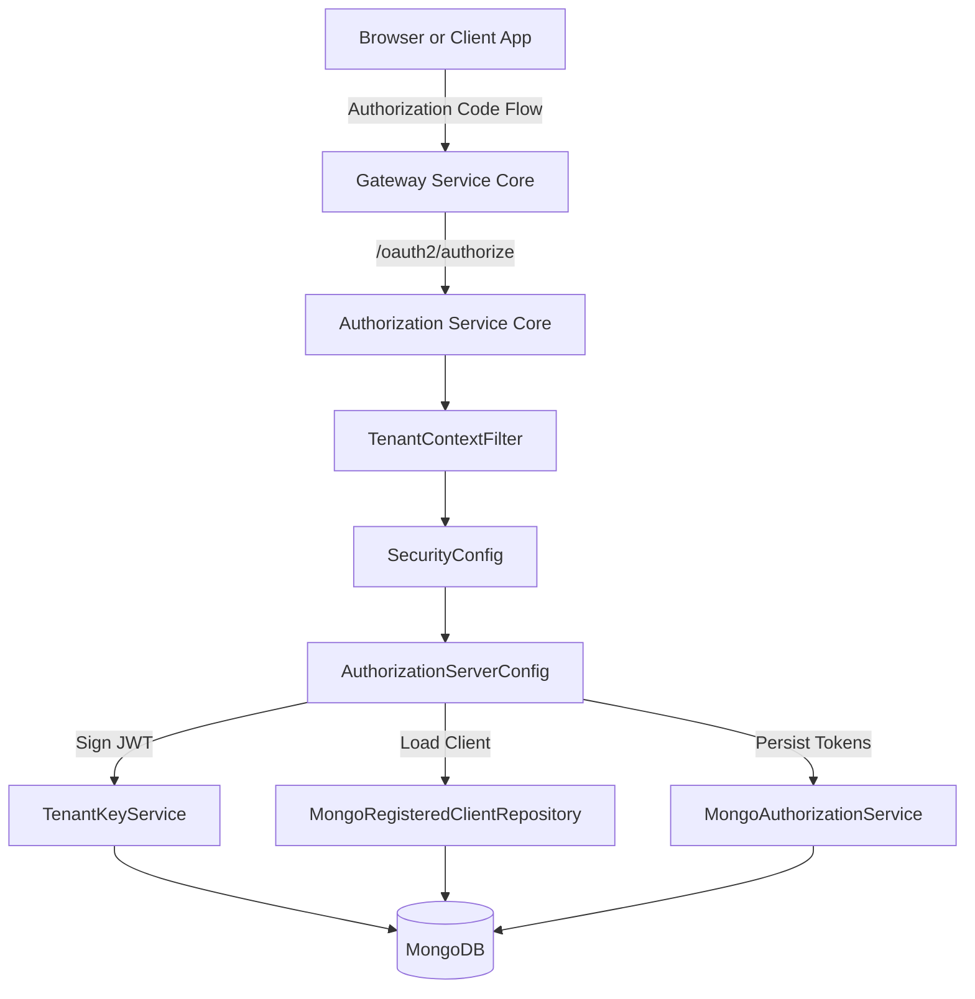
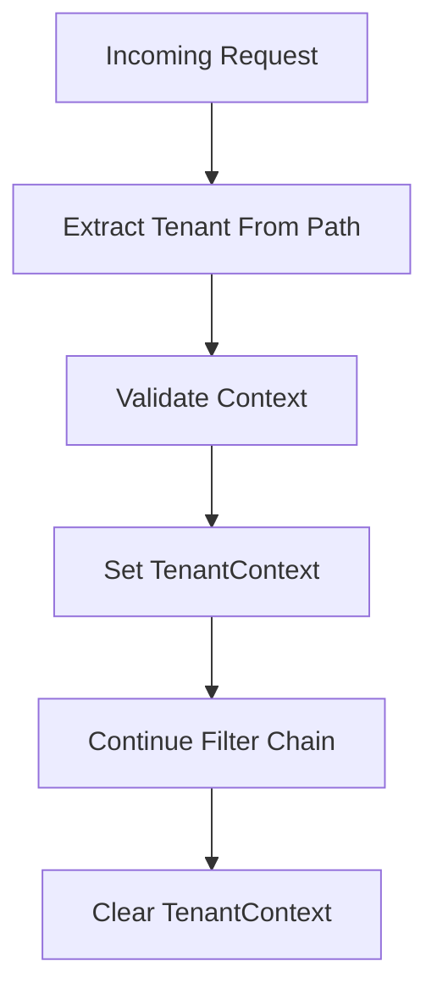
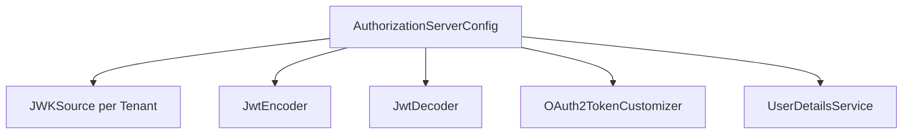
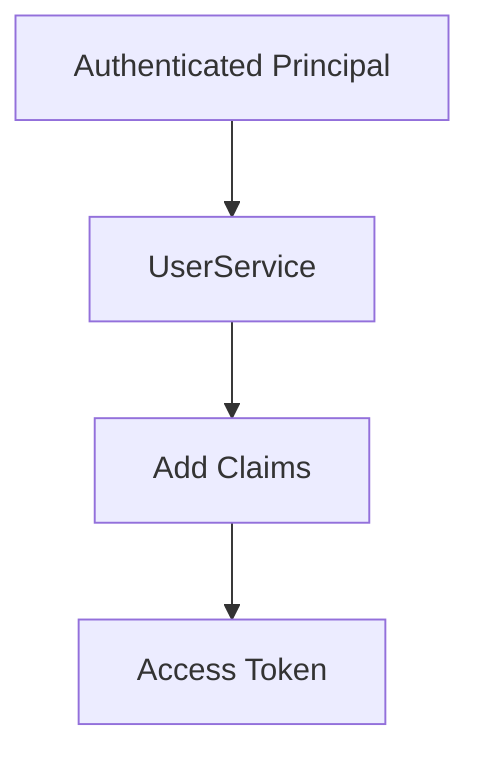
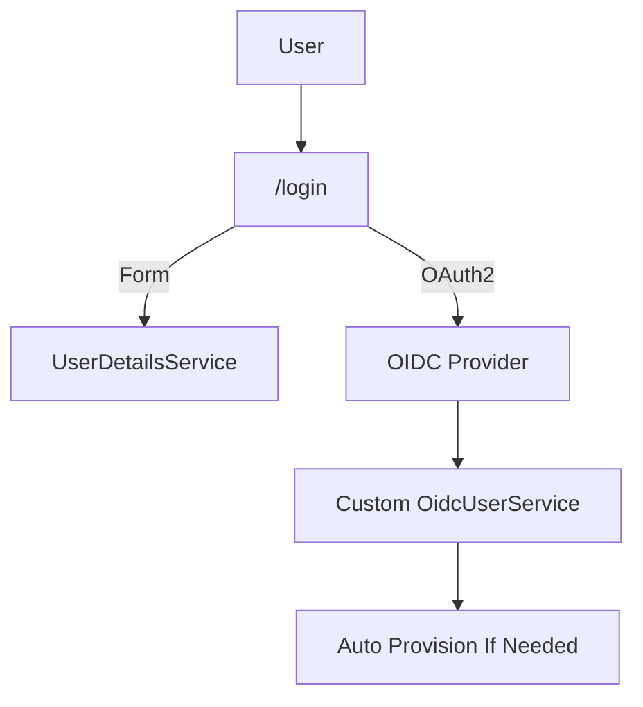
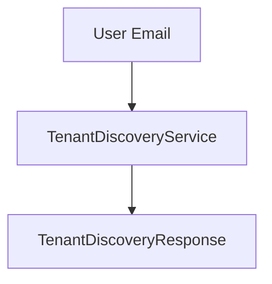
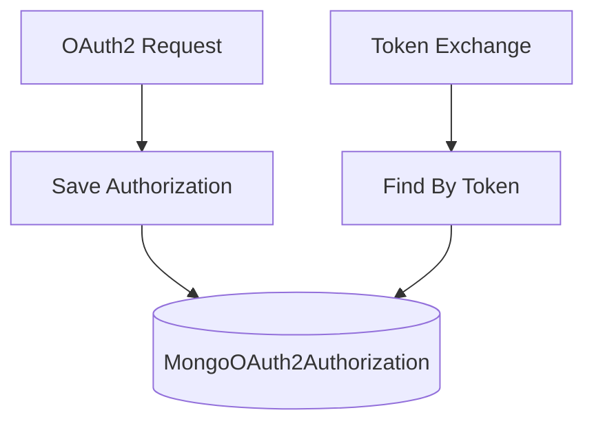
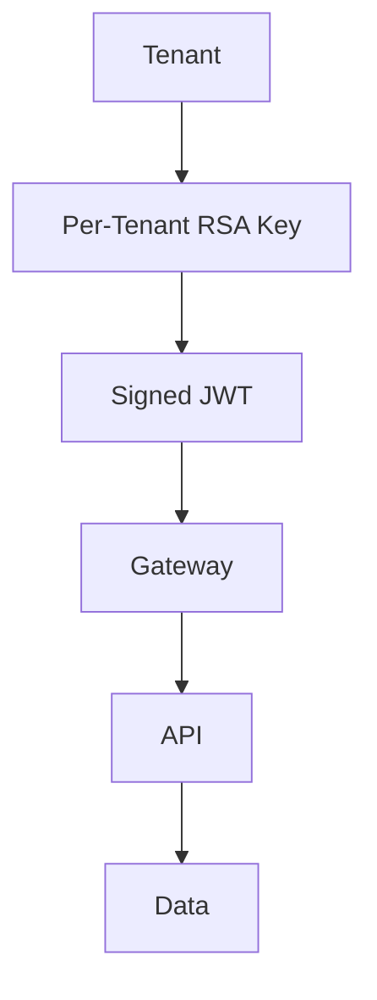

# Authorization Service Core

The **Authorization Service Core** module provides the multi-tenant OAuth2 Authorization Server for the OpenFrame platform. It is responsible for:

- Issuing OAuth2 and OIDC tokens
- Managing tenant-aware authentication
- Handling SSO (OIDC) integrations per tenant
- Supporting tenant discovery and registration
- Managing signing keys and token persistence

This module is the security backbone of the platform and integrates with:

- [Gateway Service Core](../gateway-service-core/gateway-service-core.md)
- [API Service Core](../api-service-core/api-service-core.md)
- [Data Layer Mongo](../data-layer-mongo/data-layer-mongo.md)

---

## 1. Architectural Overview

The Authorization Service Core is built on **Spring Authorization Server** and extended with strict multi-tenant support.

### Key Characteristics

- ✅ Multi-issuer support (`multipleIssuersAllowed(true)`)
- ✅ Per-tenant RSA signing keys
- ✅ OIDC login with Microsoft and custom providers
- ✅ Token customization with tenant and role claims
- ✅ PKCE support
- ✅ Auto-provisioning for SSO users

---

## 2. Multi-Tenant Context Resolution

Multi-tenancy is enforced using a thread-local tenant context.

### TenantContext

- Stores the current tenant ID in a `ThreadLocal`
- Accessible via `TenantContext.getTenantId()`
- Cleared after each request

### TenantContextFilter

The `TenantContextFilter` extracts the tenant from:

1. URL path prefix (`/{tenant}/oauth2/...`)
2. Query parameter (`?tenant=...`)
3. HTTP session

### Session Switching Protection

If a request attempts to switch tenants mid-session:

- The session is invalidated
- Except when switching from onboarding tenant to real tenant

This prevents cross-tenant privilege escalation.

---

## 3. OAuth2 Authorization Server Configuration

### AuthorizationServerConfig

Configures Spring Authorization Server with:

- OIDC enabled
- Multiple issuers
- JWT encoder and decoder
- Custom token claims
- Custom `AuthenticationManager`

### Per-Tenant JWK Source

`TenantKeyService` dynamically provides the active RSA key for the current tenant.

If no key exists:

- A new RSA key pair is generated
- Private key is encrypted
- Key is persisted in MongoDB

This enables:

- Isolated signing keys per tenant
- Future key rotation support
- Independent trust domains

---

## 4. Token Customization

The `OAuth2TokenCustomizer` enriches access tokens with:

- `tenant_id`
- `userId`
- `roles`

Role logic:

- If user has `OWNER`, `ADMIN` is automatically added

This ensures downstream services (such as the API Service Core) can:

- Authorize requests without additional lookups
- Enforce tenant-level boundaries

---

## 5. Default Security Configuration

### SecurityConfig

Handles all non-authorization-server endpoints.

Responsibilities:

- Form login
- OAuth2 login
- Custom failure handling
- Microsoft multi-tenant issuer validation
- Auto-provisioning users

### Microsoft Issuer Handling

Microsoft multi-tenant login requires relaxed issuer validation. The module:

- Uses custom `JwtDecoderFactory`
- Validates issuer via regex pattern
- Applies additional token validators

---

## 6. Registration & Onboarding Flows

The Authorization Service Core supports multiple onboarding scenarios.

### 6.1 Tenant Registration

Endpoint: `POST /oauth/register`

Handled by `TenantRegistrationController`

Supports:

- Email + password registration
- Organization name validation
- Domain validation
- Access codes

SSO-based registration:

1. Start SSO
2. Store short-lived HMAC cookie
3. Redirect to provider
4. Finalize tenant creation

---

### 6.2 Invitation Registration

Endpoint: `POST /invitations/accept`

Allows invited users to:

- Register into existing tenant
- Accept via SSO

`InvitationRegistrationController` coordinates:

- Invitation validation
- User creation
- SSO onboarding continuation

---

### 6.3 Tenant Discovery

Endpoint: `GET /tenant/discover?email=...`

Returns:

- Whether accounts exist
- Associated tenant ID
- Available auth providers

DTO: `TenantDiscoveryResponse`

This powers the returning-user experience.

---

### 6.4 Password Reset

Endpoints:

- `POST /password-reset/request`
- `POST /password-reset/confirm`

Handled by `PasswordResetController`.

Flow:

1. Create reset token
2. Confirm with token
3. Update password using BCrypt encoder

---

## 7. OAuth2 Client & Token Persistence

### MongoRegisteredClientRepository

Persists OAuth2 clients in MongoDB.

Stores:

- Client ID & secret
- Grant types
- Redirect URIs
- PKCE requirements
- Token TTL settings

---

### MongoAuthorizationService

Implements `OAuth2AuthorizationService`.

Handles:

- Storing authorization codes
- Persisting access and refresh tokens
- Retrieving by token value
- PKCE metadata tracking

---

## 8. Extensibility via RegistrationProcessor

`DefaultRegistrationProcessor` provides extension hooks:

- `preProcessTenantRegistration`
- `postProcessTenantRegistration`
- `postProcessInvitationRegistration`
- `postProcessAutoProvision`

If a custom bean implementing `RegistrationProcessor` is provided, it overrides the default.

This enables:

- Custom welcome workflows
- Provisioning external resources
- Integrating billing systems

---

## 9. Integration With Other Modules

### Gateway Service Core

- Validates JWT access tokens
- Routes authenticated requests
- Injects tenant-aware headers

See: [Gateway Service Core](../gateway-service-core/gateway-service-core.md)

### API Service Core

- Consumes JWT claims
- Enforces tenant-level authorization
- Applies role-based access control

See: [API Service Core](../api-service-core/api-service-core.md)

### Data Layer Mongo

- Stores users
- Stores tenants
- Stores OAuth2 clients
- Stores authorizations
- Stores tenant signing keys

See: [Data Layer Mongo](../data-layer-mongo/data-layer-mongo.md)

---

## 10. Security Model Summary

Core Guarantees:

- Strict tenant isolation
- Per-tenant signing keys
- Session isolation
- Role-based authorization
- Secure password hashing (BCrypt)
- Secure cookie handling for SSO

---

# Conclusion

The **Authorization Service Core** module is a fully multi-tenant OAuth2 and OIDC Authorization Server tailored for OpenFrame. It provides:

- Secure authentication
- Tenant-aware token issuance
- SSO integrations
- Flexible onboarding flows
- Extensible registration hooks

It forms the foundation of identity and access management across the entire OpenFrame platform.