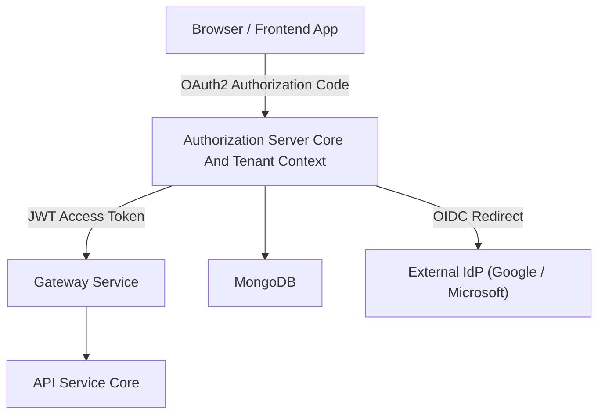
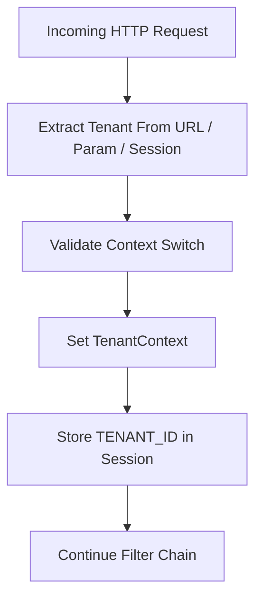
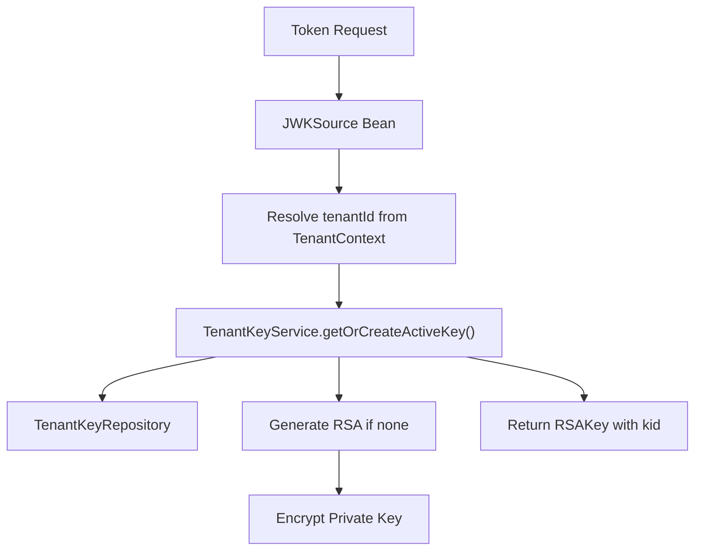
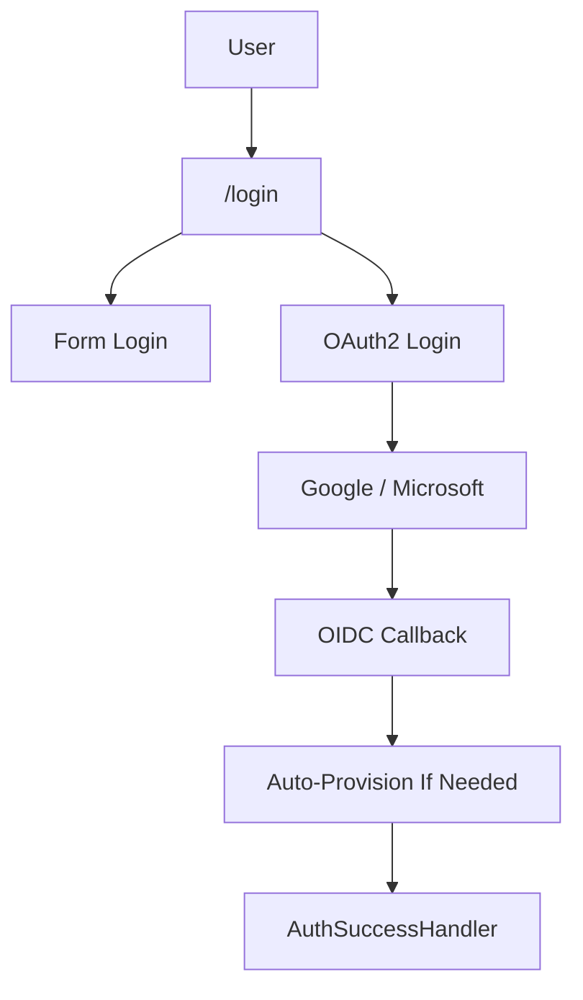
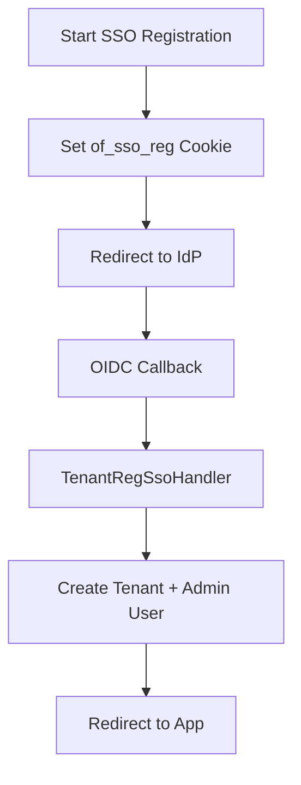
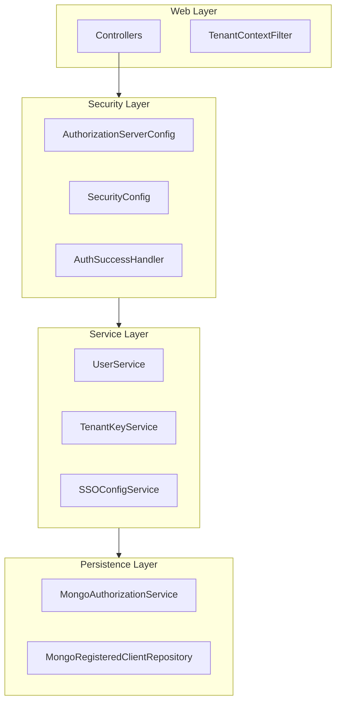

# Authorization Server Core And Tenant Context

## Overview

The **Authorization Server Core And Tenant Context** module is the security backbone of the OpenFrame multi-tenant platform. It implements:

- OAuth2 Authorization Server (Spring Authorization Server)
- OpenID Connect (OIDC) support
- Multi-tenant request scoping
- Per-tenant RSA signing keys
- Dynamic SSO client registration (Google, Microsoft)
- Invitation-based onboarding
- SSO-based tenant registration
- Password reset and email verification flows
- MongoDB-backed authorization persistence

This module is responsible for issuing JWT access tokens, managing OAuth2 authorization codes and refresh tokens, and ensuring every authentication and token is tenant-aware.

---

## High-Level Architecture

At runtime, the module sits between:

- Frontend applications (BFF, SPA, Chat client)
- Gateway and API services (resource servers)
- MongoDB (users, tenants, OAuth artifacts)
- External Identity Providers (Google, Microsoft)

### System Context



---

# 1. Multi-Tenant Context Model

Multi-tenancy is enforced at the **HTTP filter layer**, the **security layer**, and the **token layer**.

## 1.1 TenantContext (ThreadLocal)

**Core Component:** `TenantContext`

A `ThreadLocal<String>` holder that stores the active `tenantId` for the current request thread.

Responsibilities:

- Set before security processing
- Used by services (UserService, TenantKeyService)
- Used by JWT customizer to inject `tenant_id`
- Cleared after request completion

---

## 1.2 TenantContextFilter

**Core Component:** `TenantContextFilter`

This filter:

- Extracts tenant ID from:
  - URL prefix
  - Query parameter
  - Session attribute
- Validates special onboarding transitions
- Sets the tenant ID in:
  - `TenantContext`
  - HTTP session
- Clears context at the end of the request

### Tenant Resolution Flow



This ensures every authentication and token is tenant-scoped.

---

# 2. OAuth2 Authorization Server

## 2.1 AuthorizationServerConfig

**Core Component:** `AuthorizationServerConfig`

This config enables:

- OAuth2 Authorization Server
- OIDC support
- Multiple issuers (per-tenant issuer URLs)
- JWT encoder and decoder
- Per-tenant JWK resolution

### Security Filter Chain (Order 1)

Handles:

- `/oauth2/**`
- `/connect/**`
- `/.well-known/**`

It:

- Requires authentication
- Enables OIDC
- Uses custom authentication entry point
- Enables JWT resource server support

---

## 2.2 Per-Tenant Signing Keys

### TenantKeyService

Each tenant has its own RSA key pair used for signing JWTs.

**Core Components:**

- `TenantKeyService`
- `RsaAuthenticationKeyPairGenerator`
- `PemUtil`

Flow:



### Key Characteristics

- 2048-bit RSA
- Private key encrypted at rest
- Unique `kid` per key
- Stored in MongoDB
- One active key per tenant

---

## 2.3 JWT Customization

`OAuth2TokenCustomizer<JwtEncodingContext>` injects:

- `tenant_id`
- `userId`
- `roles`

Behavior:

- OWNER implicitly gains ADMIN
- On refresh token usage, `lastLogin` is updated

Resulting Access Token Claims:

```text
{
  "tenant_id": "tenant-123",
  "userId": "abc123",
  "roles": ["ADMIN", "USER"]
}
```

---

# 3. Security Configuration (Non-AS Endpoints)

## 3.1 SecurityConfig

Handles all non-Authorization Server endpoints.

### Features

- Form login (`/login`)
- OAuth2 login (Google, Microsoft)
- Custom failure handler
- Custom success handler
- OIDC user service with auto-provision
- Microsoft multi-tenant issuer validation

### Authentication Flow



---

# 4. Dynamic SSO Client Registration

## 4.1 DynamicClientRegistrationRepository

Resolves OAuth2 client configuration per:

- Provider (Google / Microsoft)
- Tenant

If tenant not found in context/session:

- Logs warning
- OAuth2 flow fails gracefully

### Strategy Pattern

Client registration strategies:

- `GoogleClientRegistrationStrategy`
- `MicrosoftClientRegistrationStrategy`

These:

- Load tenant-specific config
- Fallback to system default provider config

---

# 5. SSO Auto-Provisioning

Inside `SecurityConfig.oidcUserService()`:

- Resolves email from OIDC claims
- Checks tenant SSO config
- Validates allowed domains
- Creates user if not existing
- Assigns ADMIN role on creation
- Invokes `RegistrationProcessor.postProcessAutoProvision`

If tenant config missing:

- Uses `GlobalDomainPolicyLookup`
- Default: `NoopGlobalDomainPolicyLookup`

---

# 6. Registration and Onboarding Flows

## 6.1 Tenant Registration

### REST

`POST /oauth/register`

Creates:

- Tenant
- First user

### SSO Registration

`GET /oauth/register/sso`

Flow:



---

## 6.2 Invitation Registration

### REST

`POST /invitations/accept`

### SSO Invitation Flow

`GET /invitations/accept/sso`

- Sets `of_sso_invite` cookie
- Redirects to IdP
- `InviteSsoHandler` finalizes registration

---

# 7. Password Reset

## Endpoints

- `POST /password-reset/request`
- `POST /password-reset/confirm`

## ResetTokenUtil

Generates:

```text
32 bytes secure random
Base64 URL encoded
No padding
```

Password policy enforced via regex:

- Min 8 characters
- Uppercase
- Lowercase
- Digit
- Special character

---

# 8. Authorization Persistence (Mongo)

## 8.1 MongoAuthorizationService

Implements `OAuth2AuthorizationService`.

Stores:

- Authorization codes
- Access tokens
- Refresh tokens
- PKCE metadata
- OAuth2AuthorizationRequest snapshot

## 8.2 MongoAuthorizationMapper

Responsible for:

- Mapping Spring `OAuth2Authorization` → Mongo document
- Rehydrating authorization
- Preserving PKCE (`code_challenge`, `code_challenge_method`)

### PKCE Handling

PKCE values stored in:

- Additional parameters
- Code metadata

Ensures compatibility with:

- Public clients
- SPA with PKCE

---

# 9. Registered OAuth Clients

## MongoRegisteredClientRepository

Backs Spring `RegisteredClientRepository`.

Persists:

- Client ID
- Client secret
- Grant types
- Redirect URIs
- Scopes
- PKCE requirement
- Token TTL

Stored in Mongo as `MongoRegisteredClient`.

---

# 10. Authentication Success Handling

## AuthSuccessHandler

On successful authentication:

- Updates `lastLogin`
- Marks email verified if trusted IdP
- Delegates to SSO success handler

Email resolution uses:

- `email`
- `preferred_username`
- `upn`
- `unique_name`

---

# 11. Tenant Discovery

## TenantDiscoveryController

`GET /tenant/discover?email=...`

Returns:

```text
{
  email,
  has_existing_accounts,
  tenant_id,
  auth_providers
}
```

Used by frontend to:

- Route returning users
- Suggest SSO providers

---

# 12. Security Guarantees

This module guarantees:

1. Strict tenant isolation via ThreadLocal + filter
2. Per-tenant JWT signing keys
3. PKCE enforcement
4. Secure cookie-based SSO state handling
5. Encrypted private keys at rest
6. Role injection into JWT
7. Optional domain-based auto-provision

---

# 13. Internal Layered Architecture



---

# Conclusion

The **Authorization Server Core And Tenant Context** module is a fully multi-tenant, production-grade OAuth2 + OIDC authorization system with:

- Per-tenant isolation
- Dynamic SSO configuration
- Robust PKCE support
- Mongo-backed persistence
- Extensible processing hooks

It forms the identity and token foundation of the OpenFrame multi-service architecture and integrates tightly with gateway, API, frontend, and streaming services while maintaining strict tenant boundaries.