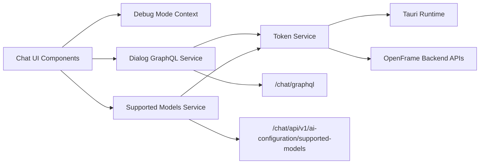
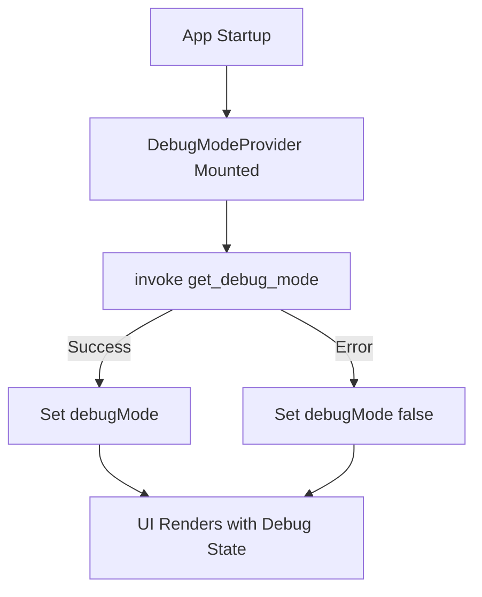
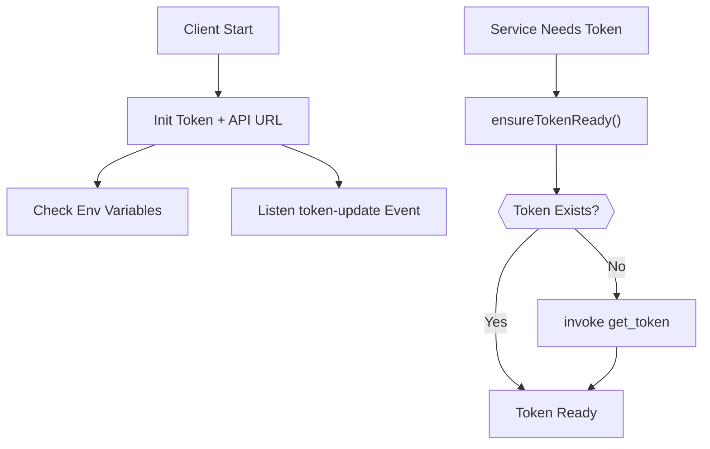
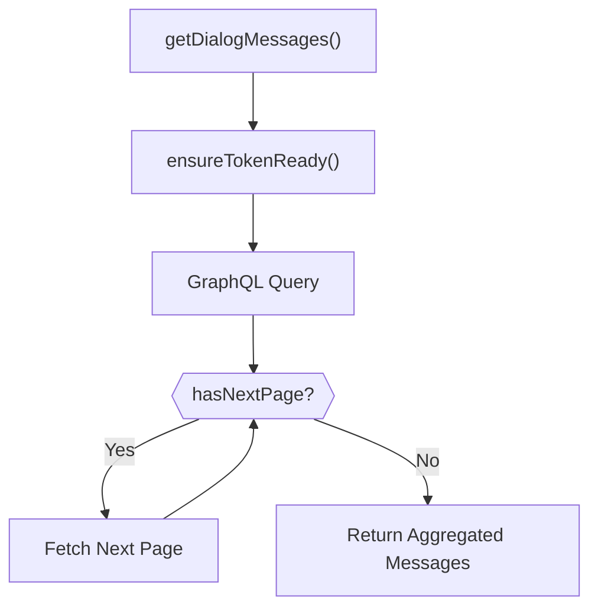
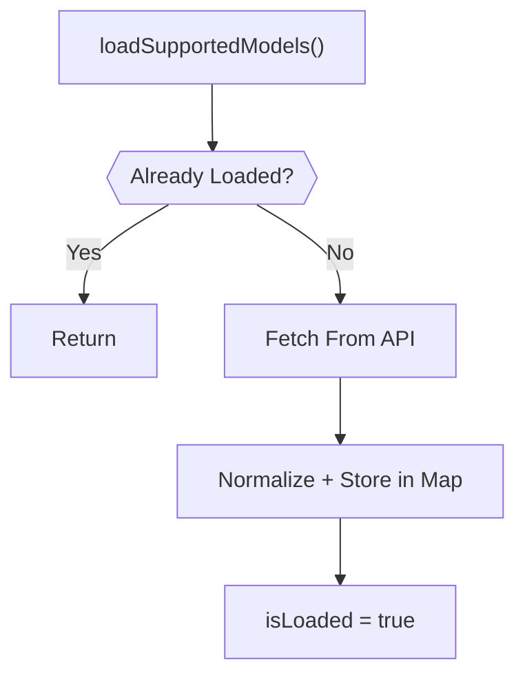
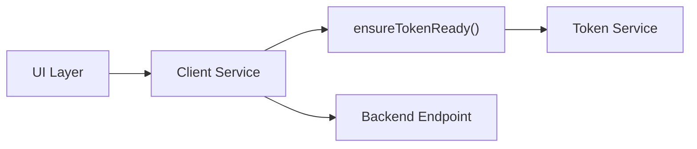

# Chat Client Services And Debug

## Overview

The **Chat Client Services And Debug** module provides the core runtime services for the OpenFrame Chat desktop client. It is responsible for:

- Managing authentication tokens and API base URLs via Tauri integration
- Executing GraphQL queries for dialog and message retrieval
- Fetching and caching supported AI models
- Providing a global debug mode context for UI-level diagnostics

This module acts as the **service layer** between the chat UI and the backend platform (API Service, Authorization Server, and Chat GraphQL endpoints).

It is designed for:

- Tauri-based desktop runtime
- Token-based authentication (Bearer JWT)
- GraphQL-driven dialog and message retrieval
- AI model configuration discovery

---

## Architectural Role in the Platform

The Chat Client Services And Debug module sits between the desktop runtime (Tauri + React) and the backend services.



### Responsibilities

| Component | Responsibility |
|------------|----------------|
| Debug Mode Context | Provides global debug state to UI |
| Token Service | Manages authentication token + API URL lifecycle |
| Dialog GraphQL Service | Fetches dialogs and paginated messages |
| Supported Models Service | Loads and caches AI model metadata |

---

## Component Breakdown

### 1. Debug Mode Context

**Core Component:**
- `openframe-oss-tenant.clients.openframe-chat.src.contexts.DebugModeContext.DebugModeContextType`

The Debug Mode Context provides a React Context wrapper around a boolean `debugMode` flag.

### Key Characteristics

- Initialized from Tauri command: `get_debug_mode`
- Safe fallback to `false` on failure
- Exposes `setDebugMode()` for runtime toggling
- Enforced provider usage via `useDebugMode()` guard

### Debug Initialization Flow



This ensures the debug state reflects backend/runtime configuration without blocking UI initialization.

---

### 2. Token Service

**Core Component:**
- `openframe-oss-tenant.clients.openframe-chat.src.services.tokenService.TokenService`

The Token Service is the **authentication backbone** of the chat client.

It handles:

- Token lifecycle
- API base URL discovery
- Tauri event listening
- Subscription-based update propagation

### Token Sources

The service supports three token sources:

1. Tauri event `token-update`
2. Tauri command `get_token`
3. Environment variables (`VITE_TOKEN`, `VITE_SERVER_URL`)

### Token Lifecycle Flow



### Features

- Automatic masking of tokens in logs
- Listener-based subscription model
- Lazy retrieval via `ensureTokenReady()`
- URL normalization (`https://` enforcement)
- Safe fallback when backend unavailable

### Security Considerations

- Tokens are never persisted to disk
- Logging masks sensitive portions
- All API calls use `Authorization: Bearer <token>`

---

### 3. Dialog GraphQL Service

**Core Component:**
- `openframe-oss-tenant.clients.openframe-chat.src.services.dialogGraphQLService.DialogGraphQLService`

This service provides all GraphQL interactions related to chat dialogs.

### Responsibilities

- Initialize authenticated `GraphQLClient`
- Retrieve resumable dialog
- Retrieve full paginated message history
- Aggregate paginated responses automatically

### GraphQL Endpoints

```
{baseUrl}/chat/graphql
```

### Message Pagination Strategy

Unlike simple single-request pagination, this service:

- Loops until `hasNextPage == false`
- Accumulates all edges
- Returns a normalized connection result



### Data Model Highlights

The service supports polymorphic `messageData` types including:

- Text messages
- Tool execution requests
- Tool execution results
- Approval workflows
- Error data

This aligns with backend GraphQL schema behavior and ensures forward compatibility with tool-integrated AI workflows.

### Endpoint Dependency

This service depends on backend GraphQL resolvers exposed by the Chat API within the API Service layer.

---

### 4. Supported Models Service

**Core Component:**
- `openframe-oss-tenant.clients.openframe-chat.src.services.supportedModelsService.SupportedModelsService`

This service loads and caches available AI models from the backend.

### Endpoint

```
{baseUrl}/chat/api/v1/ai-configuration/supported-models
```

### Provider Groups

The service supports grouped providers:

- anthropic
- openai
- google-gemini

### Loading Strategy

- Lazy load on first request
- Promise deduplication (`loadPromise`)
- In-memory cache via `Map<string, SupportedModel>`
- Manual reset support



### Benefits

- Prevents duplicate network requests
- Provides O(1) model lookup
- Abstracts provider-specific grouping
- Enables UI-level model validation

---

## Cross-Service Interaction Pattern

All outbound network services follow this pattern:



This guarantees:

- Token presence
- API URL configuration
- Consistent authentication headers
- Runtime safety

---

## Error Handling Philosophy

The module follows a **fail-safe client approach**:

- Log errors to console
- Return `null` instead of throwing in data services
- Keep UI responsive
- Avoid crashing the application

Only `ensureTokenReady()` throws, because authentication is a critical invariant.

---

## Runtime Context (Tauri Integration)

This module relies heavily on Tauri runtime features:

- `invoke()` for synchronous command execution
- `listen()` for async event propagation
- Secure Rust → JavaScript token bridge

This design prevents token exposure in browser storage and ensures secure desktop authentication flow.

---

## Design Principles

1. Singleton services for predictable state
2. Lazy initialization for performance
3. Strong typing via TypeScript interfaces
4. Decoupled token management
5. Centralized network orchestration
6. Resilient error handling

---

## Summary

The **Chat Client Services And Debug** module provides the foundational runtime services that power the OpenFrame Chat desktop client.

It ensures:

- Secure authentication lifecycle management
- Reliable GraphQL dialog retrieval
- Efficient AI model discovery
- Controlled debug-mode state
- Safe integration with Tauri runtime

Without this module, the chat UI would have no secure communication channel with the backend, no dialog continuity, and no AI model awareness.

It is the **service orchestration layer** of the OpenFrame Chat client.