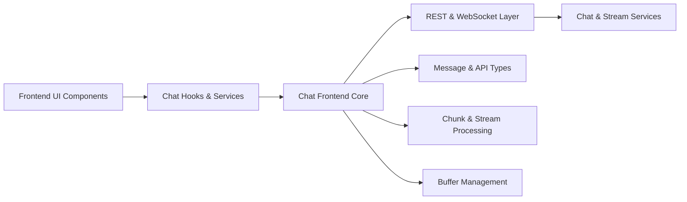
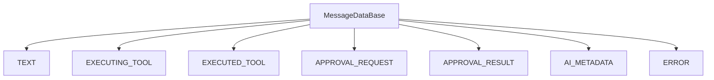
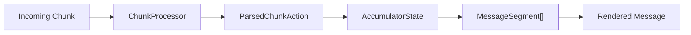
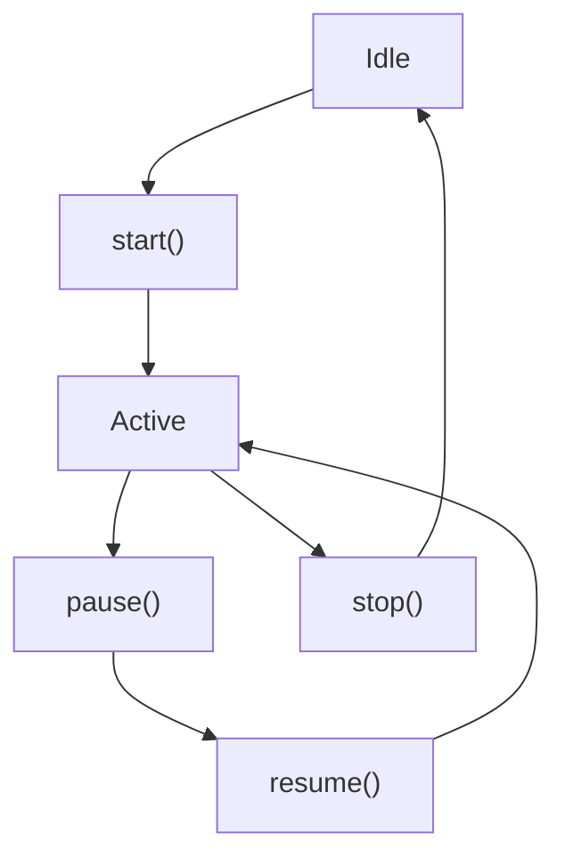
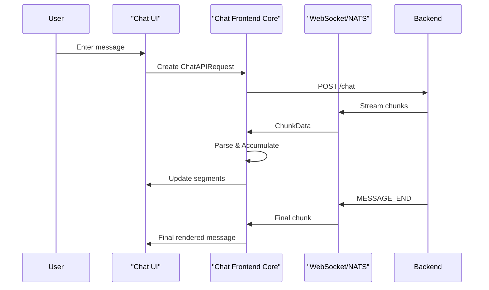
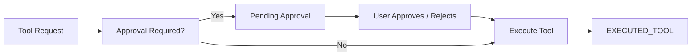

# Chat Frontend Core

## Overview

The **Chat Frontend Core** module defines the type system and processing contracts that power the real-time chat experience in OpenFrame. It provides:

- Strongly typed API request and response contracts
- A structured message and segment model
- Real-time streaming and chunk processing abstractions
- WebSocket and NATS-based network communication types
- Buffering and stream lifecycle management interfaces

This module is framework-agnostic at its core and focuses on **data modeling and processing contracts** rather than UI components. It is consumed by higher-level frontend applications such as the tenant frontend layer (see [Tenant Frontend API Clients and Hooks](tenant-frontend-api-clients-and-hooks.md)).

---

## Architectural Role in OpenFrame

The Chat Frontend Core sits between:

- The **backend chat and streaming APIs** (via REST and WebSocket/NATS)
- The **frontend UI layer** (React components, hooks, and stores)

It standardizes how:

- Messages are represented
- Streaming chunks are interpreted
- Tool executions and approvals are modeled
- Network responses are typed and validated

### High-Level Architecture



The Chat Frontend Core provides the **contracts and processing primitives** used by the UI and network layers.

---

# Core Domains

The module is organized around four major domains:

1. API Types
2. Message Model
3. Network & Streaming Types
4. Processing & Buffering Contracts

---

## 1. API Types

Defined in `api.types.ts`, these interfaces describe how the frontend interacts with backend chat APIs.

### Chat APIs

- `ChatAPIRequest`
- `ChatAPIResponse`

These types represent a single message submission to a dialog:

```text
ChatAPIRequest
  - dialogId
  - message
  - metadata?

ChatAPIResponse
  - success
  - messageId?
  - error?
```

This enforces a strict request/response contract between the frontend and backend.

---

### Dialog Management

The module defines types for creating and listing dialogs:

- `DialogCreateRequest`
- `DialogCreateResponse`
- `DialogListRequest`
- `DialogListResponse`

These support:

- Pagination
- Sorting (`createdAt`, `updatedAt`, `name`)
- Dialog metadata

The `DialogListResponse` structure ensures that dialog summaries include:

- `lastMessage`
- `messageCount`
- Timestamps

---

### Settings & Approvals

The module also defines:

- `ChatSettings`
- `UpdateSettingsRequest`
- `UpdateSettingsResponse`
- `ApprovalRequest`
- `ApprovalResponse`

These enable:

- Runtime customization of assistant behavior
- User-controlled approval workflows for tool execution

---

## 2. Message Model

The message model is defined in `message.types.ts` and is the heart of the chat rendering system.

### Message Type System

All backend message events resolve into one of the following logical types:



Each type maps to a strongly typed interface such as:

- `TextMessageData`
- `ExecutingToolMessageData`
- `ExecutedToolMessageData`
- `ApprovalRequestMessageData`
- `ApprovalResultMessageData`
- `AIMetadataMessageData`

---

### Segment-Based Rendering

Instead of rendering raw text, messages are decomposed into **segments**:

- `TextSegment`
- `ToolExecutionSegment`
- `ApprovalRequestSegment`

This enables rich rendering such as:

- Streaming text updates
- Inline tool execution blocks
- Interactive approval buttons



---

### Processed vs Historical Messages

Two important abstractions exist:

- `HistoricalMessage` → raw data from backend
- `ProcessedMessage` → UI-ready structure

`ProcessedMessage` normalizes:

- `role` (user, assistant, error)
- `content` (string or segment array)
- `timestamp`
- `assistantType`

This separation allows rehydration and replay of previous sessions.

---

## 3. Network & Streaming Types

Defined in `network.types.ts`, this domain models real-time communication.

### NATS & WebSocket Contracts

Core types include:

- `WebSocketConfig`
- `WebSocketMessage`
- `NatsMessageType`
- `NatsConnectionStatus`
- `ChunkData`

`ChunkData` is intentionally flexible and supports:

- Text streaming
- Tool execution metadata
- Approval requests/results
- AI metadata
- Errors

---

### Network Configuration

The `NETWORK_CONFIG` constant centralizes connection behavior:

```text
- CONNECT_TIMEOUT_MS
- RECONNECT_TIME_WAIT_MS
- PING_INTERVAL_MS
- MAX_PING_OUT
- DEFAULT_MESSAGE_LIMIT
- POLL_MESSAGE_LIMIT
```

This ensures consistent behavior across hooks and services.

---

### Typed Network Responses

All REST calls follow:

- `NetworkResponse<T>`
- `PaginatedResponse<T>`

This enforces consistent success/error handling across the frontend.

---

## 4. Processing & Buffering Contracts

Defined in `processing.types.ts`, this domain describes how streaming data becomes structured messages.

### Chunk Processing

`ChunkProcessor` transforms raw `ChunkData` into a structured `ParsedChunkAction`.

Possible actions include:

- `message_start`
- `message_end`
- `text`
- `tool_execution`
- `approval_request`
- `approval_result`
- `metadata`
- `error`

This isolates parsing logic from UI concerns.

---

### Accumulator State

The `AccumulatorState` maintains:

- `segments`
- `currentTextBuffer`
- `pendingApprovals`
- `executingTools`
- `escalatedApprovals`

This enables:

- Partial message continuation after refresh
- Escalated approval handling
- Tool lifecycle tracking

---

### Stream Lifecycle

The `StreamProcessor` defines a lifecycle contract:



State is represented by `StreamState`:

- `isActive`
- `isPaused`
- `messagesProcessed`
- `chunksBuffered`
- `errors`

---

### Buffer Management

The `BufferManager` abstraction allows:

- Controlled chunk batching
- Overflow handling
- Timed flushing

This is essential for high-throughput real-time streaming scenarios.

---

# Real-Time Chat Flow

The following sequence shows a typical user message lifecycle:



This flow demonstrates how the Chat Frontend Core:

- Bridges synchronous REST calls and asynchronous streams
- Ensures ordering via `sequenceId`
- Handles partial rendering and finalization

---

# Approval & Tool Execution Model

A key feature of OpenFrame chat is controlled tool execution.

### Tool Lifecycle



The model supports:

- Escalated approvals
- Different approval types
- Post-execution result reporting

All of this is represented through structured message segments rather than ad hoc UI state.

---

# Integration with Tenant Frontend Layer

While the Chat Frontend Core defines types and processing contracts, higher-level functionality (such as API clients, React hooks, and state stores) is implemented in:

- [Tenant Frontend API Clients and Hooks](tenant-frontend-api-clients-and-hooks.md)

That module consumes:

- `ChatAPIRequest` and `ChatAPIResponse`
- `MessageSegment` and `ProcessedMessage`
- `NetworkResponse` and `PaginatedResponse`
- Streaming and buffering abstractions

This separation ensures:

- Reusability across frontend applications
- Strong typing across the stack
- Clean separation between UI and protocol logic

---

# Design Principles

The Chat Frontend Core follows these principles:

### 1. Type-First Architecture

All interactions are contract-driven and strongly typed.

### 2. Stream-Oriented Processing

Messages are built incrementally from chunks rather than delivered as monolithic payloads.

### 3. UI-Agnostic Core

No rendering logic exists here — only data modeling and transformation contracts.

### 4. Extensibility

New message types (e.g., future tool categories or metadata types) can be added without breaking the rendering pipeline.

---

# Summary

The **Chat Frontend Core** module provides the foundational type system and processing contracts for OpenFrame’s real-time AI chat experience.

It enables:

- Structured streaming message assembly
- Rich tool execution and approval workflows
- Resilient reconnection and buffering
- Strongly typed REST and WebSocket integration

By separating protocol logic from UI rendering, it ensures that the OpenFrame chat system remains scalable, extensible, and maintainable across tenants and frontend applications.
