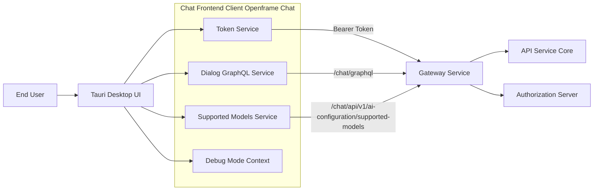
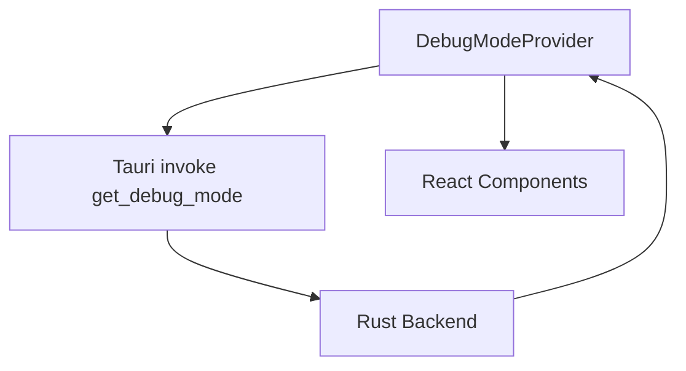
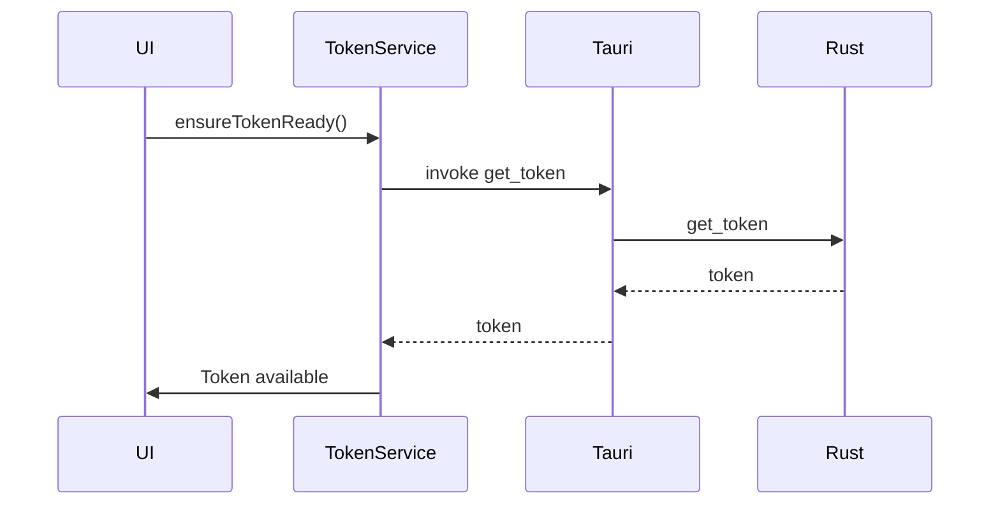
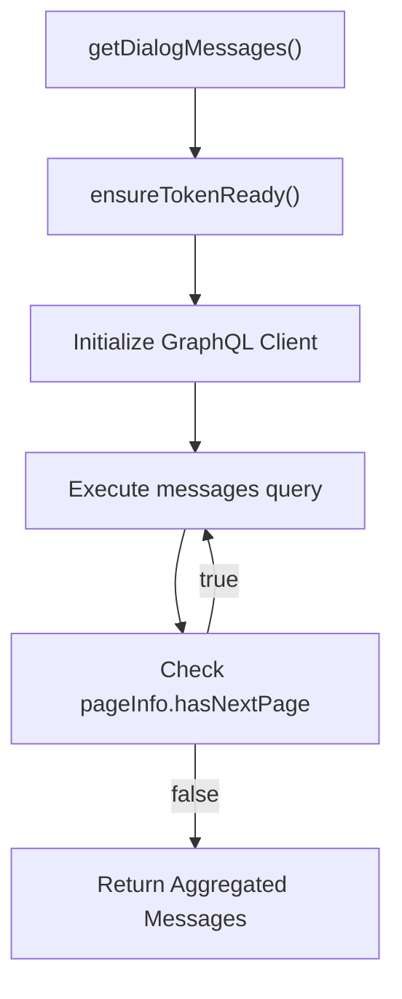
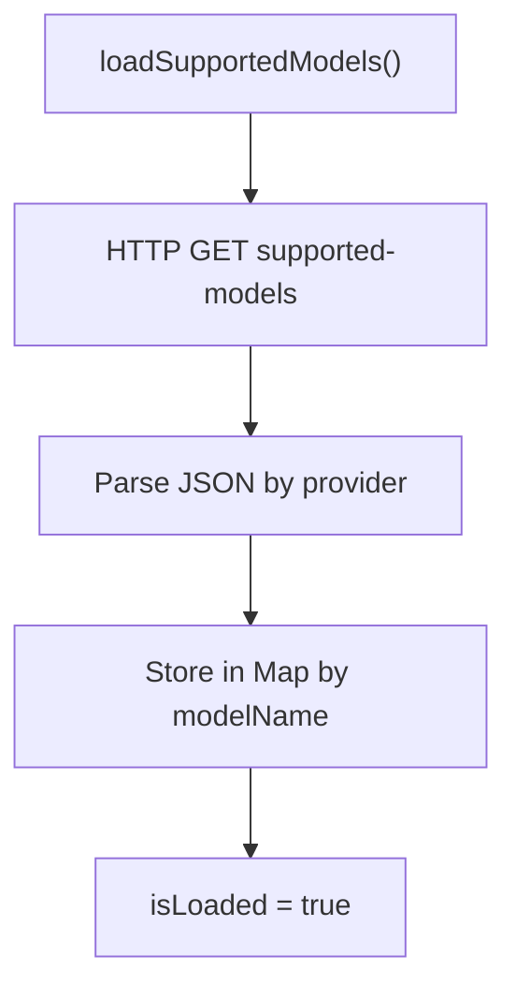
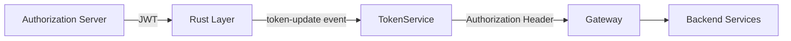
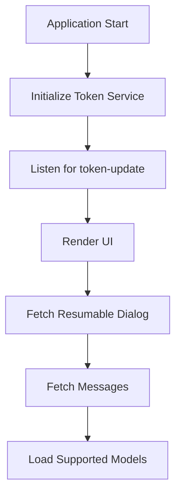

# Chat Frontend Client Openframe Chat

The **Chat Frontend Client Openframe Chat** module is the desktop chat client responsible for connecting end-users to the OpenFrame AI-driven support platform. It provides:

- Secure authentication token handling (via Tauri + Rust bridge)
- GraphQL-based dialog and message retrieval
- AI model capability discovery
- Runtime debug mode management

This module runs as a Tauri-powered desktop application and communicates with the OpenFrame backend stack (Gateway, API, Authorization Server, and Chat services).

---

## 1. Architectural Overview

The Chat Frontend Client Openframe Chat module sits at the edge of the OpenFrame platform, interacting securely with backend services through authenticated HTTP and GraphQL requests.



### Key Responsibilities

| Component | Responsibility |
|------------|----------------|
| Token Service | Manages authentication tokens and API base URL from Tauri/Rust |
| Dialog GraphQL Service | Fetches resumable dialogs and paginated messages |
| Supported Models Service | Retrieves supported AI models from backend |
| Debug Mode Context | Provides runtime debug toggle across React tree |

---

## 2. Core Components

### 2.1 Debug Mode Context

**Component:** `DebugModeContextType`

The Debug Mode Context is a React context that provides application-wide access to a `debugMode` flag.

#### Responsibilities

- Fetch debug mode state from the Rust backend using Tauri `invoke("get_debug_mode")`
- Provide a `debugMode` boolean and `setDebugMode` function
- Ensure consumers are wrapped in `DebugModeProvider`



#### Design Notes

- Initialized once using `useEffect`
- Fails safely (defaults to `false` on error)
- Enforces usage through custom `useDebugMode()` hook

This ensures predictable debug behavior across the desktop application.

---

### 2.2 Token Service

**Component:** `TokenService`

The Token Service is the authentication backbone of the chat client.

It manages:

- JWT access token
- API base URL
- Token lifecycle events
- Integration with Tauri event system

#### Initialization Flow



#### Token Sources

1. **Environment variables** (`VITE_TOKEN`, `VITE_SERVER_URL`)
2. **Tauri event listener** (`token-update`)
3. **Tauri command invocation** (`get_token`, `get_server_url`)

#### Features

- Normalizes API URLs
- Provides subscription APIs (`onTokenUpdate`, `onApiUrlUpdate`)
- Masks tokens in logs
- Throws explicit errors if token or API URL is unavailable

This design decouples authentication from UI logic and centralizes security handling.

---

### 2.3 Dialog GraphQL Service

**Component:** `DialogGraphQLService`

This service handles all GraphQL communication related to dialogs and messages.

#### Responsibilities

- Fetch resumable dialog
- Fetch paginated dialog messages
- Aggregate all pages into a single result
- Inject Bearer token into GraphQL headers

#### GraphQL Endpoint

```text
{API_BASE_URL}/chat/graphql
```

#### Message Retrieval Flow



#### Key Design Decisions

- Lazy GraphQL client initialization
- Endpoint caching to prevent unnecessary re-instantiation
- Automatic pagination loop
- Defensive error handling (returns `null` on failure)

#### Data Model Highlights

The service supports multiple message types including:

- Text messages
- Executing tool messages
- Executed tool results
- Approval requests and results
- Error messages

This polymorphic model enables rich AI-agent interactions within the chat interface.

---

### 2.4 Supported Models Service

**Component:** `SupportedModelsService`

This service retrieves and caches AI model metadata from the backend.

#### Endpoint

```text
{API_BASE_URL}/chat/api/v1/ai-configuration/supported-models
```

#### Responsibilities

- Fetch supported models grouped by provider
- Normalize models into a flat lookup map
- Provide quick access methods:
  - `getModelDisplayName()`
  - `getModel()`
  - `getAllModels()`
  - `isModelSupported()`



#### Performance Characteristics

- Uses lazy loading
- Prevents duplicate concurrent fetches via `loadPromise`
- Supports cache reset

This ensures efficient AI model metadata management without repeated backend calls.

---

## 3. Authentication & Security Model

The Chat Frontend Client Openframe Chat module does **not** directly manage OAuth flows. Instead:

1. The Authorization Server issues tokens.
2. The Gateway validates JWTs.
3. The Chat client receives tokens via Tauri bridge.
4. All requests include `Authorization: Bearer <token>`.



This separation provides:

- Secure desktop token storage
- Centralized authentication validation
- Minimal token exposure in frontend logic

---

## 4. Error Handling Strategy

| Layer | Strategy |
|--------|----------|
| Token Service | Throws explicit errors if token or API URL missing |
| Dialog GraphQL Service | Logs error and returns `null` |
| Supported Models Service | Logs warning and continues safely |
| Debug Mode Context | Defaults to `false` on failure |

The system is designed to fail gracefully, prioritizing availability over hard crashes.

---

## 5. Lifecycle & Runtime Behavior



Key runtime characteristics:

- Token and API URL initialized at startup
- Dialog state fetched lazily
- AI model metadata fetched on demand
- Debug mode initialized once

---

## 6. Design Principles

The Chat Frontend Client Openframe Chat module follows these architectural principles:

1. **Separation of Concerns** – Each service handles a single domain (auth, dialog, models, debug).
2. **Lazy Initialization** – Network resources initialized only when required.
3. **Reactive Token Handling** – Event-driven token updates.
4. **Backend-Driven UI** – Dialog state and model availability are server-controlled.
5. **Defensive Programming** – Graceful fallbacks on failure.

---

## 7. Summary

The Chat Frontend Client Openframe Chat module is a secure, Tauri-powered desktop client that:

- Bridges authentication from Rust to the frontend
- Communicates with OpenFrame backend via GraphQL and REST
- Supports AI tool-driven conversations
- Manages dialog state and pagination
- Dynamically adapts to backend-supported AI models

It serves as the user-facing interface of the OpenFrame conversational ecosystem while delegating security, orchestration, and data management to backend services.
