# Client Service Core Http And Listeners

## Overview

The **Client Service Core Http And Listeners** module is the runtime backbone of the OpenFrame client service. It exposes HTTP endpoints for agent authentication and registration, distributes tool agent artifacts, and processes asynchronous machine and tool events via NATS and JetStream listeners.

This module acts as the bridge between:

- Remote agents (device agents, integrated tool agents)
- The OpenFrame data layer (Mongo, domain services)
- Streaming infrastructure (NATS / JetStream)
- Tool integrations such as Fleet MDM and MeshCentral

It combines synchronous HTTP APIs with event-driven listeners to maintain accurate machine state, installed agent records, and tool connections in near real time.

---

## Architectural Role in the Platform

At a high level, the Client Service Core Http And Listeners module sits between field agents and the broader OpenFrame platform.

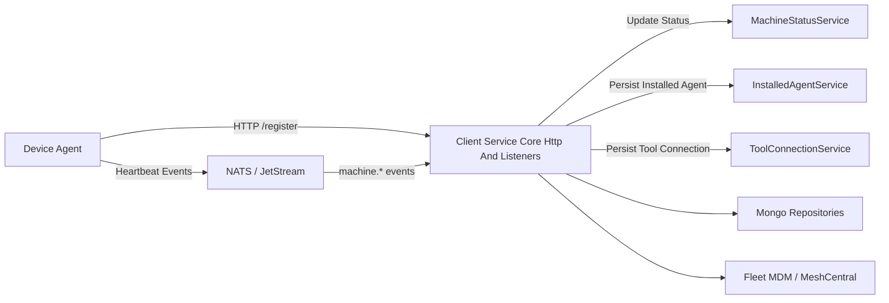

### Responsibilities

- Issue OAuth-compatible tokens to agents
- Register new machines and agents
- Serve tool agent binaries
- Track machine connectivity (online/offline/heartbeat)
- Process installed agent events
- Process tool connection events
- Transform tool-specific agent identifiers into platform-consumable IDs

---

# HTTP Layer

The HTTP layer exposes endpoints for authentication, registration, and artifact retrieval.

## 1. PasswordEncoderConfig

**Component:** `PasswordEncoderConfig`

Defines a `PasswordEncoder` bean using `BCryptPasswordEncoder`.

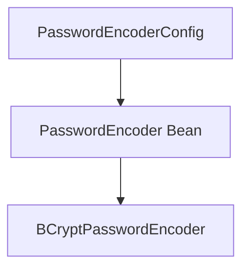

### Purpose

- Provides secure password hashing
- Used by authentication-related services
- Ensures consistent cryptographic configuration across the module

---

## 2. AgentAuthController

**Endpoint Base Path:** `/oauth`

### Token Endpoint

```text
POST /oauth/token
```

Parameters:

- `grant_type`
- `refresh_token` (optional)
- `client_id` (optional)
- `client_secret` (optional)

### Flow

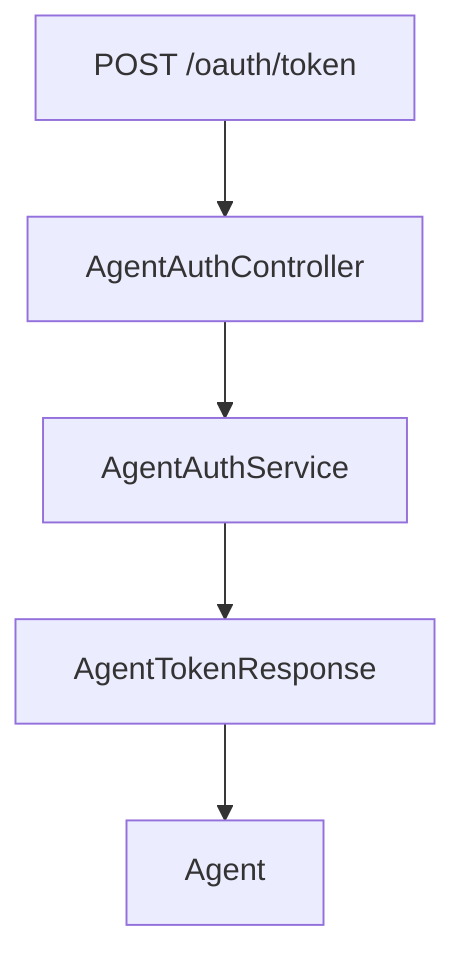

### Behavior

- Delegates token issuance to `AgentAuthService`
- Returns:
  - `200 OK` with token payload
  - `401` for invalid credentials
  - `400` for server-side processing errors

This enables agents to authenticate and obtain access tokens in an OAuth-style flow.

---

## 3. AgentController

**Endpoint Base Path:** `/api/agents`

### Register Endpoint

```text
POST /api/agents/register
```

Headers:

```text
X-Initial-Key: <initial-registration-key>
```

Body:

`AgentRegistrationRequest`

### Registration Flow

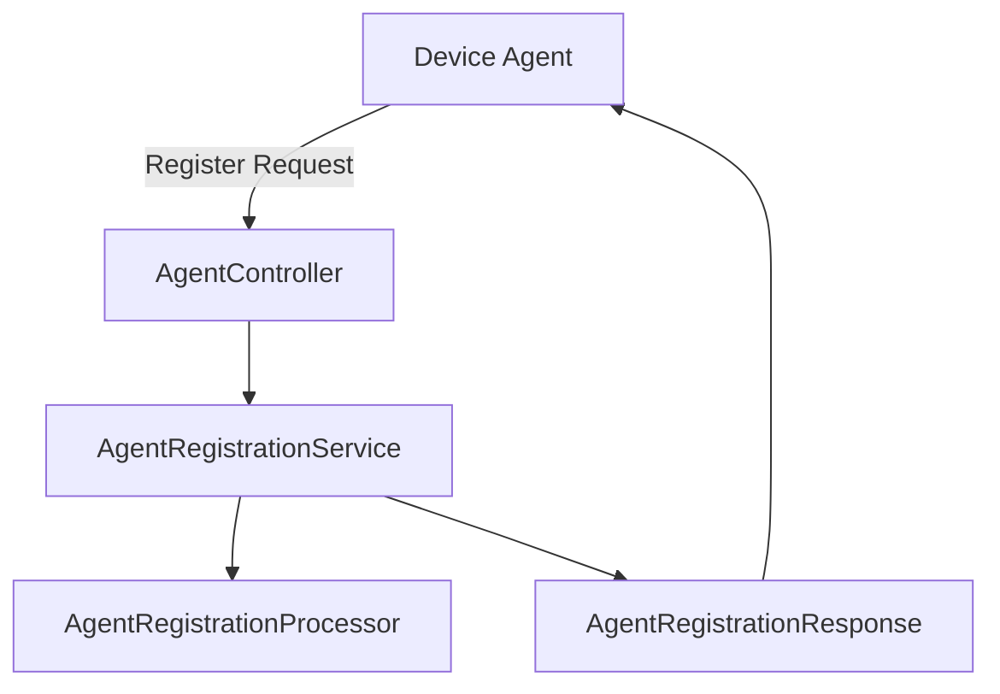

### AgentRegistrationRequest

Includes:

- Identification (hostname, organizationId)
- Network info (ip, macAddress, osUuid)
- Hardware metadata
- OS metadata
- Device status and type

### Extensibility

`DefaultAgentRegistrationProcessor` is used if no custom implementation is provided.

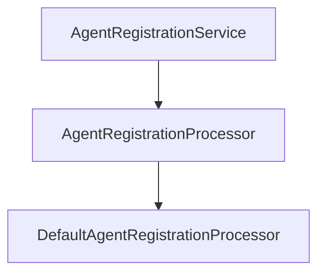

The default implementation is a no-op, enabling customization without modifying core logic.

---

## 4. ToolAgentFileController

**Endpoint Base Path:** `/tool-agent/{assetId}`

Provides downloadable binaries for tool agents.

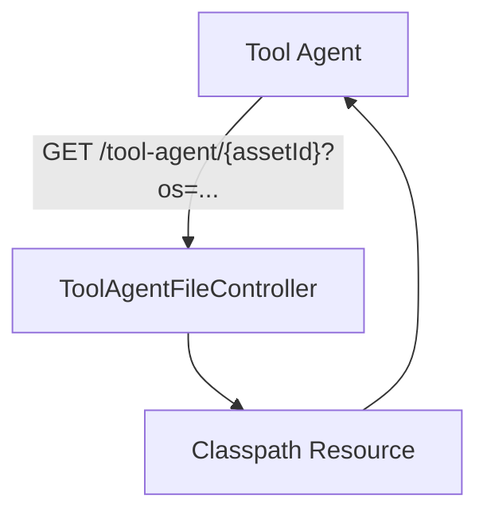

### Behavior

- Selects file based on:
  - `assetId`
  - `os` parameter (`mac` or `windows`)
- Returns binary content
- Throws exceptions for unsupported OS or missing asset

Currently implemented as a hardcoded resource-based fallback.

---

# Event-Driven Listeners (NATS / JetStream)

The module subscribes to machine and tool events via NATS.

## Listener Overview

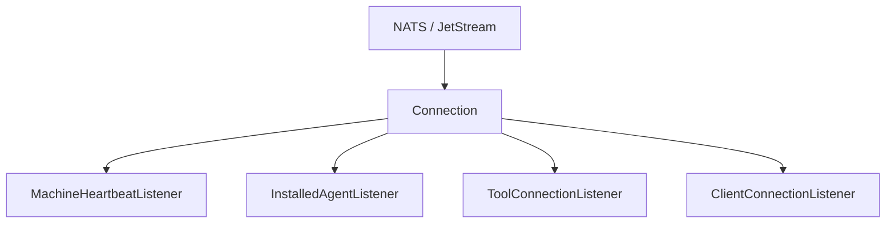

---

## 1. ClientConnectionListener

Consumes client connection and disconnection events.

Subjects (derived from event model):

- Client connected
- Client disconnected

### Flow

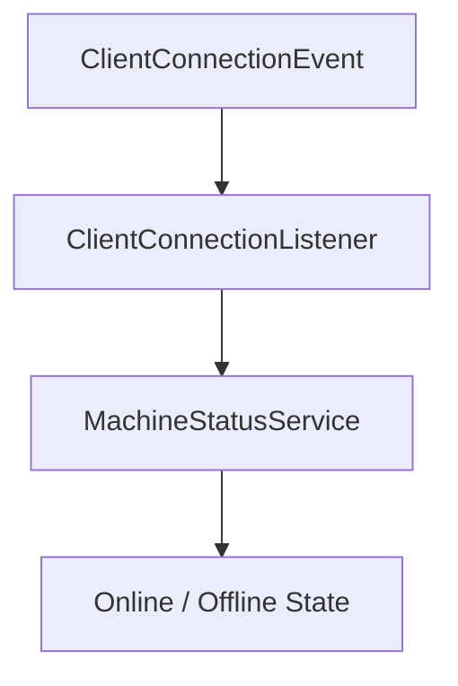

### Behavior

- Parses JSON message
- Extracts machine ID
- Updates machine status to:
  - Online (connected)
  - Offline (disconnected)

Exceptions are wrapped in `NatsException`.

---

## 2. MachineHeartbeatListener

Subject:

```text
machine.*.heartbeat
```

### Flow

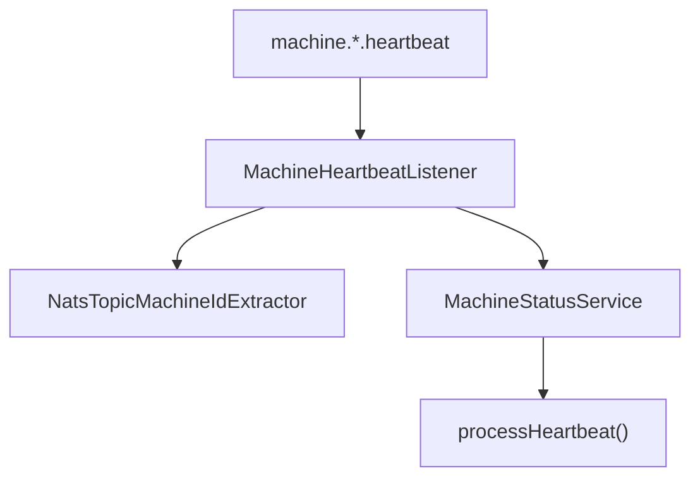

### Behavior

- Extracts machine ID from subject
- Generates server-side timestamp
- Calls `processHeartbeat()`

This provides near real-time liveness detection.

---

## 3. InstalledAgentListener (JetStream)

Stream: `INSTALLED_AGENTS`  
Subject: `machine.*.installed-agent`

### Consumer Characteristics

- Durable consumer
- Explicit acknowledgment
- `maxDeliver = 50`
- `ackWait = 30s`
- Delivery group for scaling

### Flow

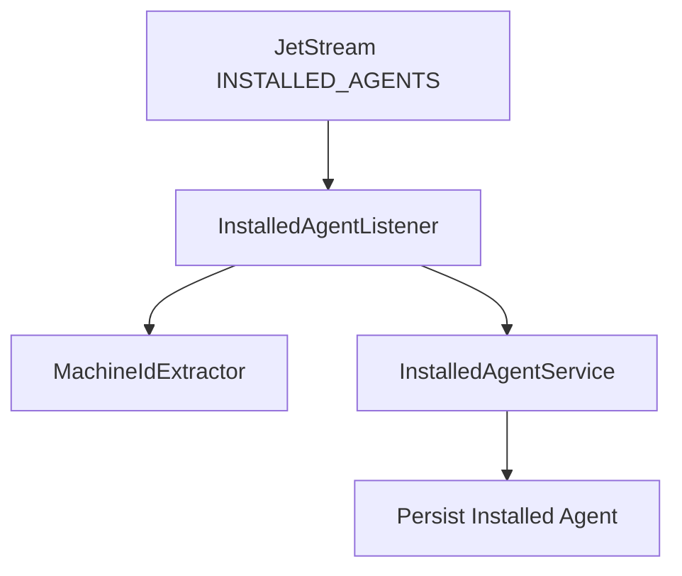

### Reliability Model

- Message is acknowledged only after successful processing
- If exception occurs:
  - Message is not acked
  - JetStream redelivers
- `lastAttempt` flag is derived from delivery count

This guarantees at-least-once processing.

---

## 4. ToolConnectionListener (JetStream)

Stream: `TOOL_CONNECTIONS`  
Subject: `machine.*.tool-connection`

### Flow

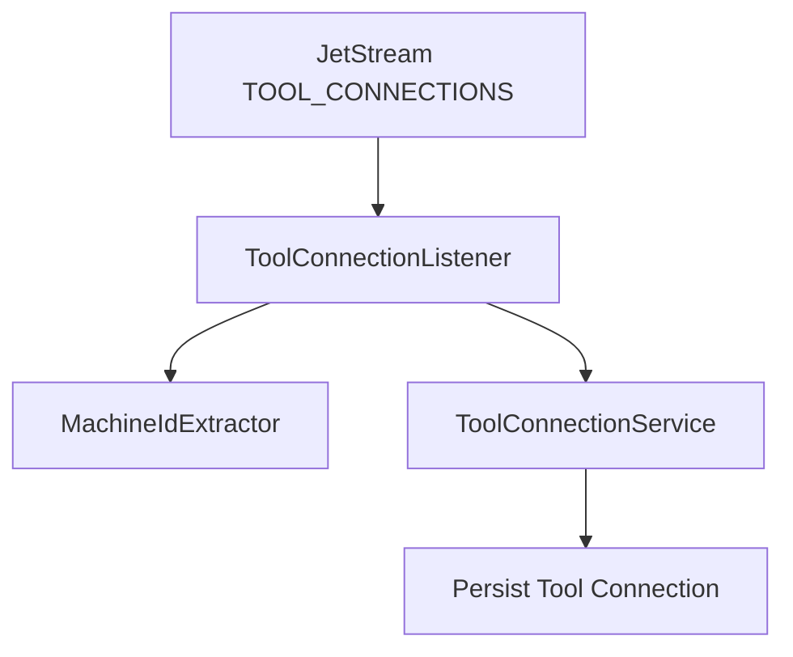

### Behavior

- Extracts machine ID from subject
- Parses `ToolConnectionMessage`
- Determines `lastAttempt`
- Calls `addToolConnection()`
- Explicitly acknowledges message on success

This listener tracks tool integrations per machine.

---

# Tool Agent ID Transformation

The module includes tool-specific transformers that normalize external agent IDs.

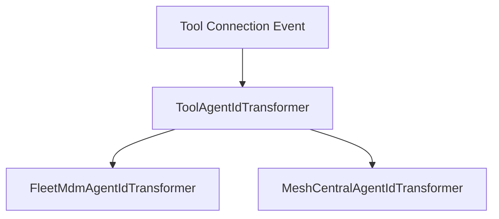

## FleetMdmAgentIdTransformer

### Purpose

- Converts Fleet MDM UUID into internal host ID
- Uses:
  - `IntegratedToolService`
  - `ToolUrlService`
  - `FleetMdmClient`

### Flow

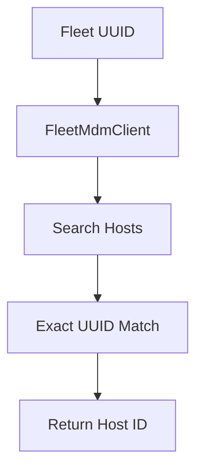

If no match is found:

- Throws exception unless `lastAttempt = true`
- On last attempt, falls back to original UUID

This ensures resilience during transient tool inconsistencies.

---

## MeshCentralAgentIdTransformer

### Purpose

Transforms:

```text
<agentToolId>
```

Into:

```text
node//<agentToolId>
```

### Flow

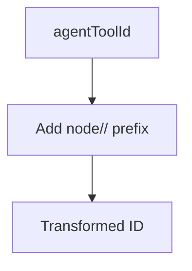

Simple deterministic transformation with no external lookup.

---

# Data Contracts (DTOs)

## AgentRegistrationRequest

Captures:

- Host metadata
- OS metadata
- Hardware details
- Device type and status

Used by registration endpoint.

## CreateClientRequest

Defines:

- `grantTypes`
- `scopes`

Used for client configuration flows.

## MetricsMessage

Represents telemetry payload:

- `machineId`
- CPU usage
- Memory usage
- Timestamp

Designed for streaming ingestion or metrics pipelines.

---

# Reliability and Lifecycle Management

Each JetStream listener:

- Configures durable consumers
- Uses explicit acknowledgments
- Implements redelivery handling
- Cleans up resources via `@PreDestroy`

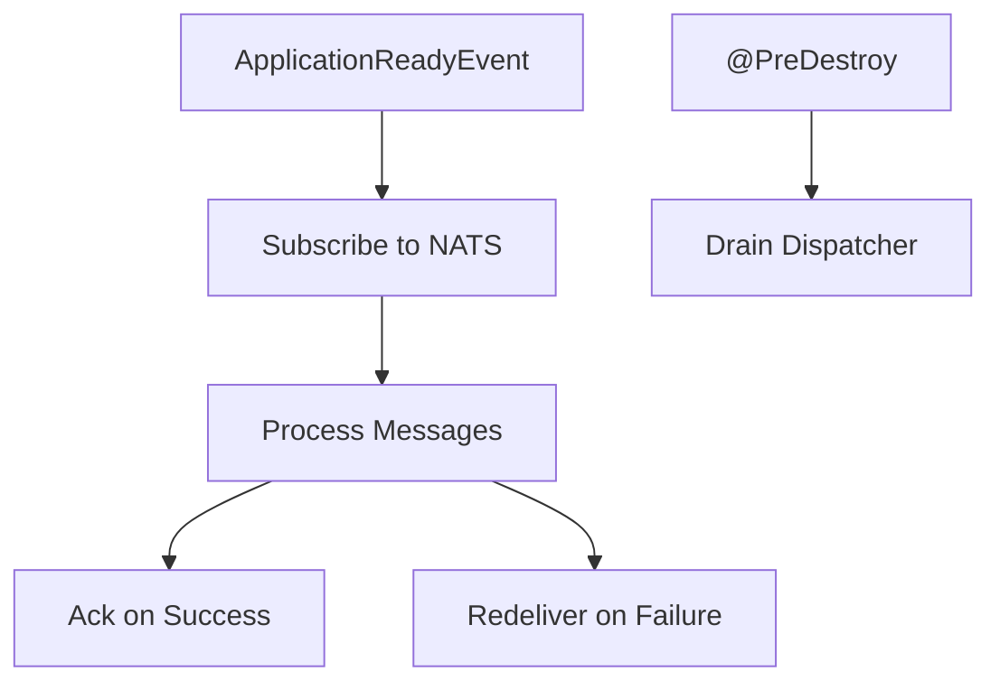

This ensures graceful shutdown and safe message handling.

---

# Key Design Patterns

- **Event-Driven Architecture** – Machine and tool events processed asynchronously
- **Durable Messaging** – JetStream explicit ack model
- **Strategy Pattern** – ToolAgentIdTransformer per tool type
- **Extensibility Hook** – AgentRegistrationProcessor override mechanism
- **Separation of Concerns** – HTTP layer separated from event listeners

---

# Summary

The **Client Service Core Http And Listeners** module is the operational heart of machine lifecycle management in OpenFrame. It:

- Authenticates agents
- Registers machines
- Serves tool artifacts
- Maintains machine online/offline state
- Tracks installed agents and tool connections
- Integrates with external tool ecosystems

By combining HTTP endpoints with durable event listeners, it ensures consistent, real-time synchronization between device agents, tool platforms, and the OpenFrame data layer.