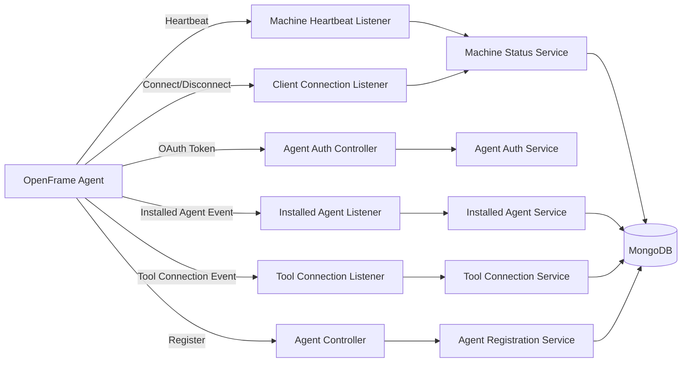
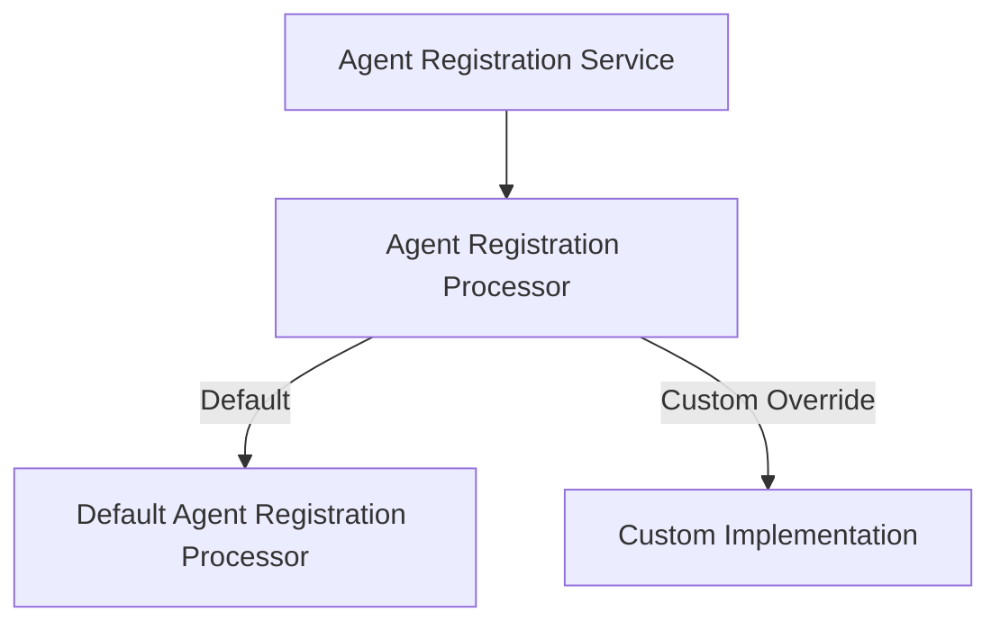
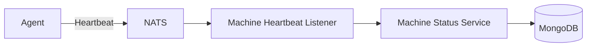
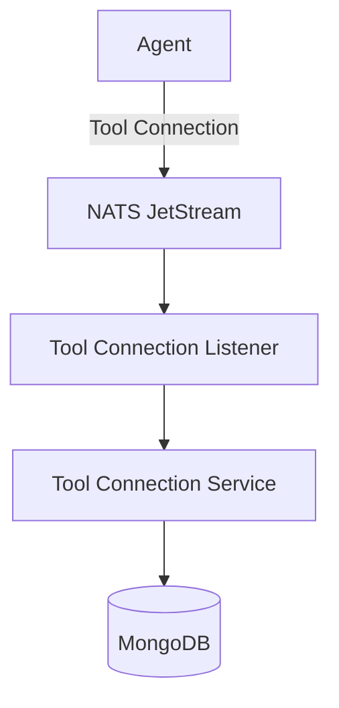

# Client Service Core

## Overview

The **Client Service Core** module is responsible for managing OpenFrame agents (machines) within a tenant. It provides:

- Agent registration and bootstrap
- Agent authentication (OAuth-style token issuance)
- Machine lifecycle tracking (connect, disconnect, heartbeat)
- Installed agent and tool connection processing
- Extensibility hooks for custom registration logic

This module acts as the backend control plane for OpenFrame client agents deployed on endpoints. It integrates with messaging (NATS JetStream), data-access modules, and the broader security and authorization infrastructure.

---

## Architectural Context

Within the OpenFrame platform, the Client Service Core sits between:

- **Client agents** running on machines
- **Messaging infrastructure (NATS)** for event-driven updates
- **Data access layers** (Mongo repositories)
- **Security and OAuth components** for token issuance

---

## Core Responsibilities

### 1. Agent Authentication

**Primary Component:** `AgentAuthController`

Endpoint:

- `POST /oauth/token`

This controller supports token issuance for client agents using OAuth-style parameters:

- `grant_type`
- `client_id`
- `client_secret`
- `refresh_token`

It delegates to `AgentAuthService` to:

- Validate credentials
- Issue access tokens
- Handle refresh flows

Error handling ensures:

- `401` for invalid credentials
- `400` for generic server errors

This integrates with the broader security infrastructure (JWT, OAuth, tenant-aware auth).

---

### 2. Agent Registration

**Primary Component:** `AgentController`

Endpoint:

- `POST /api/agents/register`

Key characteristics:

- Requires `X-Initial-Key` header for bootstrap security
- Accepts `AgentRegistrationRequest` payload
- Delegates to `AgentRegistrationService`

#### AgentRegistrationRequest

Captures machine identity and metadata:

- Core identification: hostname, organizationId
- Network info: IP, MAC, UUID
- Agent metadata: version, status
- Hardware: serial number, manufacturer, model
- OS info: type, version, build, timezone

This enables the system to:

- Create or update a machine record
- Associate it with an organization
- Initialize its lifecycle state

---

### 3. Extensible Registration Processing

**Primary Component:** `DefaultAgentRegistrationProcessor`

This class provides a default no-op implementation of `AgentRegistrationProcessor`.

Design goals:

- Allow tenants or integrators to override post-registration behavior
- Avoid forcing custom implementations
- Enable plug-in style customization

If no custom bean is provided, the default processor logs the event and performs no additional action.

---

## Event-Driven Machine Lifecycle

The Client Service Core heavily relies on **NATS JetStream** and subject-based messaging.

### 4. Machine Connection Events

**Primary Component:** `ClientConnectionListener`

Consumers:

- Machine connected
- Machine disconnected

Flow:

1. Deserialize `ClientConnectionEvent`
2. Extract machine ID
3. Update status via `MachineStatusService`

This keeps machine availability in sync with real-time agent connectivity.

---

### 5. Machine Heartbeats

**Primary Component:** `MachineHeartbeatListener`

Subject:

- `machine.*.heartbeat`

Behavior:

- Extract machine ID from subject
- Generate service-side timestamp
- Call `MachineStatusService.processHeartbeat(...)`

This ensures liveness detection even when explicit connect/disconnect events are unreliable.

---

### 6. Installed Agent Processing

**Primary Component:** `InstalledAgentListener`

JetStream configuration:

- Stream: `INSTALLED_AGENTS`
- Durable consumer
- Explicit ack policy
- Max delivery attempts

Processing steps:

1. Extract machine ID from subject
2. Deserialize `InstalledAgentMessage`
3. Call `InstalledAgentService.addInstalledAgent(...)`
4. Acknowledge on success
5. Allow redelivery on failure

Key reliability features:

- Durable consumer
- Explicit ack
- Delivery count tracking
- Last-attempt detection

---

### 7. Tool Connection Events

**Primary Component:** `ToolConnectionListener`

JetStream configuration:

- Stream: `TOOL_CONNECTIONS`
- Delivery group for horizontal scaling
- Explicit ack policy

Processing steps:

1. Extract machine ID from subject
2. Deserialize `ToolConnectionMessage`
3. Call `ToolConnectionService.addToolConnection(...)`
4. Ack on success

The use of delivery groups enables multiple service instances to scale horizontally while preserving message semantics.

---

## Security and Cryptography

### PasswordEncoderConfig

Defines a `PasswordEncoder` bean using:

- `BCryptPasswordEncoder`

Purpose:

- Secure hashing of secrets
- Compatibility with Spring Security
- Safe storage of client credentials

This is typically used in combination with:

- Agent authentication
- Client credential validation
- Secure storage of bootstrap secrets

---

## Reliability and Lifecycle Management

Each NATS listener:

- Subscribes on `ApplicationReadyEvent`
- Uses dispatcher-based threading
- Supports graceful shutdown via `@PreDestroy`
- Drains dispatcher with timeout

JetStream-based listeners:

- Use durable consumers
- Configure `AckPolicy.Explicit`
- Limit `maxDeliver`
- Implement redelivery logic

This ensures:

- At-least-once processing
- Controlled retry behavior
- Resilience across restarts

---

## Integration Points

The Client Service Core integrates with:

- Data access modules for machine and organization persistence
- Security and OAuth modules for token issuance
- Messaging infrastructure (NATS JetStream)
- Management services for bootstrap and configuration

It forms the operational backbone of agent-to-platform communication.

---

## Summary

The **Client Service Core** module provides:

- Secure agent registration and authentication
- Real-time machine lifecycle tracking
- Event-driven installed agent and tool connection management
- Extensibility for custom registration workflows
- Reliable, durable message processing via NATS JetStream

It is a critical component of the OpenFrame control plane, ensuring that endpoint agents remain authenticated, observable, and synchronized with the platform state.