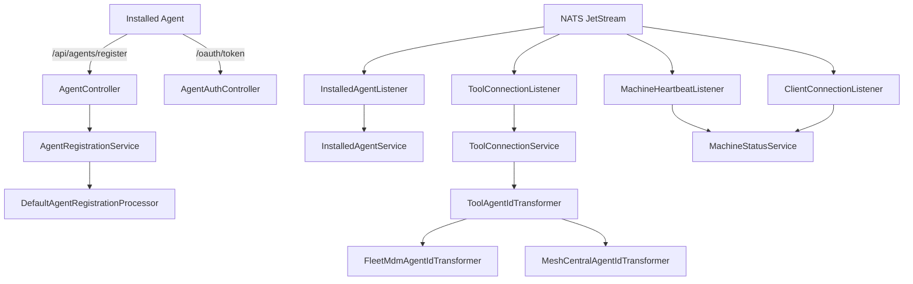
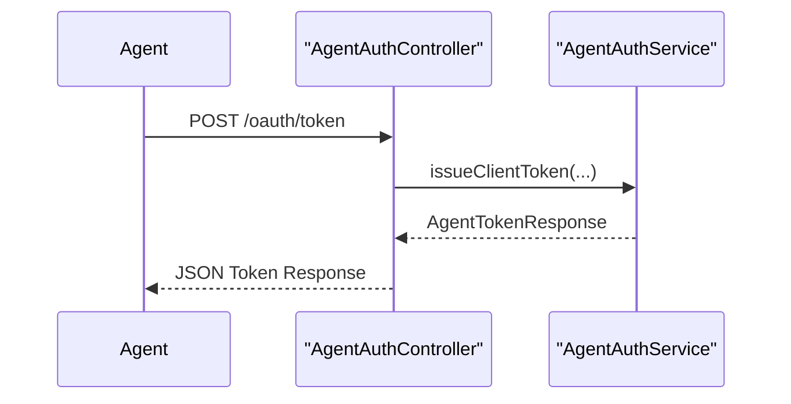
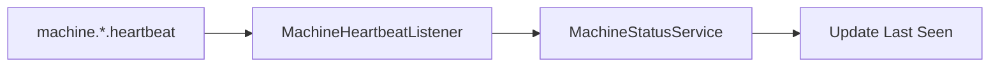
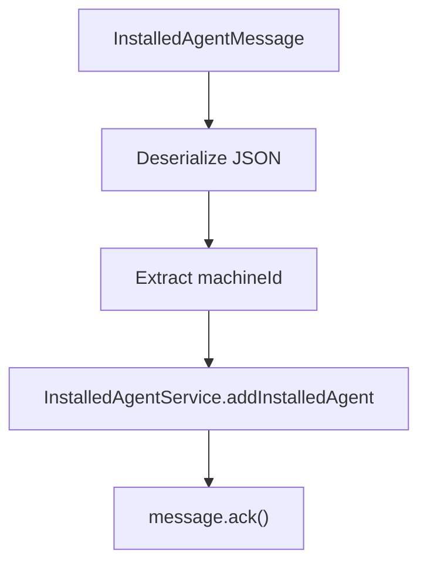
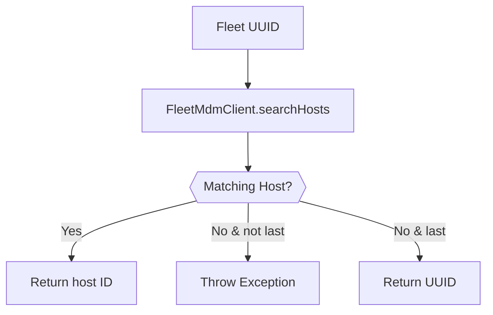
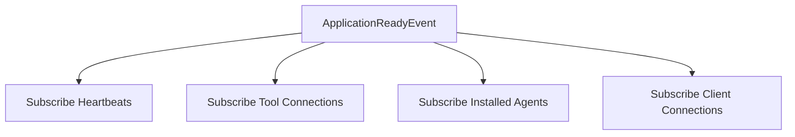

# Client Service Core

The **Client Service Core** module is responsible for managing machine agents, tool connections, client authentication, and real-time machine lifecycle events within the OpenFrame platform. It acts as the runtime-facing service that bridges installed agents and external tools (such as Fleet MDM and MeshCentral) with the broader OpenFrame backend ecosystem.

This module plays a critical role in:

- Agent registration and onboarding
- Machine online/offline state tracking
- Tool-to-machine association
- OAuth-based agent authentication
- NATS-driven event consumption
- Tool agent asset delivery (temporary implementation)

It integrates tightly with the data storage layer (MongoDB, Redis), the messaging layer (NATS JetStream), and upstream API services.

---

## High-Level Responsibilities

The Client Service Core provides:

1. **Agent Registration API** – Secure onboarding of machines.
2. **Agent OAuth Token Issuance** – Client credentials & refresh flows.
3. **Machine Lifecycle Processing** – Heartbeats and connection events.
4. **Tool Connection Processing** – Associating tools to machines.
5. **Installed Agent Tracking** – Tracking external tool agents per machine.
6. **Tool Agent ID Transformation** – Tool-specific ID normalization.
7. **Password Encoding Configuration** – Secure credential hashing.

---

## Architectural Overview



The module is event-driven for runtime updates and REST-driven for agent onboarding and authentication.

---

## Core Components

### 1. Configuration Layer

#### PasswordEncoderConfig
Provides a Spring `PasswordEncoder` bean using `BCryptPasswordEncoder`.

**Purpose:**
- Secure hashing of client secrets
- Used by authentication-related services

```java
@Bean
public PasswordEncoder passwordEncoder() {
    return new BCryptPasswordEncoder();
}
```

---

### 2. REST Controllers

#### AgentAuthController
**Endpoint:** `/oauth/token`

Handles OAuth-style token issuance for machine agents.

Supported parameters:
- `grant_type`
- `refresh_token`
- `client_id`
- `client_secret`

Flow:



Error handling:
- `IllegalArgumentException` → 401 Unauthorized
- Other exceptions → 400 with `server_error`

---

#### AgentController
**Endpoint:** `/api/agents/register`

Registers a machine agent using an `X-Initial-Key` header.

Input: `AgentRegistrationRequest`

Key data captured:
- Hostname
- Organization ID
- Network information (IP, MAC, UUID)
- Hardware information
- OS information
- Device status & type

This delegates to `AgentRegistrationService`, which may invoke post-processing hooks.

---

#### ToolAgentFileController
**Endpoint:** `/tool-agent/{assetId}`

Temporary implementation for delivering tool agent binaries.

Behavior:
- Returns platform-specific assets
- Supports macOS and Windows
- Throws exception for unsupported OS

> Marked as temporary until artifact repository integration is implemented.

---

## 3. Event-Driven Listeners (NATS)

The Client Service Core consumes real-time events from NATS JetStream.

### MachineHeartbeatListener

**Subject:** `machine.*.heartbeat`

Responsibilities:
- Extract machine ID from subject
- Generate server-side timestamp
- Update machine status to active



---

### ClientConnectionListener

Processes:
- Machine connected events
- Machine disconnected events

Updates machine status:
- `updateToOnline()`
- `updateToOffline()`

Fallback note indicates heartbeat mechanism compensates for NATS downtime.

---

### InstalledAgentListener

**Stream:** `INSTALLED_AGENTS`  
**Subject:** `machine.*.installed-agent`

JetStream configuration:
- Durable consumer
- Explicit ack policy
- Max delivery retries: 50
- Ack wait: 30 seconds

Processing flow:



If processing fails:
- Message remains unacknowledged
- Redelivery occurs until max attempts

---

### ToolConnectionListener

**Stream:** `TOOL_CONNECTIONS`  
**Subject:** `machine.*.tool-connection`

Processes tool connection events and:
- Extracts machine ID
- Transforms tool agent ID (if required)
- Persists tool association
- Acknowledges message on success

Implements delivery group support to enable horizontal scaling.

---

## 4. Agent Registration Processing

### DefaultAgentRegistrationProcessor

A conditional default implementation of `AgentRegistrationProcessor`.

- Used when no custom processor bean is defined
- Provides no-op post-processing
- Enables extensibility for enterprise customization


---

## 5. Tool Agent ID Transformation

When tools emit events, their internal IDs may not match OpenFrame expectations.

The module provides pluggable ID transformers via `ToolAgentIdTransformer`.

### FleetMdmAgentIdTransformer

Tool Type: `FLEET_MDM`

Responsibilities:
- Query Fleet MDM API
- Convert UUID → Fleet host ID
- Validate OS data presence
- Retry logic based on delivery attempt

Flow:



This ensures consistency between external Fleet MDM identifiers and internal OpenFrame references.

---

### MeshCentralAgentIdTransformer

Tool Type: `MESHCENTRAL`

Simple transformation:

```text
node// + agentToolId
```

Example:

```text
Original: abc123
Transformed: node//abc123
```

---

## Data Model Integration

The module interacts with:

- Machine entities
- Installed agent records
- Tool connection records
- User and organization context

These are persisted via the shared data layer (MongoDB repositories and related services).

---

## Runtime Lifecycle

Application startup flow:



Shutdown flow:
- Drain NATS dispatcher
- Unsubscribe JetStream consumers
- Ensure clean message acknowledgment state

---

## Security Considerations

- BCrypt password hashing for client secrets
- OAuth-based token issuance for agents
- Header-based initial key validation for registration
- Explicit acknowledgment for message durability
- Retry-safe event processing

---

## Extensibility Points

The module is designed for customization:

1. Replace `AgentRegistrationProcessor`
2. Add new `ToolAgentIdTransformer` implementations
3. Extend event processing services
4. Customize NATS stream configurations

---

## Summary

The **Client Service Core** module is the runtime integration backbone for machine agents in OpenFrame. It:

- Onboards machines securely
- Issues authentication tokens
- Tracks machine lifecycle events
- Integrates with external tools
- Consumes real-time messaging streams
- Provides extensible transformation and processing hooks

It forms the operational boundary between installed agents and the broader OpenFrame platform ecosystem.