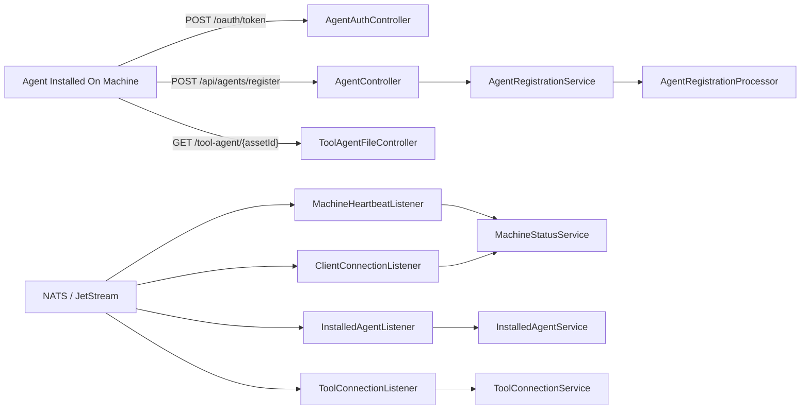
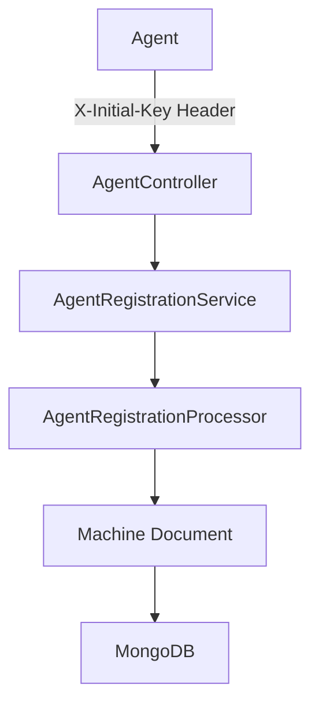
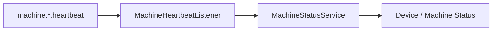
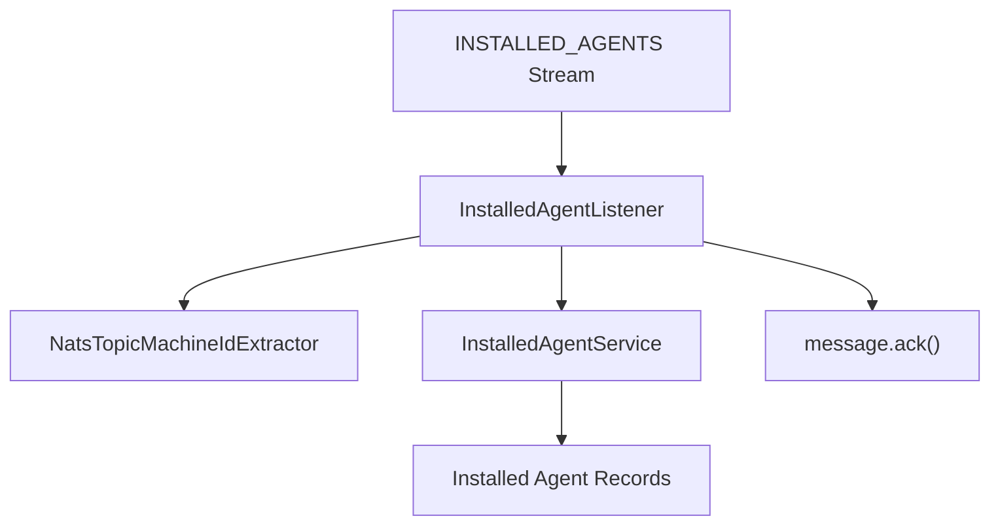
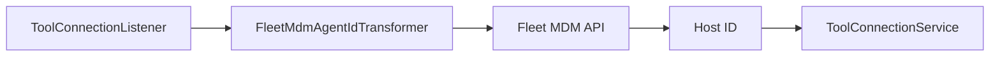
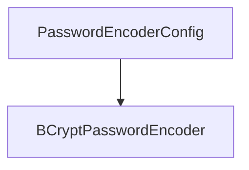
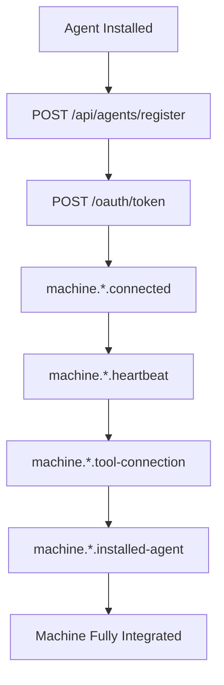

# Client Service Core Agent Endpoints And Listeners

The **Client Service Core Agent Endpoints And Listeners** module is the runtime bridge between external agents (installed on customer machines) and the OpenFrame backend platform. It exposes REST endpoints for agent authentication and registration, serves tool agent binaries, and processes real-time machine and tool events via NATS and JetStream listeners.

This module is part of the broader OpenFrame microservices ecosystem and works closely with:

- [API Service Core Rest GraphQL](../api_service_core_rest_graphql/api_service_core_rest_graphql.md)
- [Authorization Server Core And Tenant Context](../authorization_server_core_and_tenant_context/authorization_server_core_and_tenant_context.md)
- [Gateway Service Core Edge Security And Ws Proxy](../gateway_service_core_edge_security_and_ws_proxy/gateway_service_core_edge_security_and_ws_proxy.md)
- [Data Layer Mongo Documents And Repositories](../data_layer_mongo_documents_and_repositories/data_layer_mongo_documents_and_repositories.md)
- [Data Layer Streaming Kafka Pinot Cassandra](../data_layer_streaming_kafka_pinot_cassandra/data_layer_streaming_kafka_pinot_cassandra.md)

It is bootstrapped by the `ClientApplication` entrypoint from the services layer.

---

## 1. Architectural Overview

At a high level, the module has three responsibilities:

1. **Agent-facing REST APIs** (authentication, registration, binary delivery)
2. **Event-driven machine and tool state updates** via NATS
3. **Pluggable registration and ID transformation logic** for integrated tools

### High-Level Component Diagram



This design separates:

- **Synchronous control plane operations** (REST)
- **Asynchronous state/event processing** (NATS consumers)
- **Extensibility hooks** (processors and transformers)

---

## 2. REST Endpoints

### 2.1 Agent Authentication – `AgentAuthController`

**Path:** `/oauth/token`  
**Method:** `POST`

This endpoint issues access tokens for agents using client credentials or refresh flows.

Core responsibilities:

- Accepts parameters:
  - `grant_type`
  - `refresh_token` (optional)
  - `client_id` (optional)
  - `client_secret` (optional)
- Delegates to `AgentAuthService`
- Returns an `AgentTokenResponse`
- Handles:
  - `401` for invalid credentials
  - `400` for server-side processing errors

It integrates with the platform’s OAuth infrastructure defined in:

- [Authorization Server Core And Tenant Context](../authorization_server_core_and_tenant_context/authorization_server_core_and_tenant_context.md)
- [Security OAuth Bff And Jwt Support](../security_oauth_bff_and_jwt_support/security_oauth_bff_and_jwt_support.md)

---

### 2.2 Agent Registration – `AgentController`

**Path:** `/api/agents/register`  
**Method:** `POST`

This endpoint is responsible for onboarding a new agent instance.

#### Request Model

`AgentRegistrationRequest` contains:

- Core identity:
  - `hostname`
  - `organizationId`
- Network information:
  - `ip`, `macAddress`, `osUuid`
  - `agentVersion`, `status`
- Hardware:
  - `displayName`, `serialNumber`, `manufacturer`, `model`
- OS:
  - `type`, `osType`, `osVersion`, `osBuild`, `timezone`

This DTO is aligned with the domain model in:

- [Data Layer Mongo Documents And Repositories](../data_layer_mongo_documents_and_repositories/data_layer_mongo_documents_and_repositories.md)

#### Registration Flow



Key aspects:

- Uses `X-Initial-Key` header for bootstrap trust.
- Delegates to `AgentRegistrationService`.
- Allows post-processing via `AgentRegistrationProcessor`.

#### Extensibility – `DefaultAgentRegistrationProcessor`

The default processor:

- Is registered with `@ConditionalOnMissingBean`
- Provides a no-op implementation
- Can be overridden by custom beans

This enables tenant- or environment-specific logic without modifying core code.

---

### 2.3 Tool Agent File Delivery – `ToolAgentFileController`

**Path:** `/tool-agent/{assetId}`  
**Method:** `GET`

This controller:

- Serves platform-specific tool agent binaries
- Accepts query parameter `os` (e.g., `mac`, `windows`)
- Applies simple path-based resolution

> ⚠️ Currently marked as temporary logic for testing until artifact distribution is implemented.

In production, this would typically integrate with:

- Object storage
- Artifact registry
- GitHub releases or similar distribution systems

---

## 3. Event-Driven Listeners (NATS & JetStream)

The module heavily relies on NATS for real-time machine and tool lifecycle events.

### 3.1 Machine Heartbeat – `MachineHeartbeatListener`

**Subject:** `machine.*.heartbeat`

Responsibilities:

- Subscribes on application startup
- Extracts `machineId` from subject
- Generates server-side timestamp
- Calls `MachineStatusService.processHeartbeat(...)`



Design choice:

- Timestamp is generated server-side for consistency.
- Dispatcher lifecycle is managed with `@PreDestroy` cleanup.

---

### 3.2 Client Connection Events – `ClientConnectionListener`

Processes connection and disconnection events:

- `machineConnectedConsumer()`
- `machineDisconnectionConsumer()`

Event model:

- `ClientConnectionEvent`
- Timestamp parsed from payload
- Machine status updated to online/offline

This ensures accurate availability tracking in the platform.

---

### 3.3 Installed Agent Events – `InstalledAgentListener`

**Stream:** `INSTALLED_AGENTS`  
**Subject:** `machine.*.installed-agent`

Key characteristics:

- JetStream durable consumer
- Explicit acknowledgment (`AckPolicy.Explicit`)
- Redelivery up to `MAX_DELIVER = 50`
- `ACK_WAIT = 30s`



Failure strategy:

- If processing fails, message is left unacked
- JetStream retries until max delivery
- On last attempt, `lastAttempt = true` is passed to service layer

---

### 3.4 Tool Connection Events – `ToolConnectionListener`

**Stream:** `TOOL_CONNECTIONS`  
**Subject:** `machine.*.tool-connection`

Responsibilities:

- Durable JetStream consumer
- Delivery group support
- Redelivery tracking
- Delegates to `ToolConnectionService`

This enables the system to:

- Track which integrated tools are connected to which machines
- Maintain consistency across restarts
- Handle transient failures safely

---

## 4. Tool Agent ID Transformation

To support multiple integrated tools (e.g., Fleet MDM, MeshCentral), the module defines pluggable `ToolAgentIdTransformer` implementations.

### 4.1 Fleet MDM – `FleetMdmAgentIdTransformer`

Behavior:

- Resolves integrated tool configuration via:
  - `IntegratedToolService`
  - `ToolUrlService`
- Connects to Fleet MDM using `FleetMdmClient`
- Searches hosts by UUID
- Transforms UUID → numeric host ID
- Applies special handling on last retry attempt



Resilience strategy:

- If no valid host is found and not last attempt → throw exception
- On last attempt → log and fallback to original UUID

---

### 4.2 MeshCentral – `MeshCentralAgentIdTransformer`

Simpler transformation:

- Adds prefix `node//` to the provided ID
- Ensures consistent ID format for MeshCentral tool integration

Example transformation:

```text
Input:  abc123
Output: node//abc123
```

---

## 5. Security and Cryptography

### 5.1 Password Encoding – `PasswordEncoderConfig`

Defines:

- A `BCryptPasswordEncoder` bean



This encoder is used for:

- Client secrets
- Agent bootstrap credentials
- Any password-like artifacts within the client domain

It aligns with the broader security configuration defined in:

- [Security OAuth Bff And Jwt Support](../security_oauth_bff_and_jwt_support/security_oauth_bff_and_jwt_support.md)

---

## 6. End-to-End Lifecycle View

The following diagram illustrates the complete lifecycle of a machine:



This demonstrates how REST endpoints and NATS listeners together establish:

- Identity
- Authentication
- Presence tracking
- Tool association
- Installed agent state

---

## 7. Design Principles

The **Client Service Core Agent Endpoints And Listeners** module is designed around:

- **Event-driven architecture** (NATS + JetStream)
- **Durable, retryable processing**
- **Extensibility via processors and transformers**
- **Strict separation of REST and asynchronous flows**
- **Security-first design with OAuth and BCrypt**

It acts as the operational edge of the OpenFrame backend, where real-world machine agents meet platform services.

In combination with the API, Gateway, Authorization, and Data layers, it enables scalable, multi-tenant, real-time device and tool orchestration.