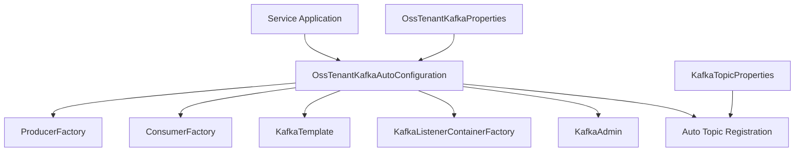
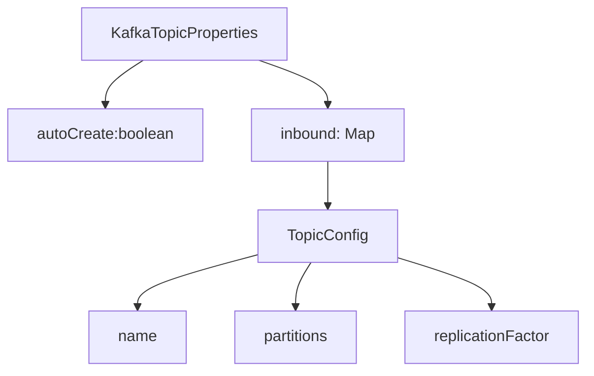
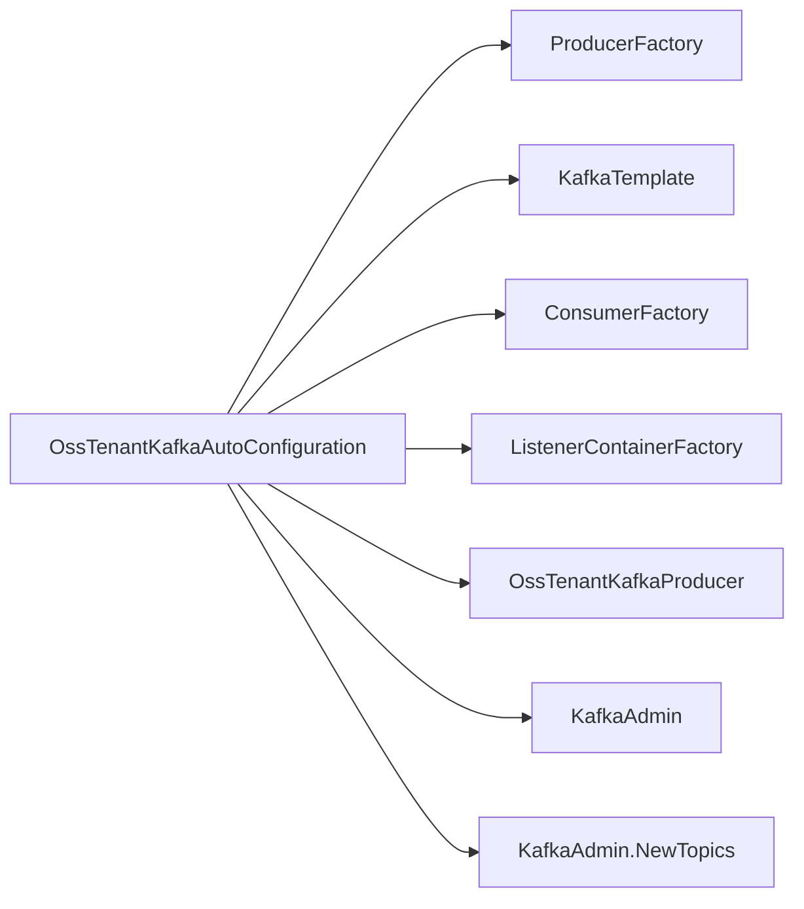
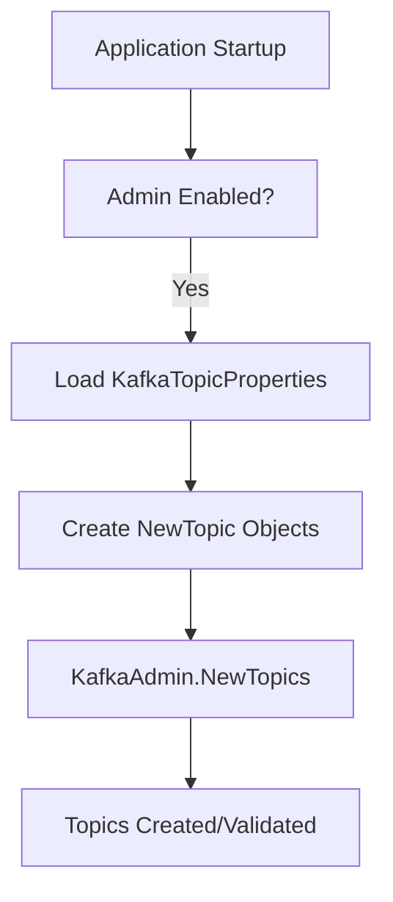

# Data Access Kafka

## Overview

The **Data Access Kafka** module provides standardized, multi-tenant Kafka configuration and auto-configuration for the OpenFrame platform. It encapsulates all Kafka-related infrastructure concerns including:

- Producer and consumer factories
- Kafka template configuration
- Listener container configuration
- Topic auto-creation
- Tenant-scoped Kafka properties

This module is designed to be imported by service applications (such as Stream Service, Management Service, and Client Service) that require reliable event-driven communication over Kafka.

It replaces the default Spring Boot `KafkaAutoConfiguration` with a custom, tenant-aware configuration aligned with the OpenFrame OSS architecture.

---

## Architectural Role in the Platform

Data Access Kafka acts as the foundational Kafka infrastructure layer used by higher-level modules such as:

- Stream processing components
- Event-driven listeners
- Debezium CDC handlers
- Management initializers
- Client-side event publishers

It does **not** implement business logic. Instead, it provides reusable, auto-configured Kafka infrastructure that other modules build upon.

### High-Level Architecture



The module integrates tightly with Spring Boot's configuration model while maintaining isolation from default auto-configuration.

---

## Core Components

The Data Access Kafka module consists of four primary configuration components:

1. **KafkaTopicProperties**
2. **OssKafkaConfig**
3. **OssTenantKafkaAutoConfiguration**
4. **OssTenantKafkaProperties**

Each component plays a specific role in bootstrapping and managing Kafka infrastructure.

---

## OssKafkaConfig

```text
com.openframe.kafka.config.OssKafkaConfig
```

### Purpose

This configuration class enables Kafka support while explicitly excluding Spring Boot's default `KafkaAutoConfiguration`.

### Key Responsibilities

- Enables Kafka via `@EnableKafka`
- Prevents default auto-configuration conflicts
- Ensures the platform uses the custom OSS tenant configuration

### Why This Matters

Spring Boot provides automatic Kafka configuration, but OpenFrame requires:

- Tenant-aware property namespaces
- Custom topic auto-registration
- Controlled producer/consumer serialization

By excluding the default configuration, the module guarantees predictable and centralized Kafka behavior.

---

## OssTenantKafkaProperties

```text
com.openframe.kafka.config.OssTenantKafkaProperties
```

### Purpose

Defines tenant-scoped Kafka configuration under the prefix:

```text
spring.oss-tenant
```

It wraps Spring's native `KafkaProperties`, inheriting full support for:

- Producer configuration
- Consumer configuration
- Listener configuration
- Template configuration
- Bootstrap servers

### Key Fields

- `enabled` – Enables/disables OSS Kafka configuration (default: true)
- `kafka` – Full `KafkaProperties` object

### Configuration Example

```yaml
spring:
  oss-tenant:
    enabled: true
    kafka:
      bootstrap-servers: localhost:9092
      producer:
        acks: all
      consumer:
        group-id: openframe-group
```

### Design Rationale

By wrapping `KafkaProperties`, the module avoids reimplementing Kafka configuration logic while enforcing a tenant-specific namespace.

---

## KafkaTopicProperties

```text
com.openframe.kafka.config.KafkaTopicProperties
```

### Purpose

Provides declarative topic configuration and optional automatic topic creation.

### Configuration Prefix

```text
openframe.oss-tenant.kafka.topics
```

### Structure



### TopicConfig Fields

- `name` – Kafka topic name
- `partitions` – Number of partitions (default: 1)
- `replicationFactor` – Replication factor (default: 1)

### Example Configuration

```yaml
openframe:
  oss-tenant:
    kafka:
      topics:
        autoCreate: true
        inbound:
          device-events:
            name: device.events
            partitions: 3
            replicationFactor: 2
```

When admin support is enabled, these topics are automatically registered at startup.

---

## OssTenantKafkaAutoConfiguration

```text
com.openframe.kafka.config.OssTenantKafkaAutoConfiguration
```

### Purpose

This is the central auto-configuration class responsible for constructing all Kafka infrastructure beans for the OSS tenant cluster.

It activates only when:

```text
spring.oss-tenant.kafka.enabled=true
```

### Bean Overview



### 1. Producer Factory

- Uses `StringSerializer` for keys
- Uses `JsonSerializer` for values
- Builds properties from `KafkaProperties`

Ensures structured JSON event publishing across services.

---

### 2. KafkaTemplate

Provides a strongly typed template:

```text
KafkaTemplate<String, Object>
```

Supports:

- Default topic configuration
- JSON message publishing
- Tenant-scoped configuration

This template is used by `OssTenantKafkaProducer`.

---

### 3. Consumer Factory

- Uses `StringDeserializer` for keys
- Uses `JsonDeserializer` for values
- Builds properties from `KafkaProperties`

Ensures consistent deserialization for event-driven services.

---

### 4. Listener Container Factory

Creates a configurable `ConcurrentKafkaListenerContainerFactory`.

Supports:

- Concurrency settings
- Custom acknowledgment mode
- Poll timeout configuration
- Idle event interval
- Container logging configuration

Default acknowledgment mode falls back to:

```text
ContainerProperties.AckMode.RECORD
```

This guarantees per-record acknowledgment unless overridden.

---

### 5. KafkaAdmin & Topic Auto-Registration

When admin is enabled:

```text
spring.oss-tenant.kafka.admin.enabled=true
```

The module:

- Creates a `KafkaAdmin` bean
- Registers topics defined in `KafkaTopicProperties`
- Logs topic registration at startup

### Topic Creation Flow



This mechanism ensures infrastructure consistency across environments.

---

## Multi-Tenant Considerations

The module isolates Kafka configuration under the `spring.oss-tenant` namespace to:

- Avoid collision with other Kafka clusters
- Support multiple cluster configurations in the same application
- Maintain tenant-scoped infrastructure separation

The conditional configuration model allows services to:

- Enable or disable Kafka completely
- Enable or disable topic auto-registration
- Override producer/consumer behavior per environment

---

## Integration with Other Modules

Data Access Kafka is primarily consumed by:

- Stream processing modules handling event transformation
- Management components initializing event streams
- Client services publishing lifecycle events
- Authorization and API services emitting domain events

It provides infrastructure only and does not depend on business-domain modules.

---

## Design Principles

1. **Infrastructure First** – No business logic, only configuration.
2. **Tenant Isolation** – Dedicated property namespace.
3. **Spring-Native Integration** – Reuses `KafkaProperties`.
4. **Declarative Topic Management** – Config-driven topic registration.
5. **Conditional Activation** – Fully toggleable via properties.

---

## Summary

The **Data Access Kafka** module centralizes Kafka infrastructure for the OpenFrame platform. By replacing default Spring auto-configuration with a tenant-aware model, it ensures:

- Predictable Kafka setup
- Consistent serialization/deserialization
- Environment-driven topic management
- Clean separation between infrastructure and domain logic

It forms the event backbone of the OpenFrame microservice ecosystem while remaining lightweight, reusable, and highly configurable.
