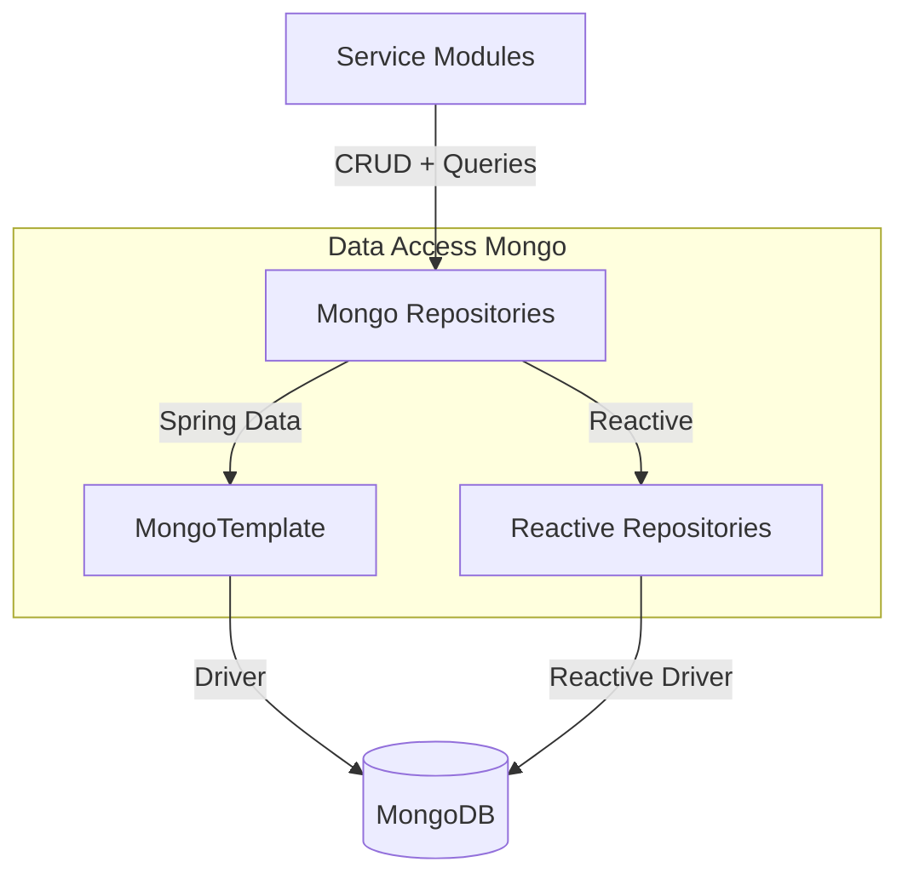
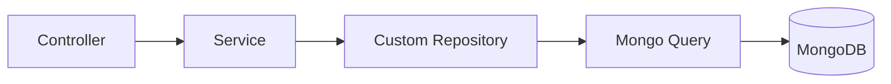
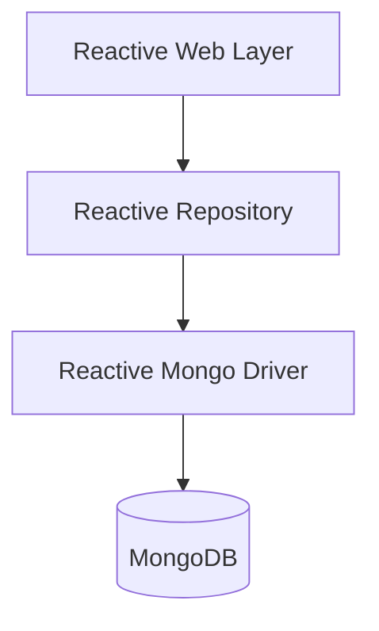
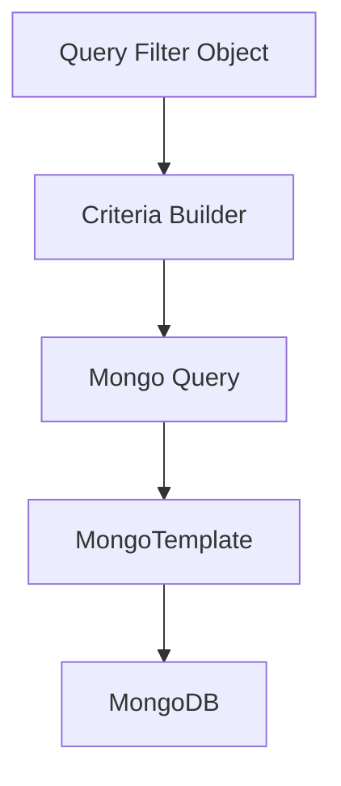

# Data Access Mongo

## Overview

The **Data Access Mongo** module provides the MongoDB-based persistence layer for the OpenFrame platform. It defines:

- MongoDB configuration and indexing
- Domain document models
- Blocking and reactive repositories
- Custom query implementations with filtering, search, and cursor-based pagination

This module is consumed by higher-level services such as:

- Authorization Server Core (OAuth clients, tokens, users)
- API Service Core (devices, organizations, events)
- Gateway Service Core (tenant and security lookups)
- Management and Stream services (event and tool data)

It acts as the canonical MongoDB adapter for the platform’s multi-tenant, event-driven architecture.

---

## High-Level Architecture



### Responsibilities

- Encapsulate MongoDB-specific logic
- Provide consistent filtering and pagination patterns
- Support both blocking and reactive stacks
- Enforce indexes and compound constraints
- Model multi-tenant and OAuth-aware data

---

## Configuration Layer

### MongoConfig
Component:
- `deps.openframe-oss-lib.openframe-data-mongo.src.main.java.com.openframe.data.config.MongoConfig.MongoConfig`

Responsibilities:

- Enables `@EnableMongoRepositories` for blocking repositories
- Enables `@EnableReactiveMongoRepositories` for reactive repositories
- Enables Mongo auditing
- Customizes `MappingMongoConverter`
  - Registers custom conversions
  - Replaces dots in map keys with `__dot__`

This ensures compatibility with MongoDB field restrictions and consistent entity mapping.

### MongoIndexConfig
Component:
- `deps.openframe-oss-lib.openframe-data-mongo.src.main.java.com.openframe.data.config.MongoIndexConfig.MongoIndexConfig`

Responsibilities:

- Ensures indexes at startup via `MongoTemplate`
- Creates compound indexes on the `application_events` collection

Example enforced indexes:

```text
Collection: application_events
Indexes:
- userId (ASC), timestamp (DESC)
- type (ASC), metadata.tags (ASC)
```

These indexes optimize event filtering and time-range queries.

---

## Domain Document Models

The module defines MongoDB `@Document` entities representing core business objects.

### AuthUser
Component:
- `deps.openframe-oss-lib.openframe-data-mongo.src.main.java.com.openframe.data.document.auth.AuthUser.AuthUser`

Extends the base `User` model and adds:

- `tenantId` (multi-tenant isolation)
- `passwordHash`
- `loginProvider` (LOCAL, GOOGLE, etc.)
- `externalUserId`
- `lastLogin`

Compound index:

```text
{ tenantId: 1, email: 1 } (unique, partial)
```

Used by:
- Authorization Server Core
- Security and OAuth flows

---

### Organization
Component:
- `deps.openframe-oss-lib.openframe-data-mongo.src.main.java.com.openframe.data.document.organization.Organization.Organization`

Features:

- Unique `organizationId`
- Soft delete support (`deleted`, `deletedAt`)
- Contract lifecycle (`contractStartDate`, `contractEndDate`)
- Auditing (`createdAt`, `updatedAt`)

Includes business logic:

- `isContractActive()`
- `isDeleted()`

Used heavily by API Service Core and management workflows.

---

### Device
Component:
- `deps.openframe-oss-lib.openframe-data-mongo.src.main.java.com.openframe.data.document.device.Device.Device`

Represents managed endpoints:

- Machine linkage
- OS and hardware metadata
- Health and configuration
- Status tracking

Used by:
- API Service Core
- Client Service Core

---

### CoreEvent
Component:
- `deps.openframe-oss-lib.openframe-data-mongo.src.main.java.com.openframe.data.document.event.CoreEvent.CoreEvent`

Represents internal system events:

- `type`
- `payload`
- `timestamp`
- `userId`
- `status` (CREATED, PROCESSING, COMPLETED, FAILED)

Used by:
- Stream Service Core
- External API Service Core

---

### OAuth Models

#### MongoRegisteredClient
Stores OAuth client metadata:

- `clientId` (unique)
- Grant types
- Redirect URIs
- PKCE requirements
- Token TTL settings

Used by:
- Authorization Server Core

#### OAuthToken
Stores issued tokens:

- Access and refresh tokens
- Expiry timestamps
- Client association
- Scopes

Used by:
- Authorization Server Core
- Security modules

---

## Repository Layer

The repository layer follows a consistent structure:

1. Spring Data repository interfaces
2. Custom repository implementations using `MongoTemplate`
3. Shared base repository interfaces

---

## Blocking Repositories

Examples:

- `OAuthTokenRepository`
- `ExternalApplicationEventRepository`
- CustomOrganizationRepositoryImpl
- CustomEventRepositoryImpl
- CustomMachineRepositoryImpl
- CustomIntegratedToolRepositoryImpl

### Pattern: Custom Filtering + Cursor Pagination



Common features:

- Dynamic `Criteria` building
- Search via regex (case-insensitive)
- Cursor-based pagination using `_id`
- Multi-field sorting with fallback to `_id`
- Distinct value extraction

### Cursor Pagination Strategy

All major custom repositories implement:

- Cursor parsing via `ObjectId`
- Direction-aware comparison (`lt` or `gt`)
- Stable sorting by secondary `_id`

This enables scalable, index-friendly pagination for large datasets.

---

## Reactive Repositories

Reactive repositories are enabled when the application runs in reactive mode.

Examples:

- `ReactiveUserRepository`
- `ReactiveOAuthClientRepository`

They:

- Extend `ReactiveMongoRepository`
- Implement shared base repository contracts
- Return `Mono<T>` instead of `Optional<T>`



This enables non-blocking authentication and client lookup in high-concurrency environments.

---

## Shared Base Repository Contracts

To maintain consistency across blocking and reactive implementations, the module defines technology-agnostic base interfaces:

- BaseUserRepository
- BaseTenantRepository
- BaseIntegratedToolRepository

These:

- Abstract return types (`Optional` vs `Mono`)
- Enforce common method signatures
- Reduce duplication across implementations

This design ensures that higher-level services depend on consistent repository contracts.

---

## Query & Filtering Architecture

Custom repositories implement structured filtering objects such as:

- MachineQueryFilter
- EventQueryFilter
- OrganizationQueryFilter
- ToolQueryFilter

Query construction typically follows:



Benefits:

- Database-level filtering (not in-memory)
- Index-aware queries
- Search and filter combination
- Clean separation between service logic and persistence logic

---

## Multi-Tenancy Considerations

Multi-tenancy is supported through:

- Tenant-aware indexes (e.g., AuthUser)
- Domain-based tenant lookup (BaseTenantRepository)
- Tenant-specific OAuth client storage

The Authorization Server Core relies on this module to:

- Isolate users per tenant
- Register clients per tenant
- Issue tenant-scoped tokens

---

## Cross-Module Integration

Data Access Mongo serves as the persistence backbone for:

- API Service Core → Devices, Organizations, Events
- Authorization Server Core → Users, OAuth clients, Tokens
- Stream Service Core → Event enrichment and processing
- Gateway Service Core → Tenant and security resolution
- Management Service Core → Tool and configuration management

It intentionally contains no business orchestration logic — only persistence and query behavior.

---

## Design Principles

1. Separation of concerns – persistence isolated from services
2. Reactive + blocking support
3. Cursor-based scalable pagination
4. Index-driven query optimization
5. Multi-tenant aware data modeling
6. Consistent repository abstraction patterns

---

## Summary

The **Data Access Mongo** module is the MongoDB adapter layer for the OpenFrame ecosystem. It:

- Defines domain persistence models
- Provides both reactive and blocking repositories
- Implements advanced filtering and pagination patterns
- Enforces indexes and compound constraints
- Supports multi-tenant and OAuth-driven architecture

It enables higher-level services to remain database-agnostic while leveraging MongoDB’s flexibility and performance characteristics.