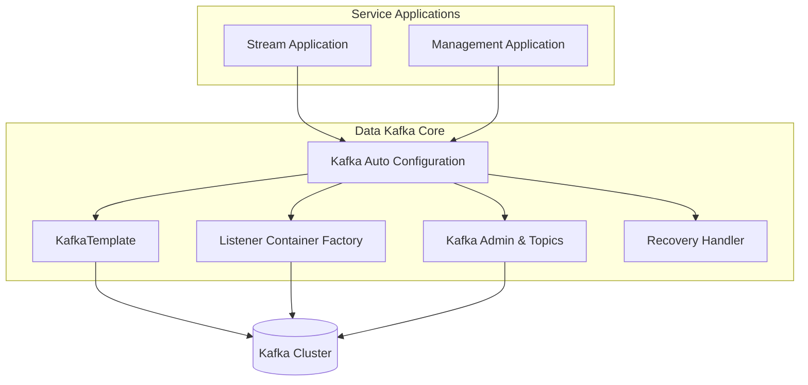
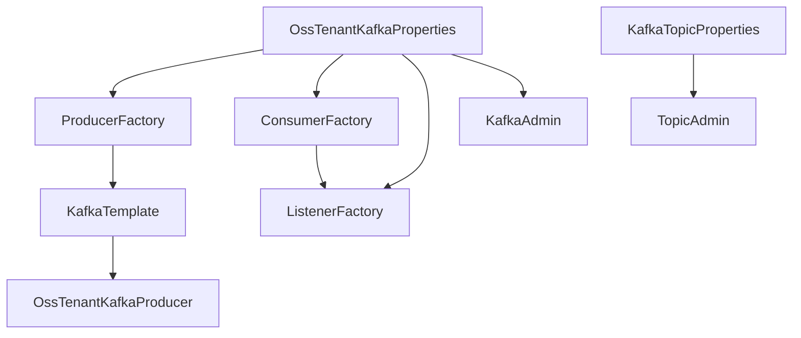
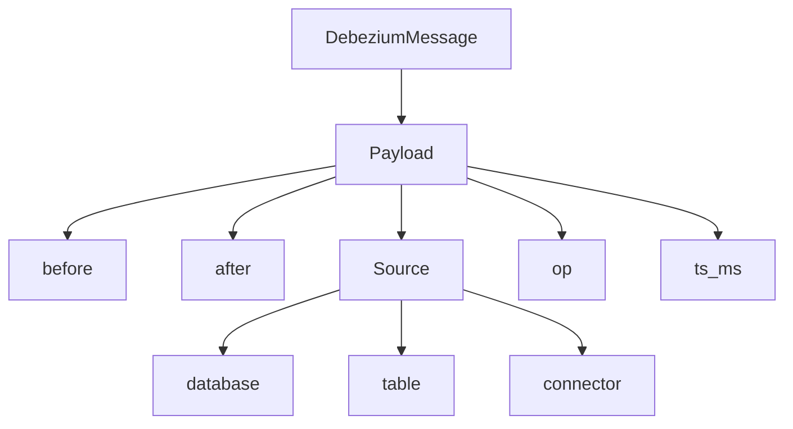
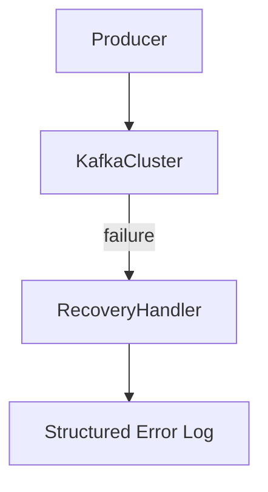

# Data Kafka Core

## Overview

The **Data Kafka Core** module provides the foundational Kafka infrastructure for the OpenFrame OSS tenant ecosystem. It encapsulates:

- Multi-tenant Kafka configuration
- Producer and consumer auto-configuration
- Topic provisioning and management
- Debezium message modeling
- Producer-side recovery handling
- Standardized Kafka headers

This module acts as the **Kafka infrastructure backbone** for higher-level services such as:

- Stream processing services
- Management and initialization services
- CDC (Change Data Capture) pipelines

It does not implement business logic directly. Instead, it standardizes and centralizes Kafka configuration so that other modules can safely rely on consistent messaging behavior.

---

## Architectural Role in the Platform

Data Kafka Core sits at the infrastructure layer and is consumed by services such as Stream Service Core and Management Service Core.



### Responsibilities

- Replace default Spring Boot Kafka auto-configuration
- Provide OSS tenant–specific Kafka properties
- Configure producers, consumers, templates, and listener factories
- Optionally auto-create topics
- Provide shared message models (Debezium)
- Standardize header names across services

---

## Configuration Model

The module introduces two major configuration property groups:

### 1. Oss Tenant Kafka Properties

Class: `OssTenantKafkaProperties`

Prefix:

```text
spring.oss-tenant
```

This wraps Spring’s `KafkaProperties` and allows full control over:

- Bootstrap servers
- Producer configuration
- Consumer configuration
- Listener settings
- Admin settings

Key flag:

```text
spring.oss-tenant.enabled=true
```

If disabled, the entire auto-configuration is skipped.

---

### 2. Kafka Topic Properties

Class: `KafkaTopicProperties`

Prefix:

```text
openframe.oss-tenant.kafka.topics
```

Used to declaratively define inbound topics and enable auto-creation.

Example structure:

```text
openframe.oss-tenant.kafka.topics:
  autoCreate: true
  inbound:
    device-events:
      name: device.events
      partitions: 3
      replicationFactor: 1
```

If admin is enabled, topics are automatically registered using `KafkaAdmin.NewTopics`.

---

## Auto-Configuration Lifecycle

The core entry point is:

- `OssTenantKafkaAutoConfiguration`

This class is activated when:

- `spring.oss-tenant.enabled=true`

It wires the following beans:

- `ProducerFactory`
- `KafkaTemplate`
- `ConsumerFactory`
- `ConcurrentKafkaListenerContainerFactory`
- `KafkaAdmin`
- `KafkaAdmin.NewTopics`
- `OssTenantKafkaProducer`

### Bean Wiring Flow



---

## Producer Configuration

### Producer Factory

- Key serializer: `StringSerializer`
- Value serializer: `JsonSerializer`
- Built from `KafkaProperties.buildProducerProperties()`

### KafkaTemplate

The template:

- Uses the configured producer factory
- Supports a configurable default topic
- Is injected into `OssTenantKafkaProducer`

This ensures all producer behavior remains consistent across services.

---

## Consumer Configuration

### Consumer Factory

- Key deserializer: `StringDeserializer`
- Value deserializer: `JsonDeserializer`
- Built from `KafkaProperties.buildConsumerProperties()`

### Listener Container Factory

Configurable via properties:

- Concurrency
- Ack mode (defaults to `RECORD` if not set)
- Poll timeout
- Idle event interval
- Logging of container configuration

This factory standardizes listener behavior for all modules using `@KafkaListener`.

---

## Topic Administration

When admin is enabled:

```text
spring.oss-tenant.kafka.admin.enabled=true
```

The module:

1. Creates a `KafkaAdmin` bean
2. Iterates over inbound topic configurations
3. Registers topics via `TopicBuilder`

Topic creation is conditional and logged during startup.

---

## Debezium Message Model

Class: `DebeziumMessage<T>`

This generic wrapper models Debezium CDC events.

### Structure



### Key Fields

- `before` – entity state before change
- `after` – entity state after change
- `operation` – CRUD operation type
- `timestamp` – event timestamp
- `source` – metadata about connector, database, schema, table, collection

This model is consumed by stream processing modules such as Stream Service Core.

---

## Kafka Header Standardization

Interface: `KafkaHeader`

Defines shared header constants:

```text
message-type
```

This ensures cross-service consistency when attaching metadata to Kafka messages.

---

## Recovery Handling

Class: `KafkaRecoveryHandlerImpl`

Implements producer-side recovery handling.

### Behavior

When enqueue fails:

- Logs structured error details
- Captures topic, key, payload summary
- Attaches full stack trace



This implementation focuses on observability rather than automatic replay.

---

## Relationship With Other Modules

### Stream Service Core

The Stream Service Core module consumes Kafka events using the listener infrastructure defined here. It relies on:

- Listener container factory
- Debezium message model
- Shared serialization configuration

See: [Stream Service Core](../stream-service-core/stream-service-core.md)

---

### Management Service Core

The Management Service Core may rely on Kafka for:

- Connector initialization
- Topic provisioning
- Operational health checks

See: [Management Service Core](../management-service-core/management-service-core.md)

---

## Design Principles

1. **Infrastructure Isolation**  
   Business logic is intentionally excluded.

2. **Property-Driven Configuration**  
   Everything is controlled via Spring Boot configuration.

3. **Safe Defaults**  
   - Default ack mode: `RECORD`
   - Auto-create topics optional
   - Admin enabled by default

4. **Multi-Tenant Awareness**  
   Dedicated property namespace (`spring.oss-tenant`).

5. **Observability First**  
   Structured logging for recovery handling.

---

## Summary

The **Data Kafka Core** module standardizes Kafka infrastructure across the OpenFrame OSS ecosystem.

It provides:

- Centralized Kafka configuration
- Topic provisioning support
- Producer and consumer factories
- Debezium CDC modeling
- Recovery logging strategy

By abstracting Kafka infrastructure concerns into a single reusable module, the platform ensures consistency, reduces duplication, and simplifies operational management across all Kafka-enabled services.
