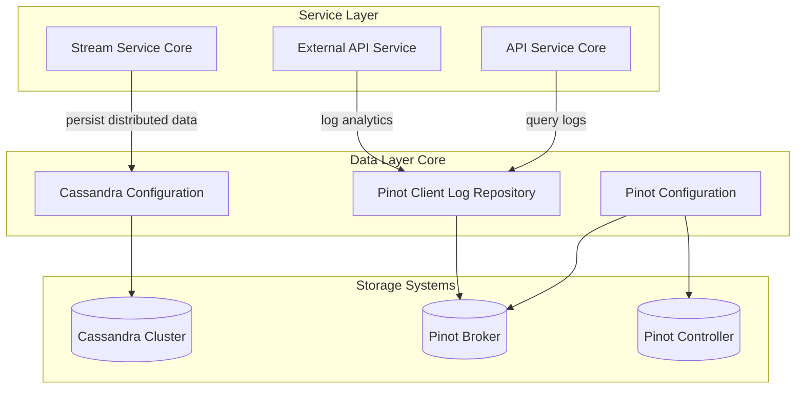
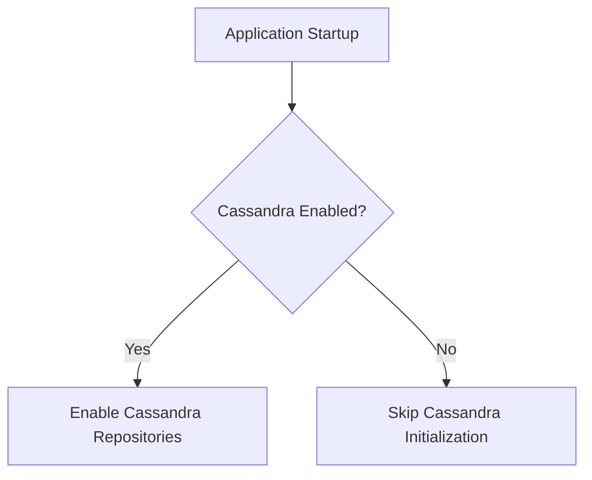
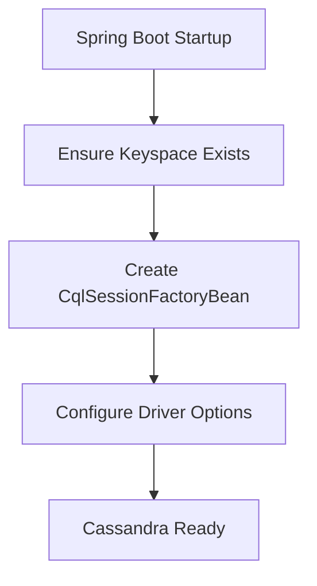
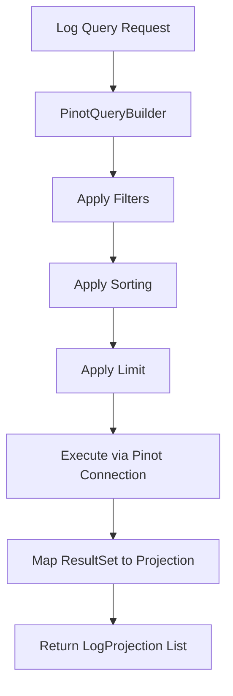
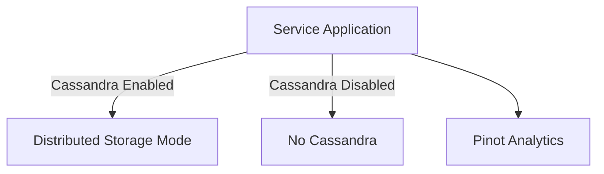

# Data Layer Core

The **Data Layer Core** module provides foundational configuration and repository abstractions for analytical and distributed data stores used across the OpenFrame platform. It enables integration with **Cassandra** for distributed transactional storage and **Apache Pinot** for real-time analytics and log querying.

This module acts as the infrastructure bridge between service-layer modules (API, Stream, Management, External API) and high-performance storage systems.

---

## 1. Purpose and Responsibilities

The Data Layer Core module is responsible for:

- Conditional activation of Cassandra repositories
- Programmatic Cassandra session initialization and keyspace management
- Apache Pinot broker and controller connectivity
- Analytical log querying and filtering logic
- Base repository support for time-series and search use cases

It complements:

- [Data Layer Mongo](../data-layer-mongo/data-layer-mongo.md) – primary document persistence
- [Data Layer Kafka](../data-layer-kafka/data-layer-kafka.md) – streaming and event transport
- [Stream Service Core](../stream-service-core/stream-service-core.md) – event enrichment and processing

The Data Layer Core focuses specifically on **distributed and analytical data workloads**.

---

# 2. High-Level Architecture



### Architectural Principles

- **Conditional Activation** – Cassandra only initializes if explicitly enabled
- **Programmatic Keyspace Management** – Keyspaces are created automatically
- **Separation of Concerns** – Configuration, connection management, and query execution are isolated
- **Analytics Optimization** – Pinot is used for search, filtering, and high-volume log queries

---

# 3. Core Components

## 3.1 DataConfiguration

**Component:** `DataConfiguration`

Provides conditional activation of Cassandra repositories.

### Responsibilities

- Enables Cassandra repositories only when:

```text
spring.data.cassandra.enabled=true
```

- Prevents unnecessary Cassandra initialization in services that do not require it

### Key Behavior



This ensures modular deployment flexibility across service applications.

---

## 3.2 CassandraConfig

**Component:** `CassandraConfig`

Extends `AbstractCassandraConfiguration` to provide a fully programmatic Cassandra setup.

### Key Features

- Reads configuration from Spring properties
- Ensures keyspace exists before session initialization
- Configures:
  - Local datacenter
  - Contact points
  - Replication factor
  - Load balancing
  - Timestamp generator

### Initialization Flow



### Keyspace Creation Logic

Before connecting to the configured keyspace:

- A temporary session connects without a keyspace
- Executes:

```text
CREATE KEYSPACE IF NOT EXISTS <keyspace>
WITH replication = {'class': 'SimpleStrategy', 'replication_factor': N}
```

- Prevents deployment failures on first startup

### Bean Provided

```text
CassandraSessionLogger
```

This allows session-level logging and monitoring.

---

## 3.3 PinotConfig

**Component:** `PinotConfig`

Provides Apache Pinot connectivity.

### Beans Created

- `pinotBrokerConnection`
- `pinotControllerConnection`

### Configuration Properties

```text
pinot.broker.url
pinot.controller.url
```

### Responsibilities

- Creates broker connection using properties-based configuration
- Creates controller connection using host list
- Enables analytic query execution through Pinot repositories

---

## 3.4 PinotEventEntity

**Component:** `PinotEventEntity`

A placeholder analytical model class intended for Pinot-backed entities.

While currently empty, it serves as:

- A semantic anchor for analytical event modeling
- A future extension point for Pinot-based projections

---

## 3.5 PinotClientLogRepository

**Component:** `PinotClientLogRepository`

This is the primary analytical repository implementation in the Data Layer Core.

It provides dynamic query construction and execution against Apache Pinot for log data.

---

# 4. PinotClientLogRepository Deep Dive

## 4.1 Responsibilities

- Build dynamic SQL-like Pinot queries
- Support cursor-based pagination
- Provide filtering by:
  - Date range
  - Tool type
  - Event type
  - Severity
  - Organization
  - Device ID
- Provide full-text relevance search
- Return filter option values dynamically
- Enforce safe sortable fields

---

## 4.2 Query Construction Flow



---

## 4.3 Sorting Safety

Only fields in the whitelist are allowed:

```text
eventTimestamp
severity
eventType
toolType
organizationId
deviceId
ingestDay
```

If invalid:

- Sorting is rejected
- Default sort field is used:

```text
eventTimestamp
```

This prevents query injection and runtime errors.

---

## 4.4 Log Search vs Log Filter

| Operation | Behavior |
|-----------|----------|
| findLogs | Structured filtering only |
| searchLogs | Adds relevance-based search condition |

Both methods:

- Use cursor-based pagination
- Execute via `Connection.execute()`
- Map results using column index resolution

---

## 4.5 Result Mapping Strategy

The repository:

1. Retrieves `ResultSetGroup`
2. Extracts `ResultSet`
3. Builds a column index map dynamically
4. Maps rows into:
   - `LogProjection`
   - `OrganizationOption`
   - Filter option strings

This approach avoids hardcoded column positions.

---

## 4.6 Error Handling

All Pinot execution errors:

- Are logged
- Wrapped in `PinotQueryException`
- Preserve root cause

This standardizes failure propagation to service layers.

---

# 5. Interaction with Other Modules

## With Stream Service Core

The Stream Service Core enriches and processes events, which are:

- Persisted in distributed stores (Cassandra)
- Indexed and made queryable in Pinot

## With API Service Core

API data fetchers call analytical repositories to:

- Provide filtered logs
- Offer dynamic filter options
- Support search functionality

## With External API Service

External-facing endpoints rely on Pinot for:

- Log retrieval
- Organization filtering
- Event metadata exploration

---

# 6. Deployment Flexibility

The Data Layer Core supports flexible service deployment models:



This allows:

- Lightweight services without Cassandra
- Full distributed deployments with keyspace auto-provisioning
- Centralized analytics via Pinot

---

# 7. Design Characteristics

- ✅ Modular activation
- ✅ Distributed-ready (Cassandra)
- ✅ Analytics-optimized (Pinot)
- ✅ Safe dynamic query construction
- ✅ Cursor-based pagination
- ✅ Strong error encapsulation

---

# 8. Summary

The **Data Layer Core** module provides the analytical and distributed data backbone for OpenFrame.

It:

- Configures Cassandra with automatic keyspace provisioning
- Connects to Apache Pinot for real-time analytics
- Implements advanced log querying with filtering, sorting, and search
- Serves as the integration layer between service modules and scalable storage systems

Together with Mongo and Kafka data modules, it forms a complete multi-model persistence architecture supporting transactional, streaming, and analytical workloads.

---

**End of Data Layer Core Documentation**
