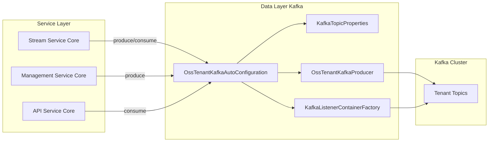
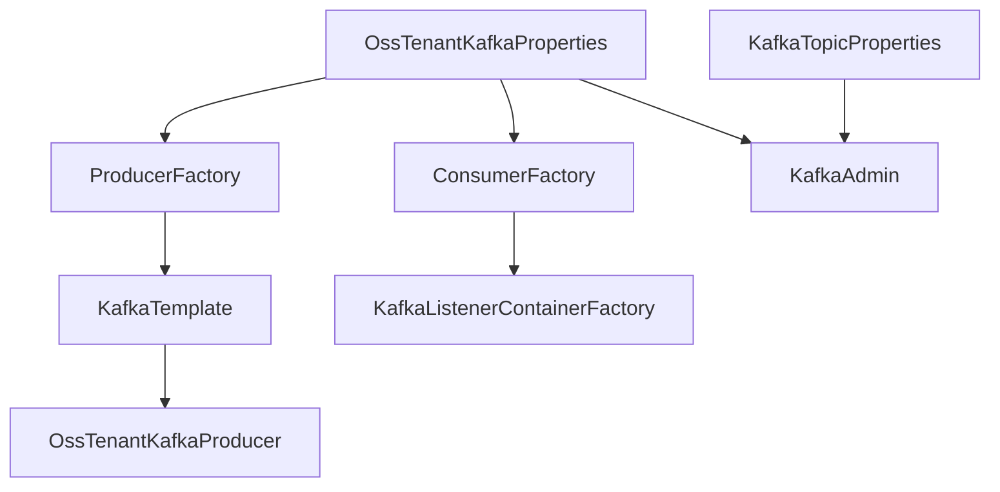
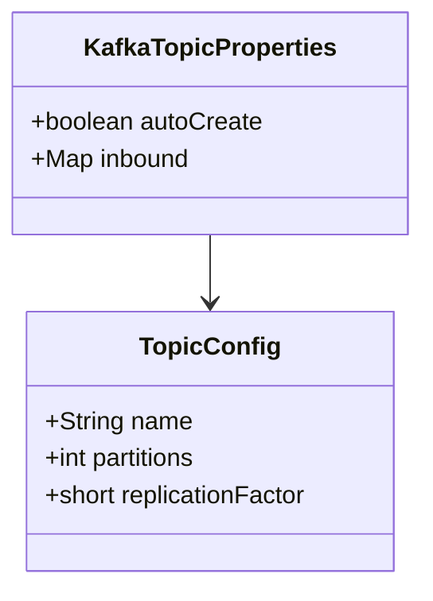
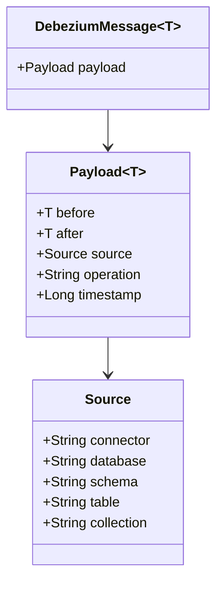
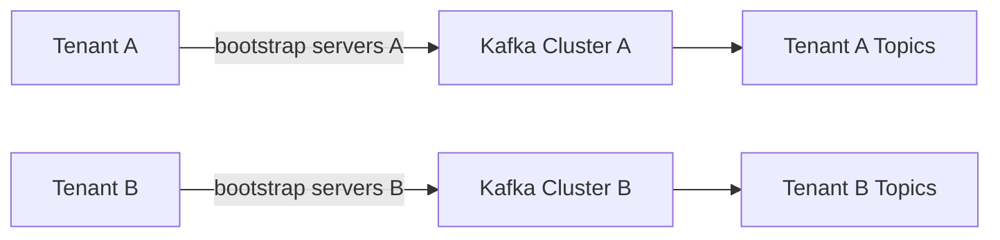
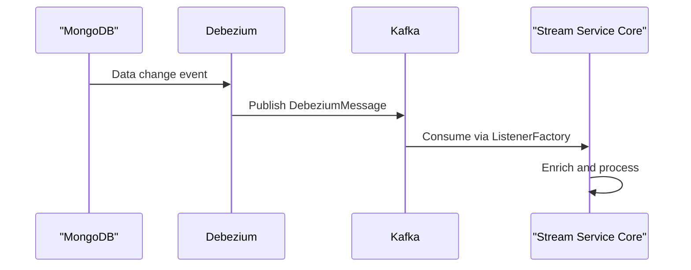

# Data Layer Kafka

## Overview

The **Data Layer Kafka** module provides the foundational Kafka infrastructure for OpenFrame OSS tenant-based deployments. It standardizes Kafka producer, consumer, admin, and topic configuration across services, enabling reliable event-driven communication between modules such as Stream Service Core, Management Service Core, and Data Layer Mongo.

This module is infrastructure-focused and does not contain business logic. Instead, it offers:

- Centralized Kafka auto-configuration
- Multi-tenant–aware Kafka setup
- Topic auto-creation support
- Standardized message headers
- Debezium message model for CDC processing

It is primarily consumed by higher-level modules like Stream Service Core and Management Service Core.

---

## Architectural Role in the Platform

The Data Layer Kafka module sits between service-level business logic and the Kafka cluster. It abstracts Spring Kafka configuration and enforces consistent behavior across services.



---

## Core Components

### 1. OssKafkaConfig

Excludes Spring Boot's default `KafkaAutoConfiguration` and enables Kafka support via `@EnableKafka`.

**Purpose:**
- Prevent conflicts with default Spring Boot Kafka auto-configuration
- Ensure that the OSS tenant-specific configuration is used instead

This allows the platform to fully control producer, consumer, and admin configuration behavior.

---

### 2. OssTenantKafkaAutoConfiguration

This is the central auto-configuration class of the module.

It creates and configures:

- `ProducerFactory`
- `KafkaTemplate`
- `ConsumerFactory`
- `ConcurrentKafkaListenerContainerFactory`
- `KafkaAdmin`
- Automatic topic registration
- `OssTenantKafkaProducer`

It is conditionally activated using:

```text
spring.oss-tenant.kafka.enabled=true
```

### Bean Architecture



### Key Responsibilities

#### Producer Configuration
- Uses `StringSerializer` for keys
- Uses `JsonSerializer` for values
- Applies default topic if configured

#### Consumer Configuration
- Uses `StringDeserializer` for keys
- Uses `JsonDeserializer` for values
- Configurable:
  - Concurrency
  - Ack mode (defaults to `RECORD`)
  - Poll timeout
  - Idle event interval

#### Admin & Topic Auto-Creation
If enabled:

```text
spring.oss-tenant.kafka.admin.enabled=true
```

The module:
- Instantiates `KafkaAdmin`
- Registers topics defined in `KafkaTopicProperties`

---

### 3. KafkaTopicProperties

Maps configuration properties with prefix:

```text
openframe.oss-tenant.kafka.topics
```

### Structure



### Responsibilities

- Defines inbound topic configurations
- Supports:
  - Topic name
  - Partition count
  - Replication factor
- Enables automatic topic creation during startup

Example configuration:

```yaml
openframe:
  oss-tenant:
    kafka:
      topics:
        inbound:
          device-events:
            name: device.events
            partitions: 3
            replication-factor: 2
```

---

### 4. KafkaHeader

Defines standardized Kafka header constants used across services.

```text
MESSAGE_TYPE_HEADER = "message-type"
```

This ensures consistent header naming for:

- Event type routing
- Message classification
- Downstream processing decisions

---

### 5. DebeziumMessage

Generic model representing Debezium Change Data Capture (CDC) events.

### Structure



### Purpose

- Provides a strongly typed wrapper for Debezium events
- Used by Stream Service Core handlers
- Supports database and Mongo CDC events
- Encapsulates:
  - Before/after state
  - Operation type (`c`, `u`, `d`)
  - Source metadata
  - Timestamp

This abstraction allows Stream Service Core to process CDC events without tightly coupling to raw JSON structures.

---

## Multi-Tenant Considerations

The module is designed for OSS tenant deployments and supports:

- Dedicated Kafka cluster configuration per tenant
- Tenant-specific topic definitions
- Isolated consumer groups
- Configurable bootstrap servers



This ensures strong isolation between tenants in distributed environments.

---

## Interaction with Other Modules

### Stream Service Core
Consumes Debezium events and enriched events via Kafka listeners configured by this module.

### Management Service Core
Produces integration and configuration events.

### Data Layer Mongo
Acts as a Debezium source for CDC events which are wrapped in `DebeziumMessage` and processed downstream.

---

## Event Flow Example



---

## Configuration Summary

| Feature | Property Prefix |
|----------|-----------------|
| Enable Kafka | `spring.oss-tenant.kafka.enabled` |
| Admin enable | `spring.oss-tenant.kafka.admin.enabled` |
| Topic definitions | `openframe.oss-tenant.kafka.topics` |

---

## Design Principles

- ✅ Infrastructure-first abstraction
- ✅ Multi-tenant ready
- ✅ Spring-native integration
- ✅ Auto-configurable but override-friendly
- ✅ CDC-ready with Debezium model

---

## Conclusion

The **Data Layer Kafka** module provides the foundational event infrastructure for OpenFrame’s distributed, multi-tenant architecture. By centralizing Kafka configuration, topic management, and message modeling, it ensures:

- Consistent messaging behavior
- Reduced duplication across services
- Reliable CDC processing
- Scalable tenant isolation

It is a critical building block for event-driven workflows throughout the OpenFrame platform.