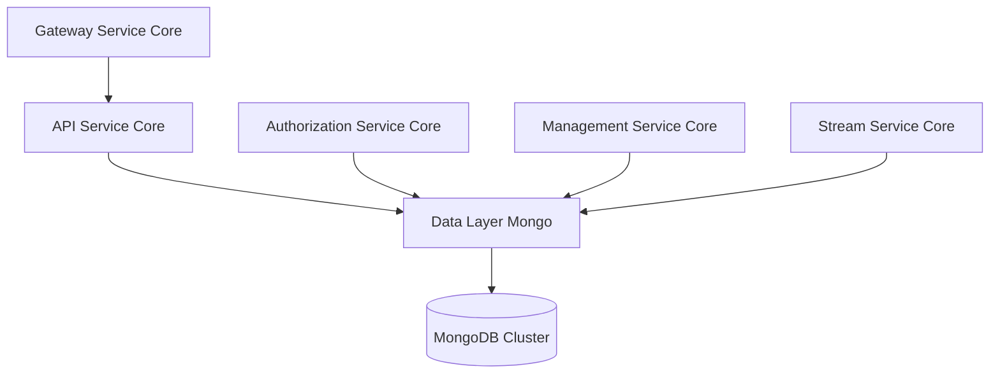
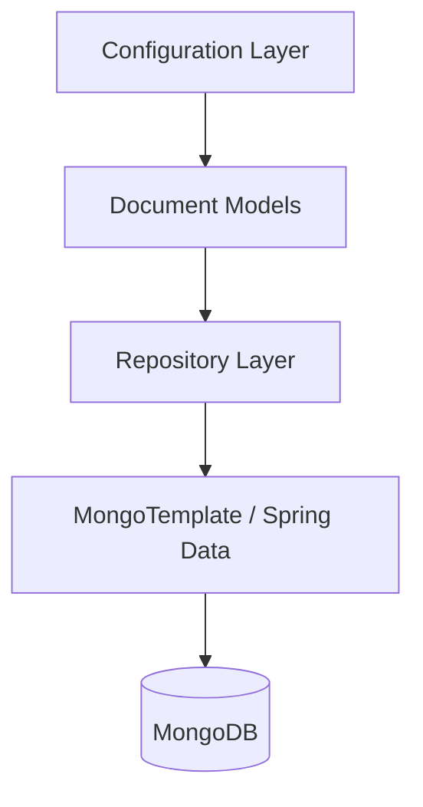
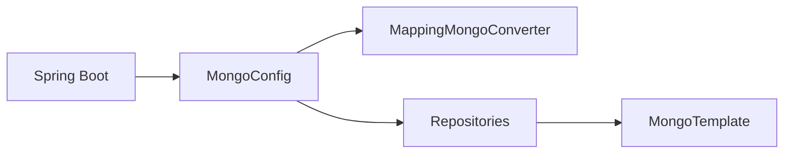
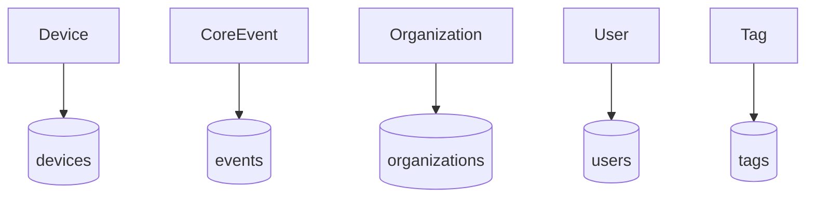
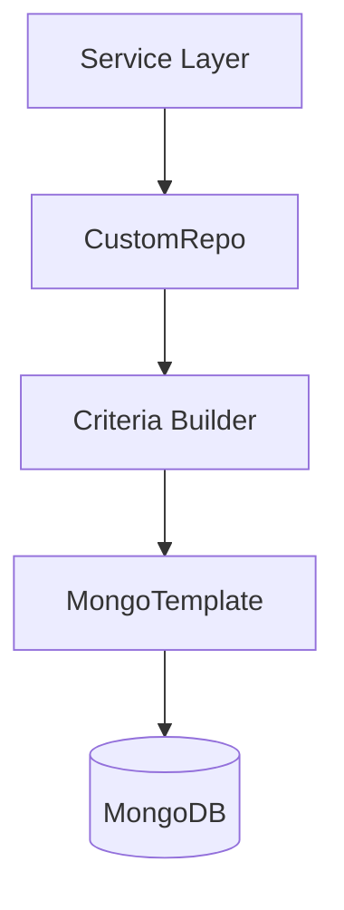
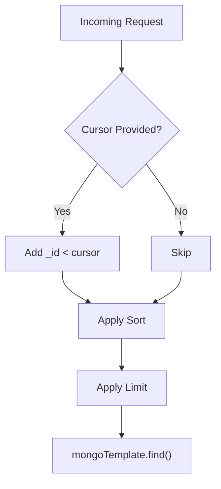
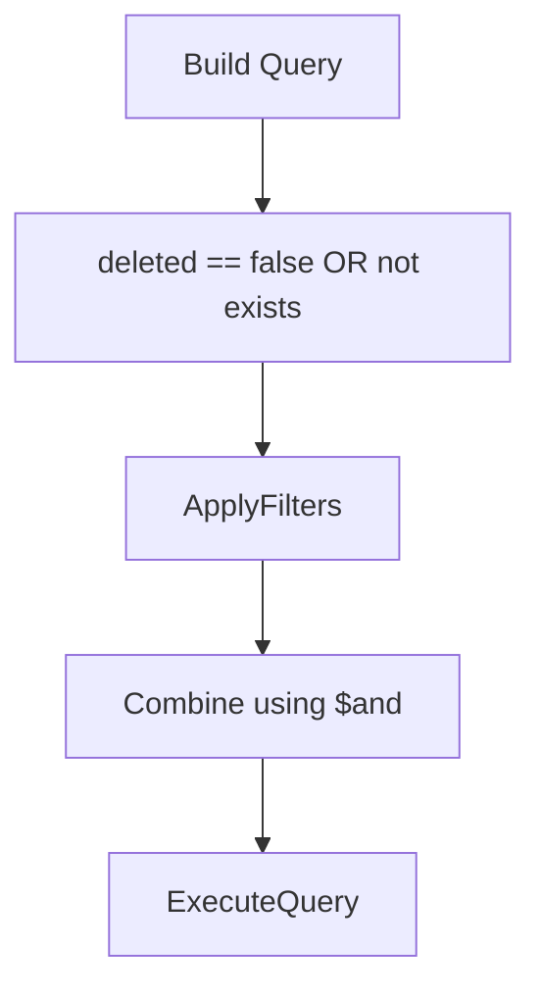
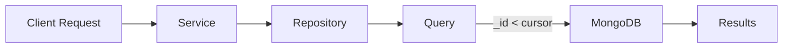
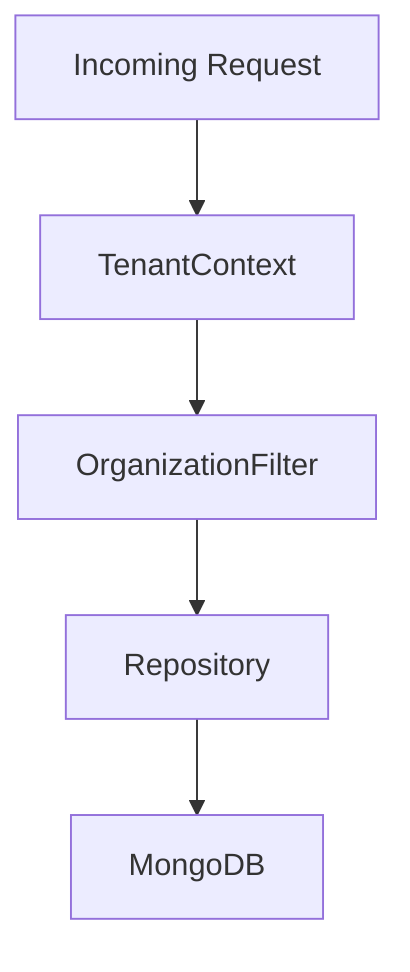

# Data Layer Mongo

## Overview

The **Data Layer Mongo** module provides the MongoDB-based persistence layer for the OpenFrame platform. It defines:

- MongoDB configuration and indexing
- Domain document models (Device, Event, Organization, User, Tag, etc.)
- Custom repository implementations with advanced filtering and cursor-based pagination
- Tenant-aware and organization-scoped data access patterns

This module is used by higher-level service modules such as API Service Core, Authorization Service Core, Management Service Core, and Stream Service Core to persist and query operational data.

It acts as the primary transactional and document store for multi-tenant business entities.

---

## Architectural Role in the Platform

The Data Layer Mongo module sits below service-layer modules and exposes repository abstractions built on Spring Data MongoDB.

### Responsibilities

- Persist core domain entities
- Provide efficient filtering and pagination mechanisms
- Support multi-tenant isolation via domain and organization scoping
- Enable indexing strategies for performance
- Offer both blocking and reactive repository support

---

# Internal Architecture

The module is structured into four primary layers:

## 1. Configuration Layer

### MongoConfig

`MongoConfig` enables MongoDB repositories conditionally based on application properties.

Key responsibilities:

- Enables `@EnableMongoRepositories`
- Enables Mongo auditing (`@EnableMongoAuditing`)
- Configures custom `MappingMongoConverter`
- Replaces dots in map keys using `__dot__`
- Supports both blocking and reactive repositories

### MongoIndexConfig

`MongoIndexConfig` ensures indexes are created at startup using `MongoTemplate`.

Indexes defined:

- Composite index on `userId + timestamp`
- Composite index on `type + metadata.tags`

This ensures efficient event filtering and analytics queries.

---

## 2. Document Models

Each document is annotated with `@Document` and stored in its respective collection.

### Device

Represents physical or virtual infrastructure endpoints.

Fields include:

- `machineId`
- `serialNumber`
- `model`
- `status`
- `type`
- `lastCheckin`
- `configuration`
- `health`

Used by API and Management services for inventory management.

---

### CoreEvent

Represents system events.

Fields include:

- `type`
- `payload`
- `timestamp`
- `userId`
- `status` (CREATED, PROCESSING, COMPLETED, FAILED)

Used heavily by Stream Service Core and API analytics endpoints.

---

### Organization

Represents tenant organizations with business metadata.

Key features:

- Unique `organizationId`
- Soft delete support (`deleted`, `deletedAt`)
- Contract date validation
- Indexed fields for performance

Soft deletion is enforced at query level by custom repositories.

---

### User

Represents application users.

Features:

- Email normalization
- Indexed email and status
- Role-based access support
- Auditing fields (`createdAt`, `updatedAt`)

---

### Tag

Scoped metadata entity.

- Unique name
- Organization-scoped via `organizationId`
- Supports color and description metadata

---

## 3. Repository Layer

The repository layer combines:

- Spring Data `MongoRepository`
- Custom repository implementations
- Cursor-based pagination
- Advanced filter construction using `Criteria`

---

# Custom Repository Implementations

## Machine Repository

`CustomMachineRepositoryImpl`

Capabilities:

- Cursor-based pagination using `_id`
- Sortable field validation
- Text search across hostname, displayName, IP, serialNumber
- Organization filtering

Cursor pagination logic:

---

## Event Repository

`CustomEventRepositoryImpl`

Features:

- Date range filtering with UTC normalization
- Distinct user ID queries
- Distinct event type queries
- Bidirectional cursor support (ASC/DESC)
- Search across type and data fields

Efficient index usage aligns with `MongoIndexConfig`.

---

## Organization Repository

`CustomOrganizationRepositoryImpl`

Advanced features:

- Soft-delete exclusion logic
- Contract-active filtering
- Employee count range filtering
- Category filtering
- Search across name, organizationId, category
- Cursor pagination

Soft-delete enforcement:

---

## Integrated Tool Repository

`CustomIntegratedToolRepositoryImpl`

Capabilities:

- Enabled filter
- Category and platform filtering
- Search across name and description
- Distinct type and category queries
- Controlled sortable field validation

---

## Tenant Repository

`TenantRepository`

Extends `MongoRepository` and custom base interface.

Responsibilities:

- Find by domain
- Domain existence validation
- Domain projection via `DomainView`
- Tenant counting

Enabled only in Servlet web applications.

---

## BaseUserRepository

Technology-agnostic base interface.

Supports:

- Blocking (Optional, boolean)
- Reactive (Mono, Mono<Boolean>)

Ensures consistency between blocking and reactive user repositories.

---

# Query & Pagination Strategy

The module standardizes:

- Cursor-based pagination using MongoDB `_id`
- Multi-field sorting
- Safe sortable field validation
- Defensive handling of invalid cursor formats

Cursor pagination avoids performance issues of offset-based pagination in large collections.

---

# Multi-Tenant & Organization Strategy

Although tenant isolation is handled at higher layers (Authorization and Gateway), this module supports:

- Organization scoping via `organizationId`
- Domain-based tenant resolution (TenantRepository)
- Soft delete enforcement
- Indexed filtering for tenant-specific queries

---

# Indexing Strategy

Indexes are defined in two ways:

1. Annotation-based (`@Indexed` on document fields)
2. Programmatic (`MongoIndexConfig`)

This ensures:

- Fast lookups on `organizationId`, `email`, `status`
- Efficient event analytics
- Reduced collection scans

---

# Reactive vs Blocking Support

The module supports both runtime modes:

- Blocking repositories (Servlet stack)
- Reactive repositories (WebFlux stack)

`MongoConfig` conditionally enables:

- `@EnableMongoRepositories`
- `@EnableReactiveMongoRepositories`

This allows flexible deployment depending on service type.

---

# Design Principles

The Data Layer Mongo module follows these architectural principles:

- Clear separation of document models and business logic
- Database-level filtering for performance
- Cursor-based pagination for scalability
- Defensive query construction
- Multi-tenant readiness
- Explicit indexing for performance

---

# Summary

The **Data Layer Mongo** module is the core MongoDB persistence engine for the OpenFrame platform. It provides:

- Strongly defined domain documents
- Advanced custom filtering logic
- Cursor-based pagination
- Indexing strategies
- Multi-tenant support
- Blocking and reactive compatibility

It enables higher-level service modules to operate efficiently on scalable, document-oriented data storage while maintaining strict filtering and performance guarantees.