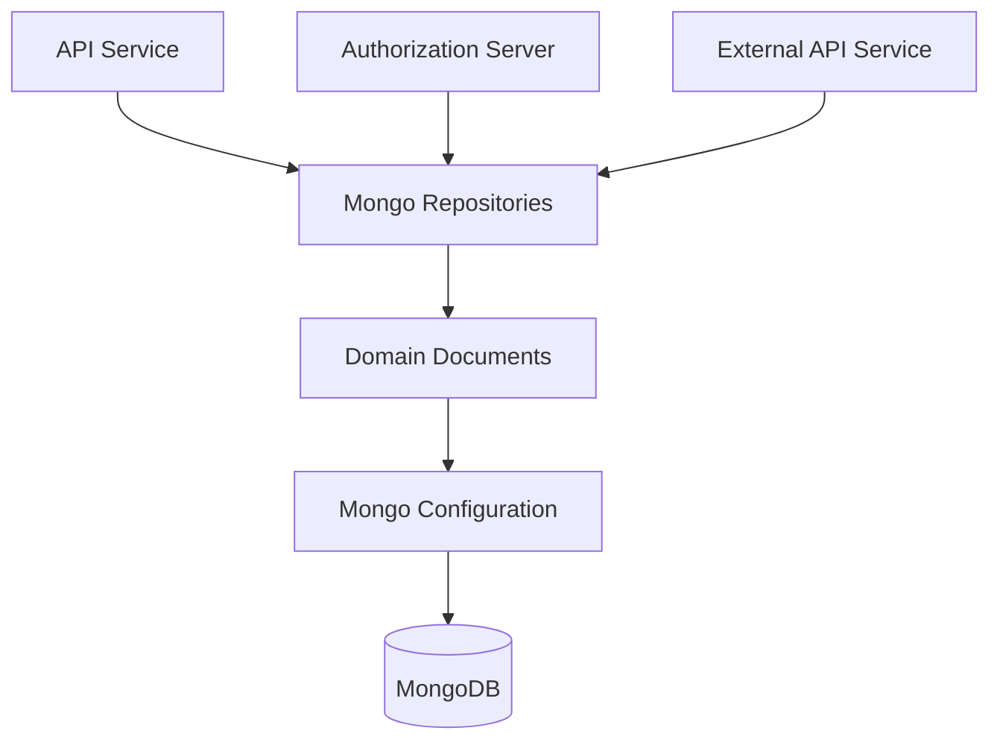
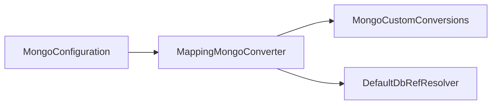
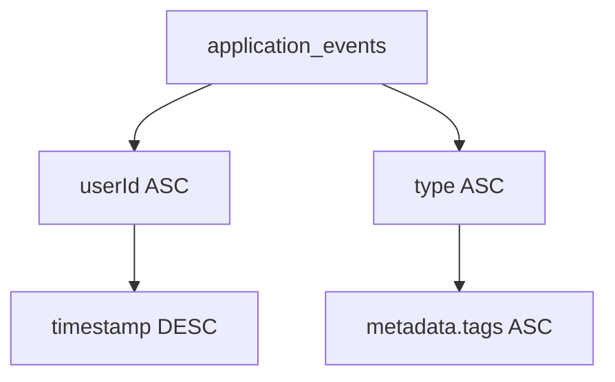
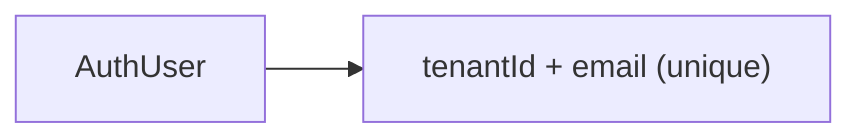
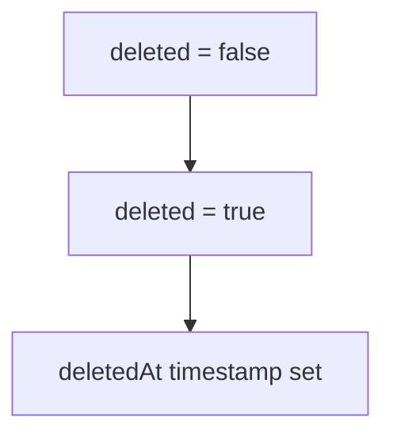
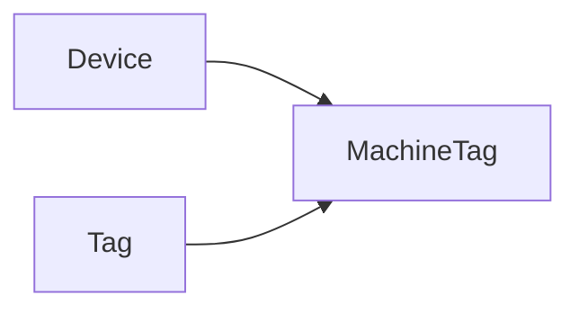
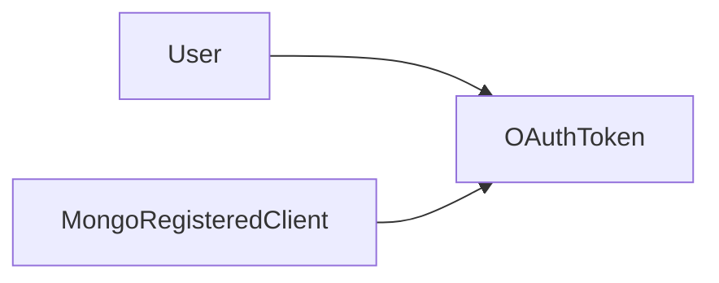
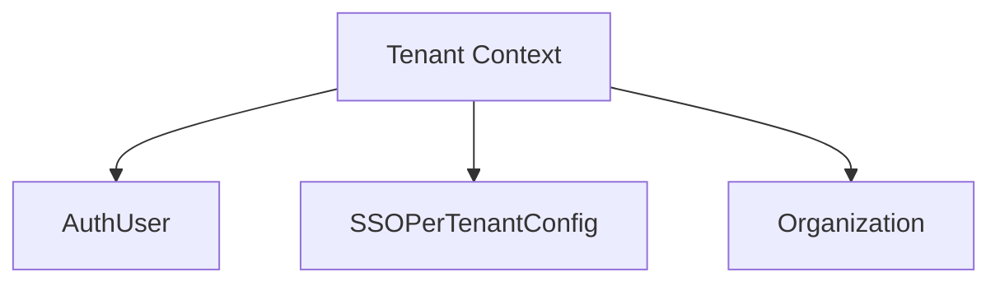
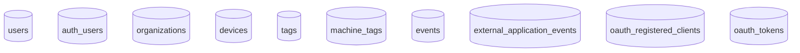

# Data Mongo Core And Documents

The **Data Mongo Core And Documents** module defines the MongoDB configuration, core domain documents, and foundational persistence behavior for the OpenFrame platform. It acts as the primary document model layer for authentication, organizations, devices, events, OAuth, tags, and tenant-specific configuration.

This module is the backbone of all Mongo-backed services including:

- API Service
- Authorization Server
- Gateway (indirectly via repositories)
- External API Service
- Client and Stream integrations

It provides:

- Spring Data Mongo configuration (sync + reactive)
- Index initialization and auditing support
- Multi-tenant aware user and SSO models
- Core domain documents mapped to Mongo collections

---

## Architectural Role in the Platform

At a high level, this module sits beneath service-layer modules and exposes document models used by repositories and domain services.



**Key Responsibilities:**

1. Define Mongo collections and indexes
2. Enable repository scanning (blocking + reactive)
3. Support auditing (`@CreatedDate`, `@LastModifiedDate`)
4. Enforce multi-tenant constraints at document level
5. Model OAuth and authentication state

---

# 1. Mongo Configuration Layer

## MongoConfig

`MongoConfig` enables repository scanning and auditing.

It contains two nested configurations:

### MongoConfiguration (Blocking)

Activated when:

```text
spring.data.mongodb.enabled=true
```

Responsibilities:

- Enables `@EnableMongoRepositories`
- Enables `@EnableMongoAuditing`
- Customizes `MappingMongoConverter`
- Replaces dots in map keys with `__dot__`



The dot replacement ensures Mongo compatibility when map keys contain `.`.

### ReactiveMongoConfiguration

Activated for reactive web applications.

- Enables `@EnableReactiveMongoRepositories`
- Scans `com.openframe.data.reactive.repository`

This supports WebFlux-based services such as reactive APIs and streaming integrations.

---

## MongoIndexConfig

`MongoIndexConfig` ensures runtime index creation for critical collections.

### application_events Indexes



These indexes optimize:

- User event timelines
- Event filtering by type
- Tag-based queries

---

# 2. Core Domain Documents

This module defines all Mongo document models used across the platform.

---

## 2.1 User and Authentication

### User

Collection: `users`

Fields include:

- `email` (normalized to lowercase)
- `roles`
- `emailVerified`
- `status`
- Auditing timestamps

Automatic auditing is enabled via `@CreatedDate` and `@LastModifiedDate`.

---

### AuthUser (Multi-Tenant Authorization User)

Extends `User` and adds:

- `tenantId`
- `passwordHash`
- `loginProvider`
- `externalUserId`
- `lastLogin`

### Multi-Tenant Uniqueness Constraint



A compound index enforces:

```text
{ tenantId: 1, email: 1 } unique
```

This allows:

- Same email across different tenants
- Strict uniqueness within a tenant

---

## 2.2 Organization Model

### Organization

Collection: `organizations`

Represents a company or managed entity.

Key features:

- Immutable `organizationId`
- Soft delete (`deleted`, `deletedAt`)
- Contract lifecycle validation
- Indexed default organization flag
- Revenue and employee metadata

### Soft Delete Pattern



No hard deletes are required for logical removal.

---

## 2.3 Device and Tagging

### Device

Collection: `devices`

Models managed hardware:

- `machineId`
- `serialNumber`
- `status` (ACTIVE, OFFLINE, MAINTENANCE)
- `type`
- `lastCheckin`
- `configuration`
- `health`

---

### Tag

Collection: `tags`

- Globally unique `name`
- Optional `color`
- Scoped by `organizationId`

---

### MachineTag (Many-to-Many Join)

Collection: `machine_tags`

Compound index:

```text
{ machineId: 1, tagId: 1 } unique
```



This allows devices to have multiple tags without duplication.

---

## 2.4 Events

### CoreEvent

Collection: `events`

Tracks internal system events.

Fields:

- `type`
- `payload`
- `timestamp`
- `userId`
- `status` (CREATED, PROCESSING, COMPLETED, FAILED)

---

### ExternalApplicationEvent

Collection: `external_application_events`

Adds structured metadata:

- `source`
- `version`
- `tags` (map)

Optimized via runtime indexes from `MongoIndexConfig`.

---

## 2.5 OAuth and Client Registration

### MongoRegisteredClient

Collection: `oauth_registered_clients`

Used by Authorization Server.

- Unique `clientId`
- Grant types
- Redirect URIs
- PKCE requirement
- Token TTL configuration

---

### OAuthToken

Collection: `oauth_tokens`

Stores:

- `accessToken`
- `refreshToken`
- Expiry timestamps
- `clientId`
- `scopes`



---

## 2.6 Tenant-Specific SSO Configuration

### SSOPerTenantConfig

Extends base SSO configuration and adds:

- Unique `tenantId`
- Created and updated timestamps

This enables:

- Tenant-isolated OAuth providers
- Dynamic SSO onboarding

---

## 2.7 Tool Agent Assets

### ToolAgentAsset

Embedded configuration model for:

- Agent version
- Download configurations
- Execution metadata
- Source information

Used for distributing tool/agent binaries and configurations.

---

# 3. Cross-Cutting Patterns

## Auditing

Enabled via `@EnableMongoAuditing`.

Documents supporting auditing:

- User
- Organization
- SSOPerTenantConfig

This ensures consistent lifecycle tracking.

---

## Multi-Tenancy Strategy

Multi-tenancy is implemented at document level via:

- `tenantId` fields
- Compound indexes
- Scoped configuration documents



Isolation is achieved without separate databases.

---

## Soft Deletes

Implemented via:

- Boolean flags
- Timestamp markers

Avoids physical data removal and enables audit recovery.

---

# 4. Collection Overview



---

# 5. Why This Module Is Critical

The **Data Mongo Core And Documents** module provides:

- The canonical data model for the platform
- Secure multi-tenant authentication structures
- Extensible event and device tracking
- OAuth persistence for Authorization Server
- Organization and contract lifecycle modeling

Without this module, higher-level services would lack:

- Data integrity guarantees
- Indexed performance
- Tenant isolation enforcement
- Consistent auditing behavior

---

# Summary

The **Data Mongo Core And Documents** module is the foundational MongoDB modeling layer for OpenFrame. It standardizes document structures, enforces multi-tenant constraints, configures indexing and auditing, and supports both blocking and reactive repository patterns.

It ensures that all services across the platform share a consistent, performant, and secure persistence model built on MongoDB.